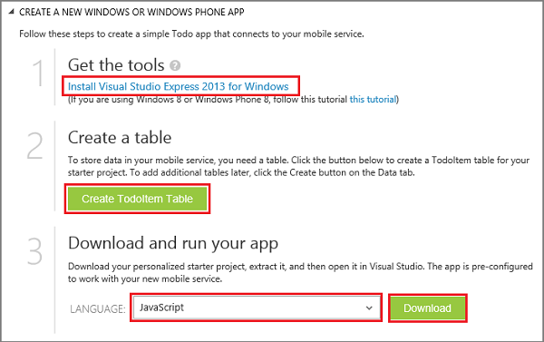

<properties 
	pageTitle="Introducción a los Servicios móviles para aplicaciones de la Tienda Windows | Centro de desarrollo móvil" 
	description="Siga este tutorial para aprender a usar Servicios móviles de Azure para el desarrollo de la Tienda Windows C# o JavaScript." 
	services="mobile-services" 
	documentationCenter="windows" 
	authors="ggailey777" 
	manager="dwrede" 
	editor=""/>

<tags 
	ms.service="mobile-services" 
	ms.workload="mobile" 
	ms.tgt_pltfrm="mobile-windows-store" 
	ms.devlang="javascript" 
	ms.topic="hero-article" 
	ms.date="08/18/2014" 
	ms.author="glenga"/>

# Introducción a los Servicios móviles

[AZURE.INCLUDE [mobile-services-selector-get-started](../includes/mobile-services-selector-get-started.md)]

En este tutorial se muestra cómo agregar un servicio de back-end basado en la nube para una aplicación universal de Windows con Servicios móviles de Azure. 

En este tutorial, creará tanto un servicio móvil nuevo como una aplicación simple  *To do list* que almacena datos de la aplicación en el servicio móvil nuevo. El servicio móvil que se creará utiliza JavaScript para la lógica de negocios de servidor. Si desea crear un servicio móvil que le permita escribir su lógica de negocios de servidor en los lenguajes compatibles de .NET con Visual Studio, consulte la versión de back-end de .NET de este tema.

[AZURE.INCLUDE [mobile-services-windows-universal-get-started](../includes/mobile-services-windows-universal-get-started.md)]

Para completar este tutorial, necesitará lo siguiente:

* Una cuenta de Azure activa. En caso de no tener ninguna, puede crear una cuenta de evaluación gratuita en tan solo unos minutos. Para obtener más información, consulte [Evaluación gratuita de Azure.](http://azure.microsoft.com/pricing/free-trial/?WT.mc_id=A0E0E5C02&amp;returnurl=http%3A%2F%2Fazure.microsoft.com%2Fes-es%2Fdocumentation%2Farticles%2Fmobile-services-javascript-backend-windows-store-javascript-get-started%2F)
* [Visual Studio 2013 Express para Windows]

## Creación de un servicio móvil

[AZURE.INCLUDE [mobile-services-create-new-service](../includes/mobile-services-create-new-service.md)]

## Creación de una nueva aplicación universal de Windows

Una vez que haya creado el servicio móvil, podrá seguir una introducción rápida en el Portal de administración para crear una nueva aplicación universal de Windows o modificar un proyecto de aplicación existente en la Tienda Windows o Windows Phone para conectarla a su servicio móvil. 

En esta sección, creará una nueva aplicación universal de Windows que se conecta al servicio móvil.

1.  En el Portal de administración, haga clic en **Servicios móviles** y, a continuación, en el servicio móvil que acaba de crear.

   
2. En la pestaña de inicio rápido, haga clic en **Windows** en **Seleccionar plataforma** y, a continuación, expanda **Crear una nueva aplicación de la Tienda Windows**.

   	

   	Con esto se muestran los tres sencillos pasos requeridos para crear una aplicación de la Tienda Windows conectada al servicio móvil.

  	

3. Si todavía no lo ha hecho, descargue e instale [Visual Studio 2013][Visual Studio 2013 Express para Windows] en su equipo local o máquina virtual.

4. Haga clic en **Crear tabla TodoItem** para crear una tabla donde almacenar los datos de la aplicación.

5. En **Descargar y ejecutar la aplicación**, seleccione un idioma para la aplicación y, a continuación, haga clic en **Descargar**. 

  	De este modo se descarga el proyecto para la aplicación  *To do list* de ejemplo que está conectada al servicio móvil. Guarde el archivo comprimido del proyecto en el equipo local y anote dónde lo guardó.

## Ejecución de la aplicación de Windows

[AZURE.INCLUDE [mobile-services-javascript-backend-run-app](../includes/mobile-services-javascript-backend-run-app.md)]

>[AZURE.NOTE]Puede revisar el código de acceso al servicio móvil para consultar e insertar datos; este se encuentra en el archivo default.js.

## Pasos siguientes
Ahora que completó el inicio rápido, aprenda a realizar importantes tareas adicionales en los Servicios móviles: 

* [Introducción a los datos]
   Obtenga más información sobre cómo almacenar y consultar datos con los Servicios móviles.

* [Introducción a la autenticación]
   Aprenda a autenticar a los usuarios de su aplicación con un proveedor de identidades.

* [Introducción a las notificaciones de inserción]
   Aprenda a enviar una notificación de inserción muy básica a la aplicación.

Para obtener más información acerca de las aplicaciones universales de Windows, vea [Compatibilidad de plataformas de varios dispositivos desde un único servicio móvil](mobile-services-how-to-use-multiple-clients-single-service#shared-vs.md).

<!-- Anchors. -->
[Introducción a los Servicios móviles]:#getting-started
[Creación de un servicio móvil]:#create-new-service
[Definición de la instancia del servicio móvil]:#define-mobile-service-instance
[Pasos siguientes]:#next-steps

<!-- Images. -->

<!-- URLs. -->
[Introducción a los datos]: /es-es/documentation/articles/mobile-services-javascript-backend-windows-universal-javascript-get-started-data
[Introducción a la autenticación]: /es-es/documentation/articles/mobile-services-windows-store-javascript-get-started-users
[Introducción a las notificaciones de inserción]: /es-es/documentation/articles/mobile-services-javascript-backend-windows-store-javascript-get-started-push
[Visual Studio 2013 Express para Windows]: http://go.microsoft.com/fwlink/?LinkId=257546
[SDK de servicios móviles]: http://go.microsoft.com/fwlink/?LinkId=257545
[Portal de administración]: https://manage.windowsazure.com/

<!--HONumber=42-->
