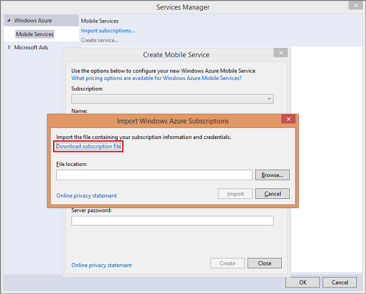

<properties 
	pageTitle="Importación del archivo de configuración de publicación en Visual Studio 2013 | Servicios móviles" 
	description="Obtenga información sobre cómo importar un archivo de configuración de publicación de suscripción para su aplicación de Servicios móviles de Azure en Visual Studio 2013." 
	documentationCenter="windows" 
	services="mobile-services" 
	manager="dwrede" 
	editor="" 
	authors="ggailey777"/>

<tags 
	ms.service="mobile-services" 
	ms.workload="mobile" 
	ms.tgt_pltfrm="mobile-multiple" 
	ms.devlang="multiple" 
	ms.topic="article" 
	ms.date="11/21/2014" 
	ms.author="glenga"/>

# Importación del archivo de configuración de publicación de la suscripción en Visual Studio 2013

Antes de crear el servicio móvil, debe importar el archivo de configuración de publicación de la suscripción de Azure en Visual Studio. De esta forma, Visual Studio podrá conectarse a Azure en su nombre.  

>[AZURE.NOTE] A partir de la actualización 2 de Visual Studio 2013, deja de ser necesario usar un archivo de configuración de publicación. Visual Studio puede conectarse directamente con Azure gracias a las credenciales que proporciona.

1. En Visual Studio 2013, abra el Explorador de soluciones, haga clic con el botón derecho en el proyecto, haga clic en **Agregar** y, a continuación, en **Servicio conectado...**. 

	

2. En el cuadro de diálogo Administrador de servicios, haga clic en **Crear servicio...** y, en **Suscripción**, seleccione **&lt;Importar...&gt;** en el cuadro de diálogo para crear servicio móvil.  

	

3. En el apartado para importar suscripciones a Azure, haga clic en **Descargar archivo de suscripción**, inicie sesión en su cuenta de Azure (si es necesario) y, cuando el explorador le solicite que guarde el archivo, haga clic en **Guardar**.

	

	> [AZURE.NOTE] la ventana de inicio de sesión se muestra en el explorador, que puede encontrarse detrás de la ventana de Visual Studio. No olvide anotar dónde guarda el archivo .publishsettings descargado. Si el proyecto ya está conectado a la suscripción de Azure, puede omitir este paso.

4. Haga clic en **Examinar**, vaya a la ubicación en la que ha guardado el archivo .publishsettings, seleccione el archivo y, a continuación, haga clic en **Abrir** y en **Importar**. 

	

	Visual Studio importa los datos necesarios para conectar con su suscripción de Azure. Cuando su suscripción ya tiene uno o varios servicios móviles existentes, se muestran los nombres de los servicios. 

	> [AZURE.NOTE] Después de importar la configuración de publicación, podría ser conveniente eliminar el archivo .publishsettings descargado dado que contiene información que otros usuarios podrían emplear para tener acceso a su cuenta. Si tiene pensado guardar el archivo para utilizarlo en otros proyectos de aplicaciones relacionados, aplique alguna medida de seguridad.

<!-- Anchors. -->

<!-- Images. -->
[1]: ./media/mobile-services-how-to-register-microsoft-authentication/mobile-services-live-connect-add-app.png
[2]: ./media/mobile-services-how-to-register-microsoft-authentication/mobile-live-connect-app-api-settings.png
<!-- URLs. -->
[Inicio de sesión único para aplicaciones de la Tienda Windows mediante Live Connect]: /es-es/develop/mobile/how-to-guides/register-for-single-sign-on/
[Página Enviar una aplicación]: http://go.microsoft.com/fwlink/p/?LinkID=266582
[Mis aplicaciones]: http://go.microsoft.com/fwlink/p/?LinkId=262039
[Introducción a los servicios móviles]: /es-es/develop/mobile/tutorials/get-started/
[Introducción a la autenticación]: /es-es/develop/mobile/tutorials/get-started-with-users-dotnet/
[Introducción a las notificaciones de inserción]: /es-es/develop/mobile/tutorials/get-started-with-push-dotnet/
[Autorización de usuarios con scripts]: /es-es/develop/mobile/tutorials/authorize-users-in-scripts-dotnet/
[JavaScript y HTML]: /es-es/develop/mobile/tutorials/get-started-with-users-js/

[Portal de administración de Azure]: https://manage.windowsazure.com/

<!--HONumber=42-->
