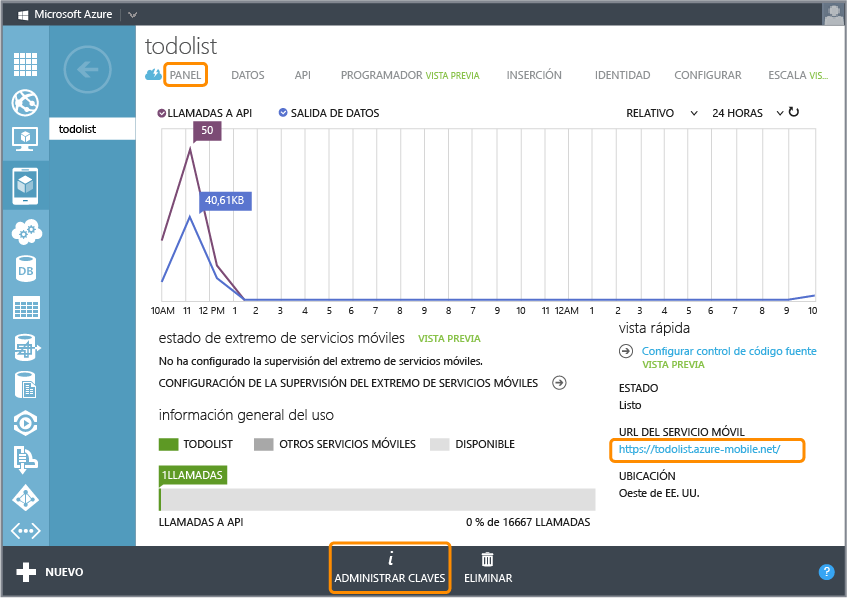
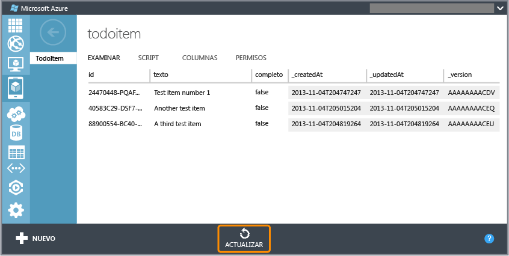

<properties linkid="develop-mobile-tutorials-get-started-with-data-wp8" urlDisplayName="Get Started with Data" pageTitle="Get started with data (WP8) - Azure Mobile Services" metaKeywords="" description="Learn how to get started using data from your Azure Mobile Services Windows Phone 8 app." metaCanonical="" services="" documentationCenter="Mobile" title="Get started with data in Mobile Services" authors="glenga" solutions="" manager="" editor="" />

Introducción a los datos en Servicios móviles
=============================================

 
	<a href="/en-us/develop/mobile/tutorials/get-started-with-data-dotnet" title="Windows Store C#">Windows Store C#</a><a href="/en-us/develop/mobile/tutorials/get-started-with-data-js" title="Windows Store JavaScript">Windows Store JavaScript</a><a href="/en-us/develop/mobile/tutorials/get-started-with-data-wp8" title="Windows Phone" class="current">Windows Phone</a><a href="/en-us/develop/mobile/tutorials/get-started-with-data-ios" title="iOS">iOS</a><a href="/en-us/develop/mobile/tutorials/get-started-with-data-android" title="Android">Android</a><a href="/en-us/develop/mobile/tutorials/get-started-with-data-html" title="HTML">HTML</a><a href="/en-us/develop/mobile/tutorials/get-started-with-data-xamarin-ios" title="Xamarin.iOS">Xamarin.iOS</a><a href="/en-us/develop/mobile/tutorials/get-started-with-data-xamarin-android" title="Xamarin.Android">Xamarin.Android</a>

	

	<a href="/en-us/documentation/articles/mobile-services-dotnet-backend-windows-phone-get-started-data/" title=".NET backend">.NET backend</a> | 
	<a href="/en-us/documentation/articles/mobile-services-windows-phone-get-started-data/"  title="JavaScript backend" class="current">JavaScript backend</a>

Este tema muestra cómo utilizar Servicios móviles de Azure para aprovechar los datos en una aplicación de Windows Phone 8. En este tutorial descargará una aplicación que almacena datos en memoria, creará un nuevo servicio móvil, integrará el servicio móvil en la aplicación y luego iniciará sesión en el Portal de administración de Azure para ver los cambios que se hicieron en los datos durante la ejecución de la aplicación.

<a href="http://go.microsoft.com/fwlink/?LinkID=298628" target="_blank" class="label">Ver el tutorial (en inglés)</a> <a style="background-image: url('/media/devcenter/mobile/videos/mobile-wp8-get-started-data-180x120.png') !important;" href="http://go.microsoft.com/fwlink/?LinkID=298628" target="_blank" class="dev-onpage-video">Reproducir vídeo (en inglés)</a> 12:54

<b>Nota:</b>

Este tutorial está destinado a profundizar en el uso de Azure con los Servicios móviles para almacenar y recuperar datos en una aplicación de Windows Phone 8. Para ello, en este tema se recorren muchos de los pasos que se completan automáticamente en el inicio rápido de Servicios móviles. Si esta es la primera vez que usa los Servicios móviles, considere la posibilidad de completar antes el tutorialIntroducción a los Servicios móviles <a href="/en-us/develop/mobile/tutorials/get-started-wp8">Introducción a los Servicios móviles</a>.

Este tutorial le guiará a través de estos pasos básicos:

1.  [Descarga del proyecto de la aplicación de Windows Phone 8](#download-app)
2.  [Creación del servicio móvil](#create-service)
3.  [Incorporación de una tabla de datos para almacenamiento](#add-table)
4.  [Actualización de la aplicación para usar Servicios móviles](#update-app)
5.  [Prueba de la aplicación en Servicios móviles](#test-app)

Este tutorial requiere que el [SDK de Windows Phone 8](http://go.microsoft.com/fwlink/p/?LinkID=268374) se esté ejecutando en Windows 8.

<b>Nota:</b>

Para completar este tutorial, necesita una cuenta de Azure que tenga habilitada la característica de Servicios móviles de Azure.

<ul> <li>En caso de no tener ninguna, puede crear una cuenta de evaluación gratuita en tan solo unos minutos. Para obtener más información, consulte <a href="http://www.windowsazure.com/en-us/pricing/free-trial/?WT.mc_id=A756A2826&amp;returnurl=http%3A%2F%2Fwww.windowsazure.com%2Fen-us%2Fdevelop%2Fmobile%2Ftutorials%2Fget-started-with-data-wp8%2F" target="_blank">Evaluación gratuita de Azure</a>.</li></ul> 

Descarga del proyectoDescarga del proyecto GetStartedWithData
-------------------------------------------------------------

Este tutorial se basa en la [aplicación GetStartedWithData](http://go.microsoft.com/fwlink/p/?LinkId=271146), una aplicación de Windows Phone 8. La interfaz de usuario de esta aplicación es idéntica a la de la aplicación generada por el inicio rápido de Servicios móviles, con la excepción de que los elementos agregados se almacenan localmente en la memoria.

1.  Descargue la aplicación de muestra GetStartedWithData desde el [sitio de Muestras de código para desarrollador](http://go.microsoft.com/fwlink/p/?LinkId=271146) (en inglés).

2.  En Visual Studio 2012 Express para Windows Phone 8, abra el proyecto descargado y examine el archivo MainPage.xaml.cs.

   Observe que los objetos **TodoItem** agregados se almacenan en **ObservableCollection&lt;TodoItem&gt;** en memoria.

3.  Presione la tecla **F5** para recompilar el proyecto e iniciar la aplicación.

4.  En la aplicación, escriba algún texto en el cuadro de texto y, a continuación, haga clic en el botón **Save**.

      

   Observe que el texto guardado se muestra en la lista a continuación.

Creación de un servicio móvilCreación de un servicio móvil en el Portal de administración
-----------------------------------------------------------------------------------------

[WACOM.INCLUDE [mobile-services-create-new-service-data](../includes/mobile-services-create-new-service-data.md)]

Incorporación de una tabla nuevaIncorporación de una tabla nueva al servicio móvil
----------------------------------------------------------------------------------

[WACOM.INCLUDE [mobile-services-create-new-service-data-2](../includes/mobile-services-create-new-service-data-2.md)]

Actualización de la aplicaciónActualización de la aplicación para usar el servicio móvil para el acceso a datos
---------------------------------------------------------------------------------------------------------------

Ahora que el servicio móvil está listo, puede actualizar la aplicación a fin de almacenar elementos en Servicios móviles en lugar de en la colección local.

1.  En el **Explorador de soluciones** de Visual Studio, haga clic con el botón secundario en el nombre del proyecto y, a continuación, seleccione **Manage NuGet Packages**.

2.  En el panel izquierdo, seleccione la categoría **Online**, busque `WindowsAzure.MobileServices`, haga clic en **Install** en el paquete **Servicios móviles de Azure** y, a continuación, acepte el contrato de licencia.

	
 
    De esta forma se agrega al proyecto la biblioteca de clientes de Servicios móviles.

1.  En el Portal de administración, haga clic en **Servicios móviles** y, a continuación, en el servicio móvil que acaba de crear.

2.  Haga clic en la pestańa **Panel** y tome nota de la dirección que aparece en **Site URL**; a continuación, haga clic en **Manage keys** y tome nota de la clave indicada en **Application key**.

	

   Necesitará estos valores al obtener acceso al servicio móvil desde el código de la aplicación.

1.  En Visual Studio, abra el archivo App.xaml.cs y agregue o quite la marca de comentario en la siguiente instrucción `using`:

         using Microsoft.WindowsAzure.MobileServices;

2.  En este mismo archivo, quite la marca de comentario del código que define la variable **MobileService** y proporcione la dirección URL y la clave de aplicación del servicio móvil en el constructor **MobileServiceClient**, en ese orden.

         //public static MobileServiceClient MobileService = new MobileServiceClient( 
         //    "AppUrl", 
         //    "AppKey" 
         //); 

   De esta forma, se crea una nueva instancia de **MobileServiceClient** que se usa para obtener acceso al servicio móvil.

1.  En el archivo MainPage.xaml.cs, agregue o quite la marca de comentario en las siguientes instrucciones `using`:

         using Microsoft.WindowsAzure.MobileServices;
         using Newtonsoft.Json;

2.  En este mismo archivo, reemplace la definición de clase **TodoItem** por el siguiente código:

         public class TodoItem
         {
             public string Id { get; set; }

             [JsonProperty(PropertyName = "text")]
             public string Text { get; set; }

             [JsonProperty(PropertyName = "complete")]
             public bool Complete { get; set; }
         }

3.  Comente la línea que define la colección **items** existente y luego quite la marca de comentario de las siguientes líneas:

         private MobileServiceCollection<TodoItem, TodoItem> items;
         private IMobileServiceTable<TodoItem> todoTable = 
             App.MobileService.GetTable<TodoItem>();

     Este código crea una colección de enlaces (**items**) compatible con los servicios móviles y una clase proxy para la tabla de base de datos SQL **TodoItem** (**todoTable**). 

4.  En el método **InsertTodoItem**, quite la línea de código que define la propiedad **TodoItem**.**Id**, agregue el modificador **async** al método y quite la marca de comentario de la siguiente línea de código:

         await todoTable.InsertAsync(todoItem);

   Este código inserta un elemento nuevo en la tabla.

1.  En el método **RefreshTodoItems**, agregue el modificador **async** al método y quite la marca de comentario en la siguiente línea de código:

         items = await todoTable.ToCollectionAsync();

   Esto define el enlace a la colección de elementos en todoTable, que contiene todos los objetos TodoItem devueltos por el servicio móvil. 

2.  En el método **UpdateCheckedTodoItem**, agregue el modificador **async** al método y quite la marca de comentario en la siguiente línea de código:

         await todoTable.UpdateAsync(item);

     Esto envía una actualización de elemento al servicio móvil.

Ahora que se ha actualizado la aplicación para utilizar Servicios móviles para almacenamiento back-end, es momento de probar la aplicación con Servicios móviles.

Prueba de la aplicaciónPrueba de la aplicación con su servicio móvil nuevo
--------------------------------------------------------------------------

1.  En Visual Studio, presione la tecla F5 para ejecutar la aplicación.

2.  Al igual que anteriormente, escriba texto en el cuadro de texto y, a continuación, haga clic en **Save**.

        Esto envía un elemento nuevo como inserción al servicio móvil.

3.  En el [Portal de administración](https://manage.windowsazure.com/), haga clic en **Servicios móviles** y, a continuación, en su servicio móvil.

4.  Haga clic en la pestańa **Data** y, a continuación, en **Browse**.

   
          
    Observe que la tabla **TodoItem** ahora contiene datos con valores de identificador generados por Servicios móviles, y que se agregaron automáticamente columnas a la tabla para coincidir con la clase TodoItem en la aplicación.

Con esto concluye el tutorial **Introducción a los datos** para Windows Phone 8.

Pasos siguientes
----------------

Este tutorial demostró los aspectos básicos de la habilitación de una aplicación de Windows Phone 8 para trabajar con datos en Servicios móviles. A continuación, considere la realización de los siguientes tutoriales que se basan en la aplicación GetStartedWithData que creó en este tutorial:

-   [Validación y modificación de datos con scripts](/en-us/develop/mobile/tutorials/validate-modify-and-augment-data-wp8)
    
    Obtenga más información acerca del uso de scripts de servidor en Servicios móviles para validar y cambiar datos enviados desde su aplicación.

-   [Limitación de consultas con paginación](/en-us/develop/mobile/tutorials/add-paging-to-data-wp8)
    
    Aprenda a utilizar la paginación en consultas para controlar la cantidad de datos que se manejan en una única solicitud.

Una vez que haya completado la serie de datos, también puede probar uno de los siguientes tutoriales de Windows Phone 8:

-   [Introducción a la autenticación](/en-us/develop/mobile/tutorials/get-started-with-users-wp8)
    
    Aprenda a autenticar a los usuarios de su aplicación.

-   [Introducción a las notificaciones de inserción](/en-us/develop/mobile/tutorials/get-started-with-push-wp8)
    
    Aprenda a enviar una notificación de inserción muy básica a la aplicación con Servicios móviles.

<!-- Anchors. -->
[Download the Windows Phone 8 app project]: #download-app
[Create the mobile service]: #create-service
[Add a data table for storage]: #add-table
[Update the app to use Mobile Services]: #update-app
[Test the app against Mobile Services]: #test-app
[Next Steps]:#next-steps

<!-- Images. -->
[0]: ./media/mobile-services-windows-phone-get-started-data/mobile-quickstart-startup-wp8.png

[7]: ./media/mobile-services-windows-phone-get-started-data/mobile-add-nuget-package-wp.png
[8]: ./media/mobile-services-windows-phone-get-started-data/mobile-dashboard-tab.png
[9]: ./media/mobile-services-windows-phone-get-started-data/mobile-todoitem-data-browse.png

<!-- URLs. -->
[Validate and modify data with scripts]: /en-us/develop/mobile/tutorials/validate-modify-and-augment-data-wp8
[Refine queries with paging]: /en-us/develop/mobile/tutorials/add-paging-to-data-wp8
[Get started with Mobile Services]: /en-us/develop/mobile/tutorials/get-started-wp8
[Get started with data]: /en-us/develop/mobile/tutorials/get-started-with-data-wp8
[Get started with authentication]: /en-us/develop/mobile/tutorials/get-started-with-users-wp8
[Get started with push notifications]: /en-us/develop/mobile/tutorials/get-started-with-push-wp8

[Azure Management Portal]: https://manage.windowsazure.com/
[Management Portal]: https://manage.windowsazure.com/
[Windows Phone 8 SDK]: http://go.microsoft.com/fwlink/p/?LinkID=268374
[Mobile Services SDK]: http://go.microsoft.com/fwlink/p/?LinkID=268375
[Developer Code Samples site]:  http://go.microsoft.com/fwlink/p/?LinkId=271146
