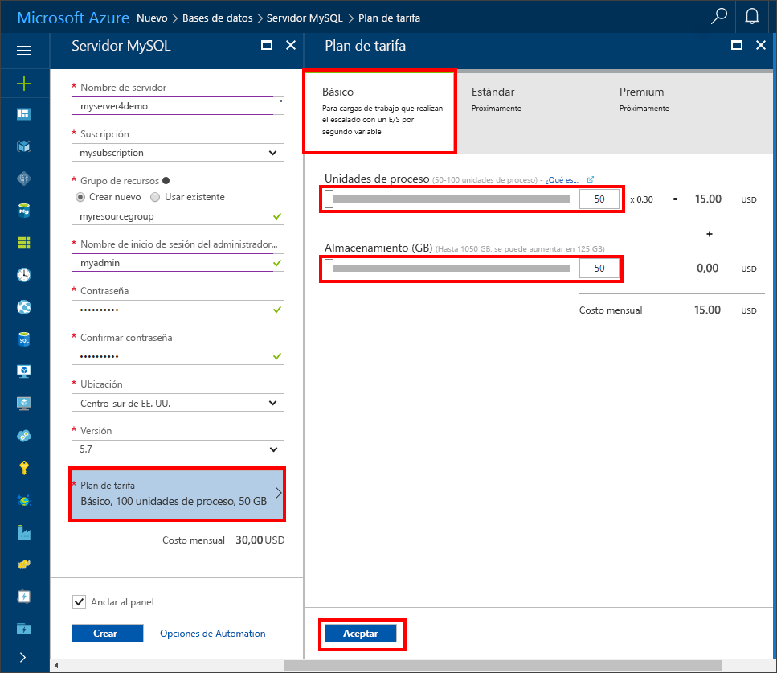
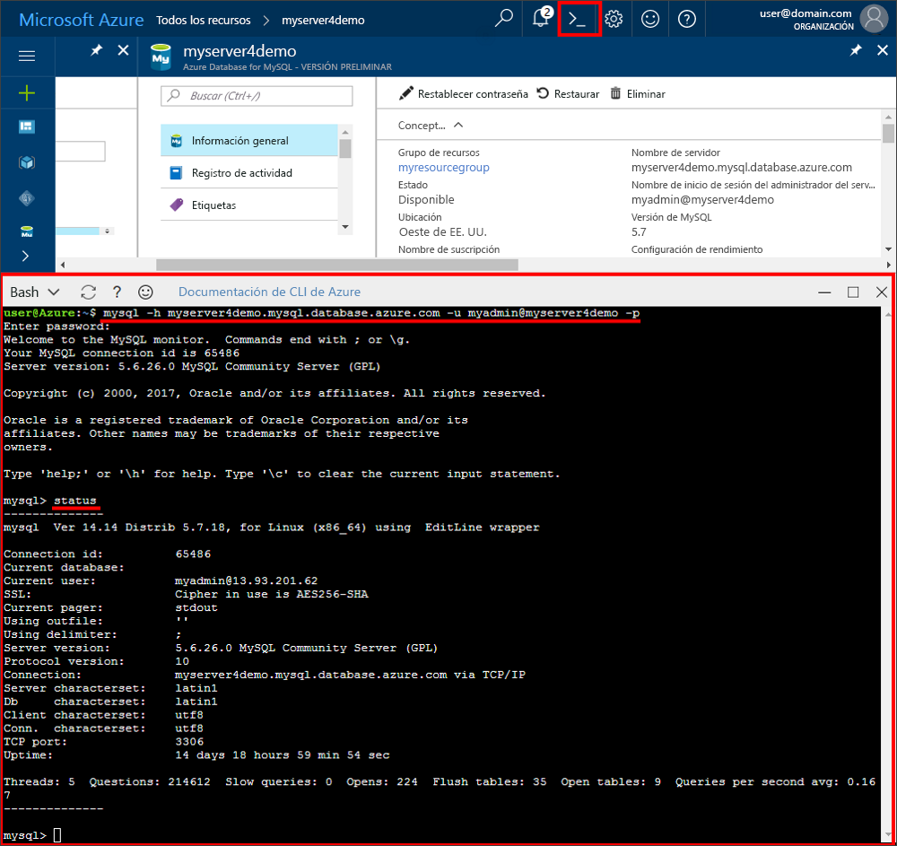

# <a name="create-an-azure-database-for-mysql-server-using-azure-portal"></a>Creación de un servidor de Azure Database for MySQL con Azure Portal
Este artículo le ayudará a usar Azure Portal para crear un servidor de Azure Database for MySQL en unos cinco minutos. 

Si no tiene una suscripción a Azure, cree una cuenta [gratuita](https://azure.microsoft.com/free/) antes de empezar.

## <a name="log-in-to-azure"></a>Inicie sesión en Azure.
Abra el explorador web y vaya a [Microsoft Azure Portal](https://portal.azure.com/). Introduzca sus credenciales para iniciar sesión en el portal. La vista predeterminada es el panel del servicio.

## <a name="create-azure-database-for-mysql-server"></a>Creación de un servidor de Azure Database for MySQL
1. Haga clic en el botón **Nuevo** de la esquina superior izquierda de Azure Portal.

2. En la página **Nuevo**, seleccione **Bases de datos** y, en la página **Bases de datos**, seleccione **Azure Database for MySQL**. También puede escribir **MySQL** en el cuadro de búsqueda de la página Nuevo para encontrar el servicio.


3. Rellene el formulario con los datos del nuevo servidor con la siguiente información, como se muestra en la imagen anterior:

| **Configuración** | **Valor sugerido** | **Descripción del campo** |
|---|---|---|
| *Nombre del servidor* | myserver4demo  | El nombre del servidor debe ser único globalmente. |
| *Suscripción* | mysubscription | Seleccione la suscripción en la lista desplegable. |
| *Grupos de recursos* | myresourcegroup | Cree un grupo de recursos o use uno existente. |
| *Inicio de sesión del administrador del servidor* | myadmin | Especifique un nombre de cuenta para que sea el administrador en el motor de MySQL. |
| *Password* |  | Configure una contraseña de la cuenta de administrador segura. |
| *Confirmar contraseña* |  | Confirme la contraseña de la cuenta de administrador. |
| *Ubicación* |  | Seleccione una región disponible. |
| *Versión* | 5.7 | Elija la versión más reciente. |
| *Plan de tarifa* | Básico, 50 unidades de proceso, 50 GB de almacenamiento  | Seleccione **Plan de tarifa**, **Unidades de proceso**, **Almacenamiento (GB)** y, finalmente, haga clic en **Aceptar**. |
| *Anclar al panel* | Comprobar | Es recomendable activar esta casilla para poder encontrar el servidor fácilmente más tarde |

   Haga clic en **Plan de tarifa** para especificar el nivel de rendimiento y el nivel de servicio de la nueva base de datos. En esta guía de inicio rápido, seleccione el nivel Básico, 50 Unidades de proceso y 50 GB de almacenamiento incluido. A continuación, haga clic en **Aceptar** para guardar este plan de tarifa.
   
   

   A continuación, haga clic en **Crear**. En un par de minutos, tendrá un servidor nuevo de Azure Database for MySQL en ejecución en la nube. Haga clic en el botón **Notificaciones** (icono de la campana) de la barra de herramientas para supervisar el proceso de implementación.

## <a name="configure-the-firewall"></a>Configuración del firewall
Antes de conectarse a Azure Database for MySQL por primera vez, configure el firewall y agregue la dirección IP (o intervalo de direcciones IP) de red pública del cliente a la lista de permitidos.

1. Una vez finalizada la implementación, haga clic en **Todos los recursos** del menú izquierdo y escriba el nombre **myserver4demo** para buscar el servidor recién creado. Haga clic en el nombre del servidor que aparece en el resultado de la búsqueda. Se abrirá la página Introducción del servidor, que proporciona opciones para continuar la configuración.

2. En la hoja del servidor, seleccione **Seguridad de la conexión**.

3. Haga clic en **Agregar mi IP** para agregar la dirección IP del equipo local o configurar un intervalo de direcciones IP. Recuerde hacer clic en **Guardar** después de haber creado las reglas.
  

## <a name="get-connection-information"></a>Obtención de información sobre la conexión
En Azure Portal encontrará el nombre completo de dominio del servidor Azure MySQL. Utilice el nombre completo de dominio para conectarse al servidor mediante la herramienta **mysql.exe** de la línea de comandos.

1.  En [Azure Portal](https://portal.azure.com/), haga clic en **Todos los recursos** en el menú izquierdo y en el servidor de Azure Database for MySQL.

2.  Haga clic en **Propiedades**. Anote los valores de **NOMBRE DEL SERVIDOR** e **INICIO DE SESIÓN DEL ADMINISTRADOR DEL SERVIDOR**.
En este ejemplo, el nombre del servidor es *myserver4demo.mysql.database.azure.com* y el inicio de sesión del administrador del servidor, *myadmin@myserver4demo*.

## <a name="connect-to-the-server-using-mysqlexe-command-line-tool"></a>Conexión al servidor mediante la herramienta mysqlexe de la línea de comandos
Use la [herramienta de línea de comandos mysql](https://dev.mysql.com/doc/refman/5.7/en/mysql.html) para establecer una conexión con el servidor de Azure Database for MySQL. Puede ejecutar la herramienta mysql de la línea de comandos en el explorador mediante Azure Cloud Shell o iniciarlo desde su propia máquina mediante herramientas mysql instaladas de forma local. Para iniciar Azure Cloud Shell, haga clic en el botón `Try It` situado en un bloque de código de este artículo, o visite [Azure Portal](https://portal.azure.com) y haga clic en el icono `>_` de la barra de herramientas situada en la parte superior derecha. 

1. Escriba el comando para conectarse:
```azurecli-interactive
mysql -h myserver4demo.mysql.database.azure.com -u myadmin@myserver4demo -p
```

2. Mire el estado del servidor para asegurarse de que la conexión funciona. Escriba `status` en el símbolo del sistema mysql> una vez que esté conectado.
```sql
status
```

   

   > [!TIP]
   > Para otros comandos, consulte el [capítulo 4.5.1 del Manual de referencia de MySQL 5.7](https://dev.mysql.com/doc/refman/5.7/en/mysql.html).

3. Cree una base de datos vacía; para ello escriba el comando `CREATE DATABASE` en el símbolo del sistema mysql>.

   ```sql
   CREATE DATABASE quickstartdb;
   ```

   Dentro del servidor de Azure Database for MySQL, puede tener una o varias bases de datos. Puede optar por crear una sola base de datos por servidor para que se usen todos los recursos, o bien crear varias bases de datos para compartir los recursos. No hay límite para el número de bases de datos que se pueden crear, pero las bases de datos compartirán los mismos recursos del servidor.  

4. Muestre las bases de datos escribiendo el comando `SHOW DATABASES` en el símbolo del sistema mysql>.

   ```sql
   SHOW DATABASES;
   ```

## <a name="connect-to-the-server-using-the-mysql-workbench-gui-tool"></a>Conexión al servidor con la herramienta MySQL Workbench de la GUI
1.  Inicie la aplicación MySQL Workbench en el equipo cliente. Puede descargar e instalar MySQL Workbench desde [aquí](https://dev.mysql.com/downloads/workbench/).

2.  En el cuadro de diálogo **Setup New Connection** (Establecer nueva conexión), escriba la siguiente información en la pestaña **Parámetros**:

   

| **Configuración** | **Valor sugerido** | **Descripción del campo** |
|---|---|---|
|   *Nombre de la conexión* | Conexión de demostración| Especifique una etiqueta para esta conexión. |
| *Método de conexión* | Estándar (TCP/IP) | Estándar (TCP/IP) es suficiente. |
| *Nombre de host* | myserver4demo.mysql.database.azure.com | Use el nombre completo del servidor. |
| *Puerto* | 3306 | Use el puerto predeterminado 3306. |
| *Nombre de usuario* | myadmin@myserver4demo  | Use el inicio de sesión del administrador del servidor que anotó anteriormente, con un carácter @ y el nombre del servidor. |
| *Password* | la contraseña | Haga clic en el botón Store in Vault (Almacenar en el almacén)... para guardar la contraseña. |

Haga clic en **Probar conexión** para probar si todos los parámetros están configurados correctamente. Haga clic en Aceptar para guardar la conexión. 

> [!NOTE]
> SSL se aplica de forma predeterminada en el servidor que requiere configuración adicional para conectarse correctamente. Consulte [Configure SSL connectivity in your application to securely connect to Azure Database for MySQL](./howto-configure-ssl.md) (Configuración de SSL en la aplicación para la conexión segura a Azure Database for MySQL).  Si desea deshabilitar SSL para esta guía de inicio rápido, visite Azure Portal y haga clic en la página de seguridad de conexión para deshabilitar el botón de alternancia Aplicar conexión SSL.

## <a name="clean-up-resources"></a>Limpieza de recursos
Elimine el [grupo de recursos de Azure](../azure-resource-manager/resource-group-overview.md) para eliminar todos los recursos que ha creado en la guía de inicio rápido.

> [!TIP]
> Otras guías de inicio rápido de esta colección se basan en los valores de esta. Si tiene previsto seguir trabajando con las siguientes guías de inicio rápido, no elimine los recursos creados en esta. Si no tiene previsto continuar, siga estos pasos para eliminar todos los recursos creados en esta guía de inicio rápido en Azure Portal.

1.  En el menú izquierdo de Azure Portal, haga clic en **Resource groups** (Grupos de recursos) y en **myresourcegroup**.
2.  En la página del grupo de recursos, haga clic en **Delete** (Eliminar), escriba **myresourcegroup** en el cuadro de texto y haga clic en Delete (Eliminar).

Si desea eliminar el servidor recién creado:
1.  En el menú izquierdo de Azure Portal, haga clic en los servidores de PostgreSQL y busque el que acaba de crear.
2.  En la página de introducción, haga clic en el botón Delete (Eliminar) del panel superior .
3.  Confirme el nombre del servidor que desea eliminar y observe si sus bases de datos están incluidas. Escriba **myserver4demo** en el cuadro de texto y haga clic en Delete (Eliminar).


## <a name="next-steps"></a>Pasos siguientes

> [!div class="nextstepaction"]
> [Diseño de la primera base de datos de Azure Database for MySQL](./tutorial-design-database-using-portal.md)


