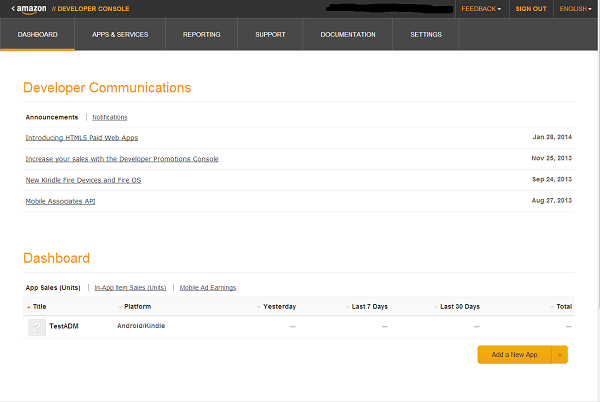
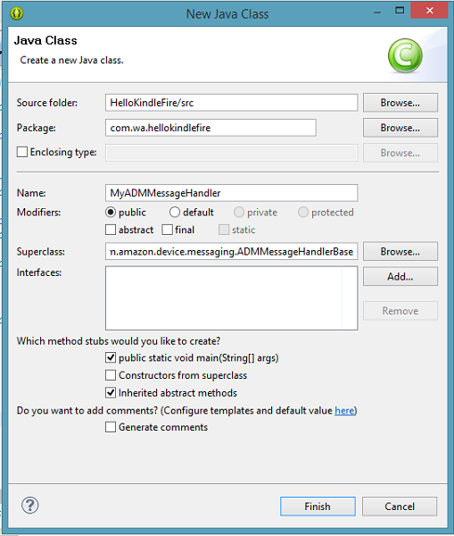

<properties linkid="develop-notificationhubs-tutorials-get-started-kindle" urlDisplayName="Get Started" pageTitle="Get Started with Azure Notification Hubs" metaKeywords="" description="Learn how to use Azure Notification Hubs to send push notifications." metaCanonical="" services="notification-hubs" documentationCenter="Mobile" title="Get started with Notification Hubs" authors="sethm" solutions="" manager="dwrede" editor="" />

Introducción a los Centros de notificaciones
============================================

[C\# para Tienda Windows](/en-us/manage/services/notification-hubs/getting-started-windows-dotnet "C# para Tienda Windows")[Windows Phone](/en-us/documentation/articles/notification-hubs-windows-phone-get-started/ "Windows Phone")[iOS](/en-us/documentation/articles/notification-hubs-ios-get-started/ "iOS")[Android](/en-us/documentation/articles/notification-hubs-android-get-started/ "Android")[Kindle](/en-us/documentation/articles/notification-hubs-kindle-get-started/ "Kindle")[Xamarin.iOS](/en-us/documentation/articles/partner-xamarin-notification-hubs-ios-get-started/ "Xamarin.iOS")[Xamarin.Android](/en-us/documentation/articles/partner-xamarin-notification-hubs-android-get-started/ "Xamarin.Android")

Este tema muestra cómo puede utilizar los Centros de notificaciones de Azure para enviar notificaciones de inserción a una aplicación Kindle. En este tutorial, creará una aplicación Kindle vacía que recibirá notificaciones de inserción con el servicio de mensajería en la nube de Google (GCM).

Este tutorial requiere lo siguiente:

-   El SDK de Android (se presupone que usará Eclipse), que puede descargarse desde [aquí](http://go.microsoft.com/fwlink/?LinkId=389797).
-   Siga los pasos descritos [aquí](https://developer.amazon.com/appsandservices/resources/development-tools/ide-tools/tech-docs/01-setting-up-your-development-environment) para configurar el entorno de desarrollo para Kindle.

Incorporación de una aplicación nueva al portal para desarrolladores
--------------------------------------------------------------------

1.  En primer lugar, cree una aplicación en el [portal de desarrolladores](https://developer.amazon.com/home.html).

    

2.  Copie la **clave de aplicación**.

    

3.  En el portal, haga clic en el nombre de la aplicación y, a continuación, haga clic en la pestaña **Device Messaging**.

    

4.  Haga clic en **Create a New Security Profile** y, a continuación, cree un nuevo perfil de seguridad (por ejemplo, **TestAdm security profile**). A continuación, haga clic en **Save**.

    

5.  Haga clic en "Security Profiles" para ver el perfil de seguridad que acaba de crear. Copie los valores **Id. de cliente** y **Secreto del cliente** para usarlos más adelante.

    

Creación de una clave de API
----------------------------

1.  Abra un símbolo del sistema con privilegios de administrador.
2.  Vaya a la carpeta del SDK de Android.
3.  Escriba el comando siguiente:

		keytool -list -v -alias androiddebugkey -keystore ./debug.keystore

    

4.  Para la contraseña de **keystore**, escriba **android**.

5.  Copie la huella digital **MD5**.
6.  En la pestaña **Messaging** del portal para desarrolladores, haga clic en **Android/Kindle** y escriba el nombre del paquete para la aplicación (por ejemplo, **com.sample.notificationhubtest**), el valor de **MD5** y, a continuación, haga clic en **Generate API Key**.

Incorporación de credenciales al centro
---------------------------------------

En el portal, agregue el secreto de cliente y el identificador de cliente a la pestaña **Configure** del centro de notificaciones.

Configuración de la aplicación
------------------------------

**Nota:**

Al crear un aplicación, use al menos la API Level 17.

Agregue las bibliotecas de ADM al proyecto Eclipse.

1.  Para obtener la biblioteca de ADM, [descargue el SDK](https://developer.amazon.com/public/resources/development-tools/sdk). Extraiga el archivo ZIP del SDK.
2.  En Eclipse, haga clic con el botón secundario en el proyecto y, a continuación, haga clic en **Properties**. Seleccione **Java Build Path** en la izquierda y, a continuación, seleccione la pestaña **Libraries** en la parte superior. Haga clic en **Add External Jar** y seleccione el archivo `\SDK\Android\DeviceMessaging\lib\amazon-device-messaging-*.jar` en el directorio en que ha extraído el SDK de Amazon.
3.  Descargue el SDK de Android NotificationHubs (vínculo).
4.  Descomprima el paquete y, a continuación, arrastre el archivo `notification-hubs-sdk.jar` a la carpeta `libs `de Eclipse.

Edite el manifiesto de la aplicación para admitir ADM:

1.  Agregue el espacio de nombres de Amazon al elemento del manifiesto raíz:

         xmlns:amazon="http://schemas.amazon.com/apk/res/android"

2.  Agregue permisos como el primer elemento del manifiesto. Sustituya **[NOMBRE DEL PAQUETE]** por el paquete usado para crear la aplicación.

         <permission android:name="[NOMBRE DEL PAQUETE].permission.RECEIVE_ADM_MESSAGE"
          android:protectionLevel="signature" />

         <uses-permission android:name="android.permission.INTERNET"/>

         <uses-permission android:name="[NOMBRE DEL PAQUETE].permission.RECEIVE_ADM_MESSAGE" />
         
         <!-- Este permiso permite a la aplicación obtener acceso para recibir
         notificaciones de inserción de ADM. -->
         <uses-permission android:name="com.amazon.device.messaging.permission.RECEIVE" />
         
         <!-- ADM usa WAKE_LOCK para que el procesador no esté suspendido cuando se recibe un mensaje. -->
         <uses-permission android:name="android.permission.WAKE_LOCK" />

3.  Inserte el siguiente elemento como el primer elemento secundario de la aplicación. Recuerde sustituir **[NOMBRE DEL SERVICIO]** por el nombre del controlador de mensajes de ADM que creará en la siguiente sección (incluido el paquete) y reemplace **[NOMBRE DEL PAQUETE]** por el nombre del paquete con que ha creado la aplicación.

         <amazon:enable-feature
               android:name="com.amazon.device.messaging"
                      android:required="true"/>
         <service android:name="[NOMBRE DEL SERVICIO]"
             android:exported="false" />
             
         <receiver android:name="[NOMBRE DEL SERVICIO]$Receiver"
             
             <!-- Este permiso garantiza que solo ADM pueda enviar las difusiones de registro de la aplicación. -->
             android:permission="com.amazon.device.messaging.permission.SEND" >
             
             <!-- Para interactuar con ADM, la aplicación debe escuchar los siguientes intentos. -->
             <intent-filter>
           <action android:name="com.amazon.device.messaging.intent.REGISTRATION" />
           <action android:name="com.amazon.device.messaging.intent.RECEIVE" />
             
           <!-- Sustituya el nombre de la etiqueta de categoría por el nombre del paquete de la aplicación. -->
           <category android:name="[NOMBRE DEL PAQUETE]" />
             </intent-filter>
         </receiver>

Creación del controlador de mensajes de ADM:
--------------------------------------------

1.  Cree una clase nueva heredada de `com.amazon.device.messaging.ADMMessageHandlerBase` y asígnele el nombre `MyADMMessageHandler`, como se muestra en la siguiente ilustración:

    

2.  Agregue las siguientes instrucciones `import`:

         import android.app.NotificationManager;
         import android.app.PendingIntent;
         import android.content.Context;
         import android.content.Intent;
         import android.support.v4.app.NotificationCompat;
         import com.amazon.device.messaging.ADMMessageReceiver;
         import com.microsoft.windowsazure.messaging.NotificationHub

3.  Agregue el código siguiente a la clase que ha creado. Recuerde reemplazar el nombre del centro y de la cadena de conexión (escucha):

         public static final int NOTIFICATION_ID = 1;
         private NotificationManager mNotificationManager;
         NotificationCompat.Builder builder;

	     private static NotificationHub hub;

         public static NotificationHub getNotificationHub(Context context) {
             Log.v("com.wa.hellokindlefire", "getNotificationHub");
             if (hub == null) {
                 hub = new NotificationHub("[hub name]", "[listen connection string]", context);
             }
             return hub;
         }

         public MyADMMessageHandler() {
                 super("MyADMMessageHandler");
             }

             public static class Receiver extends ADMMessageReceiver

    	{

                 public Receiver()
                {
                    super(MyADMMessageHandler.class);
                }

    	}

             private void sendNotification(String msg) {
                 Context ctx = getApplicationContext();
            
                 mNotificationManager = (NotificationManager)
                    ctx.getSystemService(Context.NOTIFICATION_SERVICE);

            PendingIntent contentIntent = PendingIntent.getActivity(ctx, 0,
                new Intent(ctx, MainActivity.class), 0);

            NotificationCompat.Builder mBuilder =
                new NotificationCompat.Builder(ctx)
                .setSmallIcon(R.drawable.ic_launcher)
                .setContentTitle("Notification Hub Demo")
                .setStyle(new NotificationCompat.BigTextStyle()
                          .bigText(msg))
                .setContentText(msg);

            mBuilder.setContentIntent(contentIntent);
            mNotificationManager.notify(NOTIFICATION_ID, mBuilder.build());
         }

4.  Agregue el siguiente código al método `OnMessage()`:

         String nhMessage = intent.getExtras().getString("msg");
         sendNotification(nhMessage);

5.  Agregue el siguiente código al método `OnRegistered`:

             try {
         getNotificationHub(getApplicationContext()).register(registrationId);
             } catch (Exception e) {
         Log.e("[your package name]", "Fail onRegister: " + e.getMessage(), e);
             }

6.  Agregue el siguiente código al método `OnUnregistered`:

            try {
                getNotificationHub(getApplicationContext()).unregister();
            } catch (Exception e) {
                Log.e("[your package name]", "Fail onUnregister: " + e.getMessage(), e);
            }

7.  A continuación, en el método `MainActivity`, agregue la siguiente instrucción import:

         import com.amazon.device.messaging.ADM;             

8.  Ahora, agregue el siguiente código al final del método `OnCreate`:

         final ADM adm = new ADM(this);
         if (adm.getRegistrationId() == null)
         {
            adm.startRegister();
         } else {
             new AsyncTask() {
                   @Override
                   protected Object doInBackground(Object... params) {
                      try {                      MyADMMessageHandler.getNotificationHub(getApplicationContext()).register(adm.getRegistrationId());
                      } catch (Exception e) {
                         Log.e("com.wa.hellokindlefire", "Failed registration with hub", e);
                         return e;
                      }
                      return null;
                  }
                }.execute(null, null, null);
         }

Incorporación de APIKey a la aplicación
---------------------------------------

1.  En Eclipse, cree un archivo nuevo con nombre **api\_key.txt** en los recursos del directorio del proyecto.
2.  Abra el archivo y copie la **clave de API** generada en el portal para desarrolladores de Amazon.

Ejecución de la aplicación
--------------------------

1.  Inicie el emulador.
2.  En el emulador, desplácese desde la parte superior y haga clic en **Settings** y en **My account** y regístrese con una cuenta de Amazon válida.
3.  Ejecute la aplicación en Eclipse.

**Nota:**

Si se produce un error, compruebe el tiempo del emulador (o del dispositivo). El valor de tiempo debe ser preciso. Para cambiar el tiempo del emulador de Kindle, puede ejecutar el comando siguiente desde el directorio de herramientas de la plataforma del SDK de Android:

     adb shell  date -s "yyyymmdd.hhmmss"

Envío de un mensaje
-------------------

Para enviar un mensaje con .NET:

     static void Main(string[] args)
        {
            NotificationHubClient hub = NotificationHubClient.CreateClientFromConnectionString("[conn string]", "[hub name]");

            hub.SendAdmNativeNotificationAsync("{    static void Main(string[] args)
        {
            NotificationHubClient hub = NotificationHubClient.CreateClientFromConnectionString("[conn string]", "[hub name]");

            hub.SendAdmNativeNotificationAsync("{\"data\":{\"msg\" : \"Hello from .NET!\"}}").Wait();
        }
    quot;data  static void Main(string[] args)
        {
            NotificationHubClient hub = NotificationHubClient.CreateClientFromConnectionString("[conn string]", "[hub name]");

            hub.SendAdmNativeNotificationAsync("{\"data\":{\"msg\" : \"Hello from .NET!\"}}").Wait();
        }
    quot;:{    static void Main(string[] args)
        {
            NotificationHubClient hub = NotificationHubClient.CreateClientFromConnectionString("[conn string]", "[hub name]");

            hub.SendAdmNativeNotificationAsync("{\"data\":{\"msg\" : \"Hello from .NET!\"}}").Wait();
        }
    quot;msg   static void Main(string[] args)
        {
            NotificationHubClient hub = NotificationHubClient.CreateClientFromConnectionString("[conn string]", "[hub name]");

            hub.SendAdmNativeNotificationAsync("{\"data\":{\"msg\" : \"Hello from .NET!\"}}").Wait();
        }
    quot; :    static void Main(string[] args)
        {
            NotificationHubClient hub = NotificationHubClient.CreateClientFromConnectionString("[conn string]", "[hub name]");

            hub.SendAdmNativeNotificationAsync("{\"data\":{\"msg\" : \"Hello from .NET!\"}}").Wait();
        }
    quot;Hello from .NET!  static void Main(string[] args)
        {
            NotificationHubClient hub = NotificationHubClient.CreateClientFromConnectionString("[conn string]", "[hub name]");

            hub.SendAdmNativeNotificationAsync("{\"data\":{\"msg\" : \"Hello from .NET!\"}}").Wait();
        }
    quot;}}").Wait();
        }

