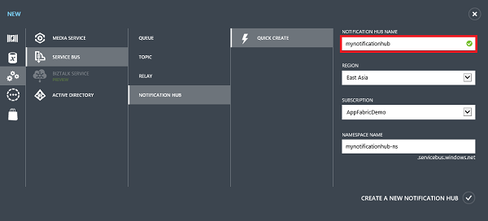
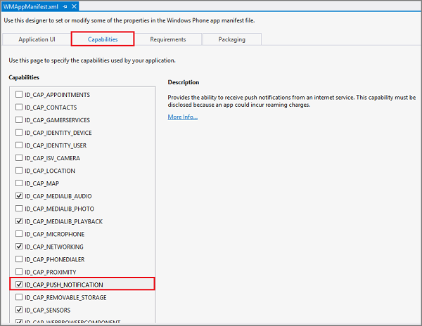
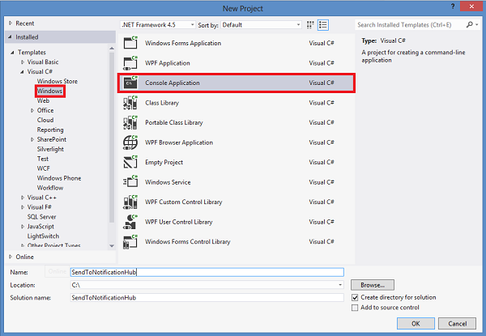

<properties linkid="develop-notificationhubs-tutorials-get-started-windowsphone" urlDisplayName="Get Started" pageTitle="Get Started with Azure Notification Hubs" metaKeywords="" description="Learn how to use Azure Notification Hubs to push notifications." metaCanonical="" services="notification-hubs" documentationCenter="Mobile" title="Get started with Notification Hubs" authors="elioda" solutions="" manager="" editor="" />

Introducción a los Centros de notificaciones
============================================

[C# para Tienda Windows](/es-es/manage/services/notification-hubs/getting-started-windows-dotnet "C# para Tienda Windows")[Windows Phone](/es-es/documentation/articles/notification-hubs-windows-phone-get-started/ "Windows Phone")[iOS](/es-es/documentation/articles/notification-hubs-ios-get-started/ "iOS")[Android](/es-es/documentation/articles/notification-hubs-android-get-started/ "Android")[Kindle](/es-es/documentation/articles/notification-hubs-kindle-get-started/ "Kindle")[Xamarin.iOS](/es-es/documentation/articles/partner-xamarin-notification-hubs-ios-get-started/ "Xamarin.iOS")[Xamarin.Android](/es-es/documentation/articles/partner-xamarin-notification-hubs-android-get-started/ "Xamarin.Android")

Este tema muestra cómo puede utilizar los Centros de notificaciones de Azure para enviar notificaciones de inserción a una aplicación de Windows Phone 8. En este tutorial puede crear una aplicación de Windows Phone 8 vacía que recibe notificaciones de inserción mediante el servicios de notificaciones de inserción de Microsoft (MPNS). Cuando haya finalizado, podrá difundir notificaciones de inserción a todos los dispositivos que ejecutan su aplicación usando su centro de notificaciones.

Este tutorial le guiará a través de los siguientes pasos para habilitar las notificaciones de inserción:

1.  [Creación de su Centro de notificaciones](#configure-hub)
2.  [Conexión de su aplicación al Centro de notificaciones](#connecting-app)
3.  [Envío de notificaciones desde su back-end](#send)

En este tutorial se demuestra el escenario de difusión sencillo con centros de notificaciones. Asegúrese de seguirlo junto con el próximo tutorial para aprender a usar los centros de notificaciones para abordar usuarios y grupos de dispositivos específicos. Este tutorial requiere lo siguiente:

-   [Visual Studio 2012 Express para Windows Phone](https://go.microsoft.com/fwLink/p/?LinkID=268374), o una versión posterior.

Completar este tutorial es un requisito previo para todos los demás tutoriales de centros de notificaciones para aplicaciones de Windows Phone 8.

**Nota:**

para completar este tutorial, deberá tener una cuenta de Azure activa. En caso de no tener ninguna, puede crear una cuenta de evaluación gratuita en tan solo unos minutos. Para obtener más información, consulte [Evaluación gratuita de Azure](http://www.windowsazure.com/es-es/pricing/free-trial/?WT.mc_id=A0E0E5C02&returnurl=http%3A%2F%2Fwww.windowsazure.com%2Fen-us%2Fdevelop%2Fmobile%2Ftutorials%2Fget-started%2F).

Creación de su Centro de notificacionesCreación de su Centro de notificaciones
------------------------------------------------------------------------------

1.  Inicie sesión en el [Portal de administración de Azure](https://manage.windowsazure.com/) y, a continuación, haga clic en **+NEW** en la parte inferior de la pantalla.

2.  Haga clic sucesivamente en **Servicios de aplicaciones**, **Bus de servicio**, **Centro de notificaciones** y finalmente en **Quick Create**.

   	

3.  Escriba un nombre para su centro de notificaciones, seleccione la región deseada y, a continuación, haga clic en **Create a new Notification Hub**.

   	

4.  Haga clic en el espacio de nombres que acaba de crear (por lo general ***notification hub name*-ns**) y, a continuación, haga clic en la pestańa **Configure** en la parte superior.

   	

5.  Haga clic en la pestańa **Centros de notificaciones** en la parte superior y, a continuación, haga clic en el centro de notificaciones que acaba de crear.

   	

6.  Haga clic en **Connection Information** en la parte inferior. Anote las dos cadenas de conexión.

   	

7.  Haga clic en la pestańa **Configure** y, a continuación, active la casilla **Enable unauthenticated push notifications** en la sección **Windows Phone notifications settings**.

   	

Ahora tiene las cadenas de conexión necesarias para registrar su aplicación de Windows Phone 8 y enviar notificaciones.

**Nota:**

Este tutorial usa MPNS en modo sin autenticar. El modo sin autenticar de MPNS viene con restricciones sobre las notificaciones que puede enviar a cada canal. Los Centros de notificaciones admiten el [modo sin autenticar de MPNS](http://msdn.microsoft.com/es-es/library/windowsphone/develop/ff941099(v=vs.105).aspx) (en inglés).

Conexión de su aplicaciónConexión de su aplicación al Centro de notificaciones
------------------------------------------------------------------------------

1.  En Visual Studio, cree una aplicación nueva de Windows Phone 8.

   	

2.  Agregue una referencia a la biblioteca de Mensajería de Azure para la Tienda Windows usando el paquete [WindowsAzure.Messaging.Managed NuGet](http://nuget.org/packages/WindowsAzure.Messaging.Managed/). En el menú de Visual Studio, haga clic en **Tools**, luego en **Library Package Manager** y finalmente en **Package Manager Console**. Posteriormente, en la ventana de la consola, escriba:

		Install-Package WindowsAzure.Messaging.Managed

    y presione Entrar.

3.  Abra el archivo App.xaml.cs y agregue las siguientes instrucciones `using`:

		using Microsoft.Phone.Notification;
		using Microsoft.WindowsAzure.Messaging;

4.  En el siguiente código en la parte superior del método **Application_Launching** en App.xaml.cs:

		var channel = HttpNotificationChannel.Find("MyPushChannel");
		if (channel == null)
		{
			channel = new HttpNotificationChannel("MyPushChannel");
			channel.Open();
			channel.BindToShellToast();
		}

		channel.ChannelUriUpdated += new EventHandler(async (o, args) =>
		{
			var hub = new NotificationHub("", "");
			await hub.RegisterNativeAsync(args.ChannelUri.ToString());
		});

    Asegúrese de insertar el nombre del centro y la cadena de conexión llamada **DefaultListenSharedAccessSignature** que obtuvo en la sección anterior. Este código recupera el valor de ChannelURI de la aplicación desde los MPNS y, a continuación, lo registra con su centro de notificaciones. Garantiza también que el valor de ChannelURI se registre en su centro de notificaciones cada vez que se inicia la aplicación.

    **Nota:**

    Este tutorial envía una notificación del sistema al dispositivo. Cuando envía una notificación de icono, debe llamar al método **BindToShellTile** en el canal. Para admitir notificaciones del sistema y notificaciones de icono, llame a ambos métodos, **BindToShellTile** y **BindToShellToast**.

5.  En el Explorador de soluciones, expanda **Propiedades**, abra el archivo WMAppManifest.xml, haga clic en la pestańa **Funcionalidades** y asegúrese de que la funcionalidad **ID__CAP__PUSH_NOTIFICATION** esté marcada.

   	

   	Esto asegura que la aplicación pueda recibir notificaciones de inserción.

6.  Presione la tecla F5 para ejecutar la aplicación.

Envío de notificacionesEnvío de notificaciones desde su back-end
----------------------------------------------------------------

Puede enviar notificaciones mediante los centros de notificaciones desde cualquier back-end que use la [interfaz REST](http://msdn.microsoft.com/es-es/library/windowsazure/dn223264.aspx). En este tutorial se pueden enviar notificaciones con una aplicación de consola .NET y con un Servicio móvil mediante un script de Node.

Para enviar notificaciones mediante una aplicación .NET:

1.  Cree una aplicación de consola nueva de Visual C#:

   	

2.  Agregue una referencia al SDK de Bus de servicio de Azure con el [paquete WindowsAzure.ServiceBus NuGet](http://nuget.org/packages/WindowsAzure.ServiceBus/). En el menú principal de Visual Studio, haga clic en **Tools**, luego en **Library Package Manager** y finalmente en **Package Manager Console**. Posteriormente, en la ventana de la consola, escriba:

		Install-Package WindowsAzure.ServiceBus

    y presione Entrar.

3.  Abra el archivo Program.cs y agregue la siguiente instrucción `using`:

		using Microsoft.ServiceBus.Notifications;

4.  En la clase `Program`, agregue el siguiente método.

		private static async void SendNotificationAsync()
		{
			NotificationHubClient hub = NotificationHubClient.CreateClientFromConnectionString("<connection string with full access>", "<hub name>");
			string toast = "<?xml version=\"1.0\" encoding=\"utf-8\"?>" +
				"<wp:Notification xmlns:wp=\"WPNotification\">" +
					"<wp:Toast>" +
						"<wp:Text1>Hello from a .NET App!</wp:Text1>" +
					"</wp:Toast> " +
				"</wp:Notification>";
			await hub.SendMpnsNativeNotificationAsync(toast);
		}

    Asegúrese de insertar el nombre del centro y la cadena de conexión llamada DefaultFullSharedAccessSignature que obtuvo en la sección "Configuración de su Centro de notificaciones". Tenga en cuenta que esta es la cadena de conexión con acceso Total, no acceso Escuchar.

5.  Posteriormente, agregue la siguiente línea al método Main:

		SendNotificationAsync();
		Console.ReadLine();

6.  Presione la tecla F5 para ejecutar la aplicación. Debería recibir una notificación del sistema. Asegúrese de tener el emulador de Windows Phone en ejecución y su aplicación cerrada.

Puede encontrar todas las cargas posibles en MSDN en el [catálogo de notificaciones del sistema](http://msdn.microsoft.com/es-es/library/windowsphone/develop/jj662938(v=vs.105).aspx) y el [catálogo de iconos](http://msdn.microsoft.com/es-es/library/windowsphone/develop/hh202948(v=vs.105).aspx).

Pasos siguientes
----------------

En este sencillo ejemplo, difunde notificaciones a todos los dispositivos con Windows Phone 8. Para abordar usuarios específicos, consulte el tutorial [Uso de Centros de notificaciones para insertar notificaciones en los usuarios](/es-es/manage/services/notification-hubs/notify-users-aspnet). Si desea segmentar a sus usuarios por grupos de interés, puede leer [Uso de Centros de notificaciones para enviar noticias de último minuto](/es-es/manage/services/notification-hubs/breaking-news-dotnet). Obtenga más información sobre el uso de Centros de notificaciones en la [orientación sobre los Centros de notificaciones](http://msdn.microsoft.com/es-es/library/jj927170.aspx) (en inglés).

