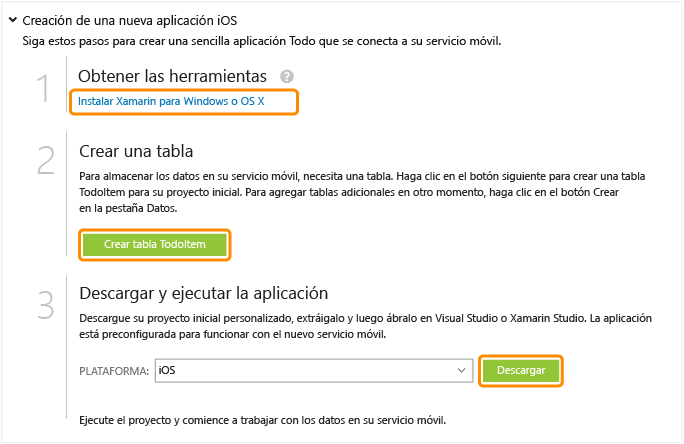
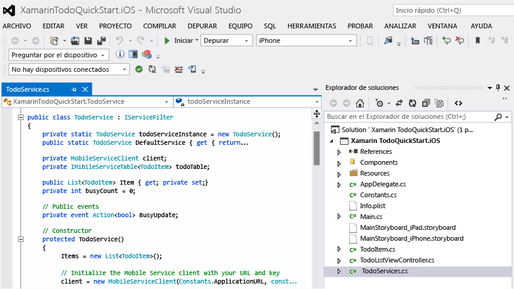
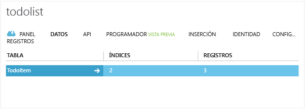

<properties pageTitle="Get Started with Mobile Services for Xamarin iOS apps" metaKeywords="" description="Follow this tutorial to get started using Azure Mobile Services for Xamarin iOS development." metaCanonical="" services="mobile" documentationCenter="Mobile" title="Get started with Mobile Services" authors="craigd" solutions="" manager="" editor="" />

Introducción a los Servicios móviles
====================================

[Tienda Windows](/en-us/documentation/articles/mobile-services-windows-store-get-started "Windows Store") [Windows Phone](/en-us/documentation/articles/mobile-services-windows-phone-get-started "Windows Phone") [iOS](/en-us/documentation/articles/mobile-services-ios-get-started "iOS") [Android](/en-us/documentation/articles/mobile-services-android-get-started "Android") [HTML](/en-us/documentation/articles/mobile-services-html-get-started "HTML") [Xamarin.iOS](/en-us/documentation/articles/partner-xamarin-mobile-services-ios-get-started "Xamarin.iOS") [Xamarin.Android](/en-us/documentation/articles/partner-xamarin-mobile-services-android-get-started "Xamarin.Android") [Sencha](/en-us/documentation/articles/partner-sencha-mobile-services-get-started/ "Sencha") [PhoneGap](/en-us/documentation/articles/mobile-services-javascript-backend-phonegap-get-started/ "PhoneGap")

En este tutorial se muestra cómo agregar un servicio back-end basado en la nube a una aplicación Xamarin.iOS mediante Servicios móviles de Azure. Con este tutorial creará tanto un servicio móvil nuevo como una aplicación simple de *Lista de pendientes* que almacena datos de la aplicación en el servicio móvil nuevo.

Si prefiere ver un vídeo, el clip que aparece a la derecha muestra los mismos pasos que este tutorial.

[Ver el tutorial (en inglés)](http://channel9.msdn.com/Series/Windows-Azure-Mobile-Services/Getting-Started-with-Xamarin-and-Windows-Azure-Mobile-Services) [Reproducir vídeo (en inglés)](http://channel9.msdn.com/Series/Windows-Azure-Mobile-Services/Getting-Started-with-Xamarin-and-Windows-Azure-Mobile-Services) 10:05

La siguiente captura de pantalla muestra la aplicación final:

Para completar este tutorial es necesario XCode 4.5 y iOS 5.0 o versiones posteriores, y [Xamarin Studio](http://xamarin.com/download) para OS X o el complemento Xamarin Visual Studio para Visual Studio en Windows.

**Nota:**

Necesita una cuenta de Azure para completar este tutorial. En caso de no tener ninguna, puede crear una cuenta de evaluación gratuita en tan solo unos minutos. Para obtener más información, consulte [Evaluación gratuita de Azure](http://www.windowsazure.com/en-us/pricing/free-trial/?WT.mc_id=A643EE910&returnurl=http%3A%2F%2Fwww.windowsazure.com%2Fen-us%2Fdevelop%2Fmobile%2Ftutorials%2Fget-started-xamarin-ios%2F).

Creación de un servicio móvil
-----------------------------

[WACOM.INCLUDE [mobile-services-create-new-service](../includes/mobile-services-create-new-service.md)]

Creación de una nueva aplicaciónCreación de una nueva aplicación Xamarin.iOS
----------------------------------------------------------------------------

Una vez que haya creado el servicio móvil, podrá seguir una introducción rápida en el Portal de administración para crear una nueva aplicación o modificar una ya existente a fin de conectarla a dicho servicio.

En esta sección se creará una nueva aplicación Xamarin.iOS que se conecta al servicio móvil.

1.  En el Portal de administración, haga clic en **Servicios móviles** y, a continuación, en el servicio móvil que acaba de crear.

2.  En la pestańa de inicio rápido, haga clic en **Xamarin.iOS** bajo **Choose platform** y expanda **Create a new Xamarin.iOS app**.

    

    Con esto se muestran los tres sencillos pasos requeridos para crear una aplicación Xamarin.iOS conectada al servicio móvil.

    

1.  Si todavía no lo ha hecho, descargue e instale [Xcode] v4.4 o una versión posterior y [Xamarin Studio](http://xamarin.com/download).

2.  Haga clic en **Create TodoItems table** para crear una tabla donde almacenar datos de la aplicación.

3.  En **Download and run app**, haga clic en **Download**.

    De esta forma, se descarga el proyecto para el ejemplo de la aplicación *Lista de tareas pendientes* que se conecta al servicio móvil y hace referencia al componente de Servicios móviles de Azure para Xamarin.iOS. Guarde el archivo de proyecto comprimido en el equipo local y anote el lugar donde lo guardó.

Ejecución de la aplicaciónEjecución de una nueva aplicación Xamarin.iOS
-----------------------------------------------------------------------

La etapa final de este tutorial consiste en crear y ejecutar la aplicación nueva.

1.  Vaya a la ubicación donde guardó los archivos comprimidos del proyecto, expándalos en su equipo y abra el archivo de la solución **XamarinTodoQuickStart.iOS.sln** con Xamarin Studio o Visual Studio.

    

    

2.  Presione el botón **Run** para crear el proyecto e iniciar la aplicación en el emulador de iPhone, que es la solución predeterminada para este proyecto.

3.  En la aplicación, escriba un texto significativo, como *Realice el tutorial*. A continuación, haga clic en el icono de suma (**+**).

    

    Esta acción envía una solicitud POST al nuevo servicio móvil hospedado en Azure. Los datos de la solicitud se insertan en la tabla TodoItem. El servicio móvil devuelve los elementos almacenados en la tabla y los datos se muestran en la lista.

    **Nota:**

    Puede revisar el código de acceso al servicio móvil para consultar e insertar datos; este se encuentra en el archivo de C\# TodoService.cs.

4.  Nuevamente en el Portal de administración, haga clic en la pestańa **Data** y, a continuación, en la tabla **TodoItems**.

    

    Esto le permite examinar los datos que la aplicación inserta en la tabla.

    

Pasos siguientes
----------------

Ahora que completó el inicio rápido, aprenda a realizar importantes tareas adicionales en los Servicios móviles:

-   [Introducción a los datos](/en-us/develop/mobile/tutorials/get-started-with-data-xamarin-ios)
    
    Obtenga más información sobre almacenar y consultar datos con los Servicios móviles.

-   [Introducción a la autenticación](/en-us/develop/mobile/tutorials/get-started-with-users-xamarin-ios)
    
    Aprenda a autenticar a los usuarios de su aplicación con un proveedor de identidades.

-   [Introducción a las notificaciones de inserción](/en-us/develop/mobile/tutorials/get-started-with-push-xamarin-ios)
    
    Aprenda a enviar una notificación de inserción muy básica a la aplicación.

