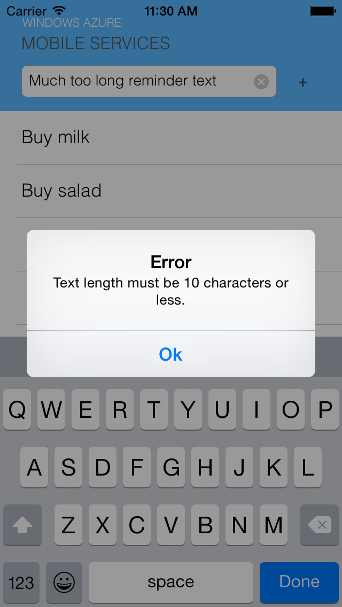

<properties linkid="develop-mobile-tutorials-validate-modify-and-augment-data-Xamarin-iOS" urlDisplayName="" pageTitle="Use server scripts to validate and modify data (Xamarin iOS) | Mobile Dev Center" metaKeywords="" description="Learn how to validate and modify data sent using server scripts from your Xamarin iOS app." metaCanonical="" services="" documentationCenter="Mobile" title="Validate and modify data in Mobile Services by using server scripts" authors="" solutions="" manager="" editor="" />

Validación y modificación de datos en los Servicios móviles mediante los scripts del servidor
=============================================================================================

[C\# para Tienda Windows](/es-es/develop/mobile/tutorials/validate-modify-and-augment-data-dotnet "C# para Tienda Windows")[JavaScript para Tienda Windows](/es-es/develop/mobile/tutorials/validate-modify-and-augment-data-js "JavaScript para Tienda Windows")[Windows Phone](/es-es/develop/mobile/tutorials/validate-modify-and-augment-data-wp8 "Windows Phone")[iOS](/es-es/develop/mobile/tutorials/validate-modify-and-augment-data-ios "iOS")[Android](/es-es/develop/mobile/tutorials/validate-modify-and-augment-data-android "Android")[HTML](/es-es/develop/mobile/tutorials/validate-modify-and-augment-data-html "HTML")[Xamarin.iOS](/es-es/develop/mobile/tutorials/validate-modify-and-augment-data-xamarin-ios "Xamarin.iOS")[Xamarin.Android](/es-es/develop/mobile/tutorials/validate-modify-and-augment-data-xamarin-android "Xamarin.Android")

En este tema se muestra cómo aprovechar los scripts del servidor en Servicios móviles de Azure. Dichos scripts se registran en un servicio móvil y pueden usarse para realizar una gran variedad de operaciones en los datos que se han insertado y actualizado, incluidas la modificación y validación de los datos. En este tutorial, definirá y registrará scripts de servidor que sirven para validar y modificar datos. Dado que el comportamiento de los scripts del servidor suele afectar al cliente, también actualizará la aplicación iOS para que se beneficie de estos nuevos comportamientos. El código terminado está disponible en el ejemplo de la [aplicación ValidateModifyData](http://go.microsoft.com/fwlink/p/?LinkId=331330).

Este tutorial le guiará a través de estos pasos básicos:

1.  [Incorporación de la validación de longitud de cadena](#string-length-validation)
2.  [Actualización del cliente para admitir la validación](#update-client-validation)
3.  [Incorporación de una marca de tiempo al insertar](#add-timestamp)
4.  [Actualización del cliente para mostrar la marca de tiempo](#update-client-timestamp)

Este tutorial se basa en los pasos y en la aplicación de ejemplo del tutorial anterior [Introducción a los datos](/es-es/develop/mobile/tutorials/get-started-with-data-xamarin-ios). Antes de comenzar este tutorial, primero debe completar [Introducción a los datos](/es-es/develop/mobile/tutorials/get-started-with-data-xamarin-ios).

Incorporación de la validación
------------------------------

Siempre es conveniente validar la longitud de los datos enviados por los usuarios. En primer lugar, registre un script que valide la longitud de los datos de cadena enviados al servicio móvil y que rechace las cadenas demasiado largas, en este caso con más de 10 caracteres.

1.  Inicie sesión en el [Portal de administración de Azure](https://manage.windowsazure.com/), haga clic en **Servicios móviles** y, a continuación, en su aplicación.

    

2.  Haga clic en la pestaña **Data** y, a continuación, haga clic en la tabla **TodoItem**.

	![][1]

3.  Haga clic en **Script** y, a continuación, seleccione la operación **Insert**.

	![][2]

4.  Sustituya el script existente por la siguiente función y, a continuación, haga clic en **Save**.

    
    function insert(item, user, request) {
        if (item.text.length > 10) {
                request.respond(statusCodes.BAD_REQUEST, 'Text length must be 10 characters or less.');
            } else {
                request.execute();
            }
        }

    Este script comprueba la longitud de la propiedad **text** y envía una respuesta de error cuando esta sobrepasa los 10 caracteres. En caso de no sobrepasarlos, se llama al método **execute** para completar la inserción.

    **Nota:**

    Puede quitar un script registrado en la pestaña **Script** haciendo clic en **Clear** y, a continuación, en **Save**.

Actualización del cliente
-------------------------

Ahora que el servicio móvil puede validar los datos y enviar respuestas de error, debe actualizar la aplicación para que pueda identificar los errores de la validación.

1.  En Xamarin Studio, abra el proyecto que ha modificado al completar el tutorial [Introducción a los datos](/es-es/develop/mobile/tutorials/get-started-with-data-xamarin-ios).

2.  Presione el botón **Run** para generar el proyecto e iniciar la aplicación y, a continuación, escriba el texto con más de 10 caracteres en el cuadro de texto y haga clic en el icono con el signo más (**+**).

    Observe que la aplicación produce un error no controlado como resultado de la respuesta 400 (solicitud incorrecta) devuelta por el servicio móvil.

3.  En el archivo TodoService.cs, busque el control actual de excepciones `try/catch` en el método **InsertTodoItemAsync** y reemplace `catch` por:

    catch (Exception ex) {
        var exDetail = (ex.InnerException.InnerException as MobileServiceInvalidOperationException);
        Console.WriteLine(exDetail.Message);

         UIAlertView alert = new UIAlertView() { 
                Title = "Error", 
                Message = exDetail.Message
         } ;
         alert.AddButton("Ok");
         alert.Show();

         return -1;
         }

    De esta forma, aparece una ventana emergente que muestra el error al usuario.

4.  Busque el método **OnAdd** en **TodoListViewController.cs**. Actualice el método para asegurarse de que el `index` devuelto no es `-1` como se devuelve en el control de excepciones en **InsertTodoItemAsync**. Este caso, no queremos agregar una nueva fila a `TableView`.

    if (index != -1) {
        TableView.InsertRows(new [] { NSIndexPath.FromItemSection(index, 0) },
            UITableViewRowAnimation.Top);
        itemText.Text = "";
    }

5.  Recompile e inicie la aplicación.

    

    Observe que el error está controlado y que el mensaje de error se muestra al usuario.

Pasos siguientes
----------------

Ahora que ha completado este tutorial, considere continuar con el tutorial final de la serie de datos: [Limitación de consultas con paginación](/es-es/develop/mobile/tutorials/add-paging-to-data-xamarin-ios).

Los scripts de servidor también se usan al autorizar usuarios y para enviar notificaciones de inserción. Para obtener más información, consulte los siguientes tutoriales:

-   [Autorización de usuarios con scripts](/es-es/develop/mobile/tutorials/authorize-users-in-scripts-xamarin-ios)
     Aprenda a filtrar datos basándose en el identificador de un usuario autenticado.

-   [Introducción a las notificaciones de inserción](/es-es/develop/mobile/tutorials/get-started-with-push-xamarin-ios)
     Aprenda a enviar una notificación de inserción muy básica a la aplicación.

-   [Referencia del script del servidor de Servicios móviles](http://go.microsoft.com/fwlink/?LinkId=262293)
     Obtenga más información acerca del registro y uso de scripts de servidor.

<!-- Anchors. -->
[Add string length validation]: #string-length-validation
[Update the client to support validation]: #update-client-validation
[Add a timestamp on insert]: #add-timestamp
[Update the client to display the timestamp]: #update-client-timestamp
[Next Steps]: #next-steps

<!-- Images. -->
[0]: ./media/partner-xamarin-mobile-services-ios-validate-modify-data-server-scripts/mobile-services-selection.png
[1]: ./media/partner-xamarin-mobile-services-ios-validate-modify-data-server-scripts/mobile-portal-data-tables.png
[2]: ./media/partner-xamarin-mobile-services-ios-validate-modify-data-server-scripts/mobile-insert-script-users.png

[4]: ./media/partner-xamarin-mobile-services-ios-validate-modify-data-server-scripts/mobile-quickstart-data-error-ios.png

<!-- URLs. -->
[Mobile Services server script reference]: http://go.microsoft.com/fwlink/?LinkId=262293
[Get started with Mobile Services]: /es-es/develop/mobile/tutorials/get-started-xamarin-ios
[Authorize users with scripts]: /es-es/develop/mobile/tutorials/authorize-users-in-scripts-xamarin-ios
[Refine queries with paging]: /es-es/develop/mobile/tutorials/add-paging-to-data-xamarin-ios
[Get started with data]: /es-es/develop/mobile/tutorials/get-started-with-data-xamarin-ios
[Get started with authentication]: /es-es/develop/mobile/tutorials/get-started-with-users-xamarin-ios
[Get started with push notifications]: /es-es/develop/mobile/tutorials/get-started-with-push-xamarin-ios

[Management Portal]: https://manage.windowsazure.com/
[Azure Management Portal]: https://manage.windowsazure.com/
[GitHub]: http://go.microsoft.com/fwlink/p/?LinkId=331330
