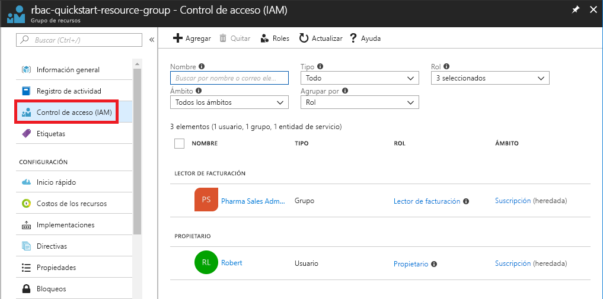
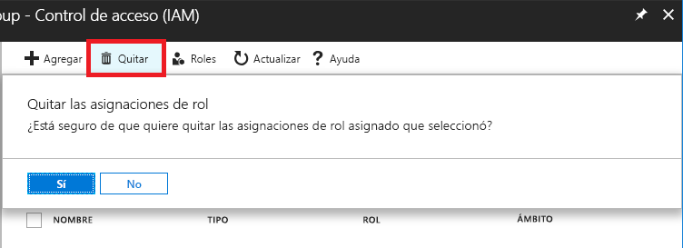

# Inicio rápido: Concesión de acceso a un usuario mediante RBAC y Azure Portal

El control de acceso basado en rol (RBAC) es la forma en que se administra el acceso a los recursos en Azure. En este inicio rápido, se concede acceso a un usuario para crear y administrar máquinas virtuales en un grupo de recursos.

Si no tiene una suscripción a Azure, cree una [cuenta gratuita](https://azure.microsoft.com/free/?WT.mc_id=A261C142F) antes de empezar.

## Inicio de sesión en Azure

Inicie sesión en Azure Portal en http://portal.azure.com.

## Crear un grupo de recursos

1. En la lista de navegación, elija **Grupos de recursos**.

1. Haga clic en **Agregar** para abrir la hoja **Grupo de recursos**.

   

1. En **Nombre del grupo de recursos**, escriba **rbac-quickstart-resource-group**.

1. Seleccione una suscripción y una ubicación.

1. Haga clic en **Crear** para crear el grupo de recursos.

1. Haga clic en **Actualizar** para actualizar la lista de grupos de recursos.

   El grupo de recursos nuevo aparece en la lista de grupos de recursos.

   

## Conceder acceso

En RBAC, para conceder acceso es preciso crear una asignación de roles.

1. En la lista de **Grupos de recursos**, elija el nuevo grupo de recursos **rbac-quickstart-resource-group**.

1. Haga clic en **Control de acceso (IAM)** para ver la lista actual de asignaciones de roles.

   

1. Elija **Agregar** para abrir el panel **Agregar permisos**.

   Si no tiene permisos para asignar roles, no verá la opción **Agregar**.

   

1. En la lista desplegable **Rol**, seleccione **Colaborador de la máquina virtual**.

1. En la lista **Seleccionar**, se puede seleccionar a usted mismo o a otro usuario.

1. Seleccione **Guardar** para crear la asignación de roles.

   Transcurridos unos instantes, se asigna el rol Colaborador de la máquina virtual al usuario en el ámbito del grupo de recursos rbac-quickstart-resource-group.

   

## Quitar acceso

En RBAC, para quitar el acceso hay que quitar una asignación de roles.

1. En la lista de asignaciones de roles, agregue una marca de verificación junto al usuario con el rol Colaborador de la máquina virtual.

1. Elija **Quitar**.

   

1. En el mensaje de eliminación de asignación de roles que aparece, elija **Sí**.

## Limpieza

1. En la lista de navegación, elija **Grupos de recursos**.

1. Elija **rbac-quickstart-resource-group** para abrir el grupo de recursos.

1. Haga clic en **Eliminar grupo de recursos** para eliminar el grupo de recursos.

   

1. En la hoja **¿Está seguro de que desea eliminar?**, escriba el nombre del grupo de recursos: **rbac-quickstart-resource-group**.

1. Haga clic en **Eliminar** para eliminar el grupo de recursos.

## Pasos siguientes

> [!div class="nextstepaction"]
> [Tutorial: Concesión de acceso a un usuario mediante RBAC y PowerShell](tutorial-role-assignments-user-powershell.md)

