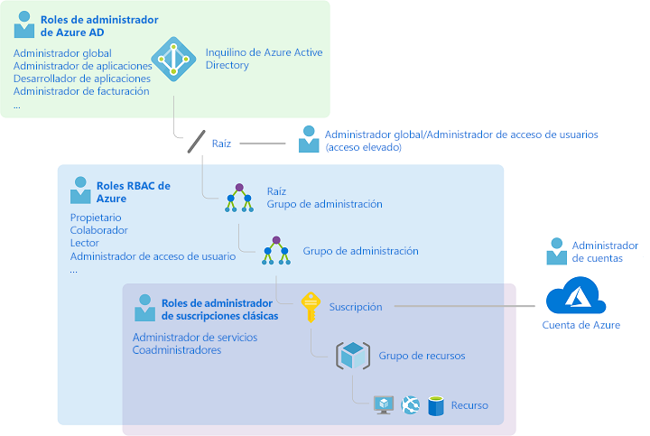
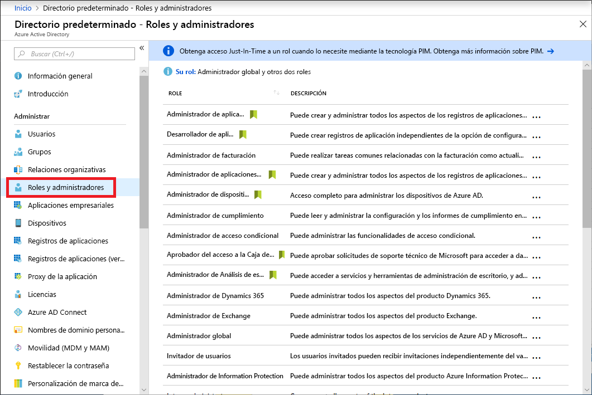
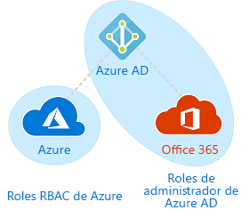

# Roles de administrador de suscripciones clásicas frente a roles de RBAC de Azure frente a Roles de administrador de Azure AD

Si no está familiarizado con Azure, le resultará un poco difícil de entender todos los distintos roles en Azure. En este artículo se explican los siguientes roles y cuándo se usa cada uno:
- Roles de administrador de suscripciones clásicas
- Roles de control de acceso basado en rol (RBAC) de Azure
- Roles de administrador en Azure Active Directory (Azure AD)

## ¿Cómo están relacionados los roles?

Para entender mejor los roles en Azure, es útil conocer algo de la historia. Cuando se publicó inicialmente Azure, el acceso a los recursos se administraba con solo tres roles de administrador: administrador de cuentas, administrador de servicios y coadministrador. Más adelante, se agregó el control de acceso basado en rol (RBAC) para los recursos de Azure. RBAC de Azure es un nuevo sistema de autorización que proporciona una administración de acceso detallada a los recursos de Azure. RBAC incluye muchos roles integrados, puede asignarse en distintos ámbitos y le permite crear sus propios roles personalizados. Para administrar recursos de Azure AD, como usuarios, grupos y dominios, hay varios roles de administrador de Azure AD.

En el siguiente diagrama se muestra una visión general de cómo se relacionan los roles de administrador de suscripciones clásicas, los roles de RBAC de Azure y los roles de administrador de Azure AD.

## Roles de administrador de suscripciones clásicas

Administrador de cuenta, administrador de servicios y coadministrador son las tres variantes de roles de administrador de suscripciones clásicas de Azure. Los administradores de suscripción clásica tienen acceso completo a la suscripción de Azure. Se pueden administrar los recursos con Azure Portal, con las API de Azure Resource Manager o bien con las API del modelo de implementación clásica. La cuenta que se utiliza para suscribirse a Azure se establece automáticamente como administrador de cuenta y administrador de servicio. A continuación, se pueden agregar coadministradores adicionales. El administrador de servicios y los coadministradores tienen el acceso equivalente de los usuarios a los que se les ha asignado el rol de propietario (un rol de RBAC de Azure) en el ámbito de la suscripción. En la tabla siguiente se describen las diferencias entre estos tres roles administrativos de la suscripción clásica.

| Administrador de suscripciones clásicas | Límite | Permisos | Notas |
| --- | --- | --- | --- |
| Administrador de cuenta | 1 por cuenta de Azure | <ul><li>Acceder al [Centro de cuentas de Azure](https://account.azure.com/Subscriptions)</li><li>Administrar todas las suscripciones en una cuenta</li><li>Crear nuevas suscripciones</li><li>Cancelar suscripciones</li><li>Cambiar la facturación de una suscripción</li><li>Cambiar el administrador de servicios</li></ul> | Desde un punto de vista conceptual, el propietario de la facturación de la suscripción.|
| Administrador de servicios | 1 por cada suscripción de Azure | <ul><li>Administrar servicios en [Azure Portal](https://portal.azure.com)</li><li>Asignar a usuarios al rol de coadministrador</li></ul> | De forma predeterminada, en una nueva suscripción, el administrador de cuenta es también el administrador de servicios. El administrador de servicios tiene el acceso equivalente a un usuario al que se le asigna el rol de propietario en el ámbito de la suscripción. |
| Coadministrador | 200 por suscripción | <ul><li>Mismos privilegios de acceso que el administrador de servicios, pero no puede cambiar la asociación de suscripciones a directorios de Azure</li><li>Asignar usuarios al rol de coadministrador, pero no puede cambiar el administrador de servicios</li></ul> | El coadministrador tiene el acceso equivalente a un usuario al que se le asigna el rol de propietario en el ámbito de la suscripción. |

En Azure Portal, puede ver quién está asignado al administrador de cuenta y al administrador de servicios viendo las propiedades de su suscripción.

Para obtener información sobre cómo agregar o cambiar administradores de suscripción, consulte [Agregar o cambiar los administradores de la suscripción de Azure](../billing/billing-add-change-azure-subscription-administrator.md) en la documentación de facturación de Azure.

### Cuenta de Azure y suscripciones de Azure

Una cuenta de Azure representa una relación de facturación. Una cuenta de Azure es una identidad de usuario, una o varias suscripciones de Azure y un conjunto asociado de recursos de Azure. La persona que crea la cuenta es el administrador de cuenta para todas las suscripciones creadas en esa cuenta. Esa persona también es el administrador de servicios predeterminado de la suscripción.

Las suscripciones de Azure le ayudan a organizar el acceso a los recursos de Azure. También le ayudan a controlar cómo se informa, factura y paga el uso de recursos. Cada suscripción puede tener una configuración de facturación y pago diferente, por lo que puede tener varias suscripciones y planes diferentes por oficina, departamento o proyecto, entre otros. Cada servicio pertenece a una suscripción y el identificador de la suscripción puede ser necesario para las operaciones de programación.

Las cuentas y suscripciones se administran en el [Centro de cuentas de Azure](https://account.azure.com/Subscriptions).
## Roles de RBAC de Azure

RBAC de Azure es un sistema de autorización basado en [Azure Resource Manager](../azure-resource-manager/resource-group-overview.md) que proporciona administración de acceso específico a los recursos de Azure como, por ejemplo, proceso y almacenamiento. RBAC de Azure incluye más de 70 roles integrados. Existen cuatro roles de RBAC fundamentales. Las tres primeras se aplican a todos los tipos de recursos:

| Rol de RBAC de Azure | Permisos | Notas |
| --- | --- | --- |
| [Propietario](built-in-roles.md#owner) | <ul><li>Acceso total a todos los recursos</li><li>Delegar el acceso a otros usuarios</li></ul> | Al administrador de servicios y a los coadministradores se les asigna el rol de propietario en el ámbito de suscripción. Se aplica a todos los tipos de recursos. |
| [Colaborador](built-in-roles.md#contributor) | <ul><li>Crear y administrar todos los tipos de recursos de Azure</li><li>No se puede conceder acceso a otros usuarios</li></ul> | Se aplica a todos los tipos de recursos. |
| [Lector](built-in-roles.md#reader) | <ul><li>Ver recursos de Azure</li></ul> | Se aplica a todos los tipos de recursos. |
| [Administrador de acceso de usuario](built-in-roles.md#user-access-administrator) | <ul><li>Administrar el acceso de usuarios a los recursos de Azure</li></ul> |  |

El resto de los roles integrados permiten la administración de recursos específicos de Azure. Por ejemplo, el rol de [colaborador de máquina virtual](built-in-roles.md#virtual-machine-contributor) permite al usuario crear y administrar máquinas virtuales. Para obtener una lista de todos los roles integrados, consulte [Roles integrados](built-in-roles.md).

RBAC de Azure solo es compatible con Azure Portal y las API de Azure Resource Manager. Los usuarios, los grupos y las aplicaciones a los que se asignan roles de RBAC no pueden usar las [API del modelo de implementación clásica de Azure](../azure-resource-manager/resource-manager-deployment-model.md).

En Azure Portal, las asignaciones de roles mediante RBAC aparecen en la hoja **Control de acceso (IAM)**. Esta hoja puede encontrarse en todo el portal, como suscripciones, grupos de recursos y distintos recursos.

Al hacer clic en la opción **Roles**, verá la lista de roles integrados y personalizados.

## Roles de administrador de Azure AD

Los roles de administrador de Azure AD se utilizan para administrar los recursos de Azure AD en un directorio como crear o editar usuarios, asignar roles administrativos a otros usuarios, restablecer contraseñas de usuario, administrar licencias de usuario y administrar dominios. En la tabla siguiente se describen algunos de los roles de administrador de Azure AD más importantes.

| Rol de administrador de Azure AD | Permisos | Notas |
| --- | --- | --- |
| [Administrador global](../active-directory/users-groups-roles/directory-assign-admin-roles.md#company-administrator) | <ul><li>Administrar el acceso a todas las características administrativas en Azure Active Directory, así como los servicios que se federan con Azure Active Directory</li><li>Asignar roles de administrador a otros usuarios</li><li>Restablecer la contraseña de cualquier usuario y de todos los demás administradores</li></ul> | La persona que se suscribe al inquilino de Azure Active Directory se convierte en un administrador global. |
| [Administrador de usuarios](../active-directory/users-groups-roles/directory-assign-admin-roles.md#user-account-administrator) | <ul><li>Crear y administrar todos los aspectos de usuarios y grupos</li><li>Administrar incidencias de soporte técnico</li><li>Supervisar el estado del servicio</li><li>Cambiar las contraseñas de los usuarios, de los administradores del departamento de soporte técnico y de otros administradores de usuario</li></ul> |  |
| [Administrador de facturación](../active-directory/users-groups-roles/directory-assign-admin-roles.md#billing-administrator) | <ul><li>Realizar compras</li><li>Administrar suscripciones</li><li>Administrar incidencias de soporte técnico</li><li>Supervisa el mantenimiento del servicio</li></ul> |  |

Para ver una lista de todos los roles de administrador de Azure AD, consulte [Asignación de roles de administrador en Azure Active Directory](/azure/active-directory/active-directory-assign-admin-roles-azure-portal).

En Azure Portal, puede ver la lista de roles de administrador de Azure AD en la hoja **Roles y administradores**.

## Diferencias entre los roles de RBAC de Azure y los roles de administrador de Azure AD

En un nivel superior, los roles de RBAC de Azure controlan los permisos para administrar recursos de Azure, mientras que los roles de administrador de Azure AD controlan los permisos para administrar los recursos de Azure Active Directory. En la tabla siguiente se comparan algunas de las diferencias.

| Roles de RBAC de Azure | Roles de administrador de Azure AD |
| --- | --- |
| Administración del acceso de usuarios a los recursos de Azure | Administrar el acceso a recursos de Azure Active Directory |
| Admite los roles personalizados | No puede crear sus propios roles |
| El ámbito se puede especificar en varios niveles (grupo de administración, suscripción, grupo de recursos, recurso). | El ámbito está en el nivel de inquilino |
| Se puede acceder a la información de roles en Azure Portal, CLI de Azure, Azure PowerShell, plantillas de Azure Resource Manager, API REST | Se puede acceder a la información de roles en el portal de administración de Azure, portal de administración de Office 365, Microsoft Graph, AzureAD PowerShell |

### ¿Se superponen los roles de RBAC de Azure y los roles de administrador de Azure AD?

De forma predeterminada, los roles de RBAC de Azure y los roles de administrador de Azure AD no abarcan Azure AD y Azure. Sin embargo, si un administrador global eleva su acceso mediante la elección del modificador **El administrador global puede administrar las suscripciones a Azure y los grupos de administración** en Azure Portal, al administrador global se le otorgará el rol [Administrador de acceso de usuario](built-in-roles.md#user-access-administrator) (un rol de RBAC) en todas las suscripciones para un inquilino en particular. El rol de administrador de accesos de usuario permite conceder a otros usuarios acceso a recursos de Azure. Este modificador puede ser útil para recuperar el acceso a una suscripción. Para más información, consulte [Elevar los privilegios de acceso de un administrador global en Azure Active Directory](elevate-access-global-admin.md).

Varios roles de administrador de Azure AD abarcan Azure AD y Microsoft Office 365, tales como los roles de administrador global y administrador de usuarios. Por ejemplo, si es miembro del rol de administrador global, tiene funcionalidades de administrador global en Azure AD y Office 365, como realizar cambios en Microsoft Exchange y Microsoft SharePoint. Sin embargo, de forma predeterminada, el administrador global no tiene acceso a los recursos de Azure.

## Pasos siguientes

- [¿Qué es el control de acceso basado en rol (RBAC)?](overview.md)
- [Asignación de roles de administrador en Azure Active Directory](/azure/active-directory/active-directory-assign-admin-roles-azure-portal)
- [Adición o cambio de los administradores de la suscripción de Azure](/azure/billing/billing-add-change-azure-subscription-administrator)
