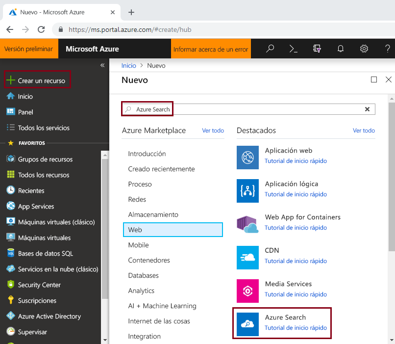
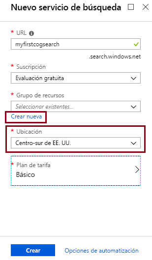
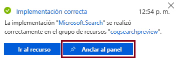

# Guía de inicio rápido: Creación de una canalización de Cognitive Search mediante aptitudes y datos de ejemplo

Cognitive Search (versión preliminar) agrega las aptitudes de extracción de datos, procesamiento de lenguaje natural (NLP) y procesamiento de imágenes a una canalización de indexación de Azure Search, lo que hace que el contenido no apto para la búsqueda o no estructurado sea más fácil de buscar. La información que crea una aptitud, como el reconocimiento de entidades o el análisis de imágenes, se agrega a un índice en Azure Search.

En esta guía de inicio rápido, pruebe la canalización de enriquecimiento en [Azure Portal](https://portal.azure.com) antes de escribir una sola línea de código:

* Comience con una muestra de datos en Azure Blob Storage.
* Configure el [asistente para importar datos](search-import-data-portal.md) para indexarlos y enriquecerlos. 
* Ejecute el asistente (una aptitud de la entidad detecta personas, ubicaciones y organizaciones).
* Use el [Explorador de búsqueda](search-explorer.md) para consultar los datos enriquecidos.

##  Regiones admitidas

Puede probar Cognitive Search en el servicio Azure Search creado en las siguientes regiones:

* Centro occidental de EE.UU.
* Centro-Sur de EE. UU
* Este de EE. UU
* Este de EE. UU. 2
* Oeste de EE. UU. 2
* Centro de Canadá
* Europa occidental
* Sur de Reino Unido 2
* Europa del Norte
* Sur de Brasil
* Sudeste asiático
* India Central
* Este de Australia

Si no tiene una suscripción a Azure, cree una [cuenta gratuita](https://azure.microsoft.com/free/?WT.mc_id=A261C142F) antes de empezar.

> [!NOTE]
> A partir del 21 de diciembre de 2018, podrá asociar un recurso de Cognitive Services con un conjunto de aptitudes de Azure Search. Esto nos permitirá empezar a cobrar por la ejecución del conjunto de aptitudes. En esta fecha, también empezaremos a cobrar por la extracción de imágenes como parte de la fase de descifrado de documentos. La extracción de texto de documentos continuará ofreciéndose sin costo adicional.
>
> La ejecución de aptitudes integradas se cobrará a los [precios de pago por uso existentes de Cognitive Services](https://azure.microsoft.com/pricing/details/cognitive-services/). La extracción de imágenes se cobrará al precio de la versión preliminar, tal y como se describe en la [página de precios de Azure Search](https://go.microsoft.com/fwlink/?linkid=2042400). [Más información](cognitive-search-attach-cognitive-services.md).

## Requisitos previos

["What is cognitive search?"](cognitive-search-concept-intro.md) (¿Qué es Cognitive Search?) presenta la arquitectura de enriquecimiento y los componentes. 

Los servicios de Azure se utilizan exclusivamente en este escenario. Crear los servicios que necesita forma parte de la preparación.

+ Azure Blob Storage proporciona los datos de origen.
+ Azure Search controla la ingesta e indexación de datos, el enriquecimiento de Cognitive Search y las consultas de búsqueda de texto completo.

### Configurar Azure Search

En primer lugar, regístrese en el servicio Azure Search. 

1. Vaya a [Azure Portal](https://portal.azure.com) e inicie sesión con su cuenta de Azure.

1. Haga clic en **Crear un recurso**, busque Azure Search y haga clic en **Crear**. Consulte [Creación de un servicio Azure Search en el portal](search-create-service-portal.md) si está configurando un servicio de búsqueda por primera vez y necesita más ayuda.

  

1. En el grupo de recursos, cree un grupo de recursos en el que se incluirán todos los recursos que cree en esta guía rápida. De este modo, será más fácil borrar los recursos tras finalizar los pasos de la guía.

1. En Ubicación, elija una de las [regiones admitidas](#supported-regions) para Cognitive Search.

1. En la opción Plan de tarifa, puede crear un servicio **Gratis** para completar tutoriales y guías de inicio rápido. Si quiere realizar una investigación detallada con sus propios datos, cree un [servicio de pago](https://azure.microsoft.com/pricing/details/search/) como **Básico** o **Estándar**. 

  El servicio gratuito se limita a 3 índices, un tamaño máximo de blob de 16 MB y 2 minutos de indexación, lo que es insuficiente para usar todas las funcionalidades de Cognitive Search. Para revisar los límites de los distintos planes, consulte [Límites de servicio](search-limits-quotas-capacity.md).

  
  
  > [!NOTE]
  > Cognitive Search está disponible en la versión preliminar pública. Actualmente, la ejecución del conjunto de aptitudes está disponible en todos los planes, incluido el gratuito. Podrá realizar una cantidad limitada de enriquecimientos sin tener que asociar un recurso de Cognitive Services pagado. [Más información](cognitive-search-attach-cognitive-services.md).

1. Ancle el servicio al panel para acceder rápidamente a la información del servicio.

  

### Configurar el servicio de Azure Blob y cargar los datos de ejemplo

La canalización de enriquecimiento extrae contenido de los orígenes de datos de Azure que admiten los [indexadores de Azure Search](search-indexer-overview.md). Tenga en cuenta que Azure Table Storage no es compatible con Cognitive Search. Para realizar este ejercicio, usaremos Blob Storage para mostrar varios tipos de contenido.

1. [Descargue los datos de ejemplo](https://1drv.ms/f/s!As7Oy81M_gVPa-LCb5lC_3hbS-4) que están formados por un pequeño conjunto de archivos de diferentes tipos. 

1. Regístrese en Azure Blob Storage, cree una cuenta de almacenamiento, inicie sesión en el Explorador de Storage y cree un contenedor. Consulte en la [guía de inicio rápido del Explorador de Azure Storage](../storage/blobs/storage-quickstart-blobs-storage-explorer.md) las instrucciones de todos los pasos.

1. Use el Explorador de Azure Storage en el contenedor que creó y haga clic en **Cargar** para cargar los archivos de ejemplo.

  

## Crear la canalización de enriquecimiento

Vuelva a la página del panel de servicio de Azure Search y haga clic en **Importar datos** en la barra de comandos para configurar el enriquecimiento en cuatro pasos.

### Paso 1: Creación de un origen de datos

En **Conectarse a los datos** > **Azure Blob Storage**, seleccione la cuenta y el contenedor que creó. Asigne un nombre al origen de datos y use los valores predeterminados para el resto. 

   

Haga clic en **Aceptar** para crear el origen de datos.

Una ventaja de usar el asistente de **importación de datos** es que también puede crear el índice. A medida que se crean los datos, el asistente crea de forma simultánea un esquema del índice. Este puede tardar unos segundos en crear el índice.

### Paso 2: Agregar conocimientos cognitivos

A continuación, agregue los pasos de enriquecimiento a la canalización de indexación. El portal le ofrece aptitudes cognitivas predefinidas para el análisis de imágenes y de texto. En el portal, un conjunto de aptitudes opera en un solo campo de origen. Esto puede parecer un objetivo pequeño, pero para los blobs de Azure, el campo `content` contiene la mayor parte del documento de blobs (por ejemplo, un documento de Word o unas diapositivas de PowerPoint). Por lo tanto, este campo es una entrada ideal, ya que todo el contenido de un blob está ahí.

A veces, deseará extraer la representación textual de archivos compuestos en su mayoría por imágenes digitalizadas, como un archivo PDF que genera un escáner. Azure Search puede extraer automáticamente el contenido de las imágenes insertadas en el documento. Para ello, seleccione la opción **Habilitar OCR y combinar todo el texto en el campo merged_content**. Esto creará automáticamente un campo `merged_content` que contiene tanto el texto extraído del documento como la representación textual de las imágenes insertadas en el documento. Al seleccionar esta opción, `Source data field` se establecerá en `merged_content`.

En la opción **Agregar aptitudes cognitivas**, elija las aptitudes que realizan el procesamiento de lenguaje natural. En esta guía de inicio rápido, elija el reconocimiento de entidades para los contactos, las organizaciones y las ubicaciones.

Haga clic en **Aceptar** para confirmar la definición.
   
  

Las aptitudes de procesamiento de lenguaje natural operan en el contenido de texto que se encuentra en el conjunto de datos de ejemplo. Puesto que no seleccionamos ninguna opción de procesamiento de imágenes, los archivos JPEG que se encontraron en el conjunto de datos de ejemplo no se procesarán en esta guía de inicio rápido. 

### Paso 3: Configuración del índice

¿Recuerda el índice que creó con el origen de datos? En este paso, podrá ver su esquema y revisar cualquier configuración. 

En esta guía de inicio rápido, el asistente realiza un trabajo remarcable a la hora de configurar valores predeterminados razonables: 

+ Todos los índices deben tener un nombre. Para este tipo de origen de datos, el nombre predeterminado es *azureblob-index*.

+ Cada documento debe tener una clave. El asistente selecciona un campo de valores únicos. En esta guía de inicio rápido, la clave es *metadata_storage_path*.

+ Cada colección de campos debe tener campos con un tipo de datos que describa sus valores, y cada campo debe tener atributos de índice que describan cómo se usa en un escenario de búsqueda. 

Como ya definió el conjunto de aptitudes, el asistente supone que quiere recuperar el campo de datos de origen y los campos de salida que crearon las aptitudes. Por este motivo, el portal agrega campos de índice para `content`, `people`, `organizations` y `locations`. Tenga en cuenta que el asistente habilita automáticamente las opciones Retrievable y Searchable de estos campos.

En **Personalizar índice**, revise los atributos en los campos para ver cómo se utilizan en un índice. La opción Searchable indica que se puede buscar un campo. La opción Retrievable indica que un valor puede aparecer en los resultados. 

Tenga en cuenta que tiene la posibilidad de borrar Retrievable del campo `content`. En los blobs, este campo puede encontrarse con miles de líneas que son difíciles de leer en una herramienta como el **Explorador de búsqueda**.

Haga clic en **Aceptar** para confirmar la definición del índice.

  

> [!NOTE]
> Los campos que no se usan se han recortado de la captura de pantalla para abreviar. Si está siguiendo esta guía desde el portal, la lista le mostrará los campos adicionales.

### Paso 4: Configurar el indexador

El indexador es un recurso de alto nivel que controla el proceso de indexación. Asimismo, especifica el nombre del origen de datos, el índice y la frecuencia de ejecución. El resultado final del asistente de la **importación de datos** es siempre un indexador que se puede ejecutar repetidamente.

En la página **Indexador**, póngale un nombre y use la opción predeterminada "ejecutar una vez" para ejecutarlo inmediatamente. 

  

Haga clic en **Aceptar** para importar, enriquecer e indexar los datos.

  

Los procesos de enriquecimiento e indexación pueden tardar cierto tiempo y, por ello, se recomienda usar conjuntos de datos más pequeños para poder realizar una exploración temprana. Puede supervisar la indexación en la página de notificaciones de Azure Portal. 

## Consulta en el Explorador de búsqueda

Después de crear un índice, puede enviar consultas para devolver documentos desde el índice. En el portal, utilice el **Explorador de búsqueda** para ejecutar consultas y ver los resultados. 

1. En la página del panel del servicio de búsqueda, haga clic en el **Explorador de búsqueda** en la barra de comandos.

1. Seleccione **Cambiar índice** en la parte superior para seleccionar el índice que haya creado.

1. Escriba una cadena de búsqueda para consultar el índice como, por ejemplo, "John F. Kennedy".

Los resultados se devuelven en formato JSON, que suele ser detallado y difícil de leer, especialmente si se trata de documentos de gran tamaño que se crean en los blobs de Azure. 

Si no puede examinar los resultados con facilidad, utilice CTRL-F para buscar dentro de los documentos. En esta consulta, puede buscar dentro del contenido JSON escribiendo "John F. Kennedy", para así ver las instancias de ese término de búsqueda. 

CTRL-F también puede ayudarle a determinar cuántos documentos hay en un determinado conjunto de resultados. En cuanto a los blobs de Azure, el portal elige "metadata_storage_path" como clave, ya que cada valor es único en el documento. Use CTRL-F y busque "metadata_storage_path" para obtener un recuento de los documentos. Si nos fijamos en esta consulta, dos de los documentos del conjunto de resultados contienen el término "John F. Kennedy".

  

## Puntos clave

Ya ha completado su primer ejercicio de indexación enriquecida. El objetivo de esta guía rápida es introducir conceptos importantes y guiarle a través del asistente para que pueda crear rápidamente el prototipo de una solución de búsqueda cognitiva utilizando sus propios datos.

Algunos conceptos clave que esperamos que haya tenido en cuenta incluyen la dependencia de los orígenes de datos de Azure. El enriquecimiento de Cognitive Search está vinculado a los indexadores, los cuales pertenecen a Azure y son específicos del origen. Aunque esta guía de inicio rápido usa Azure Blob Storage, también se pueden usar otros orígenes de datos de Azure. Para obtener más información, consulte [Indexadores de Azure Search](search-indexer-overview.md).

Otro concepto importante es que las aptitudes operan sobre los campos de entrada. En el portal, debe elegir un solo campo de origen para todas las aptitudes. En el código, las entradas pueden ser otros campos o la salida de una aptitud ascendente.

 Las entradas a una aptitud se asignan a un campo de salida en un índice. De forma interna, el portal establece las [anotaciones ](cognitive-search-concept-annotations-syntax.md) y define un [conjunto de aptitudes](cognitive-search-defining-skillset.md) que establece el orden de las operaciones y el flujo general. Estos pasos están ocultos en el portal, pero recuerde que estos conceptos serán importantes cuando comience a escribir el código.

Por último, aprendió que puede ver los resultados al consultar el índice. Al final, lo que proporciona Azure Search es un índice de búsqueda que puede consultar usando la sintaxis de consulta [simple](https://docs.microsoft.com/rest/api/searchservice/simple-query-syntax-in-azure-search) o [totalmente extendida](https://docs.microsoft.com/rest/api/searchservice/lucene-query-syntax-in-azure-search). Un índice que contenga campos enriquecidos es como cualquier otro. Si desea incorporar [analizadores personalizados](search-analyzers.md) o estándar, [perfiles de puntuación](https://docs.microsoft.com/rest/api/searchservice/add-scoring-profiles-to-a-search-index), [sinónimos](search-synonyms.md), [filtros con facetas](search-filters-facets.md), búsquedas geográficas o cualquier otra característica de Azure Search, puede hacerlo cuando quiera.

## Limpieza de recursos

Si ya ha finalizado la exploración, la manera más rápida de borrar el contenido es eliminar el grupo de recursos que contiene el servicio Azure Search y el servicio Azure Blob.  

Si decide colocar ambos servicios en el mismo grupo, elimine el grupo de recursos para eliminar de manera permanente todo lo que contiene, incluyendo los servicios y cualquier contenido almacenado que haya creado para este ejercicio. En el portal, el nombre del grupo de recursos está en la página Información general de cada servicio.

## Pasos siguientes

Si quiere experimentar con la indexación y el enriquecimiento, vuelva a ejecutar el asistente con diferentes habilidades y campos de datos de origen. Para repetir los pasos, elimine el índice y el indexador y, a continuación, vuelva a crear el indexador con una nueva combinación de selecciones.

+ En **Introducción** > **Índices**, seleccione el índice que creó y, a continuación, haga clic en **Eliminar**.

+ En **Introducción**, haga doble clic en el icono **Indexadores**. Busque el indexador que creó y elimínelo.

Asimismo, también puede volver a usar los datos de ejemplo y los servicios que creó, y obtener información sobre cómo realizar las mismas tareas mediante programación en el tutorial siguiente. 

> [!div class="nextstepaction"]
> [Tutorial: Obtener información sobre las API REST de Cognitive Search](cognitive-search-tutorial-blob.md)
