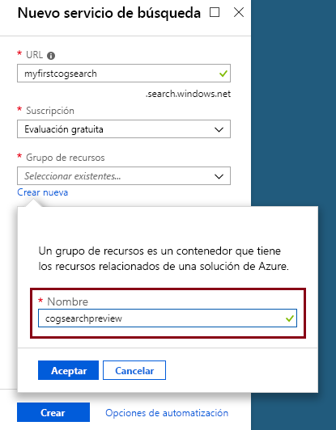
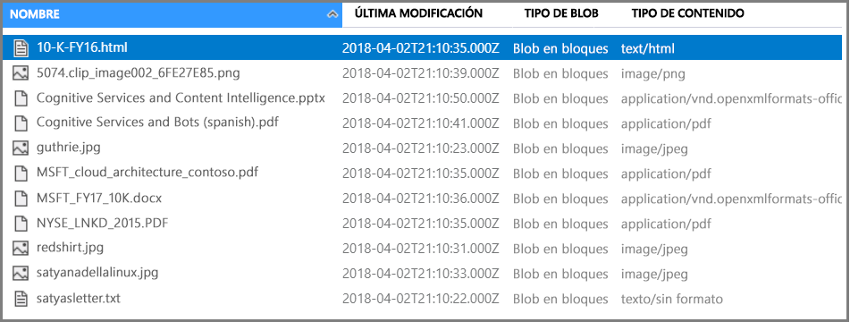
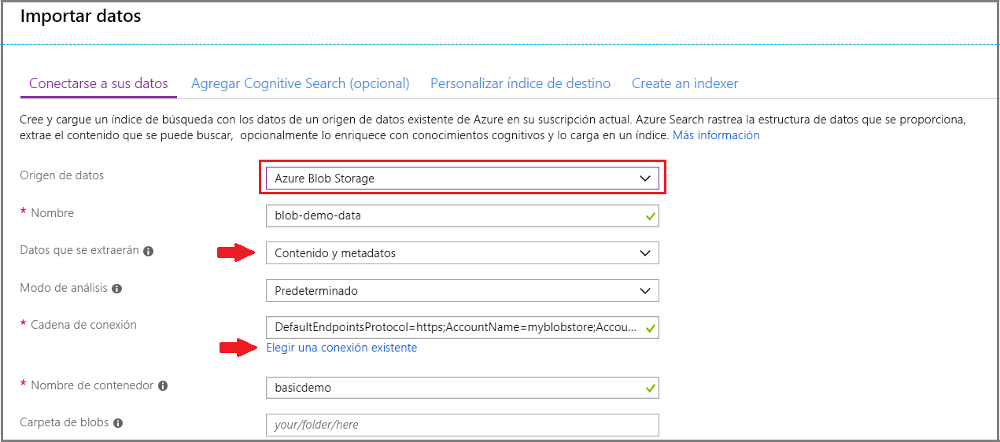
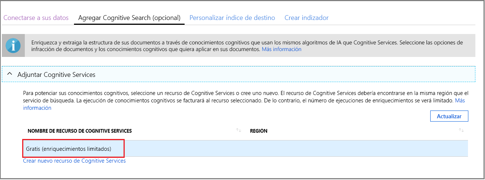
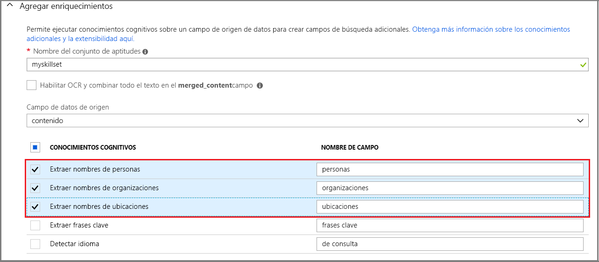

# Guía de inicio rápido: Creación de una canalización de Cognitive Search mediante aptitudes y datos de ejemplo

Cognitive Search (versión preliminar) agrega las aptitudes de extracción de datos, procesamiento de lenguaje natural (NLP) y procesamiento de imágenes a una canalización de indexación de Azure Search, lo que hace que el contenido no apto para la búsqueda o no estructurado sea más fácil de buscar. 

Una canalización de Cognitive Search integra [recursos de Cognitive Services](https://azure.microsoft.com/services/cognitive-services/) (tales como [OCR](cognitive-search-skill-ocr.md), [detección de idioma](cognitive-search-skill-language-detection.md) y [reconocimiento de entidades](cognitive-search-skill-entity-recognition.md)) en un proceso de indexación. Los algoritmos de inteligencia artificial de Cognitive Services sirven para buscar patrones, funciones y características en los datos de origen, lo que devuelve estructuras y contenido textual que pueden utilizarse en soluciones de búsqueda de texto completo basadas en Azure Search.

En este artículo de inicio rápido, cree su primera la canalización de enriquecimiento en [Azure Portal](https://portal.azure.com) antes de escribir una sola línea de código:

> [!div class="checklist"]
> * Comience con una muestra de datos en Azure Blob Storage.
> * Configure el [**Asistente para la importación de datos**](search-import-data-portal.md) para la indexación y el enriquecimiento cognitivos. 
> * Ejecute el asistente (una aptitud de la entidad detecta personas, ubicaciones y organizaciones).
> * Use el [**Explorador de búsqueda**](search-explorer.md) para consultar los datos enriquecidos.

##  Regiones admitidas

Puede probar Cognitive Search en el servicio Azure Search creado en las siguientes regiones:

* Centro occidental de EE.UU.
* Centro-Sur de EE. UU
* Este de EE. UU
* Este de EE. UU. 2
* Oeste de EE. UU. 2
* Centro de Canadá
* Europa occidental
* Sur de Reino Unido 2
* Europa del Norte
* Sur de Brasil
* Sudeste asiático
* India Central
* Este de Australia

Si no tiene una suscripción a Azure, cree una [cuenta gratuita](https://azure.microsoft.com/free/?WT.mc_id=A261C142F) antes de empezar.

> [!NOTE]
> A partir del 21 de diciembre de 2018, podrá asociar un recurso de Cognitive Services con un conjunto de aptitudes de Azure Search. Esto nos permitirá empezar a cobrar por la ejecución del conjunto de aptitudes. En esta fecha, también empezaremos a cobrar por la extracción de imágenes como parte de la fase de descifrado de documentos. La extracción de texto de documentos continuará ofreciéndose sin costo adicional.
>
> La ejecución de aptitudes integradas se cobrará a los [precios de pago por uso existentes de Cognitive Services](https://azure.microsoft.com/pricing/details/cognitive-services/). La extracción de imágenes se cobrará al precio de la versión preliminar, tal y como se describe en la [página de precios de Azure Search](https://go.microsoft.com/fwlink/?linkid=2042400). [Más información](cognitive-search-attach-cognitive-services.md).

## Requisitos previos

["What is cognitive search?"](cognitive-search-concept-intro.md) (¿Qué es Cognitive Search?) presenta la arquitectura de enriquecimiento y los componentes. 

Los servicios de Azure se utilizan exclusivamente en este escenario. Crear los servicios que necesita forma parte de la preparación.

+ [Azure Blob Storage](https://azure.microsoft.com/services/storage/blobs/) proporciona los datos de origen.
+ [Cognitive Services](https://azure.microsoft.com/services/cognitive-services/) aporta la inteligencia artificial (puede crear estos recursos en línea, al especificar la canalización).
+ [Azure Search](https://azure.microsoft.com/services/search/) ofrece una experiencia de búsqueda de texto libre enriquecida y la canalización de indexación enriquecida para su uso en aplicaciones personalizadas.

### Configurar Azure Search

En primer lugar, regístrese en el servicio Azure Search. 

1. Vaya a [Azure Portal](https://portal.azure.com) e inicie sesión con su cuenta de Azure.

1. Haga clic en **Crear un recurso**, busque Azure Search y haga clic en **Crear**. Consulte [Creación de un servicio Azure Search en el portal](search-create-service-portal.md) si está configurando un servicio de búsqueda por primera vez y necesita más ayuda.

  

1. En Grupo de recursos, cree un grupo de recursos en el que se incluirán todos los recursos que cree en este artículo de inicio rápido. De este modo, será más fácil borrar los recursos tras finalizar los pasos de la guía.

1. Como Ubicación, elija una de las [regiones admitidas](#supported-regions) para Cognitive Search.

1. En la opción Plan de tarifa, puede crear un servicio **Gratis** para completar tutoriales y guías de inicio rápido. Si quiere realizar una investigación detallada con sus propios datos, cree un [servicio de pago](https://azure.microsoft.com/pricing/details/search/) como **Básico** o **Estándar**. 

  El servicio gratuito se limita a 3 índices, un tamaño máximo de blob de 16 MB y 2 minutos de indexación, lo que es insuficiente para usar todas las funcionalidades de Cognitive Search. Para revisar los límites de los distintos planes, consulte [Límites de servicio](search-limits-quotas-capacity.md).

  

  > [!NOTE]
  > Cognitive Search está disponible en la versión preliminar pública. Actualmente, la ejecución del conjunto de aptitudes está disponible en todos los planes, incluido el gratuito. Podrá realizar una cantidad limitada de enriquecimientos sin tener que asociar un recurso de Cognitive Services pagado. [Más información](cognitive-search-attach-cognitive-services.md).

1. Ancle el servicio al panel para acceder rápidamente a la información del servicio.

  

### Configurar el servicio de Azure Blob y cargar los datos de ejemplo

La canalización de enriquecimiento extrae contenido de los orígenes de datos de Azure que admiten los [indexadores de Azure Search](search-indexer-overview.md). Tenga en cuenta que Azure Table Storage no es compatible con Cognitive Search. Para realizar este ejercicio, usaremos Blob Storage para mostrar varios tipos de contenido.

1. [Descargue los datos de ejemplo](https://1drv.ms/f/s!As7Oy81M_gVPa-LCb5lC_3hbS-4) que están formados por un pequeño conjunto de archivos de diferentes tipos. 

1. Regístrese en Azure Blob Storage, cree una cuenta de almacenamiento, abra las páginas de servicios de blob y cree un contenedor. En el contenedor, establezca el nivel de acceso público en **Contenedor**. Para más información, consulte la [sección sobre la creación de un contenedor](../storage/blobs/storage-unstructured-search.md#create-a-container) del tutorial *Búsqueda de datos no estructurados*.

1. En el contenedor que creó, haga clic en **Cargar** para cargar los archivos de ejemplo que descargó en un paso anterior.

  

## Crear la canalización de enriquecimiento

Vuelva a la página del panel del servicio Azure Search y haga clic en **Importar datos** en la barra de comandos para configurar el enriquecimiento cognitivo en cuatro pasos.

  

### Paso 1: Creación de un origen de datos

En **Conectarse a los datos**, elija **Azure Blob Storage** y seleccione la cuenta y el contenedor que creó. Asigne un nombre al origen de datos y use los valores predeterminados para el resto. 

  

Continúe en la siguiente página.

  

### Paso 2: Agregar conocimientos cognitivos

A continuación, agregue los pasos de enriquecimiento a la canalización de indexación. Si no tiene un recurso de Cognitive Services, puede registrarse para una versión gratuita que le ofrece 20 transacciones diarias. Los datos de ejemplo constan de 14 archivos, por lo que la asignación diaria se usará en su mayor parte una vez que se ejecute este asistente.

1. Expanda **Adjuntar Cognitive Services** para ver las opciones de asignación de recursos de Cognitive Services APIs. A los efectos de este tutorial, puede usar el recurso **Gratis**.

  

2. Expanda **Agregar enriquecimiento** y seleccione las aptitudes que realizan el procesamiento de lenguaje natural. En esta guía de inicio rápido, elija el reconocimiento de entidades para los contactos, las organizaciones y las ubicaciones.

  

  El portal ofrece aptitudes integradas para el análisis de texto y el procesamiento de OCR. En el portal, un conjunto de aptitudes opera en un solo campo de origen. Esto puede parecer un objetivo pequeño, pero para los blobs de Azure, el campo `content` contiene la mayor parte del documento de blobs (por ejemplo, un documento de Word o unas diapositivas de PowerPoint). Por lo tanto, este campo es una entrada ideal, ya que todo el contenido de un blob está ahí.

3. Continúe en la siguiente página.

  

> [!NOTE]
> Las aptitudes de procesamiento de lenguaje natural operan en el contenido de texto que se encuentra en el conjunto de datos de ejemplo. Puesto que no seleccionamos ninguna opción de OCR, los archivos JPEG y PNG que se encontraron en el conjunto de datos de ejemplo no se procesarán en este artículo de inicio rápido. 

### Paso 3: Configuración del índice

El asistente normalmente puede inferir un índice predeterminado. En este paso, podrá ver el esquema de índice generado y revisar la configuración. A continuación se ofrece el índice predeterminado creado para el conjunto de datos de Blob de demostración.

En esta guía de inicio rápido, el asistente realiza un trabajo remarcable a la hora de configurar valores predeterminados razonables: 

+ El nombre predeterminado es *azureblob-index* basado en el tipo de origen de datos. 

+ Los campos predeterminados se basan en el campo de datos de origen original (`content`), además de los campos de salida (`people`, `organizations` y `locations`) creados por la canalización cognitiva. Los tipos de datos predeterminados se deducen del muestreo de datos y metadatos.

+ La clave predeterminada es *metadata_storage_path* (este campo contiene valores únicos).

+ Los atributos predeterminados son **Retrievable** (Recuperable) y **Searchable** (Permite búsquedas) para estos campos. El atributo **Searchable** indica que se puede buscar un campo. El atributo **Retrievable** indica que un valor puede aparecer en los resultados. El asistente da por supuesto que desea que estos campos se puedan recuperar y permitan búsquedas porque los creó a través de un conjunto de aptitudes.

  

Observe el tachado y el signo de interrogación en el atributo **Retrievable** del campo `content`. En el caso de los documentos blob con mucho texto, el campo `content` contiene la mayor parte del archivo, posiblemente con miles de líneas. Si tiene que pasar el contenido del archivo al código de cliente, asegúrese de que **Retrievable** sigue seleccionado. De lo contrario, considere la posibilidad de borrar este atributo en `content` si los elementos extraídos (`people`, `organizations` y `locations`) son suficientes para sus fines.

Marcar un campo como **Retrievable** no significa que el campo *debe* esté presente en los resultados de búsqueda. Puede controlar con precisión la composición de los resultados de búsqueda si usa el parámetro de consulta **$select** para especificar qué campos desea incluir. En el caso de campos con mucho texto como `content`, el parámetro **$select** es la solución para proporcionar resultados de búsqueda fáciles de administrar a los usuarios de la aplicación, al tiempo que se asegura de que el código de cliente tenga acceso a toda la información que necesita a través del atributo **Retrievable**.
  
Continúe en la siguiente página.

  

### Paso 4: Configurar el indexador

El indexador es un recurso de alto nivel que controla el proceso de indexación. Asimismo, especifica el nombre del origen de datos, un índice de destino y la frecuencia de ejecución. El resultado final del asistente de la **importación de datos** es siempre un indexador que se puede ejecutar repetidamente.

En la página **Indizador**, puede aceptar el nombre predeterminado y usar la opción de programación **Ejecutar una vez** para ejecutarlo inmediatamente. 

  

Haga clic en **Enviar** para crear y ejecutar simultáneamente el indexador.

## Supervisión de la indexación

Los pasos de enriquecimiento tardan más en completarse que la indexación típica basada en texto. El asistente debe abrir la lista de indexadores en la página de introducción para que pueda realizar un seguimiento del progreso. En cuanto a la navegación automática, vaya a la página Introducción y haga clic en **Indizadores**.

La advertencia se produce porque los archivos JPG y PNG son archivos de imagen y se ha omitido la aptitud de OCR de esta canalización. También encontrará notificaciones de truncamiento. Azure Search limita la extracción a 32 000 caracteres en el nivel Gratis.

  

Los procesos de enriquecimiento e indexación pueden tardar cierto tiempo y, por ello, se recomienda usar conjuntos de datos más pequeños para poder realizar una exploración temprana. 

## Consulta en el Explorador de búsqueda

Después de crear un índice, puede enviar consultas para devolver documentos desde el índice. En el portal, utilice el **Explorador de búsqueda** para ejecutar consultas y ver los resultados. 

1. En la página del panel del servicio de búsqueda, haga clic en el **Explorador de búsqueda** en la barra de comandos.

1. Seleccione **Cambiar índice** en la parte superior para seleccionar el índice que haya creado.

1. Escriba una cadena de búsqueda para consultar el índice como, por ejemplo, `search=Microsoft&searchFields=organizations`.

Los resultados se devuelven en formato JSON, que suele ser detallado y difícil de leer, especialmente si se trata de documentos de gran tamaño que se crean en los blobs de Azure. Si no puede examinar los resultados con facilidad, utilice CTRL-F para buscar dentro de los documentos. Para esta consulta, puede buscar términos específicos en JSON. 

CTRL-F también puede ayudarle a determinar cuántos documentos hay en un determinado conjunto de resultados. En cuanto a los blobs de Azure, el portal elige "metadata_storage_path" como clave, ya que cada valor es único en el documento. Use CTRL-F y busque "metadata_storage_path" para obtener un recuento de los documentos. 

  

## Puntos clave

Ya ha completado su primer ejercicio de indexación cognitiva enriquecida. El objetivo de esta guía rápida es introducir conceptos importantes y guiarle a través del asistente para que pueda crear rápidamente el prototipo de una solución de búsqueda cognitiva utilizando sus propios datos.

Algunos conceptos clave que esperamos que haya tenido en cuenta incluyen la dependencia de los orígenes de datos de Azure. El enriquecimiento de Cognitive Search está vinculado a los indexadores, los cuales pertenecen a Azure y son específicos del origen. Aunque esta guía de inicio rápido usa Azure Blob Storage, también se pueden usar otros orígenes de datos de Azure. Para obtener más información, consulte [Indexadores de Azure Search](search-indexer-overview.md).

Otro concepto importante es que las aptitudes operan sobre los campos de entrada. En el portal, debe elegir un solo campo de origen para todas las aptitudes. En el código, las entradas pueden ser otros campos o la salida de una aptitud ascendente.

 Las entradas a una aptitud se asignan a un campo de salida en un índice. De forma interna, el portal establece las [anotaciones ](cognitive-search-concept-annotations-syntax.md) y define un [conjunto de aptitudes](cognitive-search-defining-skillset.md) que establece el orden de las operaciones y el flujo general. Estos pasos están ocultos en el portal, pero recuerde que estos conceptos serán importantes cuando comience a escribir el código.

Por último, aprendió que puede ver los resultados al consultar el índice. Al final, lo que proporciona Azure Search es un índice de búsqueda que puede consultar usando la sintaxis de consulta [simple](https://docs.microsoft.com/rest/api/searchservice/simple-query-syntax-in-azure-search) o [totalmente extendida](https://docs.microsoft.com/rest/api/searchservice/lucene-query-syntax-in-azure-search). Un índice que contenga campos enriquecidos es como cualquier otro. Si desea incorporar [analizadores personalizados](search-analyzers.md) o estándar, [perfiles de puntuación](https://docs.microsoft.com/rest/api/searchservice/add-scoring-profiles-to-a-search-index), [sinónimos](search-synonyms.md), [filtros con facetas](search-filters-facets.md), búsquedas geográficas o cualquier otra característica de Azure Search, puede hacerlo cuando quiera.

## Limpieza de recursos

Si ya ha finalizado la exploración, la manera más rápida de borrar el contenido es eliminar el grupo de recursos que contiene el servicio Azure Search y el servicio Azure Blob.  

Si decide colocar ambos servicios en el mismo grupo, elimine el grupo de recursos para eliminar de manera permanente todo lo que contiene, incluyendo los servicios y cualquier contenido almacenado que haya creado para este ejercicio. En el portal, el nombre del grupo de recursos está en la página Información general de cada servicio.

## Pasos siguientes

Según como haya aprovisionado el recurso de Cognitive Services, puede experimentar con la indexación y el enriquecimiento volviendo a ejecutar el asistente con diferentes aptitudes y campos de datos de origen. Para repetir los pasos, elimine el índice y el indexador y, a continuación, vuelva a crear el indexador con una nueva combinación de selecciones.

+ En **Introducción** > **Índices**, seleccione el índice que creó y, a continuación, haga clic en **Eliminar**.

+ En **Introducción**, haga doble clic en el icono **Indexadores**. Busque el indexador que creó y elimínelo.

Asimismo, también puede volver a usar los datos de ejemplo y los servicios que creó, y obtener información sobre cómo realizar las mismas tareas mediante programación en el tutorial siguiente. 

> [!div class="nextstepaction"]
> [Tutorial: Obtener información sobre las API REST de Cognitive Search](cognitive-search-tutorial-blob.md)
