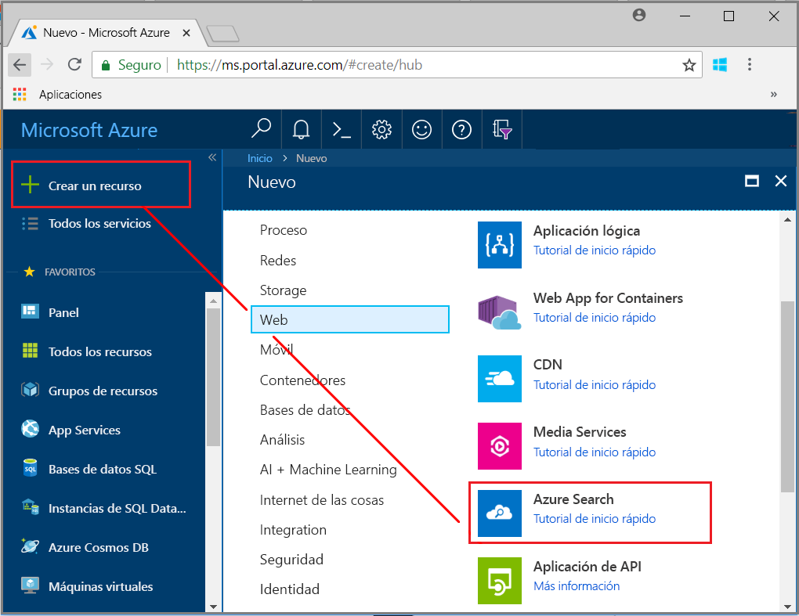
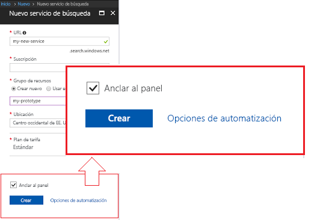
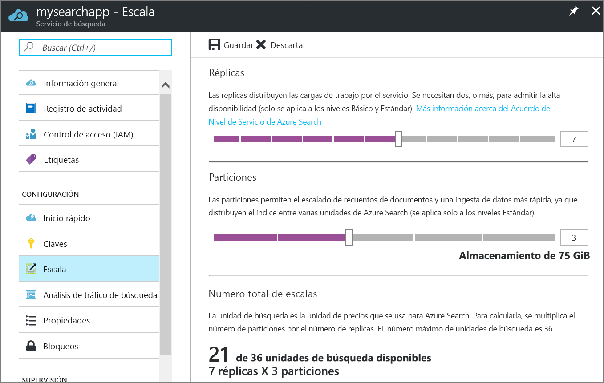

# Creación de un servicio Azure Search en el portal

Obtenga información acerca de cómo crear o aprovisionar un servicio de Azure Search en el portal. 

¿Prefiere PowerShell? Use la [plantilla de servicio](https://azure.microsoft.com/resources/templates/101-azure-search-create/) de Azure Resource Manager. Para obtener ayuda acerca de cómo empezar, vea [Administración del servicio Azure Search con PowerShell](search-manage-powershell.md) para conocer el contexto.

## Suscripción (gratuita o de pago)

[Abra una cuenta gratuita de Azure ](https://azure.microsoft.com/pricing/free-trial/?WT.mc_id=A261C142F) y use créditos gratuitos para probar servicios de pago de Azure. Cuando se consuman los créditos, mantenga la cuenta y siga usando servicios de Azure gratuitos, como Websites. No se le realizará ningún cargo en su tarjeta de crédito a menos que cambie explícitamente la configuración y lo solicite.

Como alternativa, [active las ventajas de suscriptor de MSDN](https://azure.microsoft.com/pricing/member-offers/msdn-benefits-details/?WT.mc_id=A261C142F). Una suscripción a MSDN le proporciona créditos todos los meses que puede usar para servicios de Azure de pago. 

## Búsqueda de Azure Search
1. Inicie sesión en el [Azure Portal](https://portal.azure.com/).
2. Haga clic en el signo más ("+ Crear recurso") en la esquina superior izquierda.
3. Seleccione **Web** > **Azure Search**.

## Asignación de un nombre al servicio y al punto de conexión de dirección URL

Un nombre de servicio es parte del punto de conexión de dirección URL con que se emiten llamadas a la API: `https://your-service-name.search.windows.net`. Escriba el nombre del servicio en el campo **Dirección URL**. 

Requisitos de nombre de servicio:
   * Debe ser único dentro del espacio de nombres search.windows.net.
   * Entre 2 y 60 caracteres de longitud.
   * Deben usarse letras minúsculas, números o guiones ("-").
   * No deben usarse guiones ("-") en los dos primeros caracteres ni en el último carácter.
   * No deben usarse guiones consecutivos ("--").

## Selección de una suscripción
Si tiene más de una suscripción, elija una que también tenga servicios de almacenamiento de datos o archivos. Azure Search puede detectar automáticamente Azure Table y Blob Storage, SQL Database y Azure Cosmos DB para indexarlos mediante [*indexadores*](search-indexer-overview.md), pero solo para servicios de la misma suscripción.

## Selección de un grupo de recursos
Un grupo de recursos es una colección de servicios y recursos de Azure que se usan juntos. Por ejemplo, si usa Azure Search para indexar una base de datos SQL, ambos servicios deben formar parte del mismo grupo de recursos.

> [!TIP]
> Al eliminar un grupo de recursos también se eliminan los servicios que contiene. En el caso de proyectos de prototipo que usan muchos servicios, si se ponen todos ellos en el mismo grupo de recursos, la limpieza resulta más fácil después de que el proyecto ha finalizado. 

## Selección de una ubicación de hospedaje 
En cuanto servicio de Azure, Azure Search se puede hospedar en centros de datos de todo el mundo. Tenga en cuenta que los [precios pueden variar](https://azure.microsoft.com/pricing/details/search/) según la región geográfica.

## Selección de un plan de tarifa (SKU)
[Azure Search se ofrece actualmente en varios planes de tarifa](https://azure.microsoft.com/pricing/details/search/): Gratis, Básico y Estándar. Cada plan tiene su propia [capacidad y sus propios límites](search-limits-quotas-capacity.md). Consulte [Selección SKU o plan de tarifa](search-sku-tier.md) para obtener instrucciones.

En este tutorial, hemos elegido el nivel Estándar para nuestro servicio.

Un plan de tarifa no se puede cambiar una vez creado el servicio. Si necesita un plan superior o inferior más adelante, deberá volver a crear el servicio.

## Creación del servicio

No olvide anclar su servicio en el panel para facilitar el acceso siempre que inicie sesión.

## Escalar el servicio
La creación de un servicio puede llevarle unos minutos (15 o más, en función del nivel). Después de aprovisionado el servicio, se puede escalar para satisfacer sus necesidades. Dado que ha elegido el nivel Estándar para el servicio Azure Search, puede escalar el servicio en dos dimensiones: réplicas y particiones. Si ha elegido el nivel Básico, solo puede agregar réplicas. Si ha aprovisionado el servicio gratuito, el escalado no está disponible.

Las ***particiones*** permiten que el servicio almacene y busque en más documentos.

Las ***réplicas*** permiten al servicio administrar una carga más elevada de consultas de búsqueda.

La incorporación de recursos aumenta la factura mensual. La [calculadora de precios](https://azure.microsoft.com/pricing/calculator/) puede ayudarle a entender cómo repercute la incorporación de recursos en la facturación. Recuerde que puede ajustar los recursos en base a la carga. Por ejemplo, puede aumentar los recursos para crear un índice inicial completo y luego reducir los recursos más adelante a un nivel más adecuado para la indexación incremental.

> [!Important]
> Un servicio debe tener [2 réplicas para SLA de solo lectura y 3 réplicas para SLA de lectura y escritura](https://azure.microsoft.com/support/legal/sla/search/v1_0/).

1. Vaya a la página del servicio de búsqueda de Azure Portal.
2. En el panel de navegación de la izquierda, seleccione **Configuración** > **Escala**.
3. Use la barra deslizante para agregar recursos de cualquier tipo.

> [!Note] 
> Cada nivel tiene distintos [límites](search-limits-quotas-capacity.md) en el número total de unidades de búsqueda que se permiten en un único servicio (réplicas * particiones = total de unidades de búsqueda).

## Cuándo se debe agregar un segundo servicio

La gran mayoría de los clientes usan un solo servicio aprovisionado en un nivel que proporciona el [equilibrio de recursos adecuado](search-sku-tier.md). Un servicio puede hospedar varios índices en función de los [límites máximos de la capa que seleccione](search-capacity-planning.md), con cada índice aislado del otro. En Azure Search, solo se podrán dirigir las solicitudes a un índice, lo que reduce al máximo la posibilidad de que se recuperen datos accidentales o intencionados desde otros índices en el mismo servicio.

Aunque la mayoría de los clientes usan un solo servicio, la redundancia de servicios puede ser necesaria si los requisitos operativos son los siguientes:

+ Recuperación ante desastres (interrupción del centro de datos). Azure Search no proporciona conmutación por error instantánea si se produce una interrupción del servicio. Para obtener recomendaciones e instrucciones, consulte el artículo sobre [administración de servicios](search-manage.md).
+ La investigación del modelado de la arquitectura multiempresa ha determinado que los servicios adicionales es el diseño óptimo. Para obtener más información, consulte el artículo sobre [diseño para multiempresa](search-modeling-multitenant-saas-applications.md).
+ Para las aplicaciones implementadas globalmente, es posible que necesite una instancia de Azure Search en varias regiones para minimizar la latencia de tráfico internacional de la aplicación.

> [!NOTE]
> En Azure Search, no puede separar las cargas de trabajo de indización y consultas; por lo tanto, nunca podría crear varios servicios para las cargas de trabajo segregadas. Un índice siempre se consulta en el servicio donde se creó (no se puede crear un índice en un servicio y copiar en otro).
>

No se requiere un segundo servicio para lograr alta disponibilidad. La alta disponibilidad en las consultas se logra al usar 2 o más réplicas en el mismo servicio. Las actualizaciones de réplicas son secuenciales, lo que significa que, al menos, una es operativa cuando se implementa una actualización de servicio. Para obtener más información, consulte [Acuerdos de Nivel de Servicio](https://azure.microsoft.com/support/legal/sla/search/v1_0/).

## Pasos siguientes
Después de aprovisionar un servicio Azure Search, está listo para [definir un índice](search-what-is-an-index.md) para que pueda cargar y buscar los datos. 

> [!div class="nextstepaction"]
> [Cómo usar Azure Search en .NET](search-howto-dotnet-sdk.md)
