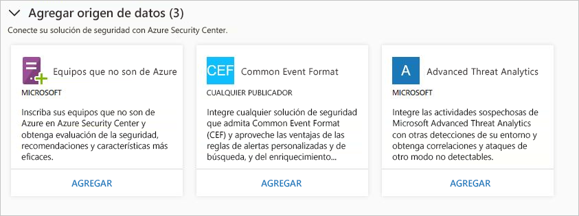

# Guía de inicio rápido: Conexión de soluciones de seguridad a Security Center

Además de recopilar datos de seguridad de los equipos, puede integrar los datos de seguridad procedentes de otras soluciones de seguridad, incluidas las que son compatibles con Common Event Format (CEF). CEF es un formato estándar del sector sobre mensajes de Syslog, que utilizan muchos proveedores de seguridad para permitir la integración de eventos entre distintas plataformas.

Esta guía de inicio rápido le muestra cómo:
- Conectar una solución de seguridad a Security Center mediante registros CEF
- Validar la conexión con la solución de seguridad

## requisitos previos
Para empezar a trabajar con el Centro de seguridad, debe disponer de una suscripción a Microsoft Azure. Si no tiene una suscripción, puede registrarse para obtener una [cuenta gratuita](https://azure.microsoft.com/free/).

Para completar esta guía de inicio rápido, es preciso tener el plan de tarifa Estándar de Security Center. Dicho plan se puede probar de forma gratuita los primeros 60 días. En [Guía de inicio rápido de Azure Security Center](security-center-get-started.md) le explicamos cómo realizar la actualización al plan de tarifa Estándar.

También necesita una [máquina Linux](https://docs.microsoft.com/azure/log-analytics/log-analytics-agent-linux), con el servicio Syslog ya conectado a Security Center.

## Conexión de la solución mediante CEF

1. Inicie sesión en el [Portal de Azure](https://azure.microsoft.com/features/azure-portal/).
2. En el menú de **Microsoft Azure**, seleccione **Security Center**. Se abre **Security Center: Información general**.

      

3. En el menú principal de Security Center, seleccione **Soluciones de seguridad**.
4. En la página Soluciones de seguridad, en **Agregar orígenes de datos (3)**, haga clic en **Agregar** en **Common Event Format**.

    

5. En la página de registros de Common Event Format expanda el segundo paso, **Configurar el reenvío de Syslog para enviar los registros necesarios al agente a través del puerto UDP 25226**, y siga las instrucciones siguientes en el equipo Linux:

    

6. Expanda el tercer paso: **Colocar el archivo de configuración del agente en el equipo del agente** y siga las instrucciones siguientes en el equipo Linux:

    

7. Expanda el cuarto paso: **Reiniciar el demonio de syslog y el agente** y siga las instrucciones siguientes en el equipo Linux:

    

## Validación de la conexión

Antes de continuar con los pasos siguientes, deberá esperar hasta que Syslog empiece a enviar notificaciones a Security Center. Esto puede tardar algún tiempo y variará según el tamaño del entorno.

1.  En el panel izquierdo del panel de Security Center, haga clic en **Buscar**.
2.  Seleccione el área de trabajo a la que está conectado Syslog (máquina Linux).
3.  Escriba *CommonSecurityLog* y haga clic en el botón **Buscar**.

En el ejemplo siguiente se muestra el resultado de estos pasos: 

## Limpieza de recursos
Otras guías de inicio rápido y tutoriales de esta colección se basan en los valores de esta. Si planea continuar trabajando con las guías rápidas y tutoriales posteriores, debe seguir ejecutando el plan de tarifa Estándar y mantener el aprovisionamiento automático habilitado. Si no planea continuar o desea volver al nivel Gratis:

1. Vuelva al menú principal de Security Center y seleccione **Directiva de seguridad**.
2. Seleccione la suscripción o directiva que desea que vuelva al nivel Gratis. Se abre **Directiva de seguridad**.
3. En **COMPONENTES DE LA DIRECTIVAS**, seleccione **Plan de tarifa**.
4. Seleccione **Gratis** para cambiar la suscripción de Estándar a Gratis.
5. Seleccione **Guardar**.

Si desea deshabilitar el aprovisionamiento automático:

1. Vuelva al menú principal de Security Center y seleccione **Directiva de seguridad**.
2. Seleccione la suscripción en la que quiere deshabilitar el aprovisionamiento automático.
3. En **Directiva de seguridad: Colección de datos**, en **Incorporación**, seleccione **Desactivado** para deshabilitar el aprovisionamiento automático.
4. Seleccione **Guardar**.

>[!NOTE]
> La deshabilitación del aprovisionamiento automático no quita Microsoft Monitoring Agent de las máquinas virtuales de Azure en las que se ha aprovisionado el agente. La deshabilitación del aprovisionamiento automático limita la supervisión de seguridad de los recursos.
>

## pasos siguientes
En esta guía de inicio rápido ha aprendido a conectar una solución Syslog de Linux a Security Center mediante CEF. Al conectar los registros de CEF a Security Center, puede aprovechar las ventajas de las reglas de alertas personalizadas y de búsqueda, y del enriquecimiento de la inteligencia sobre amenazas de cada registro. Para más información acerca del uso de Security Center, siga con el tutorial para configurar una directiva de seguridad y evaluar la seguridad de los recursos.

> [!div class="nextstepaction"]
> [Tutorial: Definición y evaluación de las directivas de seguridad](./tutorial-security-policy.md)
