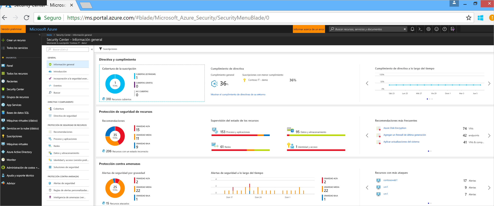
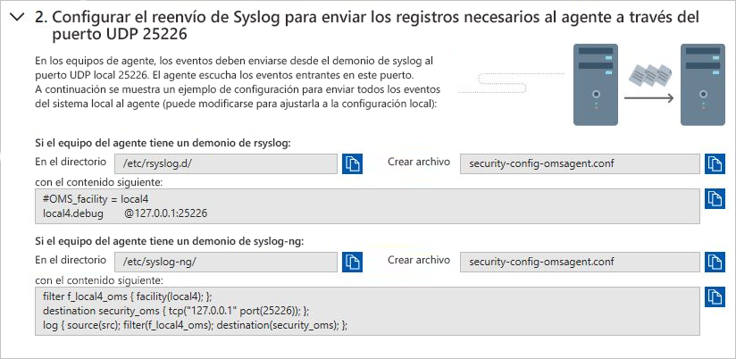
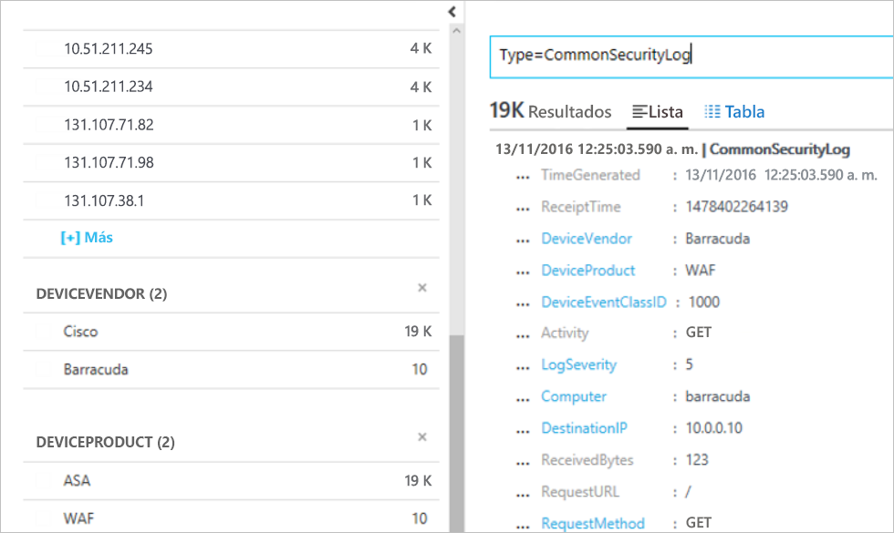

# Integración de soluciones de seguridad en Azure Security Center
Este documento le ayuda a administrar las soluciones de seguridad que ya está conectadas a Azure Security Center y a agregar otras nuevas.

## Soluciones de seguridad de Azure integradas
Security Center facilita la habilitación de soluciones de seguridad integradas en Azure. Dicha integración aporta las siguientes ventajas:

- **Implementación simplificada**: Security Center ofrece un aprovisionamiento optimizado de soluciones de asociados integradas. En el caso de algunas soluciones, como el antimalware y la evaluación de vulnerabilidades, Security Center puede aprovisionar al agente necesario en las máquinas virtuales, mientras que para las aplicaciones de firewall, Security Center puede ocuparse de gran parte de la configuración de red necesaria.
- **Detecciones integradas**: Los eventos de seguridad de las soluciones de asociados se recopilan, agregan y aparecen automáticamente como parte de las alertas e incidentes de Security Center. Estos eventos también se fusionan con las detecciones procedentes de otros orígenes para proporcionar funcionalidades avanzadas de detección de amenazas.
- **Supervisión y administración unificadas del mantenimiento**: Los clientes pueden usar eventos de mantenimiento integrados para supervisar todas las soluciones de asociados de un vistazo. La administración básica está disponible con un acceso sencillo a la configuración avanzada mediante la solución de asociado.

En la actualidad, las soluciones de seguridad integradas incluyen:

- Firewall de aplicaciones web ([Barracuda](https://www.barracuda.com/products/webapplicationfirewall), [F5](https://support.f5.com/kb/en-us/products/big-ip_asm/manuals/product/bigip-ve-web-application-firewall-microsoft-azure-12-0-0.html), [Imperva](https://www.imperva.com/Products/WebApplicationFirewall-WAF), [Fortinet](https://www.fortinet.com/products.html) y [Azure Application Gateway](https://azure.microsoft.com/blog/azure-web-application-firewall-waf-generally-available/))
- Firewall de última generación ([Check Point](https://www.checkpoint.com/products/vsec-microsoft-azure/), [Barracuda](https://campus.barracuda.com/product/nextgenfirewallf/article/NGF/AzureDeployment/), [Fortinet](http://docs.fortinet.com/d/fortigate-fortios-handbook-the-complete-guide-to-fortios-5.2), [Cisco](http://www.cisco.com/c/en/us/td/docs/security/firepower/quick_start/azure/ftdv-azure-qsg.html) y [Palo Alto Networks](https://www.paloaltonetworks.com/products))
- Evaluación de vulnerabilidad ([Qualys](https://www.qualys.com/public-clouds/microsoft-azure/) y [Rapid7](https://www.rapid7.com/products/insightvm/))

> [!NOTE]
> Security Center no instala Microsoft Monitoring Agent en aplicaciones virtuales de asociado, porque la mayoría de los proveedores de seguridad prohíben que se ejecuten agentes externos en su aplicación.
>
>

## Integración de soluciones de seguridad
Las soluciones de seguridad de Azure que se implementan desde Security Center se conectan automáticamente. También se pueden conectar otros orígenes de datos de seguridad, como:

- Azure AD Identity Protection
- Equipos que se ejecutan de forma local o en otras nubes
- Solución de seguridad que admite Common Event Format (CEF)
- Microsoft Advanced Threat Analytics

## Administración de soluciones de seguridad de Azure integradas y otros orígenes de datos

1. Inicie sesión en el [Azure Portal](https://azure.microsoft.com/features/azure-portal/).

2. En el **menú de Microsoft Azure**, seleccione **Security Center**. Se abre **Security Center: Información general**.

3. En el menú de Security Center, seleccione **Soluciones de seguridad**.

  

En **Soluciones de seguridad**, puede ver información acerca del mantenimiento de las soluciones de seguridad integrada de Azure y realizar tareas de administración básicas. También puede conectar otros tipos de orígenes de datos de seguridad, como las alertas y los registros de firewall de Azure Active Directory Identity Protection en Common Event Format (CEF).

### Soluciones conectadas

La sección **Soluciones conectadas** incluye las soluciones de seguridad que están conectadas actualmente a Security Center e información acerca del estado de mantenimiento de cada solución.  

El estado de una solución de asociado puede ser:

* Correcto (verde): no hay ningún problema de mantenimiento.
* Incorrecto (rojo): hay un problema de estado que requiere atención inmediata.
* Problemas de mantenimiento (naranja): la solución ha dejado de informar sobre su estado.
* Sin información (gris): la solución no ha notificado nada todavía; es posible que el estado de una solución no se notifique si acaba de conectarse y todavía se está implementando, o no hay datos de mantenimiento disponibles.

> [!NOTE]
> Si los datos sobre el estado de mantenimiento no están disponibles, Security Center muestra la fecha y hora del último evento recibido para indicar si la solución está enviando notificaciones o no. Si no hay disponible ningún dato de mantenimiento y no ha recibido ninguna alerta en los últimos 14 días, Security Center indica que la solución es incorrecta o que no informa.
>
>

2. Seleccione **VER** para obtener información y opciones adicionales, entre las que se incluyen:

  - **Consola de solución**. Se abre la experiencia de administración de esta solución.
  - **Vincular VM**. Se abre la hoja Vincular aplicaciones. Aquí puede conectar recursos a la solución de asociados.
  - **Eliminar solución**.
  - **Configurar**.

   

### Soluciones detectadas

Security Center detecta automáticamente las soluciones de seguridad que se ejecutan en Azure, pero que no están conectadas a Security Center y las muestra en la sección **Soluciones detectadas**. Aquí se incluyen tanto soluciones de Azure, como [Azure AD Identity Protection](https://docs.microsoft.com/azure/active-directory/active-directory-identityprotection), como soluciones de asociados.

> [!NOTE]
> El nivel estándar de Security Center es necesario en el nivel de suscripción de la característica de soluciones detectadas. Para obtener más información sobre los planes de tarifa de Security, consulte [Precios](security-center-pricing.md).
>
>

Seleccione **Conectar** en una solución para integrarla con Security Center y recibir alertas de seguridad.

Security Center también detecta las soluciones implementadas en la suscripción que pueden reenviar registros de Common Event Format (CEF). Aprenda a [conectar una solución de seguridad](quick-security-solutions.md) que use registros de CEF a Security Center.

### Agregar orígenes de datos

La sección **Agregar orígenes de datos** incluye otros orígenes de datos disponibles que se pueden conectar. Para obtener instrucciones acerca de cómo agregar datos desde cualquiera de estos orígenes, haga clic en **ADD**.

### Conexión de soluciones externas

Además de recopilar datos de seguridad de los equipos, puede integrar los datos de seguridad procedentes de otras soluciones de seguridad, incluidas las que son compatibles con Common Event Format (CEF). CEF es un formato estándar del sector sobre mensajes de Syslog, que utilizan muchos proveedores de seguridad para permitir la integración de eventos entre distintas plataformas.

Esta guía de inicio rápido le muestra cómo:
- Conectar una solución de seguridad a Security Center mediante registros CEF
- Validar la conexión con la solución de seguridad

#### Requisitos previos
Para empezar a trabajar con el Centro de seguridad, debe disponer de una suscripción a Microsoft Azure. Si no tiene una suscripción, puede registrarse para obtener una [cuenta gratuita](https://azure.microsoft.com/free/).

Para completar esta guía de inicio rápido, es preciso tener el plan de tarifa Estándar de Security Center. Dicho plan se puede probar de forma gratuita. En [Guía de inicio rápido de Azure Security Center](security-center-get-started.md) le explicamos cómo realizar la actualización al plan de tarifa Estándar. Para más información, consulte la [página de precios](https://azure.microsoft.com/pricing/details/security-center/).

También necesita una [máquina Linux](https://docs.microsoft.com/azure/log-analytics/log-analytics-agent-linux), con el servicio Syslog ya conectado a Security Center.

#### Conexión de la solución mediante CEF

1. Inicie sesión en el [Portal de Azure](https://azure.microsoft.com/features/azure-portal/).
2. En el menú de **Microsoft Azure**, seleccione **Security Center**. Se abre **Security Center: Información general**.

      

3. En el menú principal de Security Center, seleccione **Soluciones de seguridad**.
4. En la página Soluciones de seguridad, en **Agregar orígenes de datos (3)**, haga clic en **Agregar** en **Common Event Format**.

    

5. En la página de registros de Common Event Format expanda el segundo paso, **Configurar el reenvío de Syslog para enviar los registros necesarios al agente a través del puerto UDP 25226**, y siga las instrucciones siguientes en el equipo Linux:

    

6. Expanda el tercer paso: **Colocar el archivo de configuración del agente en el equipo del agente** y siga las instrucciones siguientes en el equipo Linux:

    

7. Expanda el cuarto paso: **Reiniciar el demonio de syslog y el agente** y siga las instrucciones siguientes en el equipo Linux:

    

#### Validación de la conexión

Antes de continuar con los pasos siguientes, deberá esperar hasta que Syslog empiece a enviar notificaciones a Security Center. Esto puede tardar algún tiempo y variará según el tamaño del entorno.

1.  En el panel izquierdo del panel de Security Center, haga clic en **Buscar**.
2.  Seleccione el área de trabajo a la que está conectado Syslog (máquina Linux).
3.  Escriba *CommonSecurityLog* y haga clic en el botón **Buscar**.

En el ejemplo siguiente se muestra el resultado de estos pasos: 

#### Limpieza de recursos
Otras guías de inicio rápido y tutoriales de esta colección se basan en los valores de esta. Si planea continuar trabajando con las guías rápidas y tutoriales posteriores, debe seguir ejecutando el plan de tarifa Estándar y mantener el aprovisionamiento automático habilitado. Si no planea continuar o desea volver al nivel Gratis:

1. Vuelva al menú principal de Security Center y seleccione **Directiva de seguridad**.
2. Seleccione la suscripción o directiva que desea que vuelva al nivel Gratis. Se abre **Directiva de seguridad**.
3. En **COMPONENTES DE LA DIRECTIVAS**, seleccione **Plan de tarifa**.
4. Seleccione **Gratis** para cambiar la suscripción de Estándar a Gratis.
5. Seleccione **Guardar**.

Si desea deshabilitar el aprovisionamiento automático:

1. Vuelva al menú principal de Security Center y seleccione **Directiva de seguridad**.
2. Seleccione la suscripción en la que quiere deshabilitar el aprovisionamiento automático.
3. En **Directiva de seguridad: Colección de datos**, en **Incorporación**, seleccione **Desactivado** para deshabilitar el aprovisionamiento automático.
4. Seleccione **Guardar**.

>[!NOTE]
> La deshabilitación del aprovisionamiento automático no quita Microsoft Monitoring Agent de las máquinas virtuales de Azure en las que se ha aprovisionado el agente. La deshabilitación del aprovisionamiento automático limita la supervisión de seguridad de los recursos.
>

## Exportación de datos a un SIEM

Los eventos procesados generados por Azure Security Center se publican en el [registro de actividad](../monitoring-and-diagnostics/monitoring-overview-activity-logs.md) de Azure, uno de los tipos de registros disponibles a través de Azure Monitor. Azure Monitor ofrece una canalización consolidada para el enrutamiento de cualquiera de los datos supervisados en una herramienta SIEM. Esto se realiza mediante el streaming de esos datos a un centro de eventos, desde el que se pueden extraer en una herramienta de asociado.

Esta canalización usa la [canalización única de supervisión de Azure](../azure-monitor/platform/stream-monitoring-data-event-hubs.md) para obtener acceso a los datos de supervisión de su entorno de Azure. Esto le permite configurar fácilmente las herramientas de supervisión y SIEM para consumir los datos.

En las secciones siguientes se describe cómo configurar los datos para que se transmitan en secuencias a un centro de eventos. En estos pasos se supone que ya tiene Azure Security Center configurado en su suscripción a Azure.

Información general de alto nivel

### ¿Qué datos de seguridad de Azure se exponen a SIEM?

En esta versión, se exponen las [alertas de seguridad.](../security-center/security-center-managing-and-responding-alerts.md) En las próximas versiones, ampliaremos el conjunto de datos con recomendaciones de seguridad.

### Proceso de configuración de la canalización

#### Creación de un Centro de eventos

Antes de empezar, debe [crear un espacio de nombres de Event Hubs](../event-hubs/event-hubs-create.md). El espacio de nombres y el centro de eventos son el destino de todos los datos de supervisión.

#### Transmisión del registro de actividad de Azure a Event Hubs

Consulte el artículo siguiente: [Transmisión del registro de actividad a Event Hubs](../azure-monitor/platform/activity-logs-stream-event-hubs.md).

#### Instalación de un conector SIEM de asociado 

El enrutamiento de los datos de supervisión a un centro de eventos con Azure Monitor facilita la integración con las herramientas de asociados de SIEM y de supervisión.

Consulte el vínculo siguiente para ver la lista de [SIEM compatibles](../azure-monitor/platform/stream-monitoring-data-event-hubs.md#what-can-i-do-with-the-monitoring-data-being-sent-to-my-event-hub)

### Ejemplo de consulta de datos 

A continuación, hay un par de consultas de Splunk que puede usar para extraer datos de alertas:

| **Descripción de la consulta** | **Consultar** |
|----|----|
| Todas las alertas| index=main Microsoft.Security/locations/alerts|
| Resumen del recuento de operaciones por su nombre| index=main sourcetype="amal:security" \| table operationName \| stats count by operationName|
| Información de obtención de alertas: hora, nombre, estado, identificador y suscripción | index=main Microsoft.Security/locations/alerts \| table \_time, properties.eventName, State, properties.operationId, am_subscriptionId |

## Pasos siguientes

En este documento, ha aprendido a integrar soluciones de asociados en Security Center. Para más información sobre Security Center, consulte los siguientes artículos:

* [Connecting Microsoft Advanced Threat Analytics to Azure Security Center](security-center-ata-integration.md) (Conexión de Microsoft Advanced Threat Analytics con Azure Security Center)
* [Conexión de Azure Active Directory Identity Protection con Azure Security Center](security-center-aadip-integration.md)
* [Supervisión del estado de seguridad en Security Center](security-center-monitoring.md). Aprenda a supervisar el estado de los recursos de Azure.
* [Supervise las soluciones de asociados con Security Center](security-center-partner-solutions.md). Aprenda cómo supervisar el estado de mantenimiento de las soluciones de sus asociados.
* [Preguntas más frecuentes sobre Azure Security Center](security-center-faq.md). Obtenga respuestas a preguntas frecuentes acerca del uso de Security Center.
* [Blog de seguridad de Azure](https://blogs.msdn.com/b/azuresecurity/). Encuentre artículos de blog sobre el cumplimiento y la seguridad de Azure.
