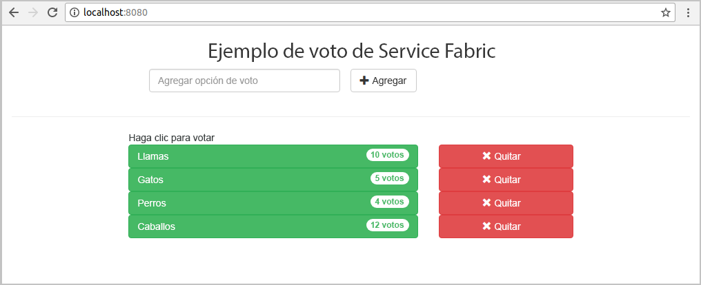
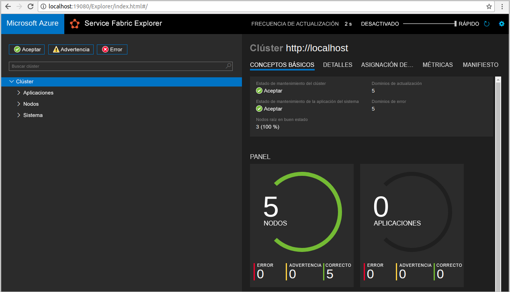
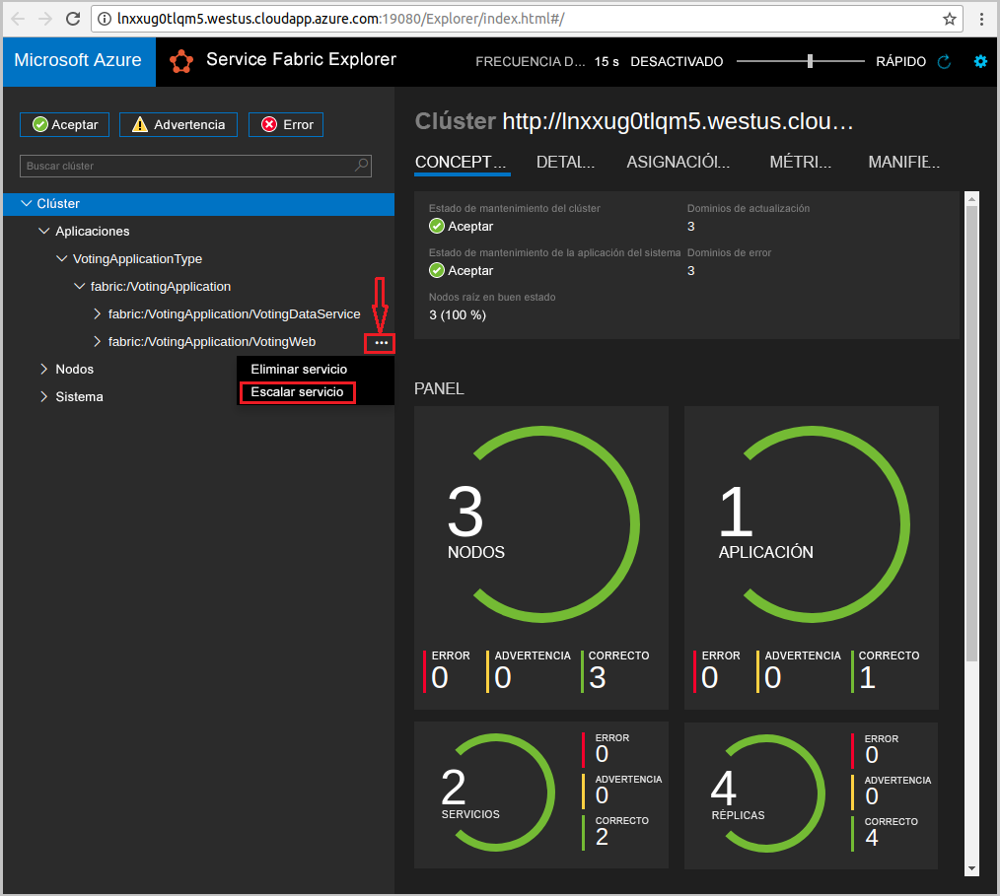

# <a name="quickstart-deploy-a-java-reliable-services-application-to-service-fabric"></a>Inicio rápido: Implementación de una aplicación de servicios de confianza de Java en Service Fabric

Azure Service Fabric es una plataforma de sistemas distribuidos para implementar y administrar microservicios y contenedores.

En esta guía de inicio rápido se explica cómo implementar la primera aplicación Java en Service Fabric mediante el IDE de Eclipse en un equipo de desarrolladores con Linux. Cuando termine, tendrá una aplicación de votación con un front-end web de Java que guarda los resultados de una votación en un servicio back-end con estado en el clúster.



En esta guía de inicio rápido, ha aprendido a hacer lo siguiente:

* Usar Eclipse como una herramienta para las aplicaciones Java en Service Fabric
* Implementar la aplicación en el clúster local
* Implementar la aplicación en un clúster en Azure
* Escalar horizontalmente la aplicación en varios nodos

## <a name="prerequisites"></a>Requisitos previos

Para completar esta guía de inicio rápido:

1. [Instale el SDK de Service Fabric y la interfaz de la línea de comandos (CLI) de Service Fabric](https://docs.microsoft.com/azure/service-fabric/service-fabric-get-started-linux#installation-methods)
2. [Instalación de Git](https://git-scm.com/)
3. [Instale Eclipse](https://www.eclipse.org/downloads/)
4. [Configure el entorno de Java](https://docs.microsoft.com/azure/service-fabric/service-fabric-get-started-linux#set-up-java-development), para lo que debe seguir los pasos opcionales para instalar el complemento de Eclipse

## <a name="download-the-sample"></a>Descarga del ejemplo

En una ventana Comandos, ejecute el comando siguiente para clonar el repositorio de la aplicación de ejemplo en la máquina local.

```git
git clone https://github.com/Azure-Samples/service-fabric-java-quickstart.git
```

## <a name="run-the-application-locally"></a>Ejecución de la aplicación de forma local

1. Inicie el clúster local mediante la ejecución del siguiente comando:

    ```bash
    sudo /opt/microsoft/sdk/servicefabric/common/clustersetup/devclustersetup.sh
    ```
    El inicio del clúster local tarda algún tiempo. Para confirmar que el clúster está totalmente operativo, acceda a Service Fabric Explorer en **http://localhost:19080**. Los cinco nodos con estado correcto indican que el clúster local está en funcionamiento.

    

2. Abra Eclipse.
3. Haga clic en File (Archivo) -> Import (Importar) -> Gradle -> Existing Gradle Project (Proyecto existente de Gradle) y siga los pasos del asistente.
4. Haga clic en Directory (Directorio) y elija el directorio `Voting` de la carpeta `service-fabric-java-quickstart` que clonó de Github. Haga clic en Finish. 

    

5. Ahora tiene el proyecto `Voting` en el Explorador de paquetes para Eclipse.
6. Haga clic con el botón derecho en el proyecto y seleccione **Publish Application...** (Publicar aplicación...) en el menú desplegable **Service Fabric**. Elija **PublishProfiles/Local.json** como el perfil de destino y haga clic en Publish (Publicar).

    

7. Abra el explorador web que prefiera y acceda a la aplicación a través de **http://localhost:8080**.

    

Ahora puede agregar una serie de opciones de votación y empezar a recibir votos. La aplicación se ejecuta y almacena todos los datos en el clúster de Service Fabric, sin necesidad de una base de datos independiente.

## <a name="deploy-the-application-to-azure"></a>Implementación de la aplicación en Azure

### <a name="set-up-your-azure-service-fabric-cluster"></a>Configuración del clúster de Service Fabric

Para implementar la aplicación en un clúster de Azure, cree su propio clúster.

Los Party Cluster son clústeres de Service Fabric gratuitos, de duración limitada, hospedados en Azure y operados por el equipo de Service Fabric. Puede usar un Party Cluster para implementar aplicaciones y aprender todo lo relacionado con la plataforma. El clúster usa un único certificado autofirmado para la seguridad de nodo a nodo y de cliente a nodo.

Inicie sesión y [únase a un clúster de Linux](http://aka.ms/tryservicefabric). Descargue los certificados PFX en el equipo. Para ello, haga clic en el vínculo **PFX**. Haga clic en el vínculo **Léame** para buscar la contraseña del certificado e instrucciones sobre cómo configurar varios entornos para el certificado. Conserve las páginas **Bienvenida** y **Léame** abiertas; se usarán algunas de las instrucciones en los pasos siguientes.

> [!Note]
> Hay un número limitado de clústeres Party Cluster disponibles por hora. Si se produce un error al intentar registrarse en un Party Cluster, puede esperar un tiempo y volver a intentarlo o puede seguir estos pasos de [Creación de un clúster de Service Fabric en Azure](service-fabric-tutorial-create-vnet-and-linux-cluster.md) para crear un clúster en su suscripción.
>
> El servicio Spring Boot está configurado para escuchar en el puerto 8080 el tráfico entrante. Asegúrese de que dicho puerto está abierto en el clúster. Si está usando el Party Cluster, el puerto estará abierto.
>

Service Fabric proporciona varias herramientas que puede usar para administrar un clúster y sus aplicaciones:

* Service Fabric Explorer, una herramienta basada en explorador.
* Interfaz de la línea de comandos (CLI) de Service Fabric, que se ejecuta sobre la CLI de Azure.
* Comandos de PowerShell.

En esta guía de inicio rápido, se usan la CLI de Service Fabric y Service Fabric Explorer.

Para utilizar la CLI, es preciso crear un archivo PEM basado en el archivo PFX que descargó. Para modificar el archivo, use el comando siguiente. (En el caso de los Party Cluster, puede copiar un comando específico para su archivo PFX siguiendo las instrucciones de la página **Léame**).

    ```bash
    openssl pkcs12 -in party-cluster-1486790479-client-cert.pfx -out party-cluster-1486790479-client-cert.pem -nodes -passin pass:1486790479
    ```

Para usar Service Fabric Explorer, tendrá que importar el archivo PFX del certificado que descargó del sitio web de Party Cluster en el almacén de certificados (Windows o Mac) o en el explorador mismo (Ubuntu). Es necesaria la contraseña de la clave privada del archivo PFX; puede obtenerla en la página **Léame**.

Utilice el método con el que se sienta más cómodo para importar el certificado en el sistema. Por ejemplo:

* En Windows: haga doble clic en el archivo PFX y siga las indicaciones para instalar el certificado en el almacén personal, `Certificates - Current User\Personal\Certificates`. Como alternativa, puede usar el comando de PowerShell de las instrucciones de la página **Léame**.
* En Mac: haga doble clic en el archivo PFX y siga las indicaciones para instalar el certificado en la cadena de claves.
* En Ubuntu: Mozilla Firefox es el explorador predeterminado en Ubuntu 16.04. Para importar el certificado en Firefox, haga clic en el botón de menú en la esquina superior derecha del explorador y, a continuación, haga clic en **Opciones**. En la página **Preferencias**, utilice el cuadro de búsqueda para buscar "certificados". Haga clic en **Ver certificados**, seleccione la pestaña **Sus certificados**, haga clic en **Importar** y siga las indicaciones para importar el certificado.

   

### <a name="add-certificate-information-to-your-application"></a>Incorporación de información de certificado a la aplicación

Es necesario agregar una huella digital a la aplicación porque esta está usando modelos de programación de Service Fabric.

1. Necesitará la huella digital del certificado en el archivo `Voting/VotingApplication/ApplicationManifest.xml` cuando se ejecuta en un clúster seguro. Ejecute el siguiente comando para extraer la huella digital del certificado.

    ```bash
    openssl x509 -in [CERTIFICATE_PEM_FILE] -fingerprint -noout
    ```

2. En el archivo `Voting/VotingApplication/ApplicationManifest.xml`, agregue el siguiente fragmento en la etiqueta **ApplicationManifest**. **X509FindValue** debe ser la huella digital del paso anterior (sin punto y coma). 

    ```xml
    <Certificates>
        <SecretsCertificate X509FindType="FindByThumbprint" X509FindValue="0A00AA0AAAA0AAA00A000000A0AA00A0AAAA00" />
    </Certificates>
    ```

### <a name="deploy-the-application-using-eclipse"></a>Implementación de la aplicación con Eclipse

Ahora que la aplicación y el clúster están listos, puede implementarlos en el clúster directamente desde Eclipse.

1. Abra el archivo **Cloud.json** en el directorio **PublishProfiles** y rellene los campos `ConnectionIPOrURL` y `ConnectionPort` según corresponda. Se proporciona un ejemplo:

    ```bash
    {
         "ClusterConnectionParameters":
         {
            "ConnectionIPOrURL": "lnxxug0tlqm5.westus.cloudapp.azure.com",
            "ConnectionPort": "19080",
            "ClientKey": "[path_to_your_pem_file_on_local_machine]",
            "ClientCert": "[path_to_your_pem_file_on_local_machine]"
         }
    }
    ```

2. Haga clic con el botón derecho en el proyecto y seleccione **Publish Application...** (Publicar aplicación...) en el menú desplegable **Service Fabric**. Elija **PublishProfiles/Cloud.json** como el perfil de destino y haga clic en Publish (Publicar).

    

3. Abra un explorador web y acceda a la aplicación a través de **http://\<ConnectionIPOrUrl>:8080**.

    

## <a name="scale-applications-and-services-in-a-cluster"></a>Escalar aplicaciones y servicios en un clúster

Los servicios se pueden escalar en un clúster para adaptarse a un cambio en la carga en los servicios. Para escalar un servicio, cambie el número de instancias que se ejecutan en el clúster. Hay muchas formas de escalar los servicios; por ejemplo, se pueden usar scripts o comandos de la CLI de Service Fabric (sfctl). En los pasos siguientes se utiliza Service Fabric Explorer.

Service Fabric Explorer se ejecuta en todos los clústeres de Service Fabric y se puede acceder a él desde un explorador. Para ello, vaya al puerto de administración HTTP de clústeres (19080); por ejemplo, `http://lnxxug0tlqm5.westus.cloudapp.azure.com:19080`.

Para escalar el servicio front-end web, realice estas operaciones:

1. Abra Service Fabric Explorer en el clúster, por ejemplo, `https://lnxxug0tlqm5.westus.cloudapp.azure.com:19080`.
2. Haga clic en el botón de puntos suspensivos (tres puntos) situado junto al nodo **fabric:/Voting/VotingWeb** en la vista de árbol y seleccione **Scale Service** (Escalar servicio).

    

    Ahora puede escalar el número de instancias del servicio front-end web.

3. Cambie el número a **2** y haga clic en **Scale Service** (Escalar servicio).
4. Haga clic en el nodo **fabric:/Voting/VotingWeb** en la vista de árbol y expanda el nodo de partición (representado por un GUID).

    

    Ahora puede ver que el servicio tiene dos instancias, y en la vista de árbol verá en qué nodos se ejecutan las instancias.

Mediante esta sencilla tarea de administración, hemos duplicado los recursos disponibles para el servicio de front-end para procesar la carga de usuarios. Es importante entender que no hacen falta varias instancias de un servicio para que se ejecute de forma confiable. Si se produce un error en un servicio, Service Fabric se asegurará de que se ejecute una nueva instancia de servicio en el clúster.

## <a name="next-steps"></a>Pasos siguientes

En este tutorial, ha aprendido a hacer lo siguiente:

* Usar Eclipse como una herramienta para las aplicaciones Java en Service Fabric
* Implementar aplicaciones Java en el clúster local
* Implementar aplicaciones Java en un clúster en Azure
* Escalar horizontalmente la aplicación en varios nodos

Para más información sobre cómo trabajar con aplicaciones Java en Service Fabric, diríjase al tutorial de las aplicaciones Java.

> [!div class="nextstepaction"]
> [Implementación de una aplicación Java](./service-fabric-tutorial-create-java-app.md)
