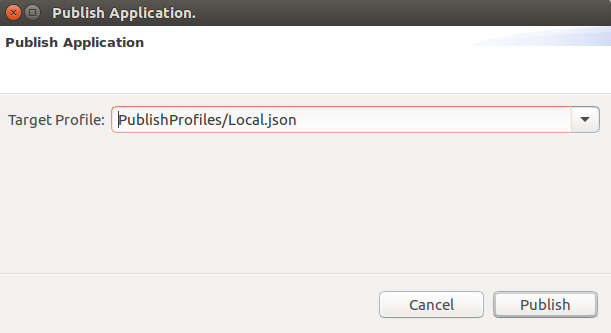
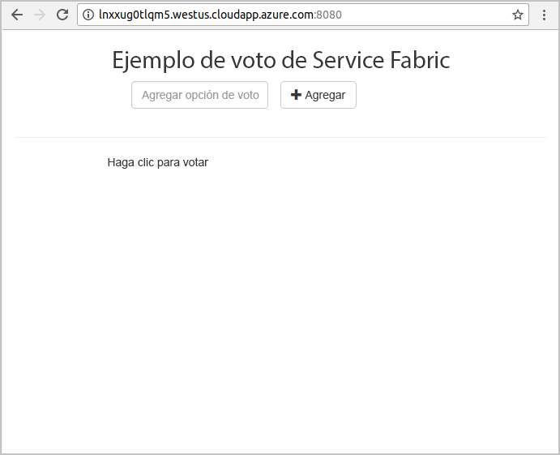

# <a name="create-a-java-application"></a>Creación de una aplicación Java
Azure Service Fabric es una plataforma de sistemas distribuidos para implementar y administrar microservicios y contenedores. 

En esta guía de inicio rápido se explica cómo implementar la primera aplicación Java en Service Fabric mediante el IDE de Eclipse en un equipo de desarrolladores con Linux. Cuando termine, tendrá una aplicación de votación con un front-end web de Java que guarda los resultados de una votación en un servicio back-end con estado en el clúster.


En esta guía de inicio rápido, ha aprendido a hacer lo siguiente:

> [!div class="checklist"]
> * Usar Eclipse como una herramienta para las aplicaciones Java en Service Fabric
> * Implementar la aplicación en el clúster local 
> * Implementar la aplicación en un clúster en Azure
> * Escalar horizontalmente la aplicación en varios nodos

## <a name="prerequisites"></a>requisitos previos
Para completar esta guía de inicio rápido:
1. [Instale el SDK de Service Fabric y la interfaz de la línea de comandos (CLI) de Service Fabric](https://docs.microsoft.com/azure/service-fabric/service-fabric-get-started-linux#installation-methods)
2. [Instalación de Git](https://git-scm.com/)
3. [Instale Eclipse](https://www.eclipse.org/downloads/)
4. [Configure el entorno de Java](https://docs.microsoft.com/azure/service-fabric/service-fabric-get-started-linux#set-up-java-development), para lo que debe seguir los pasos opcionales para instalar el complemento de Eclipse 

## <a name="download-the-sample"></a>Descarga del ejemplo
En una ventana Comandos, ejecute el comando siguiente para clonar el repositorio de la aplicación de ejemplo en la máquina local.
```
git clone https://github.com/Azure-Samples/service-fabric-java-quickstart.git
```

## <a name="run-the-application-locally"></a>Ejecución de la aplicación de forma local
1. Inicie el clúster local mediante la ejecución del siguiente comando:

    ```bash
    sudo /opt/microsoft/sdk/servicefabric/common/clustersetup/devclustersetup.sh
    ```
    El inicio del clúster local tarda algún tiempo. Para confirmar que el clúster está totalmente operativo, acceda a Service Fabric Explorer en **http://localhost:19080**. Los cinco nodos con estado correcto indican que el clúster local está en funcionamiento. 
    
    

2. Abra Eclipse.
3. Haga clic en File (Archivo) -> Open Projects from File System... (Abrir proyectos desde el sistema de archivos...). 
4. Haga clic en Directory (Directorio) y elija el directorio `Voting` de la carpeta `service-fabric-java-quickstart` que clonó de Github. Haga clic en Finish. 

    
    
5. Ahora tiene el proyecto `Voting` en el Explorador de paquetes para Eclipse. 
6. Haga clic con el botón derecho en el proyecto y seleccione **Publish Application...** (Publicar aplicación...) en el menú desplegable **Service Fabric**. Elija **PublishProfiles/Local.json** como el perfil de destino y haga clic en Publish (Publicar). 

    
    
7. Abra el explorador web favorito y acceda a la aplicación a través de **http://localhost:8080**. 

    
    
Ahora puede agregar una serie de opciones de votación y empezar a recibir votos. La aplicación se ejecuta y almacena todos los datos en el clúster de Service Fabric, sin necesidad de una base de datos independiente.

## <a name="deploy-the-application-to-azure"></a>Implementación de la aplicación en Azure

### <a name="set-up-your-azure-service-fabric-cluster"></a>Configuración del clúster de Service Fabric
Para implementar la aplicación en un clúster de Azure, cree su propio clúster.

Los Party Cluster son clústeres de Service Fabric gratuitos, de duración limitada, hospedados en Azure. Los ejecuta el equipo de Service Fabric, donde cualquier usuario puede implementar aplicaciones y conocer más información sobre la plataforma. Para obtener acceso a un Party Cluster, [siga estas instrucciones](http://aka.ms/tryservicefabric). 

Para poder realizar operaciones de administración en el clúster de entidad segura, puede utilizar Service Fabric Explorer, CLI o Powershell. Para usar Service Fabric Explorer, tendrá que descargar el archivo PFX desde el sitio web de Party Cluster e importar el certificado en el almacén de certificados (Windows o Mac) o en el explorador mismo (Ubuntu). No hay ninguna contraseña para los certificados autofirmados desde el clúster de entidad. 

Para realizar operaciones de administración con Powershell o CLI, necesitará el PFX (Powershell) o PEM (CLI). Para convertir el archivo PFX en un archivo PEM, ejecute el siguiente comando:  

```bash
openssl pkcs12 -in party-cluster-1277863181-client-cert.pfx -out party-cluster-1277863181-client-cert.pem -nodes -passin pass:
```

Para obtener información sobre cómo crear su propio clúster, vea [Creación de un clúster de Service Fabric en Azure](service-fabric-tutorial-create-vnet-and-linux-cluster.md).

> [!Note]
> El servicio Spring Boot está configurado para escuchar en el puerto 8080 el tráfico entrante. Asegúrese de que dicho puerto está abierto en el clúster. Si está usando el Party Cluster, el puerto estará abierto.
>

### <a name="add-certificate-information-to-your-application"></a>Incorporación de información de certificado a la aplicación

Es necesario agregar una huella digital a la aplicación porque esta está usando modelos de programación de Service Fabric. 

1. Necesitará la huella digital del certificado en el archivo ```Voting/VotingApplication/ApplicationManiest.xml``` cuando se ejecuta en un clúster seguro. Ejecute el siguiente comando para extraer la huella digital del certificado.

    ```bash
    openssl x509 -in [CERTIFICATE_FILE] -fingerprint -noout
    ```

2. En el archivo ```Voting/VotingApplication/ApplicationManiest.xml```, agregue el siguiente fragmento en la etiqueta **ApplicationManifest**. **X509FindValue** debe ser la huella digital del paso anterior (sin punto y coma). 

    ```xml
    <Certificates>
        <SecretsCertificate X509FindType="FindByThumbprint" X509FindValue="0A00AA0AAAA0AAA00A000000A0AA00A0AAAA00" />
    </Certificates>   
    ```
    
### <a name="deploy-the-application-using-eclipse"></a>Implementación de la aplicación con Eclipse
Ahora que la aplicación y el clúster están listos, puede implementarlos en el clúster directamente desde Eclipse.

1. Abra el archivo **Cloud.json** en el directorio **PublishProfiles** y rellene los campos `ConnectionIPOrURL` y `ConnectionPort` según corresponda. Se proporciona un ejemplo: 

    ```bash
    {
         "ClusterConnectionParameters": 
         {
            "ConnectionIPOrURL": "lnxxug0tlqm5.westus.cloudapp.azure.com",
            "ConnectionPort": "19080",
            "ClientKey": "[path_to_your_pem_file_on_local_machine]",
            "ClientCert": "[path_to_your_pem_file_on_local_machine]"
         }
    }
    ```

2. Haga clic con el botón derecho en el proyecto y seleccione **Publish Application...** (Publicar aplicación...) en el menú desplegable **Service Fabric**. Elija **PublishProfiles/Cloud.json** como el perfil de destino y haga clic en Publish (Publicar). 

    

3. Abra el explorador web favorito y acceda a la aplicación a través de **http://\<ConnectionIPOrURL>:8080**. 

    
    
## <a name="scale-applications-and-services-in-a-cluster"></a>Escalar aplicaciones y servicios en un clúster
Los servicios se pueden escalar en un clúster para adaptarse a un cambio en la carga en los servicios. Para escalar un servicio, cambie el número de instancias que se ejecutan en el clúster. Existen varias formas de escalar los servicios, ya sea mediante scripts o comandos de la CLI de Service Fabric (sfctl). En este ejemplo, se usa Service Fabric Explorer.

Service Fabric Explorer se ejecuta en todos los clústeres de Service Fabric y es accesible desde un explorador. Para ello, vaya al puerto de administración HTTP de clústeres (19080), por ejemplo, `http://lnxxug0tlqm5.westus.cloudapp.azure.com:19080`.

Para escalar el servicio front-end web, siga estos pasos:

1. Abra Service Fabric Explorer en el clúster, por ejemplo, `https://lnxxug0tlqm5.westus.cloudapp.azure.com:19080`.
2. Haga clic en el botón de puntos suspensivos (tres puntos) situado junto al nodo **fabric:/Voting/VotingWeb** en la vista de árbol y seleccione **Scale Service** (Escalar servicio).

    

    Ahora puede escalar el número de instancias del servicio front-end web.

3. Cambie el número a **2** y haga clic en **Scale Service** (Escalar servicio).
4. Haga clic en el nodo **fabric:/Voting/VotingWeb** en la vista de árbol y expanda el nodo de partición (representado por un GUID).

    

    Ahora puede ver que el servicio tiene dos instancias, y en la vista de árbol verá en qué nodos se ejecutan las instancias.

Mediante esta sencilla tarea de administración, hemos duplicado los recursos disponibles para el servicio front-end para procesar la carga de usuarios. Es importante entender que no hacen falta varias instancias de un servicio para que se ejecute de forma confiable. Si se produce un error en un servicio, Service Fabric se asegurará de que se ejecute una nueva instancia de servicio en el clúster.

## <a name="next-steps"></a>pasos siguientes
En este tutorial, ha aprendido a hacer lo siguiente:

> [!div class="checklist"]
> * Usar Eclipse como una herramienta para las aplicaciones Java en Service Fabric
> * Implementar aplicaciones Java en el clúster local 
> * Implementar aplicaciones Java en un clúster en Azure
> * Escalar horizontalmente la aplicación en varios nodos

* Obtenga más información sobre cómo [depurar servicios en Java con Eclipse](service-fabric-debugging-your-application-java.md).
* Obtenga más información sobre cómo [configurar la integración e implementación continuas con Jenkins](service-fabric-cicd-your-linux-applications-with-jenkins.md).
* Consulte otros [ejemplos de Java](https://github.com/Azure-Samples/service-fabric-java-getting-started).