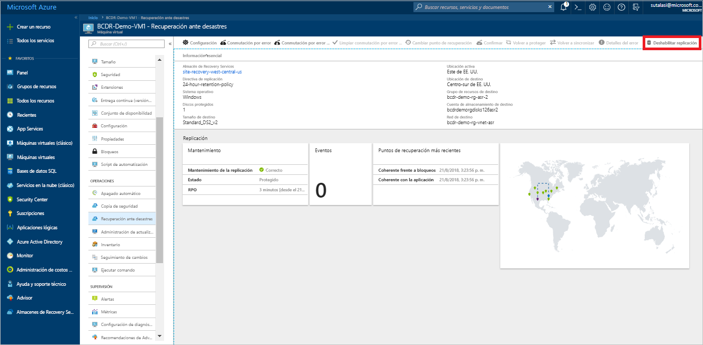

# Replicación de una máquina virtual de Azure en otra región de Azure

El servicio [Azure Site Recovery](site-recovery-overview.md) contribuye a la estrategia de recuperación ante desastres y continuidad empresarial (BCDR) al mantener sus aplicaciones empresariales al día y disponibles durante interrupciones planeadas y no planeadas. Azure Site Recovery administra y coordina la recuperación ante desastres de máquinas locales y máquinas virtuales de Azure, lo que incluye la replicación, la conmutación por error y la recuperación.

En esta guía de inicio rápido se describe cómo replicar una máquina virtual de Azure en una región distinta de Azure. 

Si no tiene una suscripción a Azure, cree una [cuenta gratuita](https://azure.microsoft.com/free/?WT.mc_id=A261C142F) antes de empezar.

## Inicio de sesión en Azure

Inicie sesión en Azure Portal en http://portal.azure.com.

## Habilitación de la replicación para la máquina virtual de Azure

1. En Azure Portal, haga clic en **Máquinas virtuales** y seleccione la máquina virtual que desea replicar.

2. En **Configuración**, haga clic en **Recuperación ante desastres**.
3. En **Configurar recuperación ante desastres** > **Región de destino**, seleccione la región de destino en la que quiere realizar la replicación.
4. En esta guía de inicio rápido, acepte los restantes valores predeterminados.
5. Haga clic en **Habilitar replicación**. Esto inicia un trabajo para habilitar la replicación de la máquina virtual.

    

## Comprobación de la configuración

Cuando haya finalizado el trabajo de replicación, puede comprobar el estado de replicación, modificar la configuración de replicación y probar la implementación.

1. En el menú de la máquina virtual, haga clic en **Recuperación ante desastres**.
2. Puede comprobar el estado de replicación, los puntos de recuperación que se han creado y las regiones de origen y destino en el mapa.

   

## Limpieza de recursos

La máquina virtual de la región primaria deja de replicar al deshabilitar la replicación:

- La configuración de replicación de origen se limpia automáticamente.
- También se detiene la facturación de Site Recovery para la máquina virtual.

Detenga la replicación como se indica a continuación:

1. Seleccione la máquina virtual.
2. En **Recuperación ante desastres**, haga clic en **Más**.
3. Haga clic en **Deshabilitar replicación**.

   

## Pasos siguientes

En esta guía de inicio rápido, se replica una única máquina virtual en una región secundaria.

> [!div class="nextstepaction"]
> [Configuración de la recuperación ante desastres para las máquinas virtuales de Azure](azure-to-azure-tutorial-enable-replication.md)
