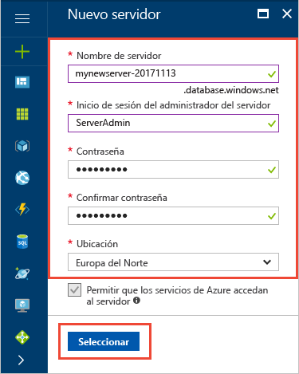
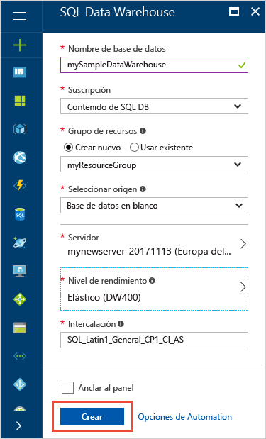
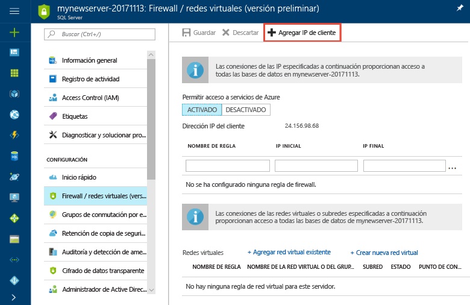
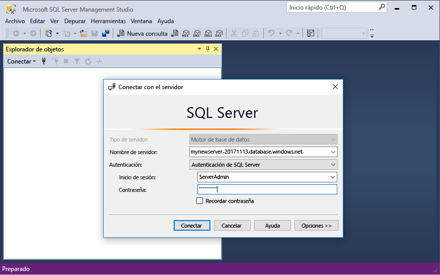
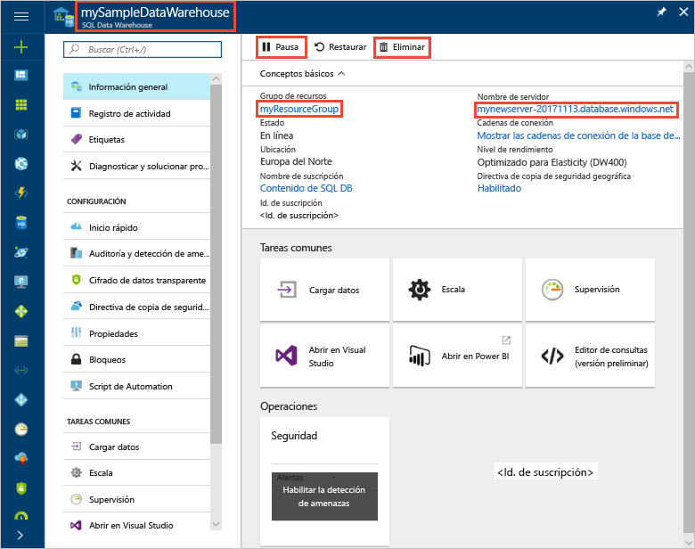

# <a name="tutorial-use-polybase-to-load-data-from-azure-blob-storage-to-azure-sql-data-warehouse"></a>Tutorial: Uso de PolyBase para cargar datos de Azure Blob Storage en Azure SQL Data Warehouse

PolyBase es la tecnología de carga estándar para obtener datos en SQL Data Warehouse. En este tutorial, se usa PolyBase para cargar datos de taxis de Nueva York de Azure Blob Storage en Azure SQL Data Warehouse. El tutorial utiliza [Azure Portal](https://portal.azure.com) y [SQL Server Management Studio](/sql/ssms/download-sql-server-management-studio-ssms.md) (SSMS) para: 

> [!div class="checklist"]
> * Crear un almacenamiento de datos en Azure Portal
> * Establecer una regla de firewall de nivel de servidor en Azure Portal
> * Conectarse al almacenamiento de datos con SSMS
> * Crear un usuario designado para cargar datos
> * Crear tablas externas para los datos en Azure Blob Storage
> * Utilizar la instrucción CTAS de T-SQL para cargar datos en el almacenamiento de datos
> * Ver el progreso de los datos a medida que se cargan
> * Crear estadísticas de los datos recién cargados

Si no tiene una suscripción a Azure, cree una [cuenta gratuita](https://azure.microsoft.com/free/) antes de empezar.

## <a name="before-you-begin"></a>Antes de empezar

Antes de completar este tutorial, descargue e instale la versión más reciente de [SQL Server Management Studio](/sql/ssms/download-sql-server-management-studio-ssms.md) (SSMS).


## <a name="log-in-to-the-azure-portal"></a>Iniciar sesión en Azure Portal

Inicie sesión en [Azure Portal](https://portal.azure.com/).

## <a name="create-a-blank-sql-data-warehouse"></a>Creación de un almacenamiento de datos SQL en blanco

Un almacenamiento de datos de Azure SQL se crea con un conjunto definido de [recursos de proceso](performance-tiers.md). La base de datos se crea dentro de un [grupo de recursos de Azure](../azure-resource-manager/resource-group-overview.md) y en un [servidor lógico de Azure SQL](../sql-database/sql-database-features.md). 

Siga estos pasos para crear un almacenamiento de datos SQL en blanco. 

1. Haga clic en el botón **Nuevo** situado en la esquina superior izquierda de Azure Portal.

2. Seleccione **Bases de datos** en la página **Nuevo** y seleccione **SQL Data Warehouse** en **Destacados** en la página **Nuevo**.

    

3. Rellene el formulario SQL Data Warehouse con la siguiente información:   

   | Configuración | Valor sugerido | DESCRIPCIÓN | 
   | ------- | --------------- | ----------- | 
   | **Nombre de la base de datos** | mySampleDataWarehouse | Para conocer los nombres de base de datos válidos, consulte [Database Identifiers](/sql/relational-databases/databases/database-identifiers) (Identificadores de base de datos). | 
   | **Suscripción** | Su suscripción  | Para más información acerca de sus suscripciones, consulte [Suscripciones](https://account.windowsazure.com/Subscriptions). |
   | **Grupos de recursos** | myResourceGroup | Para conocer cuáles son los nombres de grupo de recursos válidos, consulte el artículo [Naming conventions](https://docs.microsoft.com/azure/architecture/best-practices/naming-conventions) (Convenciones de nomenclatura). |
   | **Seleccionar origen** | Base de datos en blanco | Se especifica para crear una base de datos en blanco. Tenga en cuenta que un almacenamiento de datos es un tipo de base de datos.|

    

4. Haga clic en **Servidor** para crear y configurar un servidor nuevo para la nueva base de datos. Rellene el **formulario de servidor nuevo** con la siguiente información: 

    | Configuración | Valor sugerido | DESCRIPCIÓN | 
    | ------- | --------------- | ----------- |
    | **Nombre del servidor** | Cualquier nombre globalmente único | Para conocer cuáles son los nombres de servidor válidos, consulte el artículo [Naming conventions](https://docs.microsoft.com/azure/architecture/best-practices/naming-conventions) (Convenciones de nomenclatura). | 
    | **Inicio de sesión del administrador del servidor** | Cualquier nombre válido | Para conocer los nombres de inicio de sesión válidos, consulte [Database Identifiers](https://docs.microsoft.com/sql/relational-databases/databases/database-identifiers) (Identificadores de base de datos).|
    | **Password** | Cualquier contraseña válida | La contraseña debe tener un mínimo de ocho caracteres y debe contener caracteres de tres de las siguientes categorías: caracteres en mayúsculas, caracteres en minúsculas, números y caracteres no alfanuméricos. |
    | **Ubicación** | Cualquier ubicación válida | Para obtener información acerca de las regiones, consulte [Regiones de Azure](https://azure.microsoft.com/regions/). |

    

5. Haga clic en **Seleccionar**.

6. Haga clic en **Nivel de rendimiento** para especificar si el almacenamiento de datos está optimizado para elasticidad o proceso y el número de unidades de almacenamiento de datos. 

7. Para este tutorial, seleccione el nivel de servicio **Optimizado para Elasticity**. De forma predeterminada, el control deslizante se establece en **DW400**.  Intente moverlo hacia arriba y hacia abajo para ver cómo funciona. 

    

8. Haga clic en **Aplicar**.
9. En la página SQL Data Warehouse, seleccione una **intercalación** para la base de datos en blanco. En este tutorial, use el valor predeterminado. Para más información sobre las intercalaciones, vea [Collations](/sql/t-sql/statements/collations.md) (Intercalaciones)

11. Una vez completado el formulario de SQL Database, haga clic en **Crear** para aprovisionar la base de datos. El aprovisionamiento tarda unos minutos. 

    

12. En la barra de herramientas, haga clic en **Notificaciones** para supervisar el proceso de implementación.
    
     

## <a name="create-a-server-level-firewall-rule"></a>Crear una regla de firewall de nivel de servidor

El servicio SQL Data Warehouse crea un firewall en el nivel de servidor, lo que impide que herramientas y aplicaciones externas se conecten al servidor o a las bases de datos del servidor. Para habilitar la conectividad, puede agregar reglas de firewall que habilitan la conectividad para direcciones IP concretas.  Siga estos pasos para crear una [regla de firewall de nivel de servidor](../sql-database/sql-database-firewall-configure.md) para la dirección IP del cliente. 

> [!NOTE]
> SQL Data Warehouse se comunica a través del puerto 1433. Si intenta conectarse desde una red corporativa, es posible que el firewall de la red no permita el tráfico saliente a través del puerto 1433. En ese caso, no puede conectarse al servidor de Azure SQL Database, salvo que el departamento de TI abra el puerto 1433.
>

1. Cuando se haya finalizado la implementación, haga clic en **Bases de datos SQL** en el menú de la izquierda y, después, haga clic en **mySampleDatabase** en la página **Bases de datos SQL**. Se abre la página de información general de la base de datos, que muestra el nombre completo del servidor (por ejemplo, **mynewserver-20171113.database.windows.net**) y proporciona opciones para otras configuraciones. 

2. Copie este nombre para conectarse a su servidor y a sus bases de datos en los inicios rápidos posteriores. A continuación, haga clic en el nombre del servidor para abrir la configuración del servidor.

     

3. Haga clic en el nombre del servidor para abrir la configuración del servidor.

     

5. Haga clic en **Mostrar configuración del firewall**. Se abrirá la página **Configuración del firewall** del servidor de SQL Database. 

     

4. Haga clic en **Agregar IP de cliente** en la barra de herramientas para agregar la dirección IP actual a la nueva regla de firewall. La regla de firewall puede abrir el puerto 1433 para una única dirección IP o un intervalo de direcciones IP.

5. Haga clic en **Save**(Guardar). Se crea una regla de firewall de nivel de servidor para el puerto 1433 de la dirección IP actual en el servidor lógico.

6. Haga clic en **Aceptar** y después cierre la página **Configuración de firewall**.

Ahora puede conectarse a SQL server y sus almacenamientos de datos mediante esta dirección IP. La conexión funciona desde SQL Server Management Studio u otra herramienta de su elección. Cuando se conecte, use la cuenta de ServerAdmin que creó anteriormente.  

> [!IMPORTANT]
> De forma predeterminada, el acceso a través del firewall de SQL Database está habilitado para todos los servicios de Azure. Haga clic en **DESACTIVAR** en esta página y luego haga clic en **Guardar** para deshabilitar el firewall para todos los servicios de Azure.

## <a name="get-the-fully-qualified-server-name"></a>Obtención del nombre completo del servidor

En Azure Portal encontrará el nombre completo del servidor SQL. Más adelante usará el nombre completo cuando se conecte al servidor.

1. Inicie sesión en [Azure Portal](https://portal.azure.com/).
2. Seleccione **SQL Database** en el menú de la izquierda y haga clic en la base de datos en la página **SQL Database**. 
3. En el panel **Essentials** de la página de Azure Portal de la base de datos, busque y copie el **nombre del servidor**. En este ejemplo, el nombre completo es mynewserver-20171113.database.windows.net. 

      

## <a name="connect-to-the-server-as-server-admin"></a>Conexión al servidor como administrador del mismo

En esta sección se usa [SQL Server Management Studio](/sql/ssms/download-sql-server-management-studio-ssms.md) (SSMS) para establecer una conexión con el servidor Azure SQL.

1. Abra SQL Server Management Studio.

2. En el cuadro de diálogo **Conectar con el servidor**, especifique la siguiente información:

    | Configuración      | Valor sugerido | DESCRIPCIÓN | 
    | ------------ | --------------- | ----------- | 
    | Tipo de servidor | Motor de base de datos | Este valor es obligatorio |
    | Nombre de servidor | Nombre completo del servidor | Dicho nombre debe parecerse al siguiente: **mynewserver-20171113.database.windows.net**. |
    | Autenticación | Autenticación de SQL Server | Autenticación de SQL es el único tipo de autenticación que hemos configurado en este tutorial. |
    | Inicio de sesión | La cuenta de administrador del servidor | Es la cuenta que especificó cuando creó el servidor. |
    | Password | La contraseña de la cuenta de administrador del servidor | Es la contraseña que especificó cuando creó el servidor. |

    

4. Haga clic en **Conectar**. Se abre la ventana del Explorador de objetos en SSMS. 

5. En el Explorador de objetos, expanda **Bases de datos**. A continuación, expanda **Bases de datos del sistema** y **maestro** para ver los objetos de la base de datos maestra.  Expanda **mySampleDatabase** para ver los objetos de la base de datos.

     

## <a name="create-a-user-for-loading-data"></a>Creación de un usuario para cargar datos

La cuenta de administrador del servidor está pensada para realizar operaciones de administración y no es adecuada para ejecutar consultas en datos de usuario. La carga de datos es una operación que utiliza mucha memoria. Se definen [valores máximos de memoria](performance-tiers.md#memory-maximums) según el [nivel de rendimiento](performance-tiers.md) y la [clase de recurso](resource-classes-for-workload-management.md). 

Es mejor crear un inicio de sesión y un usuario que esté dedicado para cargar datos. A continuación, agregue el usuario de carga a una [clase de recurso](resource-classes-for-workload-management.md) que permita una asignación de memoria máxima apropiada.

Puesto que actualmente está conectado como administrador del servidor, puede crear inicios de sesión y usuarios. Siga estos pasos para crear un inicio de sesión y un usuario llamado **LoaderRC20**. Luego, asigne el usuario a la clase de recurso **staticrc20**. 

1.  En SSMS, haga clic en **maestro** para mostrar un menú desplegable y elija **Nueva consulta**. Se abre una nueva ventana de consulta.

    

2. En la ventana de consulta, escriba estos comandos de T-SQL para crear un inicio de sesión y un usuario denominado LoaderRC20, sustituyendo su propia contraseña por 'a123STRONGpassword!'. 

    ```sql
    CREATE LOGIN LoaderRC20 WITH PASSWORD = 'a123STRONGpassword!';
    CREATE USER LoaderRC20 FOR LOGIN LoaderRC20;
    ```

3. Haga clic en **Ejecutar**.

4. Haga clic con el botón derecho en **mySampleDataWarehouse** y elija **Nueva consulta**. Se abre una nueva ventana de consulta.  

    
 
5. Escriba los siguientes comandos de T-SQL para crear un usuario de base de datos denominado LoaderRC20 para el inicio de sesión LoaderRC20. La segunda línea concede al nuevo usuario permisos de CONTROL en el nuevo almacenamiento de datos.  Estos permisos son similares a convertir al usuario en el propietario de la base de datos. La tercera línea agrega el nuevo usuario como miembro de la [clase de recurso](resource-classes-for-workload-management.md) staticrc20.

    ```sql
    CREATE USER LoaderRC20 FOR LOGIN LoaderRC20;
    GRANT CONTROL ON DATABASE::[mySampleDataWarehouse] to LoaderRC20;
    EXEC sp_addrolemember 'staticrc20', 'LoaderRC20';
    ```

6. Haga clic en **Ejecutar**.

## <a name="connect-to-the-server-as-the-loading-user"></a>Conexión al servidor como el usuario de carga

El primer paso para cargar datos es iniciar sesión como LoaderRC20.  

1. En el Explorador de objetos, haga clic en el menú desplegable **Conectar** y seleccione **Motor de base de datos**. Aparecerá el cuadro de diálogo **Conectar con el servidor** .

    

2. Escriba el nombre completo del servidor y escriba **LoaderRC20** como inicio de sesión.  Escriba la contraseña para LoaderRC20.

3. Haga clic en **Conectar**.

4. Cuando la conexión esté lista, verá dos conexiones de servidor en el Explorador de objetos. Una conexión como ServerAdmin y otra como MedRCLogin.

    

## <a name="create-external-tables-for-the-sample-data"></a>Creación de tablas externas para los datos de ejemplo

Está listo para comenzar el proceso de carga de datos en el nuevo almacenamiento de datos. Este tutorial le muestra cómo usar [PolyBase](/sql/relational-databases/polybase/polybase-guide.md) para cargar datos de los taxis de Nueva York procedentes de una instancia de Azure Storage Blob. Para consultas futuras y aprender cómo obtener los datos en Azure Blob Storage o cómo cargarlos directamente desde el origen en SQL Data Warehouse, consulte la [introducción a la carga](sql-data-warehouse-overview-load.md).

Ejecute los siguientes scripts SQL para especificar información sobre los datos que desea cargar. Esta información incluye dónde se encuentran los datos, el formato del contenido de los mismos y la definición de tabla para ellos. 

1. En la sección anterior, inició sesión en el almacenamiento de datos como LoaderRC20. En SSMS, haga clic con el botón derecho en la conexión de LoaderRC20 y seleccione **Nueva consulta**.  Aparece una nueva ventana de consulta. 

    

2. Compare la ventana de consulta con la imagen anterior.  Verifique que la nueva ventana de consulta se ejecuta como LoaderRC20 y que realiza consultas en la base de datos MySampleDataWarehouse. Utilice esta ventana de consulta para realizar todos los pasos de carga.

3. Cree una clave maestra para la base de datos MySampleDataWarehouse. Solo necesita crear una clave maestra una vez para cada base de datos. 

    ```sql
    CREATE MASTER KEY;
    ```

4. Ejecute la siguiente instrucción [CREATE EXTERNAL DATA SOURCE](/sql/t-sql/statements/create-external-data-source-transact-sql.md) para definir la ubicación del blob de Azure. Esta es la ubicación de los datos de taxis externos.  Para ejecutar un comando que se ha anexado a la ventana de consulta, resalte los comandos que desea ejecutar y haga clic en **Ejecutar**.

    ```sql
    CREATE EXTERNAL DATA SOURCE NYTPublic
    WITH
    (
        TYPE = Hadoop,
        LOCATION = 'wasbs://2013@nytaxiblob.blob.core.windows.net/'
    );
    ```

5. Ejecute la siguiente instrucción de T-SQL [CREATE EXTERNAL FILE FORMAT](/sql/t-sql/statements/create-external-file-format-transact-sql.md) para especificar características y opciones de formato para el archivo de datos externos. Esta instrucción especifica que los datos externos se almacenan como texto y los valores se separan mediante el carácter de barra vertical ('|'). El archivo externo está comprimido con Gzip. 

    ```sql
    CREATE EXTERNAL FILE FORMAT uncompressedcsv
    WITH (
        FORMAT_TYPE = DELIMITEDTEXT,
        FORMAT_OPTIONS ( 
            FIELD_TERMINATOR = ',',
            STRING_DELIMITER = '',
            DATE_FORMAT = '',
            USE_TYPE_DEFAULT = False
        )
    );
    CREATE EXTERNAL FILE FORMAT compressedcsv
    WITH ( 
        FORMAT_TYPE = DELIMITEDTEXT,
        FORMAT_OPTIONS ( FIELD_TERMINATOR = '|',
            STRING_DELIMITER = '',
        DATE_FORMAT = '',
            USE_TYPE_DEFAULT = False
        ),
        DATA_COMPRESSION = 'org.apache.hadoop.io.compress.GzipCodec'
    );
    ```

6.  Ejecute la siguiente instrucción [CREATE SCHEMA](/sql/t-sql/statements/create-schema-transact-sql.md) para crear un esquema para el formato de archivo externo. El esquema proporciona una manera de organizar las tablas externas que va a crear.

    ```sql
    CREATE SCHEMA ext;
    ```

7. Creación de la tablas externas Las definiciones de tabla se almacenan en SQL Data Warehouse, pero las tablas hacen referencia a datos que se almacenan en Azure Blob Storage. Ejecute los siguientes comandos T-SQL para crear varias tablas externas que apuntan al blob de Azure que hemos definido previamente en nuestro origen de datos externo.

    ```sql
    CREATE EXTERNAL TABLE [ext].[Date] 
    (
        [DateID] int NOT NULL,
        [Date] datetime NULL,
        [DateBKey] char(10) COLLATE SQL_Latin1_General_CP1_CI_AS NULL,
        [DayOfMonth] varchar(2) COLLATE SQL_Latin1_General_CP1_CI_AS NULL,
        [DaySuffix] varchar(4) COLLATE SQL_Latin1_General_CP1_CI_AS NULL,
        [DayName] varchar(9) COLLATE SQL_Latin1_General_CP1_CI_AS NULL,
        [DayOfWeek] char(1) COLLATE SQL_Latin1_General_CP1_CI_AS NULL,
        [DayOfWeekInMonth] varchar(2) COLLATE SQL_Latin1_General_CP1_CI_AS NULL,
        [DayOfWeekInYear] varchar(2) COLLATE SQL_Latin1_General_CP1_CI_AS NULL,
        [DayOfQuarter] varchar(3) COLLATE SQL_Latin1_General_CP1_CI_AS NULL,
        [DayOfYear] varchar(3) COLLATE SQL_Latin1_General_CP1_CI_AS NULL,
        [WeekOfMonth] varchar(1) COLLATE SQL_Latin1_General_CP1_CI_AS NULL,
        [WeekOfQuarter] varchar(2) COLLATE SQL_Latin1_General_CP1_CI_AS NULL,
        [WeekOfYear] varchar(2) COLLATE SQL_Latin1_General_CP1_CI_AS NULL,
        [Month] varchar(2) COLLATE SQL_Latin1_General_CP1_CI_AS NULL,
        [MonthName] varchar(9) COLLATE SQL_Latin1_General_CP1_CI_AS NULL,
        [MonthOfQuarter] varchar(2) COLLATE SQL_Latin1_General_CP1_CI_AS NULL,
        [Quarter] char(1) COLLATE SQL_Latin1_General_CP1_CI_AS NULL,
        [QuarterName] varchar(9) COLLATE SQL_Latin1_General_CP1_CI_AS NULL,
        [Year] char(4) COLLATE SQL_Latin1_General_CP1_CI_AS NULL,
        [YearName] char(7) COLLATE SQL_Latin1_General_CP1_CI_AS NULL,
        [MonthYear] char(10) COLLATE SQL_Latin1_General_CP1_CI_AS NULL,
        [MMYYYY] char(6) COLLATE SQL_Latin1_General_CP1_CI_AS NULL,
        [FirstDayOfMonth] date NULL,
        [LastDayOfMonth] date NULL,
        [FirstDayOfQuarter] date NULL,
        [LastDayOfQuarter] date NULL,
        [FirstDayOfYear] date NULL,
        [LastDayOfYear] date NULL,
        [IsHolidayUSA] bit NULL,
        [IsWeekday] bit NULL,
        [HolidayUSA] varchar(50) COLLATE SQL_Latin1_General_CP1_CI_AS NULL
    )
    WITH
    (
        LOCATION = 'Date',
        DATA_SOURCE = NYTPublic,
        FILE_FORMAT = uncompressedcsv,
        REJECT_TYPE = value,
        REJECT_VALUE = 0
    ); 
    CREATE EXTERNAL TABLE [ext].[Geography]
    (
        [GeographyID] int NOT NULL,
        [ZipCodeBKey] varchar(10) COLLATE SQL_Latin1_General_CP1_CI_AS NOT NULL,
        [County] varchar(50) COLLATE SQL_Latin1_General_CP1_CI_AS NULL,
        [City] varchar(50) COLLATE SQL_Latin1_General_CP1_CI_AS NULL,
        [State] varchar(50) COLLATE SQL_Latin1_General_CP1_CI_AS NULL,
        [Country] varchar(50) COLLATE SQL_Latin1_General_CP1_CI_AS NULL,
        [ZipCode] varchar(50) COLLATE SQL_Latin1_General_CP1_CI_AS NULL
    )
    WITH
    (
        LOCATION = 'Geography',
        DATA_SOURCE = NYTPublic,
        FILE_FORMAT = uncompressedcsv,
        REJECT_TYPE = value,
        REJECT_VALUE = 0 
    );      
    CREATE EXTERNAL TABLE [ext].[HackneyLicense]
    (
        [HackneyLicenseID] int NOT NULL,
        [HackneyLicenseBKey] varchar(50) COLLATE SQL_Latin1_General_CP1_CI_AS NOT NULL,
        [HackneyLicenseCode] varchar(50) COLLATE SQL_Latin1_General_CP1_CI_AS NULL
    )
    WITH
    (
        LOCATION = 'HackneyLicense',
        DATA_SOURCE = NYTPublic,
        FILE_FORMAT = uncompressedcsv,
        REJECT_TYPE = value,
        REJECT_VALUE = 0
    );
    CREATE EXTERNAL TABLE [ext].[Medallion]
    (
        [MedallionID] int NOT NULL,
        [MedallionBKey] varchar(50) COLLATE SQL_Latin1_General_CP1_CI_AS NOT NULL,
        [MedallionCode] varchar(50) COLLATE SQL_Latin1_General_CP1_CI_AS NULL
    )
    WITH
    (
        LOCATION = 'Medallion',
        DATA_SOURCE = NYTPublic,
        FILE_FORMAT = uncompressedcsv,
        REJECT_TYPE = value,
        REJECT_VALUE = 0
    )
    ;  
    CREATE EXTERNAL TABLE [ext].[Time]
    (
        [TimeID] int NOT NULL,
        [TimeBKey] varchar(8) COLLATE SQL_Latin1_General_CP1_CI_AS NOT NULL,
        [HourNumber] tinyint NOT NULL,
        [MinuteNumber] tinyint NOT NULL,
        [SecondNumber] tinyint NOT NULL,
        [TimeInSecond] int NOT NULL,
        [HourlyBucket] varchar(15) COLLATE SQL_Latin1_General_CP1_CI_AS NOT NULL,
        [DayTimeBucketGroupKey] int NOT NULL,
        [DayTimeBucket] varchar(100) COLLATE SQL_Latin1_General_CP1_CI_AS NOT NULL
    )
    WITH
    (
        LOCATION = 'Time',
        DATA_SOURCE = NYTPublic,
        FILE_FORMAT = uncompressedcsv,
        REJECT_TYPE = value,
        REJECT_VALUE = 0
    );
    CREATE EXTERNAL TABLE [ext].[Trip]
    (
        [DateID] int NOT NULL,
        [MedallionID] int NOT NULL,
        [HackneyLicenseID] int NOT NULL,
        [PickupTimeID] int NOT NULL,
        [DropoffTimeID] int NOT NULL,
        [PickupGeographyID] int NULL,
        [DropoffGeographyID] int NULL,
        [PickupLatitude] float NULL,
        [PickupLongitude] float NULL,
        [PickupLatLong] varchar(50) COLLATE SQL_Latin1_General_CP1_CI_AS NULL,
        [DropoffLatitude] float NULL,
        [DropoffLongitude] float NULL,
        [DropoffLatLong] varchar(50) COLLATE SQL_Latin1_General_CP1_CI_AS NULL,
        [PassengerCount] int NULL,
        [TripDurationSeconds] int NULL,
        [TripDistanceMiles] float NULL,
        [PaymentType] varchar(50) COLLATE SQL_Latin1_General_CP1_CI_AS NULL,
        [FareAmount] money NULL,
        [SurchargeAmount] money NULL,
        [TaxAmount] money NULL,
        [TipAmount] money NULL,
        [TollsAmount] money NULL,
        [TotalAmount] money NULL
    )
    WITH
    (
        LOCATION = 'Trip2013',
        DATA_SOURCE = NYTPublic,
        FILE_FORMAT = compressedcsv,
        REJECT_TYPE = value,
        REJECT_VALUE = 0
    );
    CREATE EXTERNAL TABLE [ext].[Weather]
    (
        [DateID] int NOT NULL,
        [GeographyID] int NOT NULL,
        [PrecipitationInches] float NOT NULL,
        [AvgTemperatureFahrenheit] float NOT NULL
    )
    WITH
    (
        LOCATION = 'Weather',
        DATA_SOURCE = NYTPublic,
        FILE_FORMAT = uncompressedcsv,
        REJECT_TYPE = value,
        REJECT_VALUE = 0
    )
    ;
    ```

8. En el Explorador de objetos, expanda mySampleDataWarehouse para ver la lista de tablas externas que acaba de crear.

    

## <a name="load-the-data-into-your-data-warehouse"></a>Carga de datos en el almacenamiento de datos

En esta sección se utilizan las tablas externas que acaba de definir para cargar los datos de ejemplo desde Azure Storage Blob en SQL Data Warehouse.  

> [!NOTE]
> En este tutorial se cargan los datos directamente en la tabla final. En un entorno de producción, normalmente se usa CREATE TABLE AS SELECT para cargar en una tabla de almacenamiento provisional. Con los datos en la tabla de almacenamiento provisional, puede realizar las transformaciones necesarias. Para anexar los datos de la tabla de almacenamiento provisional a una tabla de producción, use la instrucción INSERT...SELECT. Para más información, consulte [Inserción de datos en una tabla de producción](guidance-for-loading-data.md#inserting-data-into-a-production-table).
> 

El script utiliza la instrucción de T-SQL [CREATE TABLE AS SELECT (CTAS)](/sql/t-sql/statements/create-table-as-select-azure-sql-data-warehouse.md) para cargar los datos de Azure Storage Blob en nuevas tablas en el almacenamiento de datos. CTAS crea una tabla nueva en función de los resultados de una instrucción select. La nueva tabla tiene las mismas columnas y los mismos tipos de datos que los resultados de la instrucción select. Cuando la instrucción select realiza la selección en una tabla externa, SQL Data Warehouse importa los datos en una tabla relacional en el almacenamiento de datos. 

1. Ejecute el siguiente script para cargar los datos en tablas nuevas en el almacenamiento de datos.

    ```sql
    CREATE TABLE [dbo].[Date]
    WITH
    ( 
        DISTRIBUTION = ROUND_ROBIN,
        CLUSTERED COLUMNSTORE INDEX
    )
    AS SELECT * FROM [ext].[Date]
    OPTION (LABEL = 'CTAS : Load [dbo].[Date]')
    ;
    CREATE TABLE [dbo].[Geography]
    WITH
    ( 
        DISTRIBUTION = ROUND_ROBIN,
        CLUSTERED COLUMNSTORE INDEX
    )
    AS
    SELECT * FROM [ext].[Geography]
    OPTION (LABEL = 'CTAS : Load [dbo].[Geography]')
    ;
    CREATE TABLE [dbo].[HackneyLicense]
    WITH
    ( 
        DISTRIBUTION = ROUND_ROBIN,
        CLUSTERED COLUMNSTORE INDEX
    )
    AS SELECT * FROM [ext].[HackneyLicense]
    OPTION (LABEL = 'CTAS : Load [dbo].[HackneyLicense]')
    ;
    CREATE TABLE [dbo].[Medallion]
    WITH
    (
        DISTRIBUTION = ROUND_ROBIN,
        CLUSTERED COLUMNSTORE INDEX
    )
    AS SELECT * FROM [ext].[Medallion]
    OPTION (LABEL = 'CTAS : Load [dbo].[Medallion]')
    ;
    CREATE TABLE [dbo].[Time]
    WITH
    (
        DISTRIBUTION = ROUND_ROBIN,
        CLUSTERED COLUMNSTORE INDEX
    )
    AS SELECT * FROM [ext].[Time]
    OPTION (LABEL = 'CTAS : Load [dbo].[Time]')
    ;
    CREATE TABLE [dbo].[Weather]
    WITH
    ( 
        DISTRIBUTION = ROUND_ROBIN,
        CLUSTERED COLUMNSTORE INDEX
    )
    AS SELECT * FROM [ext].[Weather]
    OPTION (LABEL = 'CTAS : Load [dbo].[Weather]')
    ;
    CREATE TABLE [dbo].[Trip]
    WITH
    (
        DISTRIBUTION = ROUND_ROBIN,
        CLUSTERED COLUMNSTORE INDEX
    )
    AS SELECT * FROM [ext].[Trip]
    OPTION (LABEL = 'CTAS : Load [dbo].[Trip]')
    ;
    ```

2. Consulte los datos mientras se carga. Está cargando varios gigabytes de datos y comprimiéndolos en índices de almacén de columnas en clúster de alto rendimiento. Ejecute la siguiente consulta, que usa vistas de administración dinámica (DMV) para mostrar el estado de la carga. Después de iniciar la consulta, tómese un café y coma algo mientras SQL Data Warehouse hace el trabajo duro.

    ```sql
    SELECT
        r.command,
        s.request_id,
        r.status,
        count(distinct input_name) as nbr_files,
        sum(s.bytes_processed)/1024/1024/1024 as gb_processed
    FROM 
        sys.dm_pdw_exec_requests r
        INNER JOIN sys.dm_pdw_dms_external_work s
        ON r.request_id = s.request_id
    WHERE
        r.[label] = 'CTAS : Load [dbo].[Date]' OR
        r.[label] = 'CTAS : Load [dbo].[Geography]' OR
        r.[label] = 'CTAS : Load [dbo].[HackneyLicense]' OR
        r.[label] = 'CTAS : Load [dbo].[Medallion]' OR
        r.[label] = 'CTAS : Load [dbo].[Time]' OR
        r.[label] = 'CTAS : Load [dbo].[Weather]' OR
        r.[label] = 'CTAS : Load [dbo].[Trip]'
    GROUP BY
        r.command,
        s.request_id,
        r.status
    ORDER BY
        nbr_files desc, 
        gb_processed desc;
    ```

3. Consulte todas las consultas del sistema.

    ```sql
    SELECT * FROM sys.dm_pdw_exec_requests;
    ```

4. Disfrute viendo cómo los datos se cargan ordenadamente en el almacenamiento de datos.

    

## <a name="create-statistics-on-newly-loaded-data"></a>Creación de estadísticas de los datos recién cargados

SQL Data Warehouse no crea ni actualiza automáticamente las estadísticas. Por lo tanto, para lograr un rendimiento elevado de las consultas, es importante crear estadísticas de todas las columna de cada tabla después de la primera carga. También es importante actualizar las estadísticas si se realizan cambios significativos en los datos.

Ejecute estos comandos para crear estadísticas de columnas que suelen usarse en las combinaciones.

    ```sql
    CREATE STATISTICS [dbo.Date DateID stats] ON dbo.Date (DateID);
    CREATE STATISTICS [dbo.Trip DateID stats] ON dbo.Trip (DateID);
    ```

## <a name="clean-up-resources"></a>Limpieza de recursos

Se le cobran recursos de proceso y datos que cargó en el almacenamiento de datos. Estos se cobran por separado. 

- Si desea conservar los datos de almacenamiento, puede pausar el proceso cuando no está utilizando el almacenamiento de datos. Cuando pausa el proceso, solamente se cobra por el almacenamiento de datos y puede reanudar el proceso cada vez que está listo para trabajar con los datos.
- Si desea quitar cobros futuros, puede eliminar el almacenamiento de datos. 

Siga estos pasos para limpiar los recursos según estime oportuno.

1. Inicie sesión en [Azure Portal](https://portal.azure.com) y haga clic en el almacenamiento de datos.

    

2. Para pausar el proceso, haga clic en el botón **Pausar**. Cuando el almacenamiento de datos se pause, verá un botón **Iniciar**.  Para reanudar el proceso, haga clic en **Iniciar**.

3. Para quitar el almacenamiento de datos para que no se le cobre por proceso o almacenamiento, haga clic en **Eliminar**.

4. Para quitar el servidor SQL que creó, haga clic en **mynewserver-20171113.database.windows.net** en la imagen anterior y luego haga clic en **Eliminar**.  Debe tener cuidado con esto, ya que la eliminación del servidor eliminará todas las bases de datos asignadas al servidor.

5. Para quitar el grupo de recursos, haga clic en **myResourceGroup** y luego haga clic en **Eliminar grupo de recursos**.

## <a name="next-steps"></a>pasos siguientes 
En este tutorial, aprendió a crear un almacenamiento de datos y a crear un usuario para cargar datos. Creó tablas externas para definir la estructura de los datos almacenados en Azure Storage Blob y luego utilizó la instrucción CREATE TABLE AS SELECT de PolyBase para cargar datos en el almacenamiento de datos. 

Hizo todo esto:
> [!div class="checklist"]
> * Creó un almacenamiento de datos en Azure Portal
> * Establecer una regla de firewall de nivel de servidor en Azure Portal
> * Se conectó al almacenamiento de datos con SSMS
> * Creó un usuario designado para cargar datos
> * Creó tablas externas para los datos en Azure Blob Storage
> * Utilizó la instrucción CTAS de T-SQL para cargar datos en el almacenamiento de datos
> * Vio el progreso de los datos a medida que se cargaban
> * Creó estadísticas de los datos recién cargados

Avance a la introducción a la migración para obtener información sobre cómo migrar una base de datos existente a SQL Data Warehouse.

> [!div class="nextstepaction"]
>[Obtener información sobre la migración de una base de datos existente a SQL Data Warehouse](sql-data-warehouse-overview-migrate.md)
