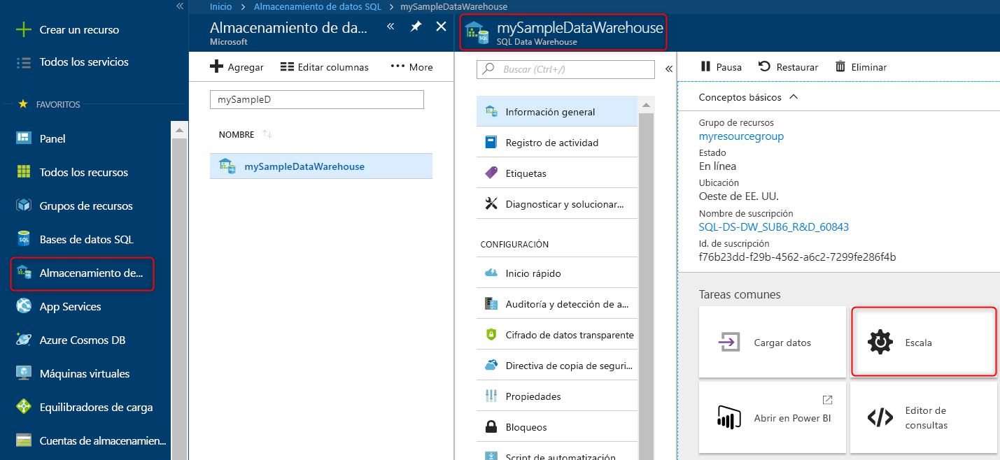

# Guía de inicio rápido: Escalabilidad horizontal de un proceso en Azure SQL Data Warehouse en Azure Portal

Escale un proceso en Azure SQL Data Warehouse en Azure Portal. [Escale horizontalmente un proceso](sql-data-warehouse-manage-compute-overview.md) para aumentar el rendimiento, o bien revierta la escalabilidad del proceso para ahorrar costos. 

Si no tiene una suscripción a Azure, cree una cuenta [gratuita](https://azure.microsoft.com/free/) antes de empezar.

## Inicie sesión en el Portal de Azure.

Inicie sesión en el [Azure Portal](https://portal.azure.com/).

## Antes de empezar

Puede escalar un almacenamiento de datos que ya tenga o consultar [Guía de inicio rápido: Creación de una instancia de Azure SQL Data Warehouse en Azure Portal, y realización de consultas en ella](create-data-warehouse-portal.md) para crear un almacenamiento de datos llamado **mySampleDataWarehouse**.  En esta guía de inicio rápido se escala **mySampleDataWarehouse**.

## Escalado de proceso

En SQL Data Warehouse, puede aumentar o reducir los recursos de procesos mediante el ajuste de las unidades del almacenamiento de datos. En [Guía de inicio rápido: Creación de una instancia de Azure SQL Data Warehouse en Azure Portal, y realización de consultas en ella](create-data-warehouse-portal.md) creó **mySampleDataWarehouse** y lo inició con 400 DWU. En los siguientes pasos se ajustan las DWU para **mySampleDataWarehouse**.

Para cambiar las unidades de almacenamiento de datos:

1. En la página izquierda de Azure Portal, haga clic en **Bases de datos SQL**.
2. Seleccione **mySampleDataWarehouse** en la página **Bases de datos SQL**. Se abre el almacenamiento de datos.
3. Haga clic en **Escalar**.

    

2. En el panel Escalar, mueva el control deslizante hacia la izquierda o la derecha para cambiar el valor de DWU.

    

3. Haga clic en **Save**(Guardar). Aparece un mensaje de confirmación. Haga clic en **Sí** para confirmar o **No** para cancelar.

    

## Pasos siguientes
Ya ha aprendido a escalar procesos para el almacenamiento de datos. Para más información sobre Azure SQL Data Warehouse, siga el tutorial para cargar los datos.

> [!div class="nextstepaction"]
>[Carga de datos en una instancia de SQL Data Warehouse](load-data-from-azure-blob-storage-using-polybase.md)
