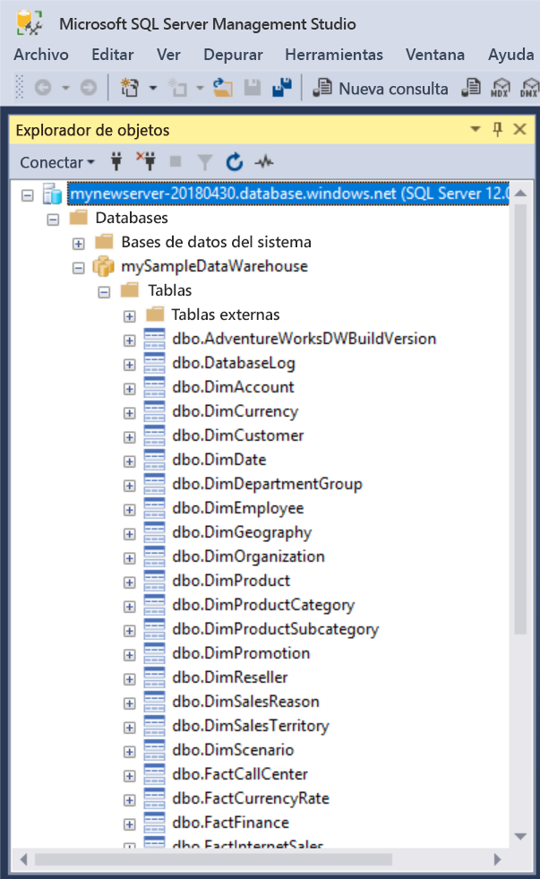

# <a name="quickstart-scale-compute-in-azure-sql-data-warehouse-using-t-sql"></a>Guía de inicio rápido: Escalabilidad de procesos en Azure SQL Data Warehouse mediante T-SQL

Escale procesos en Azure SQL Data Warehouse con T-SQL y SQL Server Management Studio (SSMS). [Escale horizontalmente un proceso](sql-data-warehouse-manage-compute-overview.md) para aumentar el rendimiento, o bien revierta la escalabilidad del proceso para ahorrar costos. 

Si no tiene una suscripción a Azure, cree una cuenta [gratuita](https://azure.microsoft.com/free/) antes de empezar.

## <a name="before-you-begin"></a>Antes de empezar

Descargue e instale la versión más reciente de [SQL Server Management Studio](/sql/ssms/download-sql-server-management-studio-ssms) (SSMS).
 
## <a name="create-a-data-warehouse"></a>Creación del almacenamiento de datos

Use [Guía de inicio rápido: Creación de una instancia de Azure SQL Data Warehouse en Azure Portal, y realización de consultas en ella](create-data-warehouse-portal.md) para crear un almacenamiento de datos denominado **mySampleDataWarehouse**. Complete la guía de inicio rápido para asegurarse de que disponga de una regla de firewall y de que pueda conectarse al almacenamiento de datos desde SQL Server Management Studio.

## <a name="connect-to-the-server-as-server-admin"></a>Conexión al servidor como administrador del mismo

En esta sección se usa [SQL Server Management Studio](/sql/ssms/download-sql-server-management-studio-ssms) (SSMS) para establecer una conexión con el servidor Azure SQL.

1. Abra SQL Server Management Studio.

2. En el cuadro de diálogo **Conectar con el servidor**, especifique la siguiente información:

   | Configuración       | Valor sugerido | DESCRIPCIÓN | 
   | ------------ | ------------------ | ------------------------------------------------- | 
   | Tipo de servidor | Motor de base de datos | Este valor es obligatorio |
   | Nombre de servidor | Nombre completo del servidor | Este es un ejemplo: **mynewserver 20171113.database.windows.net**. |
   | Autenticación | Autenticación de SQL Server | Autenticación de SQL es el único tipo de autenticación que se ha configurado en este tutorial. |
   | Inicio de sesión | La cuenta de administrador del servidor | Es la cuenta que especificó cuando creó el servidor. |
   | Contraseña | La contraseña de la cuenta de administrador del servidor | Es la contraseña que especificó cuando creó el servidor. |

    

4. Haga clic en **Conectar**. Se abre la ventana del Explorador de objetos en SSMS. 

5. En el Explorador de objetos, expanda **Bases de datos**. Después, expanda **mySampleDatabase** para ver los objetos de la base de datos.

     

## <a name="view-service-objective"></a>Visualización del objetivo del servicio
La configuración del objetivo del servicio contiene el número de unidades del almacenamiento de datos. 

Para ver las unidades actuales del almacenamiento de datos:

1. En la conexión a **mynewserver-20171113.database.windows.net**, expanda **Bases de datos del sistema**.
2. Haga clic con el botón derecho en **maestra** y luego seleccione **Nueva consulta**. Se abre una nueva ventana de consulta.
3. Ejecute la consulta siguiente para realizar la selección desde la vista de administración dinámica sys.database_service_objectives. 

    ```sql
    SELECT
        db.name [Database]
    ,   ds.edition [Edition]
    ,   ds.service_objective [Service Objective]
    FROM
        sys.database_service_objectives ds
    JOIN
        sys.databases db ON ds.database_id = db.database_id
    WHERE 
        db.name = 'mySampleDataWarehouse'
    ```

4. Los siguientes resultados muestran que **mySampleDataWarehouse** tiene un objetivo del servicio de DW400. 

    


## <a name="scale-compute"></a>Escalado de proceso
En SQL Data Warehouse, puede aumentar o reducir los recursos de procesos mediante el ajuste de las unidades del almacenamiento de datos. En [Guía de inicio rápido: Creación de una instancia de Azure SQL Data Warehouse en Azure Portal, y realización de consultas en ella](create-data-warehouse-portal.md) creó **mySampleDataWarehouse** y lo inició con 400 DWU. En los siguientes pasos se ajustan las DWU para **mySampleDataWarehouse**.

Para cambiar las unidades de almacenamiento de datos:

1. Haga clic con el botón derecho en **maestra** y luego seleccione **Nueva consulta**.
2. Use la instrucción T-SQL [ALTER DATABASE](/sql/t-sql/statements/alter-database-azure-sql-database) para modificar el objetivo del servicio. Ejecute la consulta siguiente para cambiar el objetivo del servicio por DW300. 

    ```Sql
    ALTER DATABASE mySampleDataWarehouse
    MODIFY (SERVICE_OBJECTIVE = 'DW300')
    ;
    ```

## <a name="monitor-scale-change-request"></a>Supervisión de la solicitud de cambio de escalado
Para ver el progreso de la solicitud de cambio anterior, puede usar la sintaxis de T-SQL `WAITFORDELAY` para sondear la vista de administración dinámica (DMV) de sys.dm_operation_status.

Para sondear el estado de cambio del objeto de servicio:

1. Haga clic con el botón derecho en **maestra** y luego seleccione **Nueva consulta**.
2. Ejecute la siguiente consulta para sondear la vista de administración dinámica de sys.dm_operation_status.

    ```sql
    WHILE 
    (
        SELECT TOP 1 state_desc
        FROM sys.dm_operation_status
        WHERE 
            1=1
            AND resource_type_desc = 'Database'
            AND major_resource_id = 'MySampleDataWarehouse'
            AND operation = 'ALTER DATABASE'
        ORDER BY
            start_time DESC
    ) = 'IN_PROGRESS'
    BEGIN
        RAISERROR('Scale operation in progress',0,0) WITH NOWAIT;
        WAITFOR DELAY '00:00:05';
    END
    PRINT 'Complete';
    ```
3. La salida resultante muestra un registro del sondeo del estado.

    

## <a name="check-data-warehouse-state"></a>Comprobar el estado del almacenamiento de datos

Cuando se pausa un almacenamiento de datos, no podrá conectarse a este con T-SQL. Para ver el estado actual del almacenamiento de datos, puede usar un cmdlet de PowerShell. Para obtener un ejemplo, vea [Comprobar el estado de la base de datos - Powershell](quickstart-scale-compute-powershell.md#check-data-warehouse-state). 

## <a name="check-operation-status"></a>Comprobación del estado de la operación

Para obtener información sobre varias operaciones de administración de SQL Data Warehouse, ejecute la siguiente consulta en la DMV [sys.dm_operation_status](/sql/relational-databases/system-dynamic-management-views/sys-dm-operation-status-azure-sql-database). Por ejemplo, devuelve la operación y su estado, que será IN_PROGRESS o COMPLETED.

```sql
SELECT *
FROM
    sys.dm_operation_status
WHERE
    resource_type_desc = 'Database'
AND 
    major_resource_id = 'MySampleDataWarehouse'
```


## <a name="next-steps"></a>Pasos siguientes
Ya ha aprendido a escalar procesos para el almacenamiento de datos. Para más información sobre Azure SQL Data Warehouse, siga el tutorial para cargar los datos.

> [!div class="nextstepaction"]
>[Carga de datos en una instancia de SQL Data Warehouse](load-data-from-azure-blob-storage-using-polybase.md)
