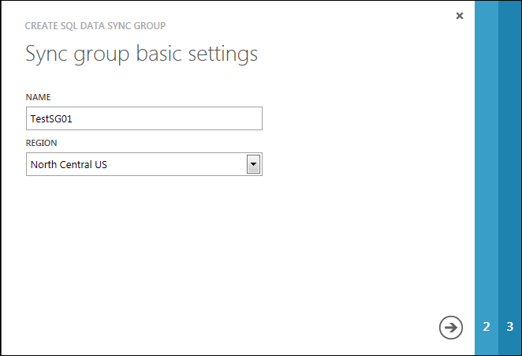
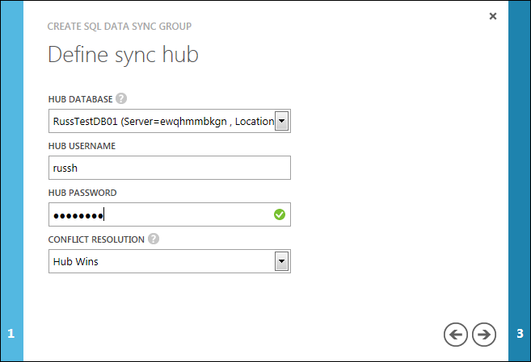
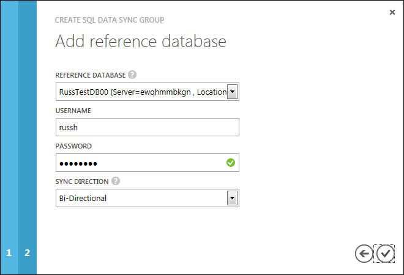
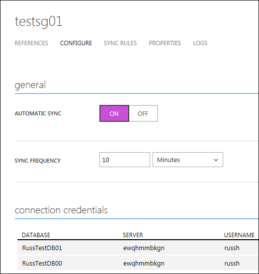

<properties linkid="manage-services-sql-databases-datasync" urlDisplayName="How to sync data" pageTitle="Getting started with SQL Databases Data Sync" metaKeywords="" description="" metaCanonical="" services="sql-database" documentationCenter="" title="Getting Started with Azure SQL Data Sync" authors="" solutions="" manager="" editor="" />

Introducción a SQL Data Sync de Azure
=====================================

En este tutorial aprenderá los fundamentos del uso de SQL Data Sync de Azure mediante el Portal de Azure (vista previa).

En este tutorial se supone que no tiene una experiencia previa en SQL Server o Base de datos SQL de Azure. En este tutorial, creará un grupo de sincronización híbrido (instancias de SQL Server y Base de datos SQL) completamente configurado y sincronizado en función de cómo lo programe.

Tabla de contenido
------------------

-   [Paso 1: Conectarse a la Base de datos SQL de Azure](#Connect)
-   [Paso 2: Agregar un agente cliente ()](#AddAgent)
-   [Paso 3: Registrar una base de datos de SQL Server con el agente cliente](#RegisterSSDB)
-   [Paso 4: Crear un grupo de sincronización](#CreateSG)
-   [Paso 5: Definir los datos que hay que sincronizar](#SyncRules)
-   [Paso 6: Configurar su grupo de sincronización](#Configure)

Paso 1: Conectarse a la Base de datos SQL de Azure
--------------------------------------------------

1.  Inicie sesión en el [Portal de administración](http://manage.windowsazure.com).

2.  Haga clic en **SQL DATABASES** en el panel izquierdo.

3.  Haga clic en **SYNC** en la parte inferior de la página. Cuando haga clic en SYNC, aparecerá una lista que muestra lo que puede agregar: **New Sync Group** y **New Sync Agent**.

4.  Para iniciar el Asistente de nuevo agente de SQL Data Sync, haga clic en **New Sync Agent**.

5.  Si nunca antes ha agregado un agente, haga clic en **descargar aquí**.

    

Paso 2: Agregar un agente cliente
---------------------------------

Este paso solo es necesario si va a incluir en su grupo de sincronización una base de datos de SQL Server local. Puede pasar al Paso 4: Crear un grupo de sincronización si su grupo de sincronización solo tiene instancias de base de datos SQL.

### Paso 2a: Instalar el software necesario

Asegúrese de tener el software siguiente instalado en el equipo donde instalará el agente cliente.

-   **.NET Framework 4.0**

	Puede instalar .NET Framework 4.0 desde [aquí](http://go.microsoft.com/fwlink/?linkid=205836).

-   **Microsoft SQL Server 2008 R2 SP1 System CLR Types (x86)**

	Puede instalar Microsoft SQL Server 2008 R2 SP1 System CLR Types (x86) desde [aquí](http://www.microsoft.com/download/en/details.aspx?id=26728).

-   **Objetos de administración compartida de Microsoft SQL Server 2008 R2 SP1 (x86)**

	Puede instalar los objetos de administración compartida de Microsoft SQL Server 2008 R2 SP1 (x86) desde [aquí](http://www.microsoft.com/download/en/details.aspx?id=26728).

### Paso 2b: Instalar un nuevo agente cliente

Siga la instrucción de [Instalar un cliente de agente de SQL Data Sync](http://msdn.microsoft.com/en-us/library/jj823137.aspx) para instalar el agente.

### Paso 2c: Finalizar el Asistente de nuevo agente de SQL Data Sync

1.  Vuelva al Asistente de nuevo agente de SQL Data Sync.
2.  Ponga un nombre descriptivo al agente.
3.  En el menú desplegable, seleccione **REGIÓN** (centro de datos) para hospedar este agente.
4.  En el menú desplegable, seleccione **SUBSCRIPCIÓN** para hospedar este agente.
5.  Haga clic en la flecha derecha.

Paso 3: Registrar una base de datos de SQL Server con el agente cliente
-----------------------------------------------------------------------

Cuando del agente cliente se haya instalado, registre todas las bases de datos de SQL Server locales que pretenda incluir en un grupo de sincronización con el agente. Para registrar una base de datos con el agente, siga las instrucciones de [Registrar una base de datos de SQL Server con un cliente de agente](http://msdn.microsoft.com/en-us/library/jj823138.aspx).

Paso 4: Crear un grupo de sincronización
----------------------------------------

### Paso 4a: Iniciar el Asistente de nuevo grupo de sincronización

1.  Vuelva al [Portal de administración](http://manage.windowsazure.com).
2.  Haga clic en **SQL DATABASES**.
3.  Haga clic en **ADD SYNC** al final de la página y, a continuación, seleccione New Sync Group en el cajón.

    

### Paso 4b: Introducir la configuración básica

1.  Escriba un nombre descriptivo para el grupo de sincronización.
2.  En el menú desplegable, seleccione **REGIÓN** (centro de datos) para hospedar este grupo de sincronización.
3.  Haga clic en la flecha derecha.

    

### Paso 4c: Definir el concentrador de sincronización

1.  En el menú desplegable, seleccione la instancia de Base de datos SQL para que sirva de concentrador de grupo de sincronización.
2.  Escriba las credenciales para esta instancia de base de datos SQL: **HUB USERNAME** y **HUB PASSWORD**.
3.  Espere a que SQL Data Sync confirme USERNAME y PASSWORD. Aparecerá una marca de verificación a la derecha de PASSWORD cuando las credenciales se confirmen.
4.  En el menú desplegable, seleccione la directiva **CONFLICT RESOLUTION**.

	**Hub Wins**: Todos los cambios incluidos en la base de datos del concentrador se escriben en las bases de datos de referencia y se sobrescriben los cambios en el mismo registro de la base de datos de referencia. Funcionalmente esto significa que el primer cambio escrito en el concentrador se propaga a las demás bases de datos.

	**Client Wins**: Los cambios de las bases de datos de referencia se sobrescriben en los cambios escritos en el concentrador. Funcionalmente esto significa que el último cambio escrito en el concentrador es el que se conserva y propaga a las otras bases de datos.

1.  Haga clic en la flecha derecha.

    

### Paso 4d: Agregar una base de datos de referencia

Repita este paso en todas las bases de datos adicionales que quiera agregar al grupo de sincronización.

1.  En el menú desplegable, seleccione la base de datos que desea agregar.

    Las bases de datos del menú desplegable incluyen tanto bases de datos de SQL Server que se han registrado con el agente como instancias de Base de datos SQL.

2.  Escriba las credenciales para esta base de datos: **USERNAME** y **PASSWORD**.
3.  En el menú desplegable, seleccione **SYNC DIRECTION** de esta base de datos.

    **Bi-directional**: Los cambios en la base de datos de referencia se escriben en la base de datos del concentrador y los cambios realizados de la base de datos del concentrador se escriben en la base de datos de referencia.

    **Sync from the Hub**: La base de datos recibe actualizaciones del concentrador. Sin embargo, no envía los cambios al concentrador.

    **Sync to the Hub**: La base de datos envía actualizaciones al concentrador. Sin embargo, los cambios del concentrador no se escriben en esta base de datos.

4.  Para terminar de crear el grupo de sincronización, haga clic en la casilla de verificación situada en la parte inferior derecha del asistente. Espere a que SQL Data Sync confirme las credenciales. Una marca de verificación verde indica que las credenciales se han confirmado.

5.  Haga clic en la marca de verificación otra vez. De este modo volverá a la página **SYNC** debajo de Bases de datos SQL. Este grupo de sincronización ahora aparece con los demás grupos de sincronización y agentes.

    

Paso 5: Definir los datos que hay que sincronizar
-------------------------------------------------

SQL Data Sync de Azure le permite seleccionar tablas y columnas para sincronizarlas. Si además desea filtrar una columna para que solo sincronice filas con valores concretos (como, Age\>=65), use el portal SQL Data Sync en Azure y la documentación de Seleccionar las tablas, las columnas y las filas que hay que sincronizar para definir los datos que se sincronizarán.

1.	Vuelva al [Portal de administración](http://manage.windowsazure.com).
2.	Haga clic en **SQL DATABASES**.
3.	Haga clic en la pestaña **SYNC**.
4.	Haga clic en el nombre de este grupo de sincronización.
5.	Haga clic en la pestaña **SYNC RULES**.
6.	Seleccione la base de datos a la que desea proporcionar el esquema de grupo de sincronización.
7.	Haga clic en la flecha derecha.
8.	Haga clic en **REFRESH SCHEMA**.
9.	En cada tabla de la base de datos, seleccione las columnas que desee incluir en las sincronizaciones.
	- La columnas con tipos de datos incompatibles no se pueden seleccionar.
	- Si no hay columnas seleccionadas en una tabla, esta no se incluye en el grupo de sincronización.
	- Para seleccionar o anular la selección de todas las tablas, haga clic en SELECT en la parte inferior de la pantalla.
10.	Haga clic en **SAVE** y espere a que el grupo de sincronización termine el aprovisionamiento.
11.	Para volver a la página de aterrizaje de Data Sync, haga clic en la flecha atrás situada en la parte superior izquierda de la pantalla (encima del nombre del grupo de sincronización).

    

Paso 6: Configurar su grupo de sincronización
---------------------------------------------

Siempre podrá sincronizar un grupo de sincronización haciendo clic en SYNC en la parte inferior de la página de aterrizaje de Data Sync. Si desea programar la sincronización de un grupo de sincronización, configúrelo en el grupo de sincronización.

1.  Vuelva al [Portal de administración](http://manage.windowsazure.com).
2.  Haga clic en **SQL DATABASES**.
3.  Haga clic en la pestaña **SYNC**.
4.  Haga clic en el nombre de este grupo de sincronización.
5.  Haga clic en la pestaña **CONFIGURE**.
6.  **AUTOMATIC SYNC**
    -   Para que el grupo de sincronización se sincronice con una frecuencia determinada, haga clic en **ON**. No obstante, puede seguir sincronizando a petición haciendo clic en SYNC.
    -   Haga clic en **OFF** para configurar el grupo de sincronización que haya que sincronizar solo cuando haga clic en SYNC.
7.  **SYNC FREQUENCY**
    -   Si AUTOMATIC SYNC está en ON, configure la frecuencia de sincronización. La frecuencia debe estar entre 5 minutos y 1 mes.
8.  Haga clic en **SAVE**.

	

¡Enhorabuena! Ha creado un grupo de sincronización que incluye una instancia de Base de datos SQL y una base de datos SQL Server.

Pasos siguientes
----------------

Para obtener más información acerca de Base de datos SQL y SQL Data Sync, consulte:

-   [Sign up for the Premium Offer for SQL Database] (../sign-up-for-sql-database-premium/)
-   [SQL Data Sync (Portal WA)](http://msdn.microsoft.com/en-us/library/windowsazure/jj856263.aspx)
-   [Introducción a Base de datos SQL de Azure](../getting-started-w-sql-databases/)
-   [Ciclo de vida de base de datos SQL Server](http://go.microsoft.com/fwlink/?LinkId=275193)

