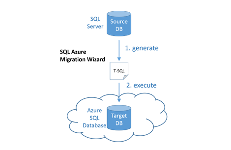
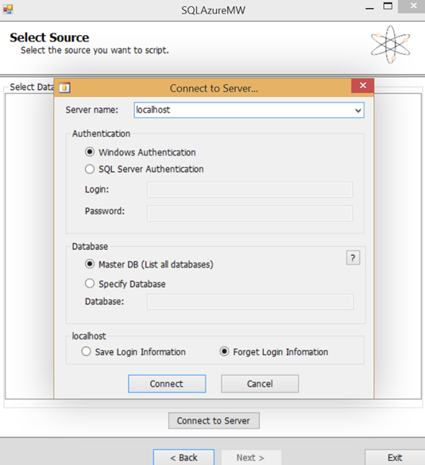
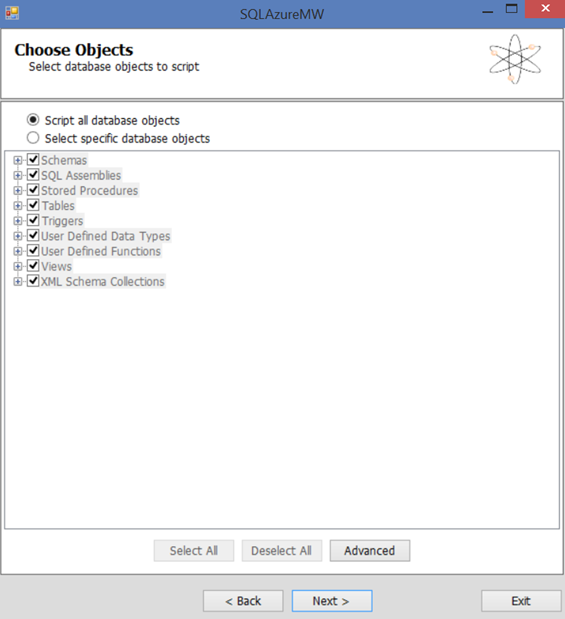
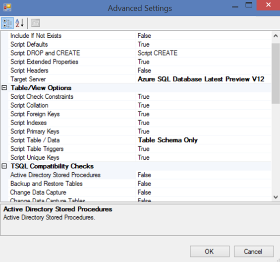
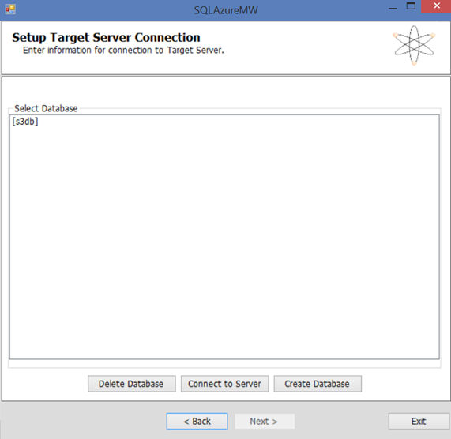

<properties 
   pageTitle="Migración mediante el Asistente para migración a SQL" 
   description="Base de datos SQL de Microsoft Azure, migración de base de datos, importación de base de datos, exportación de base de datos, asistente para migración" 
   services="sql-database" 
   documentationCenter="" 
   authors="pehteh" 
   manager="jeffreyg" 
   editor="monicar"/>

<tags
   ms.service="sql-database"
   ms.devlang="NA"
   ms.topic="article"
   ms.tgt_pltfrm="NA"
   ms.workload="data-management" 
   ms.date="04/14/2015"
   ms.author="pehteh"/>

# Migración mediante el Asistente para migración a SQL de Azure

Esta opción utiliza el Asistente para migración a SQL de Azure para generar un script T-SQL desde una base de datos de origen que luego la transforma el Asistente para que sea compatible con Base de datos de SQL y después se conecte a Base de datos SQL de Azure para ejecutar el script en una base de datos SQL de Azure vacía. El script puede generarse solo con el esquema o puede incluir datos en formato BCP. El asistente también permite incluir o excluir objetos específicos de la base de datos en el script.

Tenga en cuenta que no todos los esquemas incompatibles que pueden ser detectados por el asistente se pueden procesar por sus transformaciones integradas. El script incompatible que no se pueda resolver se notificará como un error, con comentarios insertados en el script generado. En este caso la secuencia de comandos debe guardarse y editar manualmente antes de que se pueda enviar a la base de datos de SQL Azure. Si los cambios son necesarios, el script se puede guardar y después editar con SSMS o con las herramientas de SQL Server en Visual Studio y, cuando sea compatible, se ejecuta fuera de banda en Base de datos SQL de Azure.

> Nota: como extensión de esta opción, si se detectan muchos errores y su corrección no es un proceso sencillo, puede importar el archivo de scripts generado en un proyecto de base de datos en Visual Studio. Si establece el destino del proyecto en Base de datos SQL V12, puede compilar el proyecto y corregir progresivamente los errores mediante las herramientas de SQL Server en Visual Studio. Cuando el esquema ya no tenga errores, puede publicar el esquema en una copia de la base de datos de origen y después usar SSMS para implementar o para importar o exportar la base de datos a Base de datos SQL de Azure, tal como se describe en la opción 1.

## Pasos de migración
1.	Aprovisione una nueva base de datos en un nuevo servidor de Base de datos de SQL o en un servidor existente actualizado tal como se describió anteriormente. Se ejecutará el script de migración creado en esta opción en esta base de datos como paso final. 

2.	Abra el Asistente para migración y seleccione la opción para **analizar o migrar una base de datos** y establezca el **servidor de destino** a Base de datos SQL de Azure V12 y después haga clic en **Siguiente**.

3.	En la siguiente página, haga clic en **Conectar con el servidor** y proporcione la información de conexión al servidor de origen. Especifique la base de datos de origen en el cuadro de diálogo de conexión o conéctese al servidor y después seleccione la base de datos de origen en la lista de bases de datos. 

4.	En la siguiente página, Elegir objetos, puede seleccionar si desea generado un script de todos los objetos de base de datos (valor predeterminado) o seleccionar objetos de una base de datos específica generados por script. Posiblemente sea mejor iniciar la generación de scripts de todos los objetivos en un primer paso y, a continuación, volver a este paso y excluir objetos si el Asistente notifica errores de transformación o de generación de scripts. El asistente funciona generando primero los scripts de objetos en la base de datos (con SMO) y después procesa posteriormente el script generado para aplicar una serie de reglas de transformación y validación basadas en regex.

4.	Seleccione Opciones avanzadas y revise las opciones de configuración utilizadas por el asistente. Para un primer paso, especialmente para grandes bases de datos, debe establecer los **datos y tablas de script** en Solo esquema de tabla, asegurarse que **Servidor de destino** se establece en Base de datos SQL de Microsoft Azure V12 y que **Comprobaciones de compatibilidad** se establece en Invalidar: Realizar todas las comprobaciones de compatibilidad.

5.	Haga clic en **Siguiente** para revisar las opciones y, a continuación, vuelva a hacer clic en **Siguiente** para generar y transformar el script. Puede revisar el script en la pestaña Script SQL.

6.	La generación de scripts notificará de errores si el esquema no es compatible con Base de datos SQL y no se puede transformar por el asistente. En la pantalla captura siguiente, el proceso de transformación encontró problemas con un procedimiento almacenado. En este caso, se ha escrito un procedimiento para utilizar la búsqueda de texto completo que no todavía no se admite en la versión V12 (pero se admitirá en una versión posterior).

 -Dependiendo de la evaluación de los errores, puede volver atrás en el asistente y excluir los objetos que están causando problemas y volver a generar el script. Cuando piense en cómo solucionar los errores, considere el impacto en otros objetos de la base de datos, así como de las aplicaciones que usan la base de datos. - Si el script tiene errores que deban corregirse, puede guardar un archivo de script solo de esquema desde la pestaña Script SQL y abrir y editar el script en su editor favorito para corregir los errores antes de ejecutarlo fuera de SAMW en la nueva base de datos que creó en el paso 1. Si el script es grande o hay un gran número de errores, debe utilizar la opción 3. Tenga en cuenta que aunque puede importar el archivo de scripts generado en Visual Studio, la importación desde un archivo SQL puede tardar mucho tiempo ya que la importación de una base de datos, tal como se describe en la opción 3.

7.	Si no hay ningún error o se ha eliminado del origen de los errores resultantes de la generación, puede hacer clic en **Siguiente** y en la página siguiente haga clic en **Conectar con el servidor** para conectarse al servidor de Base de datos SQL de Azure que creó en el paso 1.

8.	El siguiente paso consiste en seleccionar la base de datos en la que se ejecutará el script. Se enumerarán todas las bases de datos existentes en el servidor. Seleccione la base de datos que creó en el paso 1. La base de datos debe estar vacía y tener nivel de precios adecuado para esta operación. 
- Si lo prefiere, puede crear una base de datos en este momento mediante el asistente. Para ello, haga clic en Crear base de datos para configurarla y crearla. Consulte la sección de introducción para obtener instrucciones acerca de cómo elegir el nivel de rendimiento que se usará durante el proceso de migración.
- Una vez creada la base de datos, selecciónela y continúe. 

9.	Con una base de datos vacía seleccionada, haga clic en **Siguiente** y confirme que desea ejecutar el script para completar la migración.

<!---HONumber=58-->