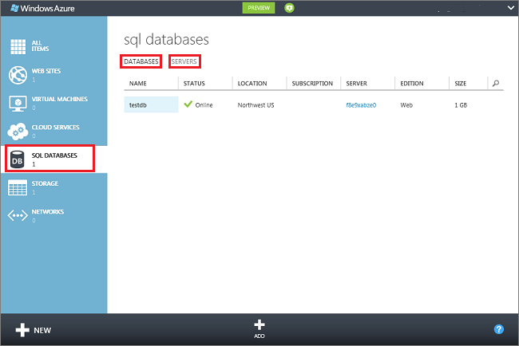
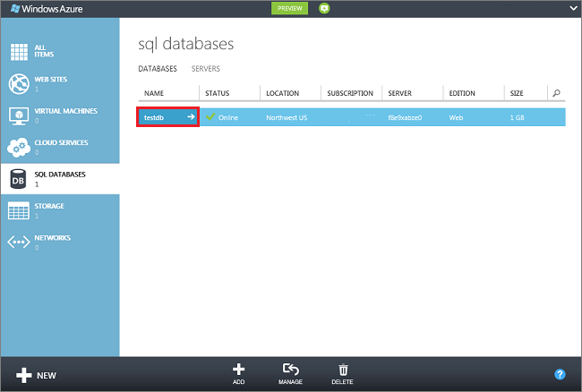

<properties linkid="develop-php-sql-database" urlDisplayName="SQL Database" pageTitle="How to use SQL Database (PHP) - Azure feature guides" metaKeywords="Azure SQL Database PHP, SQL Database PHP" description="Learn how to create and connect to an Azure SQL Database from PHP." metaCanonical="" services="sql-database" documentationCenter="PHP" title="How to Access Azure SQL Database from PHP" authors="waltpo" solutions="" manager="bjsmith" editor="mollybos" videoId="" scriptId="" />

Acceso a una base de datos SQL de Azure desde PHP
=================================================

Esta guía le mostrará los aspectos básicos del uso de Base de datos SQL de Azure desde PHP. Los ejemplos están escritos en PHP. Entre los escenarios descritos se incluyen la **creación de una base de datos SQL** y la **conexión a una base de datos SQL**. Abordaremos la creación de una base de datos SQL desde el [Portal de administración](https://manage.windowsazure.com). Para obtener información sobre la realización de estas tareas desde el portal de producción, consulte [Getting Started with PHP and SQL Database](http://blogs.msdn.com/b/brian_swan/archive/2010/02/12/getting-started-with-php-and-sql-azure.aspx). Para obtener más información, consulte la sección [Pasos siguientes](#NextSteps).

Qué es una Base de datos SQL de Azure
-------------------------------------

Una Base de datos SQL de Azure proporciona un sistema de administración de bases de datos relacionales para Azure y se basa en la tecnología de SQL Server. Con una Base de datos SQL se pueden aprovisionar e implementar soluciones de bases de datos relacionales en la nube con toda facilidad, así como beneficiarse de un centro de datos distribuido que ofrece disponibilidad, escalabilidad y seguridad de clase empresarial con las ventajas de contar con funciones de protección de datos y recuperación automática integradas.

Tabla de contenido
------------------

-   [Conceptos](#Concepts)
-   [Configuración del entorno](#Setup)
-   [Creación de una Base de datos SQL](#CreateServer)
-   [Obtención de información de conexión de la Base de datos SQL](#ConnectionInfo)
-   [Conexión a una instancia de Base de datos SQL](#Connect)
-   [Pasos siguientes](#NextSteps)

Conceptos
---------

Puesto que Base de datos SQL de Azure se basa en las tecnologías de SQL Server, el acceso a Base de datos SQL desde PHP es muy similar al acceso de SQL Server desde PHP. Puede desarrollar una aplicación localmente (con SQL Server) y, a continuación, conectarse a Base de datos SQL cambiando solo la cadena de conexión. Sin embargo, existen algunas diferencias entre Base de datos SQL y SQL Server que podrían afectar a su aplicación. Para obtener más información, consulte [Instrucciones y limitaciones (Base de datos SQL de Azure)](http://msdn.microsoft.com/en-us/library/windowsazure/ff394102.aspx).

El enfoque recomendado para obtener acceso a Base de datos SQL desde PHP es usar [Microsoft Drivers for PHP for SQL Server](http://www.microsoft.com/download/en/details.aspx?id=20098). Los ejemplos de este artículo usarán estos controladores. Los controladores de Microsoft para PHP para SQL Server funcionan solo en Windows.

Configuración del entorno
-------------------------

La forma recomendada de configurar el entorno de desarrollo es usar el [instalador de plataforma web de Microsoft](http://go.microsoft.com/fwlink/?LinkId=253447). El instalador de plataforma web le permitirá seleccionar elementos de la plataforma de desarrollo web e instalarlos y configurarlos automáticamente. Si descarga el instalador de plataforma web y selecciona instalar WebMatrix, PHP para WebMatrix y SQL Server Express, se configurará un entorno de desarrollo completo.

También puede configurar el entorno manualmente:

-   Instalación de PHP y configuración de IIS: <http://php.net/manual/en/install.windows.iis7.php>.
-   Descarga e instalación de SQL Server Express: <http://www.microsoft.com/en-us/download/details.aspx?id=29062>
-   Descarga e instalación de los controladores de Microsoft para PHP para SQL Server: <http://php.net/manual/en/sqlsrv.requirements.php>.

Creación de una Base de datos SQL
---------------------------------

Siga estos pasos para crear una base de datos SQL de Azure:

1.  Inicie sesión en el [Portal de administración](https://manage.windowsazure.com).
2.  Haga clic en **New** en la parte inferior izquierda del portal.

    

3.  Haga clic en **DATA SERVICES**, en **BASE DE DATOS SQL** y, a continuación, en **CUSTOM CREATE**.

    

4.  Escriba el valor **NAME** de la base de datos, seleccione el tipo de **EDITION** (WEB o BUSINESS), el valor **MAX SIZE** de la base de datos, la clase de **COLLATION** y, por último, seleccione **NEW SQL Database Server**. Haga clic en la flecha que aparece en la parte inferior del cuadro de diálogo. (Tenga en cuenta que si ha creado una Base de datos SQL anteriormente, puede elegir un servidor ya existente en la lista desplegable **Choose a server**).

    

5.  Especifique un nombre y una contraseña de administrador (y confirme la contraseña), elija la región donde se creará la Base de datos SQL y active la casilla `Allow Azure Services to access the server`.

    

Para ver la información del servidor y de la base de datos, haga clic en la opción **SQL Databases** del Portal de administración. A continuación, puede hacer clic en **DATABASES** o **SERVERS** para ver la información pertinente.

Obtención de información de conexión de la Base de datos SQL
------------------------------------------------------------

Para obtener información de conexión de la Base de datos SQL, haga clic en la opción **SQL DATABASES** del portal y, después, en el nombre de la base de datos.

A continuación, haga clic en **View SQL Database connection strings for ADO.NET, ODBC, PHP, and JDBC**.

En la sección de PHP de la ventana que aparece, anote los valores de **SERVER**, **DATABASE** y **USERNAME**. La contraseña será la misma que se utilizó al crear la Base de datos SQL.

Conexión a a una instancia de Base de datos SQL
-----------------------------------------------

Los siguientes ejemplos muestran cómo usar las extensiones **SQLSRV** y **PDO\_SQLSRV** para conectarse a una Base de datos SQL denominada `testdb`. Necesitará la información obtenida en la sección anterior. Reemplace `SERVER_ID` por el ID de servidor de 10 dígitos (que son los 10 primeros caracteres del valor SERVER obtenido en la sección anterior) y asigne los valores correctos (nombre de usuario y contraseña) a las variables `$user` y `$pwd`.

##### SQLSRV

    $server = "tcp:<value de SERVER de la sección anterior>";
    $user = "<value de USERNAME de la sección anterior>"@SERVER_ID;
    $pwd = "contraseña";
    $db = "testdb";

    $conn = sqlsrv_connect($server, array("UID"=>$user, "PWD"=>$pwd, "Database"=>$db));

    if($conn === false){
        die(print_r(sqlsrv_errors()));
    }

##### PDO\_SQLSRV

    $server = "tcp:<value de SERVER de la sección anterior>";
    $user = "<value de USERNAME de la sección anterior>"@SERVER_ID;
    $pwd = "contraseña";
    $db = "testdb";

    try{
        $conn = new PDO( "sqlsrv:Server= $server ; Database = $db ", $user, $pwd);
        $conn->setAttribute( PDO::ATTR_ERRMODE, PDO::ERRMODE_EXCEPTION );
    }
    catch(Exception $e){
        die(print_r($e));
    }

Pasos siguientes
----------------

Como se ha mencionado anteriormente, el uso de Base de datos SQL es muy parecido al de SQL Server. Una vez que haya establecido una conexión a una Base de datos SQL (como se ha mostrado anteriormente), puede usar las API **SQLSRV** o **PDO\_SQLSRV** para la inserción, recuperación, actualización y eliminación de datos. Para obtener información sobre las API **SQLSRV** y **PDO\_SQLSRV**, consulte [Proveedor OLE DB de Microsoft para DB2 Versión 4.0](http://msdn.microsoft.com/en-us/library/dd638075(SQL.10).aspx). Sin embargo, existen algunas diferencias entre Base de datos SQL y SQL Server que podrían afectar a su aplicación. Para obtener más información, consulte [Instrucciones y limitaciones (Base de datos SQL de Azure)](http://msdn.microsoft.com/en-us/library/windowsazure/ff394102.aspx).

En &lt;https://github.com/WindowsAzure/azure-sdk-for-php-samples/tree/master/tasklist-sqlazure\> hay un ejemplo que indica cómo usar Base de datos SQL con PHP en Azure.

