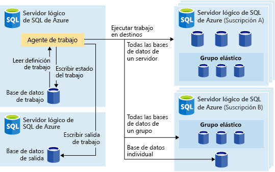
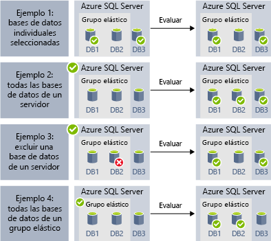
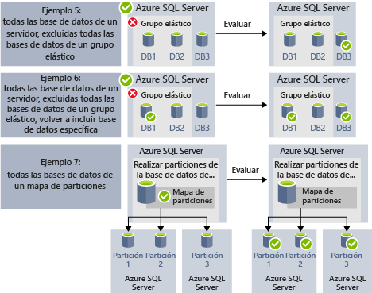
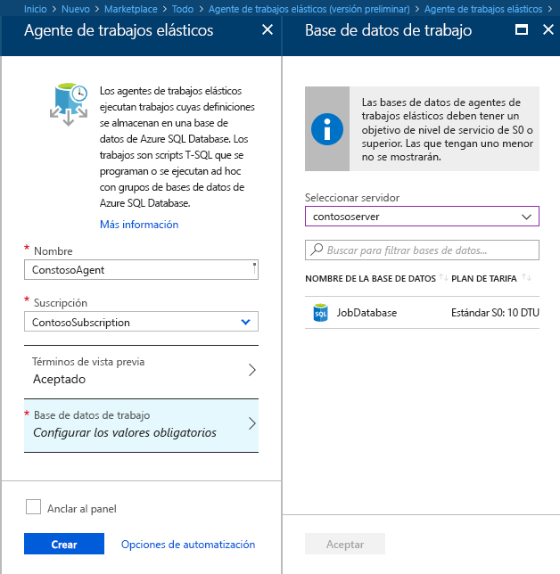
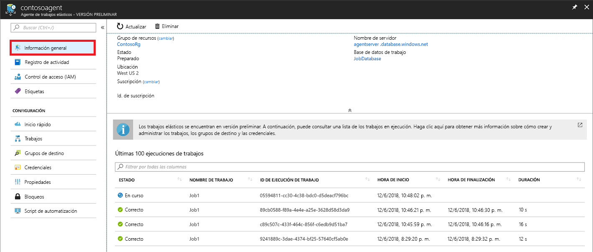

# <a name="manage-groups-of-databases-with-elastic-database-jobs"></a>Administración de grupos de bases de datos con trabajos de Elastic Database

Los **trabajos de Elastic Database** proporcionan la posibilidad de ejecutar uno o varios scripts de T-SQL en paralelo, en un gran número de bases de datos, bajo una programación o a petición.

**Ejecute trabajos en cualquier combinación de bases de datos**: una o más bases de datos individuales, todas las bases de datos de un servidor, todas las bases de datos de un grupo elástico o mapa de particiones, con la flexibilidad adicional de incluir o excluir cualquier base de datos específica. **Los trabajos se pueden ejecutar en varios servidores, en varios grupos e incluso en bases de datos de distintas suscripciones.** Los servidores y los grupos se enumeran dinámicamente en tiempo de ejecución, por lo que los trabajos se ejecutarán en todas las bases de datos que existan en el grupo de destino en el momento de la ejecución.

La siguiente imagen muestra a un agente de trabajos que ejecuta los trabajos en los diferentes tipos de grupos de destino:




## <a name="why-use-elastic-jobs"></a>¿Por qué usar trabajos elásticos?

### <a name="manage-many-databases"></a>Administración de muchas bases de datos

- Programación de tareas administrativas para su ejecución todos los días laborables, después de las horas laborables, etc.
- Implementación de cambios de esquema, administración de credenciales, recopilación de datos de rendimiento o recopilación de datos de telemetría de inquilinos (clientes). Actualización de datos de referencia (información común a todas las bases de datos).
- Regeneración de índices para mejorar el rendimiento de consultas. Configuración de trabajos para su ejecución en una colección de bases de datos periódicamente como, por ejemplo, fuera de horas pico.
- Recopile los resultados de consulta de un conjunto de bases de datos en una tabla central de forma continua. Las consultas de rendimiento pueden ejecutarse continuamente y configurarse para que desencadenen la ejecución de otras tareas.

### <a name="collect-data-for-reporting"></a>Recopilación de datos para informes

- Agregue datos de una colección de instancias de Azure SQL Database en una tabla de destino única.
- Ejecute consultas de procesamiento de datos de ejecución más larga en un conjunto grande de bases de datos; por ejemplo, la recopilación de telemetría de cliente. Los resultados se recopilan en una sola tabla de destino para su posterior análisis.

### <a name="reduce-overhead"></a>Reducción de la sobrecarga

- Normalmente, debe conectarse a cada base de datos de forma independiente para ejecutar instrucciones Transact-SQL o realizar otras tareas administrativas. Un trabajo controla la tarea de inicio de sesión en cada base de datos en el grupo de destino. También se definen, mantienen y conservan los scripts de Transact-SQL que se van a ejecutar en un grupo de instancias de Azure SQL Database.

### <a name="accounting"></a>Control

- Los trabajos registran el estado de ejecución de cada base de datos. Obtenga también el reintento automático en caso de errores.

### <a name="flexibility"></a>Flexibilidad

- Defina grupos personalizados de Azure SQL Database, así como programaciones para ejecutar un trabajo.


## <a name="elastic-job-components"></a>Componentes de los trabajos elásticos

|Componente  | Descripción (los detalles adicionales se encuentran debajo de la tabla) |
|---------|---------|
|[**Agente de trabajos elásticos**](#elastic-job-agent) |  El recurso de Azure creado para ejecutar y administrar los trabajos.   |
|[**Base de datos de trabajos**](#job-database)    |    Una instancia de SQL Azure Database que el agente de trabajos utiliza para almacenar datos relacionados con los trabajos, definiciones de trabajos, etc.      |
|[**Grupo de destino**](#target-group)      |  El conjunto de servidores, grupos, bases de datos y mapas de particiones en los que se va a ejecutar un trabajo.       |
|[**Trabajo**](#job)  |  Un trabajo es una unidad de trabajo que se compone de uno o varios [pasos de trabajo](#job-step). Los pasos de trabajo especifican el script de T-SQL que se va a ejecutar, así como otros detalles necesarios para ejecutar el script.  |


### <a name="elastic-job-agent"></a>Agente de trabajos elásticos

Un agente de trabajos elásticos es un recurso de Azure para crear, ejecutar y administrar trabajos. El agente de trabajos elásticos es un recurso de Azure que se crea en el portal ([PowerShell](elastic-jobs-powershell.md) y REST también se admiten). 

La creación de un **agente de trabajos elásticos** requiere una base de datos SQL existente. El agente configura esta base de datos existente como la [*base de datos de trabajos*](#job-database).

El agente de trabajos elásticos es gratis. La base de datos de trabajos se factura con la misma tarifa que cualquier base de datos SQL.

### <a name="job-database"></a>Base de datos de trabajos

La *base de datos de trabajos* se utiliza para definir los trabajos y realizar el seguimiento del estado e historial de las ejecuciones de los trabajos. La *base de datos de trabajos* también se utiliza para almacenar metadatos del agente, registros, resultados, definiciones de trabajos y también contiene muchos procedimientos almacenados útiles y otros objetos de base de datos para crear, ejecutar y administrar trabajos mediante T-SQL.

En la versión preliminar actual, es necesaria una instancia de Azure SQL Database (S0 o superior) para crear un agente de trabajos elásticos.

El *base de datos de trabajos* no necesita ser nueva literalmente, pero debe estar vacía y pertenecer al nivel de servicio S0 o superior. El nivel de servicio recomendado de la *base de datos de trabajos* es S1 o superior, pero realmente depende de las necesidades de rendimiento de sus trabajos: número de pasos de trabajo, número de veces y con qué frecuencia se ejecutan los trabajos. Por ejemplo, una base de datos S0 puede ser suficiente para un agente de trabajos que solo ejecuta algunos trabajos por hora, pero para la ejecución de un trabajo cada minuto podría no ser lo suficientemente eficiente y podría ser mejor un mayor nivel de servicio.


#### <a name="job-database-permissions"></a>Permisos de la base de datos de trabajos

Durante la creación del agente de trabajos, se crean un esquema, tablas y un rol llamado *jobs_reader* en la *base de datos de trabajos*. El rol se crea con los permisos siguientes y está diseñado para proporcionar a los administradores un mayor control de acceso para la supervisión de trabajos:


|Nombre de rol  |permisos del esquema "jobs"  |permisos del esquema "jobs_internal"  |
|---------|---------|---------|
|**jobs_reader**     |    SELECT     |    None     |

> [!IMPORTANT]
> Tenga en cuenta las implicaciones de seguridad antes de conceder acceso a la *base de datos de trabajos* como un administrador de base de datos. Un usuario malintencionado con permisos para crear o editar trabajos puede crear o modificar un trabajo que utiliza una credencial almacenada para conectarse a una base de datos bajo el control del usuario malintencionado, lo que podría permitir que el usuario malintencionado determinara la contraseña de la credencial.


### <a name="target-group"></a>Grupo de destino

Un *grupo de destino* define el conjunto de bases de datos en las que se ejecutará un paso de trabajo. Un grupo de destino puede contener cualquier número y combinación de los siguientes elementos:

- **Servidor de Azure SQL**: si se especifica un servidor, todas las bases de datos que existen en el servidor en el momento de la ejecución del trabajo forman parte del grupo. Se debe proporcionar la credencial de la base de datos maestra para que el grupo se pueda enumerar y actualizar antes de la ejecución del trabajo.
- **Grupo elástico**: si se especifica un grupo elástico, todas las bases de datos que se encuentran en el grupo elástico en el momento de la ejecución del trabajo forman parte del grupo. Igual que para un servidor, se debe proporcionar la credencial de la base de datos maestra para que el grupo se pueda actualizar antes de la ejecución del trabajo.
- **Base de datos individual**: especifique una o más bases de datos individuales que van a formar parte del grupo.
- **Mapa de particiones**: bases de datos de un mapa de particiones.

> [!TIP]
> En el momento de la ejecución del trabajo,la *enumeración dinámica* vuelve a evaluar el conjunto de bases de datos de los grupos de destino que incluyan servidores o grupos. La enumeración dinámica garantiza que los **trabajos se ejecutan en todas las bases de datos que existen en el servidor o grupo de servidores en el momento de la ejecución del trabajo**. Volver a evaluar la lista de bases de datos en tiempo de ejecución es específicamente útil en escenarios donde la pertenencia al grupo o servidor cambia con frecuencia.

Los grupos y bases de datos individuales se pueden especificar como incluidas o excluidas del grupo. Esto permite crear un grupo de destino con cualquier combinación de bases de datos. Por ejemplo, puede agregar un servidor a un grupo de destino, pero excluir bases de datos específicas de un grupo elástico (o excluir un grupo completo).

Un grupo de destino puede incluir bases de datos de varias suscripciones y de varias regiones. Tenga en cuenta que las ejecuciones entre regiones tienen una latencia mayor que las ejecuciones en la misma región.

Los ejemplos siguientes muestran cómo se enumeran dinámicamente distintas definiciones de grupo de destino en el momento de la ejecución del trabajo para determinar en qué bases de datos se ejecutará el trabajo:



El **Ejemplo 1** muestra un grupo de destino que consta de una lista de bases de datos individuales. Cuando se ejecuta un paso de trabajo con este grupo de destino, la acción del paso de trabajo se ejecutará en cada una de esas bases de datos.<br>
El **Ejemplo 2** muestra un grupo de destino que contiene un servidor de Azure SQL Server como destino. Cuando se ejecuta un paso de trabajo con este grupo de destino, el servidor se enumera de forma dinámica para determinar la lista de bases de datos que existen actualmente en el servidor. La acción del paso de trabajo se ejecutará en cada una de esas bases de datos.<br>
El **Ejemplo 3** muestra un grupo de destino similar al del *Ejemplo 2*, pero se excluye específicamente una base de datos individual. La acción del paso de trabajo *no* se ejecutará en la base de datos excluida.<br>
El **Ejemplo 4** muestra un grupo de destino que contiene un grupo elástico como destino. De forma similar al *Ejemplo 2*, el grupo se enumerará dinámicamente en tiempo de ejecución del trabajo para determinar la lista de bases de datos del grupo.
<br><br>




El **Ejemplo 5** y el *Ejemplo 6* muestran escenarios avanzados en los que se pueden combinar servidores de Azure SQL, grupos elásticos y bases de datos con reglas de inclusión y exclusión.<br>
En el **Ejemplo 7** se muestra que las particiones de un mapa de particiones también se pueden evaluar en tiempo de ejecución del trabajo.

### <a name="job"></a>Trabajo

Un *trabajo* es una unidad de trabajo que se ejecuta según una programación o como un trabajo de una sola vez. Un trabajo consta de uno o varios *pasos de trabajo*.

#### <a name="job-step"></a>Paso de trabajo

Cada paso de trabajo especifica un script de T-SQL que se va a ejecutar, uno o varios grupos de destino en los que se va a ejecutar el script de T-SQL y las credenciales que necesita el agente de trabajos para conectarse a la base de datos de destino. Cada paso de trabajo tiene directivas de tiempo de espera y de reintento personalizables y, opcionalmente, puede especificar parámetros de salida.

#### <a name="job-output"></a>Salida del trabajo

El resultado de los pasos de un trabajo en cada base de datos de destino se registra en detalle y se puede capturar la salida del script en una tabla especificada. Puede especificar una base de datos para guardar los datos devueltos de un trabajo.

#### <a name="job-history"></a>Historial de trabajos

El historial de ejecución de los trabajos se almacena en la *base de datos de trabajos*. Un trabajo de limpieza del sistema purga el historial de ejecución anterior a 45 días. Para eliminar el historial de menos de 45 días de antigüedad, llame al procedimiento almacenado **sp_purge_history** de la *base de datos de trabajos*.

## <a name="workflow-to-create-configure-and-manage-jobs"></a>Flujo de trabajo para crear, configurar y administrar trabajos

### <a name="create-and-configure-the-agent"></a>Creación y configuración del agente

1. Cree o identifique una base de datos SQL vacía S0 o superior. Se usará como la *base de datos de trabajos* durante la creación del agente de trabajos elásticos.
2. Cree un agente de trabajos elásticos en el [portal](https://portal.azure.com/#create/Microsoft.SQLElasticJobAgent) o con [PowerShell](elastic-jobs-powershell.md#create-the-elastic-job-agent).

   

### <a name="create-run-and-manage-jobs"></a>Creación, ejecución y administración de trabajos

1. Cree una credencial para la ejecución del trabajo en la *base de datos de trabajos* con [PowerShell](elastic-jobs-powershell.md#create-job-credentials-so-that-jobs-can-execute-scripts-on-its-targets) o [T-SQL](elastic-jobs-tsql.md#create-a-credential-for-job-execution).
2. Defina el grupo de destino (las bases de datos en las que desea ejecutar el trabajo) mediante [PowerShell](elastic-jobs-powershell.md#define-the-target-databases-you-want-to-run-the-job-against) o [T-SQL](elastic-jobs-tsql.md#create-a-target-group-servers).
3. Cree una credencial del agente de trabajos en cada base de datos en las que debe ejecutarse el trabajo [(agregue el usuario (o el rol) a cada base de datos del grupo)](https://docs.microsoft.com/azure/sql-database/sql-database-control-access). Para obtener un ejemplo, consulte el [tutorial de PowerShell](elastic-jobs-powershell.md#create-job-credentials-so-that-jobs-can-execute-scripts-on-its-targets).
4. Cree un trabajo mediante [PowerShell](elastic-jobs-powershell.md#create-a-job) o [T-SQL](elastic-jobs-tsql.md#deploy-new-schema-to-many-databases).
5. Agregue pasos de trabajo mediante [PowerShell](elastic-jobs-powershell.md#create-a-job-step) o [T-SQL](elastic-jobs-tsql.md#deploy-new-schema-to-many-databases).
6. Ejecute un trabajo mediante [PowerShell](elastic-jobs-powershell.md#run-the-job) o [T-SQL](elastic-jobs-tsql.md#begin-ad-hoc-execution-of-a-job).
7. Supervise el estado de ejecución del trabajo mediante el portal, [PowerShell](elastic-jobs-powershell.md#monitor-status-of-job-executions) o [T-SQL](elastic-jobs-tsql.md#monitor-job-execution-status).

   

## <a name="credentials-for-running-jobs"></a>Credenciales para la ejecución de trabajos

Los trabajos usan [credenciales de ámbito de base de datos](/sql/t-sql/statements/create-database-scoped-credential-transact-sql) para conectarse a las bases de datos que especifica el grupo de destino en la ejecución. Si un grupo de destino contiene servidores o grupos, estas credenciales de ámbito de base de datos se utilizan para conectarse a la base de datos maestra para enumerar las bases de datos disponibles.

La configuración de las credenciales adecuadas para ejecutar un trabajo puede ser un poco confusa, por lo que debe tener en cuenta los puntos siguientes:

- Las credenciales de ámbito de base de datos se deben crear en la *base de datos del trabajo*.
- **Todas las bases de datos de destino deben tener un inicio de sesión con [permisos suficientes](https://docs.microsoft.com/sql/relational-databases/security/permissions-database-engine) para que el trabajo se complete correctamente** (jobuser en el siguiente diagrama).
- Se espera que las credenciales se reutilicen en los trabajos y las contraseñas de las credenciales se cifran y protegen para los usuarios que tienen acceso de solo lectura a los objetos del trabajo.

La siguiente imagen está diseñada para ayudar a comprender y configurar las credenciales del trabajo adecuadas. **Recuerde que debe crear el usuario en cada base de datos (todas las *bases de datos de usuario de destino*) en las que se debe ejecutar el trabajo**.


## <a name="security-best-practices"></a>Prácticas recomendadas de seguridad

Algunas consideraciones sobre procedimientos recomendados para trabajar con trabajos elásticos:

- Limitar el uso de las API a las personas de confianza.
- Las credenciales deben tener los privilegios mínimos necesarios para realizar el paso de trabajo. Para más información, consulte [Autorización y permisos de SQL Server](https://docs.microsoft.com/dotnet/framework/data/adonet/sql/authorization-and-permissions-in-sql-server).
- Cuando se utiliza un servidor o un miembro del grupo de destino, se recomienda crear una credencial independiente con derechos en la base de datos maestra para ver y enumerar las bases de datos, que se utiliza para expandir las listas de bases de datos de los servidores o grupos antes de la ejecución del trabajo.


## <a name="agent-performance-capacity-and-limitations"></a>Rendimiento, capacidad y limitaciones del agente

Los trabajos elásticos utilizan recursos de proceso mínimos mientras se espera hasta que los trabajos de larga ejecución finalicen.

Dependiendo del tamaño del grupo de destino de las bases de datos y el tiempo de ejecución deseado para un trabajo (número de trabajadores simultáneos), el agente requiere distintas cantidades de proceso y rendimiento de la *base de datos de trabajos* (cuantos más destinos y número de trabajos, mayor será la cantidad de proceso necesaria).

Actualmente, la versión preliminar está limitada a 100 trabajos simultáneos.

### <a name="prevent-jobs-from-reducing-target-database-performance"></a>Evitar que los trabajos reduzcan el rendimiento de la base de datos de destino

Para asegurarse de que los recursos no están sobrecargados al ejecutar trabajos en las bases de datos de un grupo elástico de SQL, los trabajos se pueden configurar para limitar el número de bases de datos en las que puede ejecutarse un trabajo al mismo tiempo.

##  <a name="differences-between-elastic-jobs-and-sql-server-agent"></a>Diferencias entre los trabajos elásticos y el Agente SQL Server

Cabe destacar un par de diferencias entre el Agente SQL Server (disponible de modo local y como parte de SQL Database Managed Instance) y el agente de trabajos elásticos de Azure SQL Database (ahora disponible para SQL Database y SQL Data Warehouse).


|  |Trabajos elásticos  |Agente SQL Server |
|---------|---------|---------|
|Ámbito     |  Cualquier número de almacenamientos de datos o bases de datos SQL de Azure en la misma nube de Azure que el agente de trabajos. Los destinos pueden estar en diferentes servidores lógicos, suscripciones o regiones. <br><br>Los grupos de destino pueden estar compuestos de bases de datos individuales o almacenamientos de datos o de todas las bases de datos de un servidor, grupo o mapa de particiones (enumeradas dinámicamente en el momento de la ejecución de trabajo). | Cualquier base de datos individual en la misma instancia de SQL Server que el Agente SQL. |
|Herramientas y API admitidas     |  Azure Portal, PowerShell, T-SQL, Azure Resource Manager      |   T-SQL, SQL Server Management Studio (SSMS)     |


## <a name="best-practices-for-creating-jobs"></a>Procedimientos recomendados para crear trabajos

### <a name="idempotent-scripts"></a>Scripts idempotentes
Los scripts de T-SQL de un trabajo deben ser [idempotentes](https://en.wikipedia.org/wiki/Idempotence). **Idempotente** significa que si el script se ejecuta correctamente y se vuelve a ejecutar, produce el mismo resultado. Un script puede producir errores debido a problemas de red transitorios. En ese caso, el trabajo volverá a intentar ejecutar automáticamente el script un número de veces predefinido antes de desistir. Un script idempotente produce el mismo resultado aunque se ejecute correctamente dos veces (o más).

Una táctica sencilla es probar la existencia de un objeto antes de crearlo.


```sql
IF NOT EXIST (some_object)
    -- Create the object
    -- If it exists, drop the object before recreating it.
```

De forma similar, un script debe ser capaz de comprobar lógicamente y contrarrestar las condiciones que encuentre para ejecutarse correctamente.


## <a name="next-steps"></a>Pasos siguientes

- [Creación y administración de trabajos elásticos mediante PowerShell](elastic-jobs-powershell.md)
- [Creación y administración de trabajos elásticos mediante Transact-SQL (T-SQL)](elastic-jobs-tsql.md)