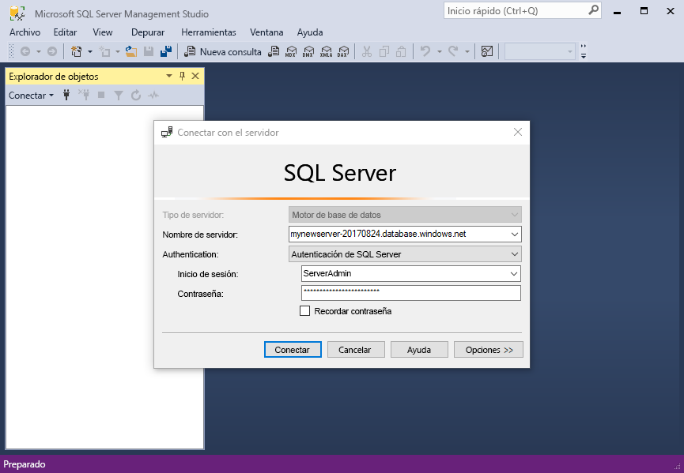
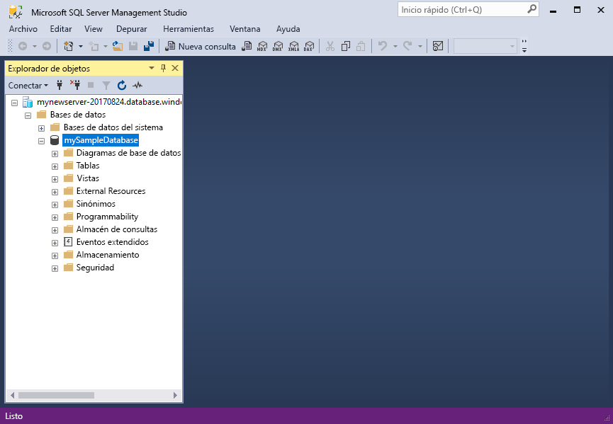

# <a name="quickstart-azure-sql-database-use-sql-server-management-studio-to-connect-and-query-data"></a>Guía de inicio rápido: Azure SQL Database: uso de SQL Server Management Studio para conectarse a los datos y realizar consultas en ellos

[SQL Server Management Studio][ssms-install-latest-84g] (SSMS) es un entorno integrado para administrar cualquier infraestructura de SQL, desde SQL Server hasta SQL Database para Microsoft Windows. Este inicio rápido muestra cómo usar SSMS para conectarse a una base de datos de SQL Azure Database, para después usar las instrucciones Transact-SQL para consultar, insertar, actualizar y eliminar datos en la base de datos. 

## <a name="prerequisites"></a>Requisitos previos

En esta guía de inicio rápido se utilizan como punto de partida los recursos creados en una de las siguientes guías:

[!INCLUDE [prerequisites-create-db](../../includes/sql-database-connect-query-prerequisites-create-db-includes.md)]

Esta guía de inicio rápido también exige configurar una regla de firewall de nivel de servidor. Para consultar una guía de inicio rápido en donde se muestra cómo hacerlo, vea [Create server-level firewall rule](sql-database-get-started-portal-firewall.md) (Crear regla de firewall de nivel de servidor).

#### <a name="install-the-latest-ssms"></a>Instalación del SSMS más reciente

Antes de empezar, asegúrese de que ha instalado la versión más reciente de [SSMS][ssms-install-latest-84g]. 

## <a name="sql-server-connection-information"></a>Información de conexión de SQL server

[!INCLUDE [prerequisites-server-connection-info](../../includes/sql-database-connect-query-prerequisites-server-connection-info-includes.md)]

## <a name="connect-to-your-database"></a>Conectarse a la base de datos

Use SQL Server Management Studio para establecer una conexión con un servidor de Azure SQL Database. 

> [!IMPORTANT]
> Un servidor lógico de Azure SQL Database escucha en el puerto 1433. Si intenta conectarse a un servidor lógico de Azure SQL Database desde dentro de un firewall corporativo, este puerto debe estar abierto en el firewall corporativo para poder conectarse correctamente.
>

1. Abra SQL Server Management Studio.

2. En el cuadro de diálogo **Conectar con el servidor**, especifique la siguiente información:

   | Configuración      | Valor sugerido    | DESCRIPCIÓN | 
   | ------------ | ------------------ | ----------- | 
   | **Tipo de servidor** | Motor de base de datos | Este valor es necesario. |
   | **Nombre del servidor** | Nombre completo del servidor | Dicho nombre debe parecerse al siguiente: **mynewserver20170313.database.windows.net**. |
   | **Autenticación** | Autenticación de SQL Server | Autenticación de SQL es el único tipo de autenticación que hemos configurado en este tutorial. |
   | **Inicio de sesión** | La cuenta de administrador del servidor | Es la cuenta que especificó cuando creó el servidor. |
   | **Contraseña** | La contraseña de la cuenta de administrador del servidor | Es la contraseña que especificó cuando creó el servidor. |
   ||||

     

3. Haga clic en **Opciones** en el cuadro de diálogo **Conectar con el servidor**. En la sección **Conectar con base de datos**, escriba **mySampleDatabase** para conectarse a esta base de datos.

     

4. Haga clic en **Conectar**. Se abre la ventana del Explorador de objetos en SSMS. 

     

5. En el Explorador de objetos, expanda **Bases de datos** y, después, expanda **mySampleDatabase** para ver los objetos de la base de datos de ejemplo.

## <a name="query-data"></a>Datos de consulta

Utilice el código siguiente para consultar los 20 primeros productos por categoría con la instrucción Transact-SQL [SELECT](https://msdn.microsoft.com/library/ms189499.aspx).

1. En el Explorador de objetos, haga clic con el botón derecho en **mySampleDatabase** y luego en **Nueva consulta**. Se abre una ventana de consulta en blanco que está conectada a la base de datos.
2. En la ventana Consulta, escriba la consulta siguiente:

   ```sql
   SELECT pc.Name as CategoryName, p.name as ProductName
   FROM [SalesLT].[ProductCategory] pc
   JOIN [SalesLT].[Product] p
   ON pc.productcategoryid = p.productcategoryid;
   ```

3. En la barra de herramientas, haga clic en **Ejecutar** para recuperar datos de las tablas Product y ProductCategory.

    

## <a name="insert-data"></a>Insertar datos

Utilice el código siguiente para insertar un nuevo producto en la tabla SalesLT.Product con la instrucción Transact-SQL [INSERT](https://msdn.microsoft.com/library/ms174335.aspx).

1. En la ventana Consulta, reemplace la consulta anterior con la siguiente consulta:

   ```sql
   INSERT INTO [SalesLT].[Product]
           ( [Name]
           , [ProductNumber]
           , [Color]
           , [ProductCategoryID]
           , [StandardCost]
           , [ListPrice]
           , [SellStartDate]
           )
     VALUES
           ('myNewProduct'
           ,123456789
           ,'NewColor'
           ,1
           ,100
           ,100
           ,GETDATE() );
   ```

2. En la barra de herramientas, haga clic en **Ejecutar** para insertar una nueva fila en la tabla Product.

    

## <a name="update-data"></a>Actualización de datos

Utilice el código siguiente para actualizar el nuevo producto que ha agregado anteriormente con la instrucción Transact-SQL [UPDATE](https://msdn.microsoft.com/library/ms177523.aspx).

1. En la ventana Consulta, reemplace la consulta anterior con la siguiente consulta:

   ```sql
   UPDATE [SalesLT].[Product]
   SET [ListPrice] = 125
   WHERE Name = 'myNewProduct';
   ```

2. En la barra de herramientas, haga clic en **Ejecutar** para actualizar la fila especificada en la tabla Product.

    

## <a name="delete-data"></a>Eliminación de datos

Utilice el código siguiente para eliminar el nuevo producto que ha agregado anteriormente con la instrucción Transact-SQL [DELETE](https://msdn.microsoft.com/library/ms189835.aspx).

1. En la ventana Consulta, reemplace la consulta anterior con la siguiente consulta:

   ```sql
   DELETE FROM [SalesLT].[Product]
   WHERE Name = 'myNewProduct';
   ```

2. En la barra de herramientas, haga clic en **Ejecutar** para eliminar la fila especificada en la tabla Product.

    

## <a name="next-steps"></a>Pasos siguientes

- Para más información acerca de SSMS, consulte [Uso de SQL Server Management Studio](https://msdn.microsoft.com/library/ms174173.aspx).
- Para conectarse y consultar mediante Azure Portal, consulte [Conexión y consulta con el editor de consultas SQL de Azure Portal](sql-database-connect-query-portal.md).
- Para conectarse y consultar con Visual Studio, vea [Conexión y consultas con Visual Studio Code](sql-database-connect-query-vscode.md).
- Para conectarse y consultar con .NET, vea [Conexión y consultas con .NET](sql-database-connect-query-dotnet.md).
- Para conectarse y consultar con PHP, vea [Conexión y consultas con PHP](sql-database-connect-query-php.md).
- Para conectarse y consultar con Node.js, vea [Conexión y consultas con Node.js](sql-database-connect-query-nodejs.md).
- Para conectarse y consultar con Java, vea [Conexión y consultas con Java](sql-database-connect-query-java.md).
- Para conectarse y consultar con Python, vea [Conexión y consultas con Python](sql-database-connect-query-python.md).
- Para conectarse y consultar con Ruby, vea [Conexión y consultas con Ruby](sql-database-connect-query-ruby.md).


<!-- Article link references. -->

[ssms-install-latest-84g]: https://docs.microsoft.com/sql/ssms/sql-server-management-studio-ssms

