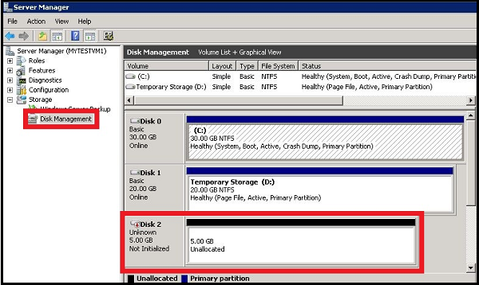

<properties 
	pageTitle="Acoplamiento de un disco a una máquina virtual | Azure" 
	description="Aprenda como acoplar un disco de datos a una máquina virtual de Azure y a inicializarla para que esté lista para utilizarse." 
	services="virtual-machines, storage" 
	documentationCenter="" 
	authors="KBDAzure" 
	manager="timlt" 
	editor="tysonn"/>

<tags 
	ms.service="virtual-machines" 
	ms.workload="infrastructure-services" 
	ms.tgt_pltfrm="vm-windows" 
	ms.devlang="na" 
	ms.topic="article" 
	ms.date="01/20/2015" 
	ms.author="kathydav"/>

#Acoplamiento de un disco de datos a una máquina virtual de Windows

Puede acoplar tanto discos vacíos como discos que contienen datos. En ambos casos, se trata realmente de archivos .vhd que residen en una cuenta de almacenamiento de Azure. También en ambos casos, una vez acoplado el disco, tendrá que inicializarlo para que esté listo para utilizarse. 

> [AZURE.NOTE] Es recomendable usar uno o varios discos independientes para almacenar los datos de una máquina virtual. Al crear una máquina virtual de Azure, esta cuenta con un disco para el sistema operativo asignado a la unidad C y un disco temporal asignado a la unidad D. **No use la unidad D para almacenar datos.** Como señala su nombre, esta ofrece únicamente almacenamiento temporal. No ofrece redundancia o copias de seguridad porque no reside en el almacenamiento de Azure.

- [Uso de un disco vacío](#attachempty)
- [Uso de un disco existente](#attachexisting)
- [Uso de un nuevo disco de datos en Windows Server](#initializeinWS)

[AZURE.INCLUDE [howto-attach-disk-windows-linux](../includes/howto-attach-disk-windows-linux.md)]

##Procedimiento: un nuevo disco de datos en Windows Server

1. Conexión a una máquina virtual. Para obtener instrucciones, consulte [Inicio de sesión en una máquina virtual con Windows Server][logon].

2. Una vez que haya iniciado sesión, abra **Server Manager**, en el panel izquierdo, expanda **Almacenamiento** y, a continuación, haga clic en **Disk Management**.

	

3. Haga clic con el botón secundario en **Disco 2**, haga clic en **Inicializar disco** y, a continuación, haga clic en **Aceptar**.

	

4. Haga clic con el botón secundario en el área de asignación de espacio para el Disco 2, haga clic en **New Simple Volume** y, a continuación, finalice el asistente con los valores predeterminados.
 

	

[logon]: ../virtual-machines-log-on-windows-server/

	El disco está ahora en línea y listo para usarse con una nueva letra de unidad.

	

> [AZURE.NOTE] La cantidad máxima de discos que se pueden conectar a una máquina virtual es variable en función del tamaño de la máquina virtual. Por ejemplo, solo puede conectar 4 discos al estándar A2 estándar, pero puede conectar 32 discos al estándar D14 y 64 discos al estándar G5. Puede encontrar información detallada sobre cuántos discos se pueden conectar por tamaño de máquina virtual [aquí](https://msdn.microsoft.com/es-es/library/azure/dn197896.aspx).

<!--HONumber=42-->
