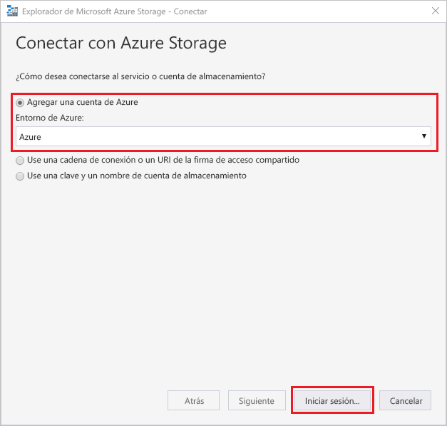
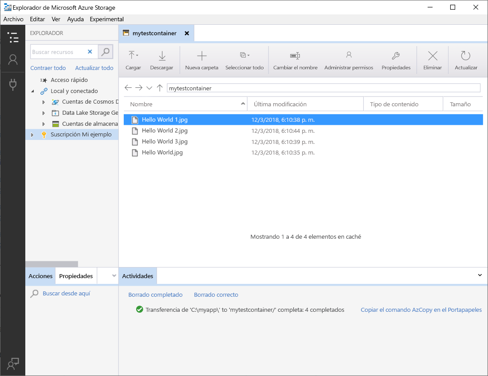

# Inicio rápido: Uso del Explorador de Azure Storage para administrar los datos de una cuenta de Azure Data Lake Storage Gen2

En este inicio rápido, aprenderá a usar el [Explorador de Azure Storage](https://azure.microsoft.com/features/storage-explorer/) para crear un directorio y un blob. A continuación, aprenderá a descargar el blob en un equipo local y a ver todos los blobs en un directorio. También aprenderá a crear una instantánea de un blob, a administrar directivas de acceso al directorio y a crear una firma de acceso compartido.

## Requisitos previos

[!INCLUDE [storage-quickstart-prereq-include](../../../includes/storage-quickstart-prereq-include.md)]

Esta guía de inicio rápido requiere que se instale el Explorador de Azure Storage. Para instalar el Explorador de Azure Storage para Windows, Macintosh o Linux, consulte [Explorador de Azure Storage](https://azure.microsoft.com/features/storage-explorer/).

## Inicie sesión en el Explorador de Microsoft Azure Storage

La primera vez, se muestra la ventana **Explorador de Microsoft Azure Storage: Conectar**. Si bien el Explorador de Storage proporciona varias formas de conectarse a las cuentas de almacenamiento, actualmente solo se admite una para administrar las ACL.

|Tarea|Propósito|
|---|---|
|Agregar una cuenta de Azure | Le redirige a la página de inicio de sesión de las organizaciones para autenticarlo en Azure. Actualmente, es el único método de autenticación compatible si quiere administrar y establecer las ACL. |

Seleccione **Add an Azure Account** (Agregar una cuenta de Azure) y haga clic en **Iniciar sesión**. Siga las indicaciones de la pantalla para registrarse en su cuenta de Azure.

Cuando se completa la conexión, el Explorador de Microsoft Azure Storage se carga y se muestra la pestaña **Explorador**. Esta vista proporciona una visión general de todas sus cuentas de Azure Storage, así como del almacenamiento local configurado mediante el [Emulador de Microsoft Azure Storage](../common/storage-use-emulator.md?toc=%2fazure%2fstorage%2fblobs%2ftoc.json), las cuentas de [Cosmos DB](../../cosmos-db/storage-explorer.md?toc=%2fazure%2fstorage%2fblobs%2ftoc.json) o los entornos de [Azure Stack](../../azure-stack/user/azure-stack-storage-connect-se.md?toc=%2fazure%2fstorage%2fblobs%2ftoc.json).

## Creación de un sistema de archivos

Los blobs siempre se cargan en un directorio. Esto le permite organizar grupos de blobs de la misma forma que organiza archivos en carpetas en el equipo.

Para crear un directorio, expanda la cuenta de almacenamiento que creó en el paso anterior. Seleccione **Contenedor de blobs**, haga clic con el botón derecho y seleccione **Crear contenedor de blobs**. Escriba el nombre del sistema de archivos. Cuando haya finalizado, presione **Entrar** para crear el sistema de archivos. Una vez que el directorio de blobs se haya creado correctamente, se mostrará en la carpeta **Contenedor de blobs** de la cuenta de almacenamiento seleccionada.

## Carga de blobs en el directorio

Blob Storage admite blobs en bloques, blobs en anexos y blobs en páginas. Los archivos VHD utilizados para respaldar VM IaaS son blobs en páginas. Los blobs en anexos se utilizan para el registro, por ejemplo, cuando desea escribir en un archivo y luego sigue agregando más información. La mayoría de los archivos almacenados en Blob Storage son blobs en bloques.

En la cinta de opciones del directorio, seleccione **Cargar**. Esta operación da la opción de cargar un archivo o una carpeta.

Elija los archivos o carpetas para cargar. Seleccione el **tipo de blob**. Opciones aceptables son **Anexar**, **Paginar** o **Bloquear** blob.

Si carga un archivo .vhd o .vhdx, elija **Upload .vhd/.vhdx files as page blobs (recommended)** [Cargar archivos.vhd/.vhdx como blobs de páginas (recomendado)].

En el campo **Cargar en carpeta (opcional)**, un nombre de carpeta para almacenar los archivos o carpetas en una carpeta bajo el directorio. Si no se elige ninguna carpeta, los archivos se cargan directamente en el directorio.

Cuando se selecciona **Aceptar**, los archivos seleccionados se ponen en cola para cargar y se cargan de uno en uno. Una vez finalizada la carga, los resultados se muestran en la ventana **Actividades**.

## Visualización de blobs en un directorio

En la aplicación **Explorador de Azure Storage**, seleccione un directorio en una cuenta de almacenamiento. El panel principal muestra una lista de los blobs en el directorio seleccionado.

## Descargar blobs

Para descargar los blobs mediante el **Explorador de Microsoft Azure Storage**, con un blob seleccionado, seleccione **Descargar** desde la cinta de opciones. Se abre un cuadro de diálogo de archivo que permite escribir un nombre de archivo. Seleccione **Guardar** para iniciar la descarga de un blob en la ubicación local.

## Pasos siguientes

En esta guía de inicio rápido aprendió a transferir archivos entre un disco local y Azure Blob Storage mediante el **Explorador de Microsoft Azure Storage**. Para información sobre cómo establecer ACL en los archivos y directorios, siga hasta el artículo relacionado con ese tema.

> [!div class="nextstepaction"]
> [How to set ACLs on files and directories](data-lake-storage-how-to-set-permissions-storage-explorer.md) (Establecimiento de ACL en archivos y directorios)
