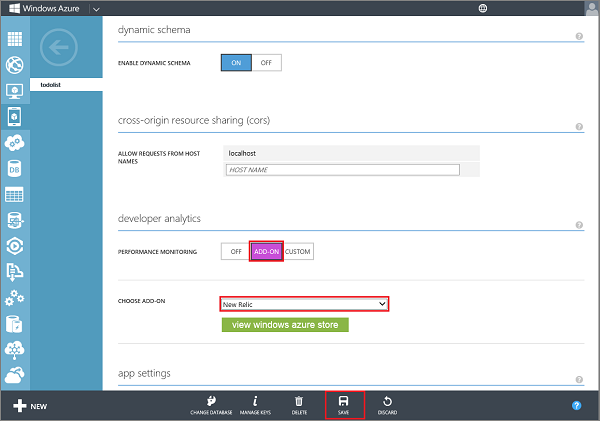
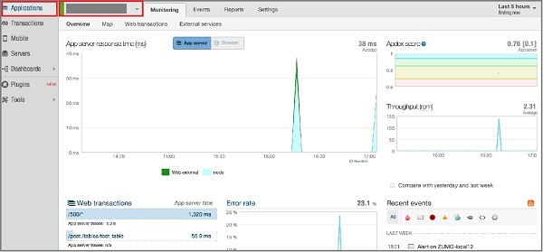

<properties linkid="mobile-services-monitor-new-relic" urlDisplayName="Use New Relic to monitor Mobile Services" pageTitle="Store server scripts in source control - Azure Mobile Services" metaKeywords="" description="Learn how to use the New Relic add-on to monitor your mobile service." metaCanonical="" disqusComments="1" umbracoNaviHide="0" documentationCenter="Mobile" title="Use New Relic to monitor Mobile Services" authors="" />

Uso de New Relic para supervisar Servicios móviles
==================================================

Este tema muestra cómo configurar el complemento New Relic de terceros para trabajar con Servicios móviles de Azure y proporcionar una supervisión mejorada del servicio móvil.

El tutorial le guiará a través de los siguientes pasos:

1.  [Suscripción en New Relic mediante el uso de la Tienda de Azure](#sign-up)
2.  [Instalación del módulo New Relic](#install-module)
3.  [Habilitación del análisis del desarrollador de New Relic para el servicio móvil](#enable-service)
4.  [Supervisión del servicio móvil en el panel de New Relic](#monitor)

Para completar este tutorial, ya debe haber creado un servicio móvil tras completar el tutorial [Introducción a los Servicios móviles](/en-us/develop/mobile/tutorials/get-started/) o [Introducción a los datos](/en-us/develop/mobile/tutorials/get-started-with-data-dotnet).

Suscripción en New Relic mediante el uso de la Tienda de Azure
--------------------------------------------------------------

El primer paso es comprar el servicio New Relic. Este tutorial le muestra cómo comprar este servicio desde la Tienda de Azure. Servicios móviles es compatible con las suscripciones de New Relic adquiridas fuera de la Tienda de Azure.

1.  Inicie sesión en el [Portal de administración de Azure](https://manage.windowsazure.com).

2.  En el panel inferior del portal de administración, haga clic en **New**.

3.  Haga clic en **Store**.

4.  En el cuadro de diálogo **Choose an Add-on**, seleccione **New Relic** y haga clic en **Next**.

5.  En el cuadro de diálogo **Personalize Add-on**, seleccione el nuevo plan de New Relic que desee.

6.  Indique el nombre que desea para el servicio de New Relic en la configuración de Azure o utilice el valor predeterminado de **NewRelic**. El nombre debe ser único en la lista de elementos suscritos de la Tienda de Azure.

7.  Elija un valor para la región; por ejemplo, **Oeste de EE. UU.**

8.  Haga clic en **Next**.

9.  En el cuadro de diálogo **Review Purchase**, revise la información del plan y de los precios, y consulte los términos legales. Si acepta los términos, haga clic en **Purchase**.

10. Después de haber hecho clic en **Purchase**, comenzará el proceso de creación de la cuenta de New Relic. Puede supervisar el estado en el Portal de administración de Azure.

Instalación del módulo New Relic
--------------------------------

Una vez que se haya suscrito al servicio New Relic, tiene que instalar el módulo New Relic Node.js en el servicio móvil. Debe tener el control del código fuente habilitado para el servicio móvil a fin de cargar este módulo.

1.  Si aún no lo ha hecho, siga los pasos del tutorial [Almacenamiento de scripts de servidor en control de código fuente](/en-us/develop/mobile/tutorials/store-scripts-in-source-control/) para habilitar el control de código fuente para el servicio móvil, clone el repositorio e instale [Node Package Manager (NPM)](http://nodejs.org/).

2.  Desplácese a la carpeta `.\service` del repositorio Git local y, a continuación, ejecute el siguiente comando desde el símbolo del sistema:

         npm install newrelic

    NPM instala el [módulo New Relic](https://npmjs.org/package/newrelic) (información en inglés) en el subdirectorio `\newrelic`.

3.  Abra una herramienta de línea de comandos Git, como **GitBash** (Windows) o **Bash** (Unix Shell) y escriba el siguiente comando en el símbolo del sistema de Git:

         $ git add .
         $ git commit -m "added newrelic module"
         $ git push origin master

    De esta forma, se carga un nuevo módulo `newrelic` en el servicio móvil.

A continuación, habilitará la supervisión de New Relic para el servicio móvil en el [Portal de administración](https://manage.windowsazure.com/).

Habilitación del análisis del desarrollador de New Relic para el servicio móvil
-------------------------------------------------------------------------------

1.  En el [Portal de administración](https://manage.windowsazure.com/), seleccione el servicio móvil y, a continuación, haga clic en la pestaña **Configure**.

    

2.  Desplácese a **Developer analytics** y realice uno de los procedimientos siguientes, según cómo haya efectuado la compra de la suscripción a New Relic:

    -   Compra en la Tienda de Azure:

        Haga clic en **Add-on**, seleccione el complemento New Relic de **Choose add-on** y, a continuación, haga clic en **Save**.

        

    -   Compra directamente desde New Relic:

        Haga clic en **Custom**, seleccione New Relic desde **Provider**, especifique la clave y, a continuación, haga clic en **Save**.

        

        La clave puede obtenerse desde el panel de New Relic.

3.  Una vez que se haya completado el registro, verá un nuevo valor en **App settings**:

    

Supervisión del servicio móvil en el panel de New Relic
-------------------------------------------------------

1.  Ejecute la aplicación de cliente para generar solicitudes de lectura, creación, actualización y eliminación del servicio móvil.

2.  Espere unos minutos para que se procesen los datos y, a continuación, desplácese al panel de New Relic.

    Cuando se haya adquirido la suscripción a New Relic como complemento, selecciónela en el [Portal de administración](https://manage.windowsazure.com/) y haga clic en **Manage**.

3.  En New Relic, haga clic en **Applications** y, a continuación, en el servicio móvil.

    

4.  Haga clic en **Web transactions** para ver las solicitudes recientes que acaba de realizar en el servicio móvil:

    

Pasos siguientes
----------------

-   Para obtener información sobre el precio, consulte la [página de New Relic en la Tienda de Azure](/en-us/gallery/store/new-relic/new-relic/).
-   Para obtener más información sobre el uso de New Relic, consulte [Applications Overview](https://docs.newrelic.com/docs/applications-dashboards/applications-overview) en la documentación de New Relic.

