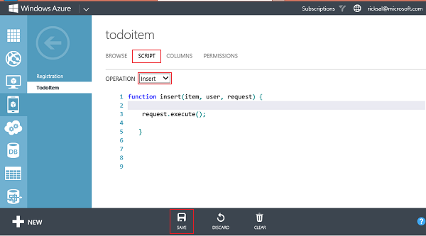

<properties linkid="develop-mobile-tutorials-send-email-with-sendgrid" urlDisplayName="Send Email Using SendGrid" pageTitle="Send email using SendGrid - Azure Mobile Services" metaKeywords="Azure SendGrid, SendGrid service, Azure emailing, mobile services email" description="Learn how to use the SendGrid service to send email from your Azure Mobile Services app." metaCanonical="" services="" documentationCenter="Mobile" title="Send email from Mobile Services with SendGrid" authors="" solutions="" manager="" editor="" />

Envío de correo electrónico desde Servicios móviles con SendGrid
================================================================

En este tema se describe cómo agregar la funcionalidad de correo electrónico al servicio móvil. En este tutorial se demuestra cómo agregar scripts del lado servidor para enviar correo electrónico mediante SendGrid. Cuando haya finalizado, el servicio móvil le enviará un correo electrónico cada vez que se inserte un registro.

SendGrid es un [servicio de correo electrónico basado en la nube](http://sendgrid.com/solutions) (en inglés) que proporciona un sistema fiable de [entrega de correos electrónicos transaccional](http://sendgrid.com/transactional-email) (en inglés), escalabilidad y análisis en tiempo real, además de API flexibles que facilitan la integración personalizada. Para obtener más información, consulte <http://sendgrid.com>.

Este tutorial le guiará a través de estos pasos básicos para habilitar la funcionalidad de correo electrónico:

1.  [Creación de una cuenta de SendGrid](#sign-up)
2.  [Incorporación de un script para enviar correo electrónico](#add-script)
3.  [Inserción de datos para recibir correo electrónico](#insert-data)

Este tutorial está basado en el inicio rápido de Servicios móviles. Antes de comenzar este tutorial, primero debe completar [Introducción a los Servicios móviles](/en-us/develop/mobile/tutorials/get-started).

Creación de una cuenta nuevaCreación de una cuenta nueva de SendGrid
--------------------------------------------------------------------

[WACOM.INCLUDE [sendgrid-sign-up](../includes/sendgrid-sign-up.md)]

Registro de un scriptRegistro de un script nuevo que envía correo electrónico
-----------------------------------------------------------------------------

1.  Inicie sesión en el [Portal de administración de Azure](https://manage.windowsazure.com/), haga clic en **Servicios móviles** y, a continuación, haga clic en el servicio móvil.

2.  En el Portal de administración, haga clic en la pestaña **Data** y, a continuación, en la tabla **TodoItem**.

    

3.  En **todoitem**, haga clic en la pestaña **Script** y seleccione **Insert**.

    

    Se muestra la función que se invoca cuando se produce una inserción en la tabla **TodoItem**.

4.  Reemplace la función de inserción por el código siguiente:

         var SendGrid = require('sendgrid').SendGrid;
            
         function insert(item, user, request) {    
             request.execute({
                 success: function() {
                     // Tras la inserción del registro, enviar la respuesta inmediatamente al cliente
                     request.respond();
                     // Enviar el correo electrónico en segundo plano
                     sendEmail(item);
                 }
             });

             function sendEmail(item) {
                 var sendgrid = new SendGrid('**username**', '**password**');       
                    
                 sendgrid.send({
                     to: '**email-address**',
                     from: '**from-address**',
                     subject: 'New to-do item',
                     text: 'A new to-do was added: ' + item.text
                 }, function(success, message) {
                     // Si se produce un problema al enviar el correo electrónico, regístrelo como error para que podamos investigarlo
                     if (!success) {
                         console.error(message);
                     }
                 });
             }
         }

5.  Reemplace los marcadores de posición del script anterior por los valores correctos:

    -   ***username* y *password***: Las credenciales de SendGrid definidas en el apartado [Creación de una cuenta de SendGrid](#sign-up).

    -   ***email-address***: La dirección a la que se envía el correo electrónico. En una aplicación en tiempo real, puede usar tablas para almacenar y recuperar direcciones de correo electrónico. Al probar la aplicación, use su propia dirección de correo electrónico.

    -   ***from-address***: La dirección de la que procede el correo electrónico. Considere usar una dirección de dominio registrada que pertenezca a su organización.

     **Nota:**

     Si no tiene un dominio registrado, en su lugar puede usar el dominio de su servicio móvil, con el formato **notifications@*your-mobile-service*.azure-mobile.net**. No obstante, se ignoran los mensajes enviados al dominio del servicio móvil.

6.  Haga clic en el botón **Save**. Ahora ha configurado un script para enviar un correo electrónico cada vez que se inserta un registro en la tabla **TodoItem**.

Inserción de datos de pruebaInserción de datos de prueba para recibir correo electrónico
----------------------------------------------------------------------------------------

1.  En el proyecto de la aplicación cliente, ejecute la aplicación de inicio rápido.

    En este tema se muestra la versión de inicio rápido de la Tienda Windows.

2.  En la aplicación, escriba un texto en **Insert a TodoItem** y, a continuación, haga clic en **Save**.

    

3.  Tenga en cuenta que recibirá un correo electrónico, como el que se muestra en la notificación siguiente.

    

    Enhorabuena, ha configurado correctamente el servicio móvil para enviar correo electrónico con SendGrid.

Pasos siguientes
----------------

Ahora que ya sabe lo fácil que resulta usar el servicio de correo electrónico SendGrid con Servicios móviles, siga estos vínculos para obtener más información acerca de SendGrid.

-   Documentación sobre la API de SendGrid <http://docs.sendgrid.com/documentation/api/>
-   Oferta especial de SendGrid para clientes de Azure: <http://sendgrid.com/azure.html>

