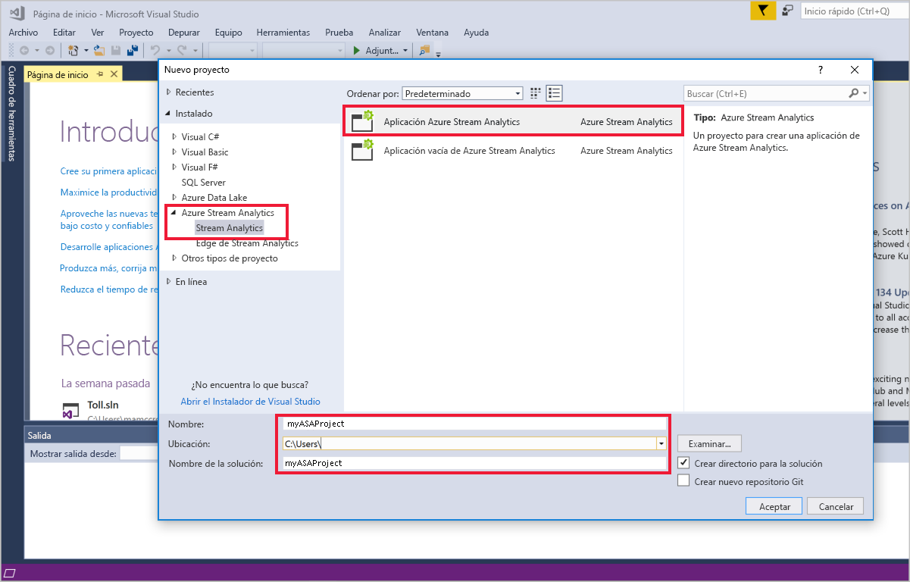
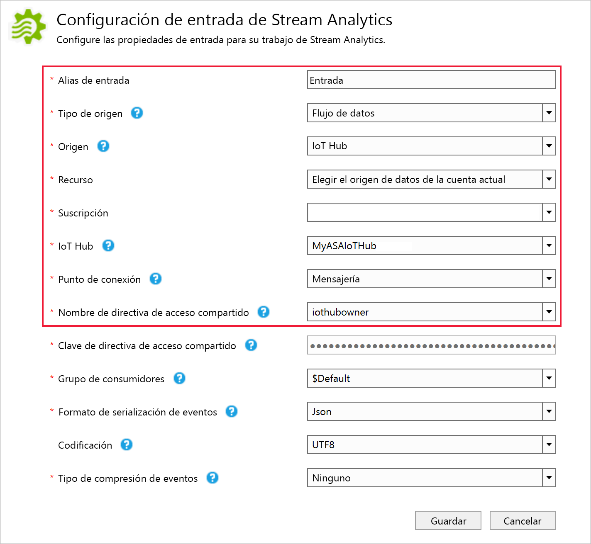
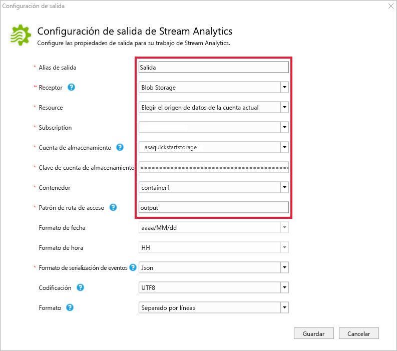
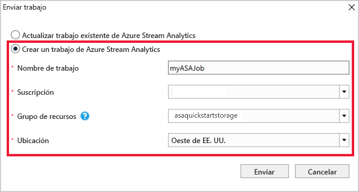
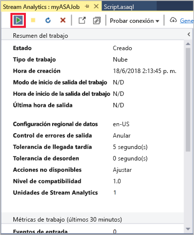
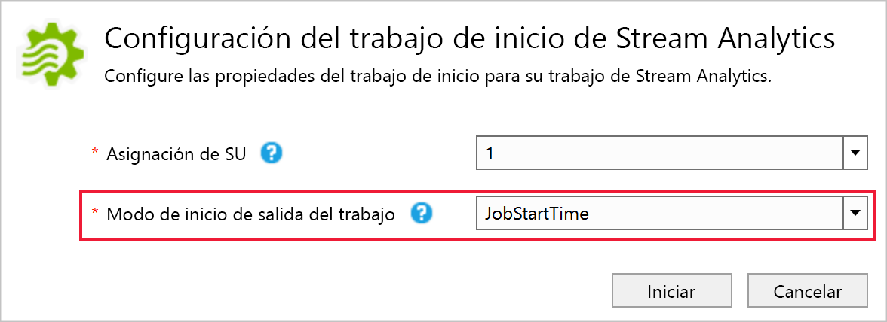
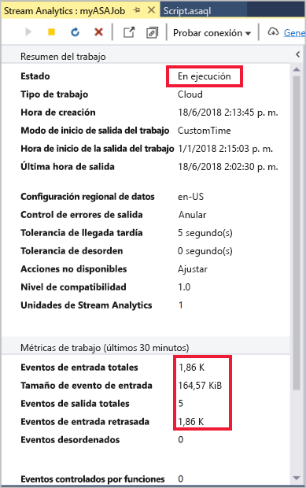

# <a name="quickstart-create-a-stream-analytics-job-by-using-the-azure-stream-analytics-tools-for-visual-studio"></a>Guía de inicio rápido: Creación de un trabajo de Stream Analytics mediante las herramientas de Azure Stream Analytics para Visual Studio

En esta guía de inicio rápido se muestra cómo crear y ejecutar un trabajo de Stream Analytics mediante las herramientas de Azure Stream Analytics para Visual Studio. El trabajo de ejemplo lee los datos de streaming desde Azure Blob Storage. El archivo de datos de entrada usado en esta guía de inicio rápido contiene datos estáticos solo con fines ilustrativos. En un escenario real, se usan datos de entrada de streaming para los trabajos de Stream Analytics. En esta guía de inicio rápido, definirá un trabajo que calcula la temperatura media cuando se sobrepasan los 100 ° y escribe los eventos de salida resultantes en un nuevo archivo.

## <a name="before-you-begin"></a>Antes de empezar

* Si no tiene una suscripción a Azure, cree una [cuenta gratuita](https://azure.microsoft.com/free/).

* Inicie sesión en el [Azure Portal](https://portal.azure.com/).

* Instale Visual Studio 2017, Visual Studio 2015 o Visual Studio 2013 Update 4. Se admiten las ediciones Enterprise (Ultimate y Premium), Professional y Community. No se admite la edición Express.

* Siga las [instrucciones de instalación](https://docs.microsoft.com/azure/stream-analytics/stream-analytics-tools-for-visual-studio-install) para instalar las herramientas de Stream Analytics para Visual Studio.

## <a name="prepare-the-input-data"></a>Preparación de los datos de entrada

Antes de definir el trabajo de Stream Analytics, debe preparar los datos, que se configuran como entrada en el trabajo. Para preparar los datos de entrada que requiere el trabajo, siga estos pasos:

1. Descargue los [datos de ejemplo del sensor](https://raw.githubusercontent.com/Azure/azure-stream-analytics/master/Samples/GettingStarted/HelloWorldASA-InputStream.json) desde GitHub. Los datos de ejemplo contienen información sobre el sensor en el siguiente formato JSON:  

   ```json
   {
     "time": "2018-01-26T21:18:52.0000000",
     "dspl": "sensorC",
     "temp": 87,
     "hmdt": 44
   }
   ```
2. Inicie sesión en el [Azure Portal](https://portal.azure.com/).

3. En la esquina superior izquierda de Azure Portal, seleccione **Crear un recurso** > **Almacenamiento** > **Cuenta de almacenamiento**. Rellene la página del trabajo de la cuenta de Storage. En **Nombre**, escriba "asaquickstartstorage", en **Ubicación**, escriba "Oeste de EE. UU. 2" y en **Grupo de recursos**, escriba "asaquickstart-resourcegroup" (para conseguir un mejor rendimiento, hospede la cuenta de almacenamiento en el mismo grupo de recursos que el trabajo de streaming). El resto de la configuración se puede dejar con sus valores predeterminados.  

   

4. En la página **Todos los recursos**, busque la cuenta de almacenamiento que creó en el paso anterior. Abra la página **Información general** y seleccione el icono **Blobs**.  

5. En la página **Blob service**, seleccione **Contenedor**, proporcione un **nombre** para el contenedor, como *contenedor1* y haga clic en **Aceptar**.  

   

6. Vaya al contenedor que creó en el paso anterior. Seleccione **Cargar** y cargue los datos del sensor que obtuvo en el primer paso.  

   

## <a name="create-a-stream-analytics-project"></a>Creación de un trabajo de Stream Analytics

1. Inicie Visual Studio.

2. Seleccione **Archivo > Nuevo proyecto**.  

3. En la lista de plantillas de la izquierda, seleccione **Stream Analytics** y **Aplicación de Azure Stream Analytics**.  

4. Escriba el **nombre** del proyecto, la **ubicación** y el **nombre de la solución** y seleccione **Aceptar**.

   

## <a name="choose-the-required-subscription"></a>Selección de la suscripción necesaria

1. En Visual Studio, en el menú **Ver**, seleccione **Explorador de servidores**.

2. Haga clic con el botón derecho en **Azure**, seleccione **Connect to Microsoft Azure Subscription** (Conectarse a la suscripción de Microsoft Azure) e inicie sesión con su cuenta de Azure.

## <a name="define-input"></a>Definición de la entrada

1. En el **Explorador de soluciones**, expanda el nodo **Entradas** y haga doble clic en **Input.json**.

2. Rellene la **configuración de entrada de Stream Analytics** con los siguientes valores:

   |**Configuración**  |**Valor sugerido**  |**Descripción**   |
   |---------|---------|---------|
   |Alias de entrada  |  Entrada   |  Escriba un nombre para identificar la entrada del trabajo.   |
   |Tipo de origen   |  Flujo de datos |  Elija el origen de entrada adecuado: flujo de datos o datos de referencia.   |
   |Origen  |  Blob Storage |  Elija el origen de entrada correspondiente.   |
   |Recurso  | Selección del origen de datos desde la cuenta actual | Elija escribir los datos manualmente o seleccione una cuenta existente.   |
   |Subscription  |  \<Su suscripción\>   | Seleccione la suscripción de Azure que tiene la cuenta de almacenamiento que creó. La cuenta de almacenamiento puede estar en la misma suscripción, o en otra diferente. En este ejemplo se da por supuesto que ha creado la cuenta de almacenamiento en la misma suscripción.   |
   |Cuenta de almacenamiento  |  asaquickstartstorage   |  Elija o escriba el nombre de la cuenta de almacenamiento. Los nombres de cuenta de almacenamiento se detectan automáticamente si se crean en la misma suscripción.   |
   |Contenedor  |  Contenedor1   |  Seleccione el contenedor existente que creó en la cuenta de almacenamiento.   |
   
3. Deje el resto de opciones con los valores predeterminados y seleccione **Guardar** para guardar la configuración.  

   

## <a name="define-output"></a>Defininición de salida

1. En el **Explorador de soluciones**, expanda el nodo **Salidas** y haga doble clic en **Output.json**.

2. Rellene la **configuración de salida de Stream Analytics** con los siguientes valores:

   |**Configuración**  |**Valor sugerido**  |**Descripción**   |
   |---------|---------|---------|
   |Alias de salida  |  Salida   |  Escriba un nombre para identificar la salida del trabajo.   |
   |Receptor   |  Blob Storage |  Elija el receptor adecuado.    |
   |Recurso  |  Provisión de la configuración del origen de datos manualmente |  Elija escribir los datos manualmente o seleccione una cuenta existente.   |
   |Subscription  |  \<Su suscripción\>   | Seleccione la suscripción de Azure que tiene la cuenta de almacenamiento que creó. La cuenta de almacenamiento puede estar en la misma suscripción, o en otra diferente. En este ejemplo se da por supuesto que ha creado la cuenta de almacenamiento en la misma suscripción.   |
   |Cuenta de almacenamiento  |  asaquickstartstorage   |  Elija o escriba el nombre de la cuenta de almacenamiento. Los nombres de cuenta de almacenamiento se detectan automáticamente si se crean en la misma suscripción.   |
   |Contenedor  |  Contenedor1   |  Seleccione el contenedor existente que creó en la cuenta de almacenamiento.   |
   |Patrón de la ruta de acceso  |  output   |  Escriba el nombre de una ruta de acceso de archivo que debe crearse en el contenedor.   |
   
3. Deje el resto de opciones con los valores predeterminados y seleccione **Guardar** para guardar la configuración.  

   

## <a name="define-the-transformation-query"></a>Definir la consulta de transformación

1. Abra **Script.asaql** desde el **Explorador de soluciones** en Visual Studio.

2. Agregue la siguiente consulta:

   ```sql
   SELECT 
   System.Timestamp AS OutputTime,
   dspl AS SensorName,
   Avg(temp) AS AvgTemperature
   INTO
     Output
   FROM
     Input TIMESTAMP BY time
   GROUP BY TumblingWindow(second,30),dspl
   HAVING Avg(temp)>100
   ```

## <a name="submit-a-stream-analytics-query-to-azure"></a>Enviar una consulta de Stream Analytics a Azure

1. En el **Editor de consultas**, haga clic en **Enviar a Azure** en el editor de scripts.

2. Seleccione **Create a New Azure Stream Analytics job** (Crear un trabajo de Azure Stream Analytics) y escriba un **nombre para el trabajo**. Elija la **suscripción**, el **grupo de recursos** y la **ubicación** que usó al comienzo de la guía de inicio rápido.

   

## <a name="start-the-stream-analytics-job-and-check-output"></a>Inicio del trabajo de Stream Analytics y consulta de la salida

1. Ahora que se ha creado el trabajo, se abre automáticamente la vista del trabajo. Seleccione el botón de la flecha verde para iniciar el trabajo.

   

2. Cambie la fecha **Hora personalizada** a `2018-01-01` y seleccione **Iniciar**.

   

3. Puede ver que el estado del trabajo ha cambiado a **En ejecución** y que hay eventos de entrada y salida. Esta operación puede tardar unos minutos.

   

4. Para ver los resultados, en el menú **Ver**, seleccione **Cloud Explorer** y vaya a la cuenta de almacenamiento del grupo de recursos. En **Contenedores de blob**, haga doble clic en **contenedor1** y, luego, en la ruta de acceso al archivo de **salida**.

   

## <a name="clean-up-resources"></a>Limpieza de recursos

Cuando no los necesite, elimine el grupo de recursos, el trabajo de streaming y todos los recursos relacionados. La eliminación del trabajo evita la facturación de las unidades de streaming utilizadas por el trabajo. Si piensa utilizar el trabajo en el futuro, puede detenerlo y volver a iniciarlo más adelante cuando sea necesario. Si no va a seguir usando este trabajo, siga estos pasos para eliminar todos los recursos creados en esta guía de inicio rápido:

1. En el menú de la izquierda de Azure Portal, seleccione **Grupos de recursos** y luego el nombre del recurso que creó.  

2. En la página del grupo de recursos, seleccione **Eliminar**, escriba el nombre del recurso que quiere eliminar en el cuadro de texto y, luego, seleccione **Eliminar**.

## <a name="next-steps"></a>Pasos siguientes

En esta guía de inicio rápido, ha implementado un sencillo trabajo de Stream Analytics. Para aprender a configurar otros orígenes de entrada y realizar la detección en tiempo real, continúe con el siguiente artículo:

> [!div class="nextstepaction"]
> [Detección de fraudes en tiempo real con Azure Stream Analytics](stream-analytics-real-time-fraud-detection.md)
