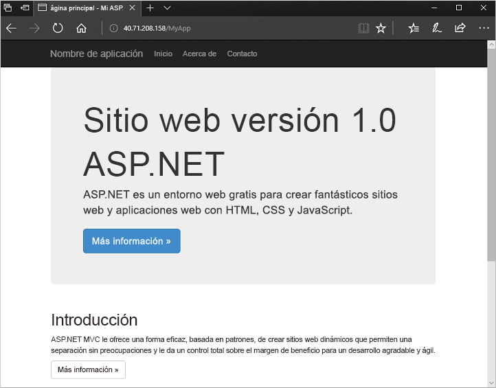

# <a name="quickstart-create-a-virtual-machine-scale-set-with-azure-powershell"></a>Guía de inicio rápido: Creación de un conjunto de escalado de máquinas virtuales con Azure PowerShell
El conjunto de escalado de máquinas virtuales le permite implementar y administrar un conjunto de máquinas virtuales de escalado automático idénticas. Puede escalar el número de máquinas virtuales del conjunto de escalado manualmente o definir reglas de escalado automático según el uso de recursos tales como la CPU, la demanda de memoria o el tráfico de red. Un equilibrador de carga de Azure distribuirá el tráfico a las instancias de máquina virtual del conjunto de escalado. En esta guía de inicio rápido, creará un conjunto de escalado de máquinas virtuales e implementará una aplicación de ejemplo con Azure PowerShell.

Si no tiene una suscripción a Azure, cree una [cuenta gratuita](https://azure.microsoft.com/free/?WT.mc_id=A261C142F) antes de empezar.

[!INCLUDE [cloud-shell-powershell.md](../../includes/cloud-shell-powershell.md)]

Si decide instalar y usar PowerShell de forma local, para este tutorial se requiere la versión 5.6.0 del módulo de Azure PowerShell, o cualquier versión posterior. Ejecute `Get-Module -ListAvailable AzureRM` para encontrar la versión. Si necesita actualizarla, consulte [Instalación del módulo de Azure PowerShell](/powershell/azure/install-azurerm-ps). Si PowerShell se ejecuta localmente, también debe ejecutar `Connect-AzureRmAccount` para crear una conexión con Azure.


## <a name="create-a-scale-set"></a>Creación de un conjunto de escalado
Cree un conjunto de escalado de máquinas virtuales con [New-AzureRmVmss](/powershell/module/azurerm.compute/new-azurermvmss). En el ejemplo siguiente, se crea un conjunto de escalado denominado *myScaleSet* que usa la imagen de plataforma *Windows Server 2016 Datacenter*. Los recursos de red de Azure para una red virtual, una dirección IP pública y un equilibrador de carga se crean automáticamente. Cuando se le solicite, proporcione sus propias credenciales administrativas para las instancias de máquina virtual en el conjunto de escalado:

```azurepowershell-interactive
New-AzureRmVmss `
  -ResourceGroupName "myResourceGroup" `
  -Location "EastUS" `
  -VMScaleSetName "myScaleSet" `
  -VirtualNetworkName "myVnet" `
  -SubnetName "mySubnet" `
  -PublicIpAddressName "myPublicIPAddress" `
  -LoadBalancerName "myLoadBalancer" `
  -UpgradePolicy "Automatic"
```

Se tardan unos minutos en crear y configurar todos los recursos de conjunto de escalado y máquinas virtuales.


## <a name="deploy-sample-application"></a>Implementación de una aplicación de ejemplo
Para probar el conjunto de escalado, instale una aplicación web básica. La extensión de script personalizado de Azure se usa para descargar y ejecutar un script que instala IIS en las instancias de máquina virtual. Esta extensión es útil para la configuración posterior a la implementación, la instalación de software o cualquier otra tarea de configuración o administración. Para obtener más información, consulte [Información general de la extensión de script personalizado](../virtual-machines/windows/extensions-customscript.md).

Use la extensión de script personalizado para instalar un servidor web de IIS básico. Aplique la extensión de script personalizada que instala IIS según se indica a continuación:

```azurepowershell-interactive
# Define the script for your Custom Script Extension to run
$publicSettings = @{
    "fileUris" = (,"https://raw.githubusercontent.com/Azure-Samples/compute-automation-configurations/master/automate-iis.ps1");
    "commandToExecute" = "powershell -ExecutionPolicy Unrestricted -File automate-iis.ps1"
}

# Get information about the scale set
$vmss = Get-AzureRmVmss `
            -ResourceGroupName "myResourceGroup" `
            -VMScaleSetName "myScaleSet"

# Use Custom Script Extension to install IIS and configure basic website
Add-AzureRmVmssExtension -VirtualMachineScaleSet $vmss `
    -Name "customScript" `
    -Publisher "Microsoft.Compute" `
    -Type "CustomScriptExtension" `
    -TypeHandlerVersion 1.8 `
    -Setting $publicSettings

# Update the scale set and apply the Custom Script Extension to the VM instances
Update-AzureRmVmss `
    -ResourceGroupName "myResourceGroup" `
    -Name "myScaleSet" `
    -VirtualMachineScaleSet $vmss
```


## <a name="test-your-scale-set"></a>Prueba del conjunto de escalado
Para ver el conjunto de escalado en acción, acceda a la aplicación web de ejemplo en un explorador web. Obtenga la dirección IP pública del equilibrador de carga con [Get-AzureRmPublicIpAddress](/powershell/module/azurerm.network/get-azurermpublicipaddress). En el ejemplo siguiente se obtiene la dirección IP que se creó en el grupo de recursos *myResourceGroup*:

```azurepowershell-interactive
Get-AzureRmPublicIpAddress -ResourceGroupName "myResourceGroup" | Select IpAddress
```

Escriba la dirección IP pública del equilibrador de carga en un explorador web. El equilibrador de carga distribuye el tráfico a una de las instancias de VM, como se muestra en el ejemplo siguiente:




## <a name="clean-up-resources"></a>Limpieza de recursos
Cuando ya no lo necesite, puede usar el comando [Remove-AzureRmResourceGroup](/powershell/module/azurerm.resources/remove-azurermresourcegroup) para quitar el grupo de recursos, el conjunto de escalado y todos los recursos relacionados como se indica a continuación. El parámetro `-Force` confirma que desea eliminar los recursos sin pedir confirmación adicional. El parámetro `-AsJob` devuelve el control a la petición de confirmación sin esperar a que finalice la operación.

```azurepowershell-interactive
Remove-AzureRmResourceGroup -Name "myResourceGroup" -Force -AsJob
```


## <a name="next-steps"></a>Pasos siguientes
En esta guía de inicio rápido, creó un conjunto de escalado básico y usó la extensión de script personalizado para instalar un servidor web IIS básico en las instancias de máquina virtual. Para más información, continúe con el tutorial sobre cómo crear y administrar conjuntos de escalado de máquinas virtuales de Azure.

> [!div class="nextstepaction"]
> [Creación y administración de conjuntos de escalado de máquinas virtuales de Azure](tutorial-create-and-manage-powershell.md)
