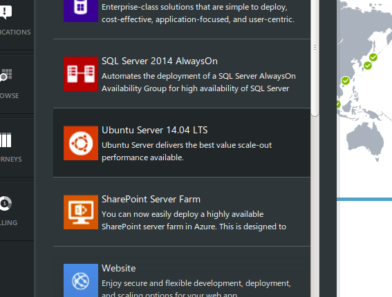
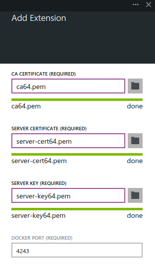

<properties 
	pageTitle="Uso de la extensión de VM Docker para Linux en Azure" 
	description="Describe Docker y las extensiones de máquinas virtuales de Azure y muestra cómo crear máquinas virtuales en Azure mediante programación que son host de Docker desde la línea de comandos usando la interfaz de comandos azure-cli." 
	services="virtual-machines" 
	documentationCenter="" 
	authors="squillace" 
	manager="timlt" 
	editor="tysonn"/>

<tags 
	ms.service="virtual-machines" 
	ms.devlang="multiple" 
	ms.topic="article" 
	ms.tgt_pltfrm="vm-linux" 
	ms.workload="infrastructure-services" 
	ms.date="02/11/2015" 
	ms.author="rasquill"/>
<!--The next line, with one pound sign at the beginning, is the page title--> 
# Uso de la extensión de VM Docker con el portal de Azure

[Docker](https://www.docker.com/) es uno de los enfoques de virtualización más populares que utilizan los [contenedores de Linux](http://en.wikipedia.org/wiki/LXC) en lugar de máquinas virtuales como una forma de aislar datos y calcular recursos compartidos. Puede usar la extensión de máquina virtual Docker que administra el [agente de Linux de Azure] para crear una máquina virtual Docker que hospede un número cualquiera de contenedores para sus aplicaciones en Azure. 

<!--Table of contents for topic, the words in brackets must match the heading wording exactly-->
En esta sección

+ [Creación de una nueva máquina virtual desde la galería de imágenes]
+ [Creación de certificados de Docker]
+ [Adición de la extensión de VM Docker]
+ [Comprobación del cliente Docker y del host Docker de Azure]
+ [Pasos siguientes]

> [AZURE.NOTE] En este tema se describe cómo crear una máquina virtual Docker desde el Portal de Azure. Para ver cómo crear una VM Docker en la línea de comandos, vea [Uso de la extensión de VM Docker desde la interfaz entre plataformas de Azure (xplat-cli)]. Para ver un análisis de alto nivel de contenedores y sus ventajas, consulte [Documento de alto nivel de Docker](http://channel9.msdn.com/Blogs/Regular-IT-Guy/Docker-High-Level-Whiteboard). 

## <a id='createvm'></a>Creación de una nueva máquina virtual desde la galería de imágenes
El primer paso requiere una máquina virtual de Azure de una imagen de Linux que admita la extensión de VM Docker, usando una imagen Ubuntu 14.04 LTS de la galería de imágenes como imagen de servidor de ejemplo y el escritorio Ubuntu 14.04 como cliente. En el portal, haga clic en **+ Nuevo** en la esquina inferior izquierda para crear una nueva instancia de máquina virtual y seleccione una imagen Ubuntu 14.04 LTS entre las selecciones disponibles o en la galería de imágenes completa, tal y como se muestra a continuación. 

> [AZURE.NOTE] Actualmente, solo las imágenes Ubuntu 14.04 LTS posteriores a julio de 2014 admiten la extensión de VM Docker.



## <a id'dockercerts'></a>Creación de certificados de Docker

Una vez creada la máquina virtual, asegúrese de que Docker está instalado en su equipo cliente. (Para obtener detalles, consulte [Instrucciones de instalación de Docker](https://docs.docker.com/installation/#installation).) 

Cree los archivos de certificado y de clave para la comunicación Docker conforme a [Ejecución de Docker con https][Docker en ejecución con https] y colóquelos en el directorio **`~/.docker`** de su equipo cliente. 

> [AZURE.NOTE] La extensión de VM Docker del portal actualmente requiere credenciales con la codificación base64.

En la línea de comandos, use **`base64`** u otra herramienta de codificación para crear temas con la codificación base64. Hacer esto con un conjunto sencillo de archivos de certificado y clave podría tener un aspecto similar al siguiente:

```
 ~/.docker$ l
 ca-key.pem  ca.pem  cert.pem  key.pem  server-cert.pem  server-key.pem
 ~/.docker$ base64 ca.pem > ca64.pem
 ~/.docker$ base64 server-cert.pem > server-cert64.pem
 ~/.docker$ base64 server-key.pem > server-key64.pem
 ~/.docker$ l
 ca64.pem    ca.pem    key.pem            server-cert.pem   server-key.pem
 ca-key.pem  cert.pem  server-cert64.pem  server-key64.pem
```

## <a id'adddockerextension'></a>Adición de la extensión de VM Docker
Para agregar la extensión de VM Docker, busque la instancia de máquina virtual que creó, desplácese hacia abajo hasta **Extensiones** y haga clic en ella para mostrar extensiones de VM, tal y como se muestra a continuación.
> [AZURE.NOTE] Esta funcionalidad solo se admite en el portal de vista previa: https://portal.azure.com/


### Adición de una extensión
Haga clic en **+ Agregar** para mostrar las extensiones de VM posibles que puede agregar a esta máquina virtual. 


### Selección de la extensión de VM Docker
Elija la extensión de VM Docker, que muestra la descripción y vínculos importantes de Docker, y haga clic en **Crear** en la parte inferior para comenzar el procedimiento de instalación.


### Adición de los archivos de certificado y clave:

En los campos del formulario, escriba las versiones con codificación base64 del certificado CA, su certificado de servidor y su clave de servidor, tal y como se muestra en el siguiente gráfico.



> [AZURE.NOTE] Tenga en cuenta que (como en la imagen anterior), se usa 4243 de forma predeterminada. Puede escribir cualquier extremo aquí, pero el paso siguiente será abrir el extremo coincidente. Si cambia el valor predeterminado, asegúrese de abrir el extremo coincidente en el paso siguiente.

## Adición del extremo de comunicación de Docker
Cuando vea su máquina virtual en el grupo de recursos que ha creado, desplácese hacia abajo para hacer clic en **Extremos** para ver los extremos en la máquina virtual tal y como se muestra aquí.


Haga clic en **+ Agregar** para agregar otro extremo y, en el caso predeterminado, escriba un nombre para el extremo (en este ejemplo **docker**) y 4243 tanto para puertos privados como para puertos públicos. Deje el valor del protocolo que se muestra en **TCP** y haga clic en **Aceptar** para crear el extremo.


## <a id='testclientandserver'></a>Comprobación del cliente Docker y del host Docker de Azure
Busque y copie el nombre de dominio de su máquina virtual y, en la línea de comandos del equipo cliente, escriba `docker --tls -H tcp://`*dockerextension*`.cloudapp.net:4243 info` (donde  *dockerextension* se sustituye por el subdominio de su máquina virtual). 

El resultado debe ser similar a esto:

```
$ docker --tls -H tcp://dockerextension.cloudapp.net:4243 info
Containers: 0
Images: 0
Storage Driver: devicemapper
 Pool Name: docker-8:1-131214-pool
 Pool Blocksize: 65.54 kB
 Data file: /var/lib/docker/devicemapper/devicemapper/data
 Metadata file: /var/lib/docker/devicemapper/devicemapper/metadata
 Data Space Used: 305.7 MB
 Data Space Total: 107.4 GB
 Metadata Space Used: 729.1 kB
 Metadata Space Total: 2.147 GB
 Library Version: 1.02.82-git (2013-10-04)
Execution Driver: native-0.2
Kernel Version: 3.13.0-36-generic
WARNING: No swap limit support
```

Cuando haya completado los pasos anteriores, dispondrá de un host Docker totalmente funcional que se ejecuta en una máquina virtual de Azure, configurado para conectarse remotamente desde otros clientes.

<!--Every topic should have next steps and links to the next logical set of content to keep the customer engaged-->
## Pasos siguientes

Está preparado para ir a la [Guía del usuario de Docker][Guía de usuario de Docker] y usar su VM Docker. Si desea automatizar la creación de hosts Docker en máquinas virtuales de Azure a través de la interfaz de línea de comandos, consulte [Cómo usar la extensión de la máquina virtual Docker desde la interfaz entre plataformas de Azure (xplat-cli)][Uso de la extensión de VM Docker desde la interfaz entre plataformas de Azure (xplat-cli)]

<!--Anchors-->
[Creación de una nueva máquina virtual desde la galería de imágenes]: #createvm
[Creación de certificados de Docker]: #dockercerts
[Adición de la extensión de VM Docker]: #adddockerextension
[Comprobación del cliente Docker y del host Docker de Azure]: #testclientandserver
[Pasos siguientes]: #next-steps

<!--Image references-->
[StartingPoint]: ./media/StartingPoint.png
[StartingPoint]: ./media/StartingPoint.png
[StartingPoint]: ./media/StartingPoint.png
[StartingPoint]: ./media/StartingPoint.png
[StartingPoint]: ./media/StartingPoint.png
[StartingPoint]: ./media/StartingPoint.png
[StartingPoint]: ./media/StartingPoint.png
[StartingPoint]: ./media/StartingPoint.png
[6]: ./media/markdown-template-for-new-articles/pretty49.png
[7]: ./media/markdown-template-for-new-articles/channel-9.png


<!--Link references-->
[Uso de la extensión de VM Docker desde la interfaz entre plataformas de Azure (xplat-cli)]: http://azure.microsoft.com/documentation/articles/virtual-machines-docker-with-xplat-cli/
[Agente de Linux de Azure]: ../virtual-machines-linux-agent-user-guide/
[Vínculo 3 a otro tema de documentación de azure.microsoft.com]: ../storage-whatis-account/

[Docker en ejecución con https]: http://docs.docker.com/articles/https/
[Guía de usuario de Docker]: https://docs.docker.com/userguide/

<!--HONumber=47-->
