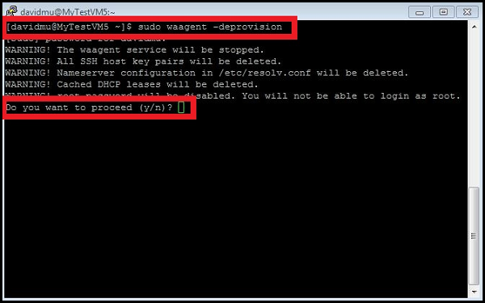

<properties
	pageTitle="Captura de una imagen de una máquina virtual que ejecuta Linux"
	description="Aprenda a capturar una imagen de una máquina virtual de Azure que ejecuta Linux."
	services="virtual-machines"
	documentationCenter=""
	authors="KBDAzure"
	manager="timlt"
	editor="tysonn"/>

<tags
	ms.service="virtual-machines"
	ms.workload="infrastructure-services"
	ms.tgt_pltfrm="vm-linux"
	ms.devlang="na"
	ms.topic="article"
	ms.date="03/16/2015" 
	ms.author="kathydav"/>

# Captura de una máquina virtual de Linux para usar como plantilla##

En este artículo se muestra cómo puede capturar una máquina virtual de Azure con Linux para usarla como plantilla en la creación de otras máquinas virtuales. Esta plantilla de máquina virtual incluye el disco del sistema operativo y cualquier otro disco de datos conectado a la máquina virtual. No incluye la configuración de red, por lo que deberá configurarla usted mismo cuando cree las otras máquinas virtuales que utilicen la plantilla.

Azure trata esta plantilla como una imagen y la almacena en **Mis imágenes**. Aquí también están almacenadas todas las imágenes que ha cargado. Para obtener más información sobre las imágenes, consulte [Acerca de las imágenes de máquina virtual en Azure][].

##Antes de empezar##

Para seguir estos pasos se supone que ya ha creado un máquina virtual Azure y ha configurado el sistema operativo, incluida la anexión de cualquier disco de datos. Si no ha realizado esto todavía, siga estas instrucciones:

- [Creación de una máquina virtual personalizada][]
- [Acoplamiento de un disco de datos a una máquina virtual][]

##Capture la máquina virtual##

1. Establezca conexión con la máquina virtual y haga clic en **Conectar** en la barra de comandos. Para obtener los detalles, consulte [Inicio de sesión en una máquina virtual con Linux][].

2. En la ventana SSH, escriba el siguiente comando y, a continuación, especifique la contraseña para la cuenta que creó en la máquina virtual. Tenga en cuenta que el resultado de `waagent` puede variar ligeramente según la versión de esta utilidad:

	`sudo waagent -deprovision`

	

3. Escriba **y** para continuar.

	

4. Escriba **Salir** para cerrar el cliente SSH.

5. En el [Portal de administración](http://manage.windowsazure.com), seleccione la máquina virtual y después haga clic en **Apagar**.

6. Cuando la máquina virtual se detenga, en la barra de comandos haga clic en **Capturar** para abrir el cuadro de diálogo **Capturar la máquina virtual**.

7.	En **Nombre de la imagen**, escriba un nombre para la nueva imagen.

8.	Es necesario *desaprovisionar* todas las imágenes de Linux mediante la ejecución del comando `waagent` con la opción `-deprovision`. Haga clic en **He ejecutado waagent-deprovision en la máquina virtual** para indicar que el sistema operativo está preparado para ser una imagen.

9.	Haga clic en la marca de verificación para capturar la imagen.

	La nueva imagen ahora está disponible en **Imágenes**. La máquina virtual se elimina una vez capturada la imagen.

	

##Pasos siguientes##
La imagen está lista para ser utilizada como plantilla para crear máquinas virtuales. Para ello, cree una máquina virtual personalizada con el método **Desde la galería** y seleccione la imagen que acaba de crear. Para obtener instrucciones, consulte [Creación de una máquina virtual personalizada][].

[Inicio de sesión en una máquina virtual con Linux]: virtual-machines-linux-how-to-log-on.md
[Acerca de las imágenes de máquina virtual en Azure]: http://msdn.microsoft.com/library/azure/dn790290.aspx
[Creación de una máquina virtual personalizada]: virtual-machines-create-custom.md
[Acoplamiento de un disco de datos a una máquina virtual]: storage-windows-attach-disk.md

<!---HONumber=58-->