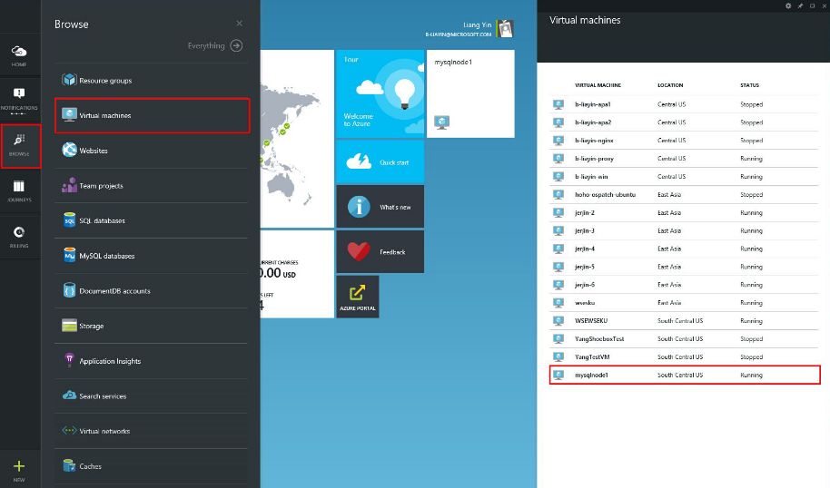
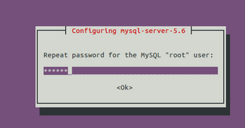

<properties
	pageTitle="Instalación de MySQL en Azure"
	description="Aprenda a instalar la pila de MySQL en una máquina virtual de Linux en Azure. Puede instalar en Ubuntu o CentOS."
	services="virtual-machines"
	documentationCenter=""
	authors="SuperScottz"
	manager="timlt"
	editor=""/>

<tags
	ms.service="virtual-machines"
	ms.workload="infrastructure-services"
	ms.tgt_pltfrm="vm-linux"
	ms.devlang="na"
	ms.topic="article"
	ms.date="03/12/2015"
	ms.author="mingzhan"/>

#Instalación de MySQL en Azure

En este tema, se supone que el lector ya tiene una cuenta de Azure. Si no es así, se recomienda para suscribirse; para ello, visite [Azure](http://azure.microsoft.com).

##Creación de una imagen de máquina virtual de Microsoft Azure.
A continuación creamos una nueva máquina virtual en el portal de administración de Microsoft Azure.
###Generación de la "Clave de autenticación SSH"
Necesitamos la clave SSH para obtener acceso al portal de Azure.

- Descargue e instale puttygen desde [aquí](http://www.chiark.greenend.org.uk/~sgtatham/putty/download.html). 
- Ejecute puttygen.exe.
- Haga clic en el botón "Generar" para generar claves.

 
 
- Una vez generada la clave, se mostrará lo siguiente. 
 
 

- Copie la clave pública y guárdela en un archivo denominado "publicKey.key". No haga clic en el botón "Guardar clave pública", porque el formato de la clave pública guardada es diferente de la clave pública que queremos.
- Haga clic en el botón "Guardar clave privada" y guárdela como "privateKey.ppk". 

###Inicio de sesión de Portal de Azure

Vaya a https://portal.azure.com/ e inicie sesión.

###Creación de una máquina virtual Linux

Haga clic en el botón de la izquierda "NUEVO", cree una imagen siguiendo las instrucciones y elija la imagen de Linux que necesite. Aquí elija Ubuntu 14.04 como ejemplo.

  

###Configuración del NOMBRE DE HOST

Para "NOMBRE DE HOST": es la dirección URL que se puede utilizar para acceder a la máquina virtual. Basta con especificar el nombre DNS, por ejemplo "mysqlnode1" y Azure generará la dirección URL como "mysqlnode1.cloudapp.net"; para "CLAVE DE AUTENTICACIÓN SSH": es la clave pública generada por puttygen y que debe copiar del contenido al archivo "publicKey.key".

  
  

##Apertura del puerto predeterminado de MySQL
Los extremos de Microsoft Azure constan de un protocolo, junto con un puerto público y privado. El puerto privado es el puerto que el servicio está escuchando en el equipo local. El puerto público es el puerto que el servicio está escuchando externamente. El puerto 3306 es el número de puerto predeterminado al que escuchará MySQL. Haga clic en "EXAMINAR" ⇒ "MÁQUINA VIRTUAL" y después haga clic en la imagen creada.
 
   

##Conexión a la imagen creada
Puede elegir cualquier herramienta SSH para conectarse a la máquina virtual. Aquí usamos Putty como ejemplo.
 

- En primer lugar, descargue Putty. A continuación se indica la dirección URL de descarga de Putty.
- Después de descargar Putty, haga clic en el archivo ejecutable "PUTTY.EXE". La configuración se indica a continuación.

     El "nombre de host (o dirección IP)" es la dirección URL como "NOMBRE DNS" al crear una imagen.
     
     Se puede elegir el "Puerto" 22. Es el puerto predeterminado de servicios SSH.

   
 
- Antes de seleccionar Abrir, haga clic en la pestaña Conexión > SSH > Autenticación para examinar el archivo generado por Puttygen y que contiene la clave privada. Consulte la siguiente captura de pantalla con el campo que se va a rellenar.

   
 
- A continuación, haga clic en "Abrir"; puede recibir una alerta en un cuadro de mensaje que indica que el equipo al que se ha conectado quizá no sea el equipo al que desea conectarse. Si ha configurado el nombre DNS y número de puerto correctamente, haga clic en "Sí".
  
 

- Después de eso, verá lo que sigue. 
 
 

##Instalación de MySQL en la máquina virtual
Se admiten tres métodos de instalación para MySQL: paquetes binarios, paquetes rpm y paquetes de código fuente. Para consideraciones sobre el rendimiento, usaremos el paquete rpm para MySQL 5.6 como ejemplo en este artículo. El rendimiento de MySQL5.6 ha mejorado considerablemente con relación a MySQL5.5. Puede encontrar más información [aquí](http://www.mysqlperformanceblog.com/2013/02/18/is-mysql-5-6-slower-than-mysql-5-5/).

###Instalación de MySQL5.6 en Ubuntu o Debian
Utilizaremos Ubuntu 14.04 LTS como ejemplo en este artículo.

- Paso 1: Instalación de MySQL Server 5.6

    Instale mysql-server 5.6 con el comando apt-get:

              # azureuser@mysqlnode1:~$ sudo apt-get update
              # azureuser@mysqlnode1:~$ sudo apt-get -y install mysql-server-5.6

    Durante la instalación, se mostrará un cuadro de diálogo para que establezca la contraseña raíz de MySQL. Deberá especificar la nueva contraseña raíz de usuario de MySQL. A continuación se muestra la captura de pantalla.

 

    Confirm the password again when it is asked.

 
 
- Paso 2: Inicio de sesión en MySQL Server

    Una vez finalizada la instalación de MySQL Server, el servicio MySQL se inicia automáticamente. Puede iniciar sesión en MySQL Server con la raíz de usuario. Para iniciar sesión en MySQL Server, utilice el comando siguiente. Se le solicitará la contraseña raíz de MySQL que haya establecido durante la instalación de MySQL Server.

             # azureuser@mysqlnode1:~$ mysql -uroot -p

- Paso 3: Comprobación del servicio de MySQL en la máquina virtual
    
    Después de iniciar sesión, asegúrese de que el servicio MySQL se está ejecutando; puede utilizar los comandos siguientes para iniciar o reiniciar el servicio.

    (a) Para obtener el estado del servicio MySQL

             #sudo service mysql status

    (b) Para iniciar el servicio MySQL

             #sudo service mysql start

    (c) Para detener el servicio MySQL

             #sudo service mysql stop

    (d) Para reiniciar el servicio MySQL

             #sudo service mysql restart

###Instalación de MySQL en la familia de sistemas operativos Redhat u Oracle Linux
- Paso 1: Incorporación del repositorio Yum de MySQL para obtener los permisos raíz y después ejecute el comando: 

            #sudo su -
            #[root@azureuser ~]# wget http://repo.mysql.com/mysql-community-release-el6-5.noarch.rpm 
            #[root@azureuser ~]# yum localinstall -y mysql-community-release-el6-5.noarch.rpm 

- Paso 2: Selección de una serie de versiones
 
            #[root@azureuser ~]# vim /etc/yum.repos.d/mysql-community.repo

    Es una entrada típica para el subrepositorio de la serie de versiones en el archivo:

        # *Enable to use MySQL 5.6*

        [mysql56-community]
        name=MySQL 5.6 Community Server

        baseurl=http://repo.mysql.com/yum/mysql-5.6-community/el/6/$basearch/

        enabled=1

        gpgcheck=1

        gpgkey=file:/etc/pki/rpm-gpg/RPM-GPG-KEY-mysql

- Paso 3: Instalación de MySQL con Yum. Instale MySQL mediante el siguiente comando:

           #[root@azureuser ~]#yum install mysql-community-server 

    Se instala el paquete para MySQL Server, así como otros paquetes necesarios.

- Paso 4: Comprobación del estado en ejecución de MySQL

    Puede comprobar el estado de MySQL Server con el siguiente comando:
   
           #[root@azureuser ~]#service mysqld status

    Puede comprobar si el puerto predeterminado de MySQL Server se está ejecutando:

           #[root@azureuser ~]#netstat  –tunlp|grep 3306

- Paso 5: Inicio y detención de MySQL Server

    Inicie MySQL Server con el siguiente comando:

           #[root@azureuser ~]#service mysqld start

    Detenga MySQL Server con el siguiente comando:

           #[root@azureuser ~]#service mysqld stop

    Para configurar MySQL para que se inicie cuando arranca el sistema, ejecute el siguiente comando:

           #[root@azureuser ~]#chkconfig mysqld on

###Instalación de MySQL en Suse Linux

- Paso 1: Instalación de  MySQL Server

    Para elevar los permisos, ejecute el comando:

           #sudo su -

    Instale MySQL con el siguiente comando:

           #mysql-test:~ # zypper update

           #mysql-test:~ # zypper install mysql-server mysql-devel mysql

- Paso 2: Comprobación del estado en ejecución de MySQL

    Puede comprobar el estado de MySQL Server con el siguiente comando:

           #mysql-test:~ # rcmysql status

    Puede comprobar si el puerto predeterminado de MySQL Server se está ejecutando;

           #mysql-test:~ # netstat  –tunlp|grep 3306

- Paso 3: Inicio y detención de MySQL Server

    Inicie MySQL Server con el siguiente comando:

           #mysql-test:~ # rcmysql start

    Detenga MySQL Server con el siguiente comando:

           #mysql-test:~ # rcmysql stop

    Para configurar MySQL para que se inicie cuando el sistema arranque, ejecute el siguiente comando:

           #mysql-test:~ # insserv mysql

<!---HONumber=58-->