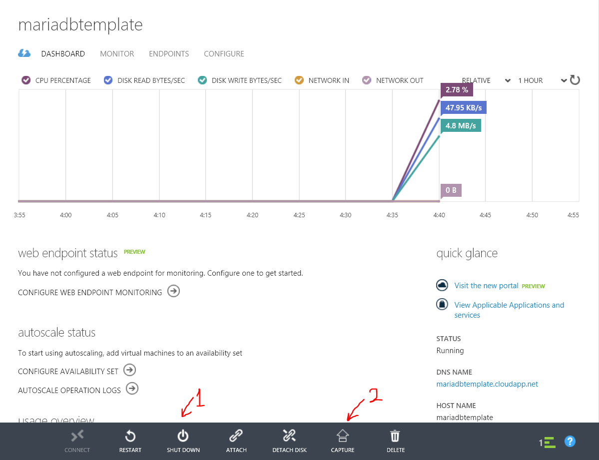
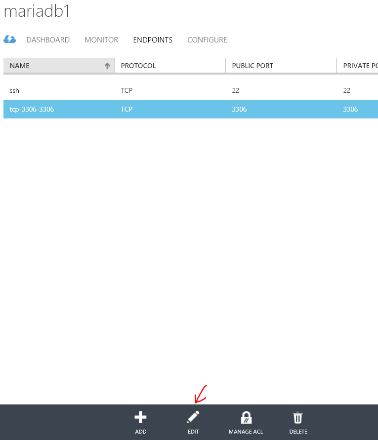
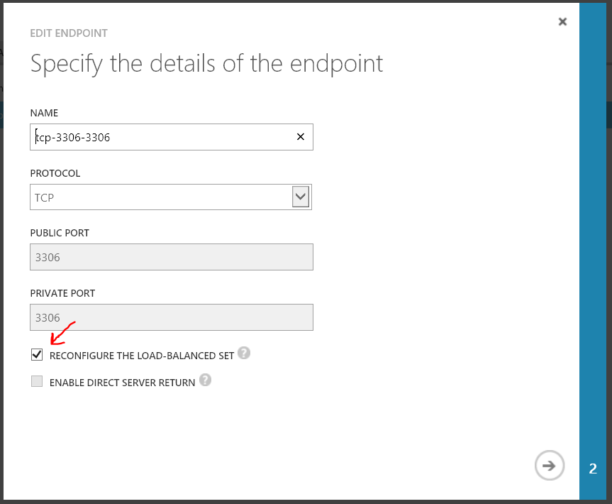

<properties 
	pageTitle="Ejecución de un clúster MariaDB (MySQL) en Azure" 
	description="Creación de un clúster MariaDB + Galera MySQL en máquinas virtuales de Azure" 
	services="virtual-machines" 
	documentationCenter="" 
	authors="sabbour" 
	manager="timlt" 
	editor=""/>

<tags 
	ms.service="virtual-machines" 
	ms.devlang="multiple" 
	ms.topic="article" 
	ms.tgt_pltfrm="vm-linux" 
	ms.workload="infrastructure-services" 
	ms.date="12/3/2014" 
	ms.author="v-ahsab" 
	ms.prod="azure"/>

<!--The next line, with one pound sign at the beginning, is the page title--> 
# Clúster MariaDB (MySQL): tutorial de Azure

Vamos a crear un clúster [Galera](http://galeracluster.com/products/) de varios maestros de [MariaDBs](https://mariadb.org/en/about/), una sustitución robusta, escalable y confiable de MySQL, para trabajar en un entorno altamente disponible en máquinas virtuales de Azure.

## Introducción a la arquitectura

En este tema se realizan los pasos siguientes:

1. Crear un clúster de tres nodos
2. Separar los discos de datos del disco del sistema operativo
3. Crear los discos de datos en la configuración RAID-0/striped para aumentar la tasa IOPS
4. Usar el equilibrador de carga de Azure para equilibrar la carga de 3 nodos
5. Para minimizar el trabajo repetitivo, cree una imagen de máquina virtual que contenga MariaDB+Galera y úsela para crear otras máquinas virtuales de clúster.

> [AZURE.NOTE]  Este tema usa las herramientas [Azure CLI], asegúrese de descargarlas y conectarlas a su suscripción de Azure siguiendo las instrucciones. Si necesita una referencia a los comandos disponibles en Azure CLI, visite este vínculo para obtener la [referencia de comandos de Azure CLI]. También necesitará [crear una clave SSH para la autenticación] y anotar la **ubicación del archivo .pem**.

## Creación de la plantilla

### Infraestructura

1. Crear un grupo de afinidad para mantener juntos los recursos

		azure account affinity-group create mariadbcluster --location "North Europe" --label "MariaDB Cluster"
        
2. Creación de una red virtual

		azure network vnet create --address-space 10.0.0.0 --cidr 8 --subnet-name mariadb --subnet-start-ip 10.0.0.0 --subnet-cidr 24 --affinity-group mariadbcluster mariadbvnet

3. Cree una cuenta de almacenamiento para alojar todos nuestros discos. Tenga en cuenta que no debería colocar más de 40 discos de uso intensivo en la misma cuenta de almacenamiento para evitar llegar al límite de la cuenta de almacenamiento IOPS de 20 000. En este caso, estamos lejos de este número, así que almacenaremos todo en la misma cuenta para simplificar.

		azure storage account create mariadbstorage --label mariadbstorage --affinity-group mariadbcluster

3. Busque el nombre de la imagen de máquina virtual de CentOS 7.

		azure vm image list | findstr CentOS        
esto devolverá un resultado similar a `5112500ae3b842c8b9c604889f8753c3__OpenLogic-CentOS-70-20140926`. Use el nombre del siguiente paso.

4. Cree la plantilla de máquina virtual reemplazando **/path/to/key.pem** por la ruta de acceso donde se almacena la clave SSH .pem generada.

		azure vm create --virtual-network-name mariadbvnet --subnet-names mariadb --blob-url "http://mariadbstorage.blob.core.windows.net/vhds/mariadbhatemplate-os.vhd"  --vm-size Medium --ssh 22 --ssh-cert "/path/to/key.pem" --no-ssh-password mariadbtemplate 5112500ae3b842c8b9c604889f8753c3__OpenLogic-CentOS-70-20140926 azureuser
        
5. Conecte 4 discos de datos 500 GB a la máquina virtual para su uso en la configuración de RAID

		FOR /L %d IN (1,1,4) DO azure vm disk attach-new mariadbhatemplate 512 http://mariadbstorage.blob.core.windows.net/vhds/mariadbhatemplate-data-%d.vhd        

6. SSH en la plantilla de máquina virtual que creó en **mariadbhatemplate.cloudapp.net:22** y conéctese con su clave privada.

### Software

1. Obtener la raíz

        sudo su
        
2. Instalar compatibilidad con RAID:

     - Instalar mdadm
        
        		yum install mdadm
                
     - Crear la configuración RAID0/stripe con un sistema de archivos EXT4
        
				mdadm --create --verbose /dev/md0 --level=stripe --raid-devices=4 /dev/sdc /dev/sdd /dev/sde /dev/sdf
				mdadm --detail --scan >> /etc/mdadm.conf
				mkfs -t ext4 /dev/md0
         
     - Crear el directorio de punto de montaje
         
				mkdir /mnt/data
                
     - Recuperar el UUID del dispositivo RAID recién creado
        
				blkid | grep /dev/md0
    
     - Editar /etc/fstab
        
        		vi /etc/fstab
        
     - Agregue el dispositivo en dicha ubicación para habilitar el montaje automático al reiniciar. Para ello, reemplace antes el UUID con el valor obtenido con el comando **blkid**.
        
        		UUID=<UUID FROM PREVIOUS>   /mnt/data ext4   defaults,noatime   1 2
        	
     - Montar la nueva partición
        
        		mount /mnt/data
            
3. Instalar MariaDB:    
		
     - Cree el archivo MariaDB.repo: 
        
              	vi /etc/yum.repos.d/MariaDB.repo
        
     - Rellénelo con el contenido siguiente      
        
				[mariadb]
				name = MariaDB
				baseurl = http://yum.mariadb.org/10.0/centos7-amd64
				gpgkey=https://yum.mariadb.org/RPM-GPG-KEY-MariaDB
				gpgcheck=1
    
     - Quite el sufijo existente y mariadb-libs para evitar conflictos
    
    		yum remove postfix mariadb-libs-*
            
     - Instalar MariaDB con Galera
    
    		yum install MariaDB-Galera-server MariaDB-client galera
   
4. Mover el directorio de datos de MySQL al dispositivo de bloques RAID

     - Copie el directorio actual de MySQL en su nueva ubicación y quite el directorio antiguo
    
    		cp -avr /var/lib/mysql /mnt/data  
    		rm -rf /var/lib/mysql
      
     - Establezca los permisos del nuevo directorio en consecuencia
        
        	chown -R mysql:mysql /mnt/data && chmod -R 755 /mnt/data/  
            
     - Cree un vínculo simbólico que apunte al directorio anterior en la nueva ubicación en la partición RAID
    
    		ln -s /mnt/data/mysql /var/lib/mysql   

5. Dado que [SELinux interfiere con las operaciones del clúster](http://galeracluster.com/documentation-webpages/configuration.html#selinux), es necesario deshabilitarlo para la sesión actual (hasta que aparezca una versión compatible). Edite  `/etc/selinux/config` para deshabilitar los reinicios posteriores:
    	
	        setenforce 0
    
       a continuación, edite `/etc/selinux/config` para establecer `SELINUX=permissive`
       
6. Valide las ejecuciones de MySQL

    - Inicie MySQL
    
    		service mysql start
            
    - Proteja la instalación de MySQL, establezca la contraseña raíz, quite los usuarios anónimos, deshabilite el inicio de sesión raíz remoto y quite la base de datos de prueba
    		
            mysql_secure_installation
            
    - Cree un usuario en la base de datos para las operaciones de clúster y, opcionalmente, las aplicaciones
   
			mysql -u root -p
			GRANT ALL PRIVILEGES ON *.* TO 'cluster'@'%' IDENTIFIED BY 'p@ssw0rd' WITH GRANT OPTION; FLUSH PRIVILEGES;
            exit
   
   - Detenga MySQL
   
			service mysql stop
            
7. Crear el marcador de posición de configuración

	- Edite la configuración de MySQL para crear un marcador de posición para la configuración del clúster. En este momento, no reemplace las **`<Variables>`** ni quite la marca de comentario. Eso sucederá después de crear una máquina virtual desde esta plantilla.
	
			vi /etc/my.cnf.d/server.cnf
			
	- Edite la sección **[galera]** y desactívela
	
	- Edite la sección **[mariadb]**
	
			wsrep_provider=/usr/lib64/galera/libgalera_smm.so 
            binlog_format=ROW
            wsrep_sst_method=rsync
			bind-address=0.0.0.0 # When set to 0.0.0.0, the server listens to remote connections
			default_storage_engine=InnoDB
            innodb_autoinc_lock_mode=2
			
            wsrep_sst_auth=cluster:p@ssw0rd # CHANGE: Username and password you created for the SST cluster MySQL user
            #wsrep_cluster_name='mariadbcluster' # CHANGE: Uncomment and set your desired cluster name
            #wsrep_cluster_address="gcomm://mariadb1,mariadb2,mariadb3" # CHANGE: Uncomment and Add all your servers
            #wsrep_node_address='<ServerIP>' # CHANGE: Uncomment and set IP address of this server
			#wsrep_node_name='<NodeName>' # CHANGE: Uncomment and set the node name of this server

8. Abrir los puertos necesarios en el firewall (mediante FirewallD en CentOS 7)
	
	- MySQL: `firewall-cmd --zone=public --add-port=3306/tcp --permanent`
    - GALERA: `firewall-cmd --zone=public --add-port=4567/tcp --permanent`
    - GALERA IST: `firewall-cmd --zone=public --add-port=4568/tcp --permanent`
    - RSYNC: `firewall-cmd --zone=public --add-port=4444/tcp --permanent`
    - Vuelva a cargar el firewall: `firewall-cmd --reload`
	
9.  Optimice el sistema para el rendimiento. Consulte este artículo sobre [estrategia de optimización del rendimiento] para obtener más detalles.

	- Editar de nuevo el archivo de configuración de MySQL
	
			vi /etc/my.cnf.d/server.cnf
		
	- Editar la sección **[mariadb]** y anexar la siguiente
	
	> [AZURE.NOTE] Se recomienda que **innodb_buffer_pool_size** sea el 70 % de la memoria de su máquina virtual. Aquí se ha establecido a 2,45 GB aquí para la máquina virtual media de Azure, con 3,5 GB de RAM.
	
	        innodb_buffer_pool_size = 2508M # The buffer pool contains buffered data and the index. This is usually set to 70% of physical memory.
            innodb_log_file_size = 512M #  Redo logs ensure that write operations are fast, reliable, and recoverable after a crash
            max_connections = 5000 # A larger value will give the server more time to recycle idled connections
            innodb_file_per_table = 1 # Speed up the table space transmission and optimize the debris management performance
            innodb_log_buffer_size = 128M # The log buffer allows transactions to run without having to flush the log to disk before the transactions commit
            innodb_flush_log_at_trx_commit = 2 # The setting of 2 enables the most data integrity and is suitable for Master in MySQL cluster
			query_cache_size = 0
			
10. Detenga MySQL, deshabilite el servicio MySQL para que no se ejecute al inicio y, de esta forma, evitar toda interferencia con el clúster al agregar un nuevo nodo y desaprovisionar la máquina.

		service mysql stop
        chkconfig mysql off
		waagent -deprovision	
		
11. Capture la máquina virtual a través del portal. (Actualmente, el [problema #1268 en las herramientas Azure CLI] describe el hecho de que las imágenes capturadas por las herramientas de xplat-cli no capturan los discos de datos adjuntos).

	- Apagar la máquina a través del portal
    - Haga clic en la captura y especifique el nombre de imagen como **mariadb-galera-image** y proporcione una descripción y active "He ejecutado waagent".
	
	
	
## Creación del clúster
 
Cree 3 máquinas virtuales de la plantilla que acaba de crear y, a continuación, configure e inicie el clúster.

1. Cree la primera VM de CentOS 7 desde la imagen **mariadb-galera-image** que creó, proporcionando el nombre de red virtual **mariadbvnet** y la subred **mariadb**, tamaño de máquina **medio**, pasando el nombre del servicio de nube que **mariadbha** (o cualquier nombre al que desee tener acceso a través de mariadbha.cloudapp.net), estableciendo el nombre del equipo para **mariadb1** y el nombre de usuario como **azureuser**, habilitando el acceso SSH y pasando el archivo .pem de certificado SSH y reemplazando **/path/to/key.pem** por la ruta de acceso en la que almacenó la clave SSH .pem generada.

	> [AZURE.NOTE] Los comandos siguientes se dividen en varias líneas para mayor claridad, pero debe especificar cada uno de ellos como una sola línea.

		azure vm create 
        --virtual-network-name mariadbvnet
        --subnet-names mariadb 
        --availability-set clusteravset
		--vm-size Medium 
		--ssh-cert "/path/to/key.pem" 
		--no-ssh-password 
		--ssh 22 
		--vm-name mariadb1 
		mariadbha mariadb-galera-image azureuser 

2. Cree dos máquinas virtuales más _conectándolas_ al servicio de nube **mariadbha** creado actualmente, cambiando el **nombre de VM** así como el **puerto SSH** a un único puerto que no entre en conflicto con otras máquinas virtuales en el mismo servicio de nube.

		azure vm create		
        --virtual-network-name mariadbvnet
        --subnet-names mariadb 
        --availability-set clusteravset
		--vm-size Medium
		--ssh-cert "/path/to/key.pem"
		--no-ssh-password
		--ssh 23
		--vm-name mariadb2
        --connect mariadbha mariadb-galera-image azureuser
and for MariaDB3

		azure vm create
        --virtual-network-name mariadbvnet
        --subnet-names mariadb 
        --availability-set clusteravset
		--vm-size Medium
		--ssh-cert "/path/to/key.pem"
		--no-ssh-password
		--ssh 24
		--vm-name mariadb3
        --connect mariadbha mariadb-galera-image azureuser
		
3. Necesitará obtener la dirección IP interna de cada una de las tres máquinas virtuales para el siguiente paso:

	

4. SSH en las tres máquinas virtuales y editar el archivo de configuración en cada una

		sudo vi /etc/my.cnf.d/server.cnf
		
	lo que realmente desea es quitar la marca de comentario de **`wsrep_cluster_name`** y **`wsrep_cluster_address`**, eliminar el carácter **#** del principio y validar.
    Además, reemplace **`<ServerIP>`** en **`wsrep_node_address`** y **`<NodeName>`** en **`wsrep_node_name`** por la dirección IP y el nombre, respectivamente, de las máquinas virtuales, y elimine esas líneas.
	
5. Iniciar el clúster en MariaDB1 y dejar que se ejecute en el inicio

		sudo service mysql bootstrap
        chkconfig mysql on
	
6. Iniciar MySQL en MariaDB2 y MariaDB3 y dejar que se ejecute en el inicio

		sudo service mysql start
        chkconfig mysql on
		
## Equilibrio de carga del clúster
Al crear las máquinas virtuales en clúster, las agregó al conjunto de disponibilidad denominado **clusteravset** para asegurarse de que se colocan en diferentes dominios de error y de actualización y que Azure nunca realice el mantenimiento en todos los equipos a la vez. Esta configuración cumple los requisitos para ser compatible por ese contrato de nivel de servicio (SLA) de Azure.

Ahora utilice el equilibrador de carga de Azure para equilibrar las solicitudes entre nuestros 3 nodos.

Ejecute los siguientes comandos en el equipo con Azure CLI.
La estructura de los parámetros de comando es: `azure vm endpoint create-multiple <MachineName> <PublicPort>:<VMPort>:<Protocol>:<EnableDirectServerReturn>:<Load Balanced Set Name>:<ProbeProtocol>:<ProbePort>`

	azure vm endpoint create-multiple mariadb1 3306:3306:tcp:false:MySQL:tcp:3306
    azure vm endpoint create-multiple mariadb2 3306:3306:tcp:false:MySQL:tcp:3306
    azure vm endpoint create-multiple mariadb3 3306:3306:tcp:false:MySQL:tcp:3306
	
Por último, puesto que la CLI establece el intervalo de sondeo de equilibrador de carga en 15 segundos (lo que puede ser demasiado grande), cámbiela en el portal, en **Extremos**, para cualquiera de las máquinas virtuales.

A continuación, haga clic en reconfigurar conjunto de equilibrio de carga y vaya al siguiente paso.

A continuación, cambie el intervalo de sondeo a 5 segundos y guarde.

## Validación del clúster

El trabajo más duro ya está terminado. Ahora, el clúster debe estar accesible en `mariadbha.cloudapp.net:3306`, lo que presionará el equilibrador de carga y enrutará las solicitudes entre las tres máquinas virtuales de forma perfecta y eficaz.

Use su cliente favorito de MySQL para conectarse o conéctese directamente desde una de las máquinas virtuales para comprobar que funciona este clúster.

	 mysql -u cluster -h mariadbha.cloudapp.net -p
	 
A continuación, cree una nueva base de datos y rellénela con datos.

	CREATE DATABASE TestDB;
    USE TestDB;
    CREATE TABLE TestTable (id INT NOT NULL AUTO_INCREMENT PRIMARY KEY, value VARCHAR(255));
	INSERT INTO TestTable (value)  VALUES ('Value1');
	INSERT INTO TestTable (value)  VALUES ('Value2');
    SELECT * FROM TestTable;
	
El resultado se ve en la tabla siguiente:

	+----+--------+
	| id | value  |
	+----+--------+
	|  1 | Value1 |
	|  4 | Value2 |
	+----+--------+
	2 rows in set (0.00 sec)	
	
<!--Every topic should have next steps and links to the next logical set of content to keep the customer engaged-->
## Pasos siguientes

En este artículo, ha creado un clúster MariaDB + Galera de alta disponibilidad de 3 nodos en máquinas virtuales de Azure con CentOS 7. Las máquinas virtuales tienen equilibrio de carga en el equilibrador de carga de Azure.

Puede que desee echar un vistazo a [otro modo para el clúster MySQL en Linux] y ver otras formas de [optimizar y probar el rendimiento de MySQL en máquinas virtuales de Linux de Azure].

<!--Anchors-->
[Introducción a la arquitectura]: #architecture-overview
[Creación de la plantilla]: #creating-the-template
[Creación del clúster]: #creating-the-cluster
[Equilibrio de carga del clúster]: #load-balancing-the-cluster
[Validación del clúster]: #validating-the-cluster
[Pasos siguientes]: #next-steps

<!--Image references-->

<!--Link references-->
[Azure CLI]: http://azure.microsoft.com/documentation/articles/xplat-cli/
[Referencia de comandos de Azure CLI]: http://azure.microsoft.com/documentation/articles/virtual-machines-command-line-tools/
[creación de una clave SSH para la autenticación]:http://www.jeff.wilcox.name/2013/06/secure-linux-vms-with-ssh-certificates/
[estrategia de optimización del rendimiento]: http://azure.microsoft.com/documentation/articles/virtual-machines-linux-optimize-mysql-perf/
[optimización y pruebas del rendimiento de MySQL en máquinas virtuales Linux de Azure]:http://azure.microsoft.com/documentation/articles/virtual-machines-linux-optimize-mysql-perf/
[problema #1268 en Azure CLI]:https://github.com/Azure/azure-xplat-cli/issues/1268
[otra modo de clúster MySQL en Linux]: http://azure.microsoft.com/documentation/articles/virtual-machines-linux-mysql-cluster/

<!--HONumber=47-->
