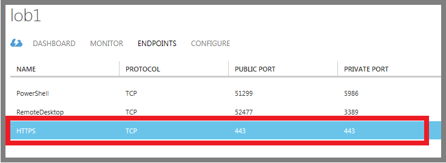
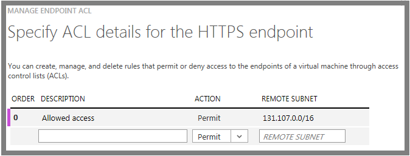

<properties urlDisplayName="Set up endpoints" pageTitle="Configuración de extremos en una máquina virtual en Azure" metaKeywords="Azure config setup, configuring vm connection" description="Learn how to setup communication with a virtual machine in Azure." metaCanonical="" services="virtual-machines" documentationCenter="" title="" authors="timlt" solutions="" manager="timlt" editor="" />

<tags ms.service="virtual-machines" ms.workload="infrastructure-services" ms.tgt_pltfrm="na" ms.devlang="na" ms.topic="article" ms.date="10/29/2014" ms.author="kathydav" />

#Configuración de extremos en una máquina virtual

**Nota**: Si desea conectar las máquinas virtuales directamente por nombre de host o configurar conexiones entre locales, consulte [Información general sobre redes virtuales de Azure](http://go.microsoft.com/fwlink/p/?LinkID=294063).

Todas las máquinas virtuales que se crean en Azure pueden comunicarse automáticamente mediante un canal de red privada con otras máquinas virtuales del mismo servicio en la nube o de la misma red virtual. Sin embargo, otros recursos en Internet u otras redes virtuales requieren extremos para administrar el tráfico de red entrante para la máquina virtual. 

Cuando cree una máquina virtual en el Portal de administración, puede crear esos extremos, como Escritorio remoto, comunicación remota de Windows PowerShell o Shell seguro (SSH). Una vez creada la máquina virtual, puede crear extremos adicionales si es necesario. También puede administrar el tráfico entrante para el puerto público configurando reglas para la lista de control de acceso a la red (ACL) del extremo. Este artículo le muestra cómo realizar ambas tareas.

Cada extremo cuenta con un puerto público y uno privado:

- La máquina virtual usa de manera interna el puerto privado para escuchar el tráfico del extremo.

- El equilibrador de carga de Azure usa el puerto público para comunicarse con la máquina virtual desde recursos externos. Una vez creado el extremo, puede usar la lista de control de acceso a la red (ACL) para definir reglas que ayuden a aislar y controlar el tráfico entrante en el puerto público. Para obtener más información, consulte [Acerca de las listas de control de acceso (ACL) de red](http://go.microsoft.com/fwlink/p/?LinkId=303816).

Se proporcionan los valores predeterminados para los puertos y el protocolo de estos extremos cuando los extremos se crean a través del Portal de administración. Para los demás extremos, especifique los puertos y el protocolo cuando cree el extremo. Los recursos pueden conectarse a un extremo mediante un protocolo TCP o UDP. El protocolo TCP incluye la comunicación HTTP y HTTPS.  

**Importante**: la configuración de firewall se realiza automáticamente para los puertos asociados a Escritorio remoto y Shell seguro (SSH), y en la mayoría de los casos para la comunicación remota de Windows PowerShell. No se realiza ninguna configuración de manera automática para el firewall en el sistema operativo invitado en los puertos especificados para los demás extremos. Una vez creado el extremo, necesitará configurar los puertos apropiados en el firewall para permitir el tráfico que pretenda redirigir a través del extremo.

###Creación de un extremo###

1. Si no lo ha hecho todavía, inicie sesión en el [Portal de administración de Azure](http://manage.windowsazure.com).

2. Haga clic en **Máquinas virtuales** y, a continuación, seleccione la máquina virtual que desea configurar.

3. Haga clic en **Extremos**. En la página Endpoints aparecen todos los extremos para la máquina virtual.

	

4.	Haga clic en **Agregar**.

	Aparecerá el cuadro de diálogo **Agregar extremo**. Elija el tipo de extremo. Si va a crear un nuevo conjunto de carga equilibrada, elija la opción independiente para crear el primer extremo en el conjunto.
	
5. En **Nombre**, escriba un nombre para el extremo.

6. En el protocolo, especifique **TCP** o **UDP**.

7. En **Puerto público** y **Puerto privado**, escriba los números de puerto que desee usar. Estos números de puerto pueden ser distintos. El puerto público es el punto de entrada para la comunicación desde fuera de Azure y lo usa el equilibrador de carga de Azure. Puede utilizar el puerto privado y las reglas de firewall en la máquina virtual para redirigir el tráfico de la manera más adecuada para su aplicación.

8. Haga clic en **Crear un conjunto de equilibrio de carga** si este extremo será el primero del conjunto de carga equilibrada. A continuación, en la página **Configurar el conjunto de carga equilibrada**, especifique información sobre el sondeo, el protocolo y un nombre. Los conjuntos con equilibrio de carga requieren un sondeo para que se pueda supervisar el estado del conjunto. Para obtener más información, consulte [Equilibrio de carga de máquinas virtuales](http://www.windowsazure.com/en-us/manage/windows/common-tasks/how-to-load-balance-virtual-machines/).  

9.	Haga clic en la marca de verificación para crear el extremo.

	Ahora verá el extremo en la página **Extremos**.

	

###Administración de ACL en un extremo###

Siga estos pasos para agregar, modificar o quitar una ACL en un extremo.

**Nota**: si el extremo forma parte de un conjunto con equilibrio de carga, los cambios que realice en la ACL en un extremo se aplican a todos los extremos del conjunto.

1. Si no lo ha hecho todavía, inicie sesión en el [Portal de administración de Azure](http://manage.windowsazure.com).

2. Haga clic en **Máquinas virtuales** y, a continuación, seleccione la máquina virtual que desea configurar.

3. Haga clic en **Extremos**. En la página Endpoints aparecen todos los extremos para la máquina virtual.

    

4. Seleccione el extremo apropiado de la lista. 

5. Haga clic en **Administrar dirección ACL**.

    Aparecerá el cuadro de diálogo **Especifique los detalles de ACL**.

    

6. Use las filas de la lista para agregar, eliminar o editar reglas para una ACL. El valor Remote Subnet se corresponde con el intervalo de la dirección IP que puede permitir o denegar como regla. Las reglas se evalúan en orden, comenzando por la primera regla y terminando por la última. Esto significa que las reglas deben aparecer de menos restrictivas a más restrictivas. Para obtener ejemplos y más información, consulte [Acerca de las listas de control de acceso (ACL) de red](http://go.microsoft.com/fwlink/p/?LinkId=303816).

<!--HONumber=35_1-->
