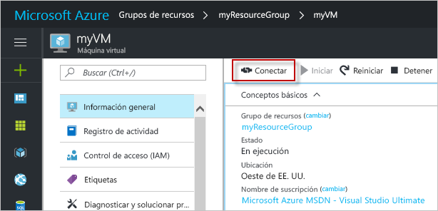
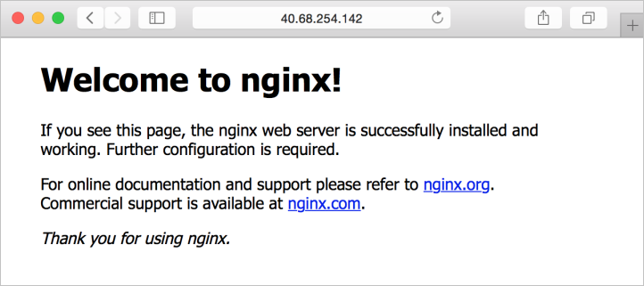

# <a name="quickstart-create-a-linux-virtual-machine-in-the-azure-portal"></a>Guía de inicio rápido: Creación de una máquina virtual Linux en Azure Portal

Las máquinas virtuales de Azure pueden crearse mediante Azure Portal. Este método proporciona una interfaz de usuario basada en explorador para crear máquinas virtuales y sus recursos asociados. En esta guía de inicio rápido se muestra cómo usar Azure Portal para implementar una máquina virtual (VM) Linux en Azure que ejecuta Ubuntu. Para ver la máquina virtual en acción, conéctese a la máquina virtual mediante SSH e instale el servidor web de NGINX.

Si no tiene una suscripción a Azure, cree una [cuenta gratuita](https://azure.microsoft.com/free/?WT.mc_id=A261C142F) antes de empezar.

## <a name="create-ssh-key-pair"></a>Creación del par de claves SSH

Necesita un par de claves SSH para completar esta guía de inicio rápido. Si ya tiene un par de claves SSH, puede omitir este paso.

Para crear un par de claves SSH e iniciar sesión en máquinas virtuales Linux, ejecute el siguiente comando desde un shell de Bash y siga las instrucciones en pantalla. Por ejemplo, puede usar [Azure Cloud Shell](../../cloud-shell/overview.md) o el [subsistema de Windows para Linux](/windows/wsl/install-win10). La salida del comando incluye el nombre del archivo de clave pública. Copie el contenido del archivo de clave pública (`cat ~/.ssh/id_rsa.pub`) en el Portapapeles.

```bash
ssh-keygen -t rsa -b 2048
```

Para más información sobre cómo crear pares de claves SSH, incluido el uso de PuTTy, consulte [Uso de claves SSH con Windows](ssh-from-windows.md).

## <a name="log-in-to-azure"></a>Inicio de sesión en Azure

Inicie sesión en Azure Portal en http://portal.azure.com

## <a name="create-virtual-machine"></a>Crear máquina virtual

1. Elija **Crear un recurso** en la esquina superior izquierda de Azure Portal.

2. En el cuadro de búsqueda encima de la lista de recursos de Azure Marketplace, busque y seleccione **Ubuntu Server 16.04 LTS** de Canonical y, a continuación, elija **Crear**.

3. Proporcione un nombre de máquina virtual, como *myVM*, deje el tipo de disco como *SSD* y proporcione un nombre de usuario, como *azureuser*.

4. En **Tipo de autenticación**, seleccione **Clave pública SSH** y luego pegue la clave pública en el cuadro de texto. Tenga cuidado de no quitar los espacios en blanco finales o iniciales de la clave pública.

    

5. Elija **Crear nuevo** para el grupo de recursos y proporcione un nombre, como *myResourceGroup*. Elija su **ubicación** deseada y seleccione **Aceptar**.

4. Seleccione un tamaño para la máquina virtual. Puede filtrar por *Tipo de proceso* o *Tipo de disco*, por ejemplo. Se recomienda un tamaño de máquina virtual de *D2s_v3*.

    

5. En la página **Configuración**, en **Red** > **Grupo de seguridad de red** > **Seleccionar puertos de entrada públicos**, seleccione **HTTP** y **SSH (22)**. Deje el resto de valores predeterminados y seleccione **Aceptar**.

6. En la página de resumen, seleccione **Crear** para iniciar la implementación de la máquina virtual.

7. La máquina virtual se ancla al panel de Azure Portal. Una vez completada la implementación, se abrirá automáticamente el resumen de la máquina virtual.

## <a name="connect-to-virtual-machine"></a>Conexión a la máquina virtual

Cree una conexión SSH con la máquina virtual.

1. Seleccione el botón **Conectar** en la página de información general de la máquina virtual. 

    

2. En la página **Connect to virtual machine** (Conexión a una máquina virtual), mantenga las opciones predeterminadas para conectarse por nombre DNS a través del puerto 22. En **Login using VM local account** (Iniciar sesión mediante la cuenta local de máquina virtual), se muestra un comando de conexión. Haga clic en el botón para copiar el comando. En el ejemplo siguiente se muestra el aspecto que tiene el comando de conexión SSH:

    ```bash
    ssh azureuser@myvm-123abc.eastus.cloudapp.azure.com
    ```

3. Pegue el comando de conexión SSH en un shell, como Azure Cloud Shell o Bash en Ubuntu, en Windows para crear la conexión. 

## <a name="install-web-server"></a>Instalación del servidor web

Para ver la máquina virtual en acción, instale al servidor de web de NGINX. Para actualizar los orígenes del paquete e instalar el paquete más reciente de NGINX, ejecute los siguientes comandos en la sesión de SSH.

```bash
# update packages
sudo apt-get -y update

# install NGINX
sudo apt-get -y install nginx
```

Cuando haya finalizado, use el comando `exit` para cerrar la sesión de SSH y volver a las propiedades de máquina virtual en Azure Portal.


## <a name="view-the-web-server-in-action"></a>Visualización del servidor web en acción

Con NGINX instalado y el puerto 80 abierto para la máquina virtual, se puede acceder ahora al servidor web desde Internet. Abra un explorador web y escriba la dirección IP pública de la máquina virtual. La dirección IP pública puede encontrarse en la página de información general de la máquina virtual o en la parte superior de la página *Redes* donde se agrega la regla de puerto de entrada.



## <a name="clean-up-resources"></a>Limpieza de recursos

Cuando ya no los necesite, puede eliminar el grupo de recursos, la máquina virtual y todos los recursos relacionados. Para ello, seleccione el grupo de recursos de la máquina virtual, seleccione **Eliminar** y luego confirme el nombre del grupo de recursos para eliminar.

## <a name="next-steps"></a>Pasos siguientes

En esta guía de inicio rápido, implementó una máquina virtual sencilla, creó un grupo de seguridad de red y una regla e instaló un servidor web básico. Para más información acerca de las máquinas virtuales de Azure, continúe con el tutorial de máquinas virtuales Linux.

> [!div class="nextstepaction"]
> [Tutoriales de máquinas virtuales Linux de Azure](./tutorial-manage-vm.md)
