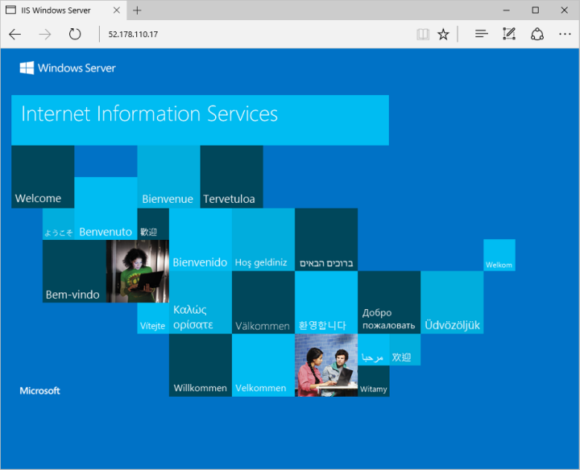

# <a name="create-a-windows-virtual-machine-with-the-azure-portal"></a>Cree una máquina virtual Windows en Azure Portal.

Las máquinas virtuales de Azure pueden crearse a través de Azure Portal. Este método proporciona una interfaz de usuario basada en el explorador para crear y configurar máquinas virtuales y todos los recursos asociados. Esta guía de inicio rápido le lleva paso a paso por la creación de una máquina virtual y la instalación de un servidor web en ella.

Si no tiene una suscripción a Azure, cree una [cuenta gratuita](https://azure.microsoft.com/free/?WT.mc_id=A261C142F) antes de empezar.

## <a name="log-in-to-azure"></a>Inicio de sesión en Azure

Inicie sesión en Azure Portal en https://portal.azure.com.

## <a name="create-virtual-machine"></a>Crear máquina virtual

1. Haga clic en **Crear un recurso** en la esquina superior izquierda de Azure Portal.

2. Seleccione **Compute** y, después, seleccione **Windows Server 2016 Datacenter**. 

3. Escriba la información de la máquina virtual. El nombre de usuario y la contraseña que especifique aquí se usarán para iniciar sesión en la máquina virtual. La contraseña debe tener al menos 12 caracteres de largo y cumplir con los [requisitos de complejidad definidos](faq.md#what-are-the-password-requirements-when-creating-a-vm). Cuando haya terminado, haga clic en **Aceptar**.

      

4. Seleccione un tamaño para la máquina virtual. Para ver más tamaños, seleccione **Ver todo** o cambie el filtro **Supported disk type** (Tipo de disco admitido). 

      

5. En **Configuración**, conserve los valores predeterminados y haga clic en **Aceptar**. 

6. En la página Resumen, haga clic en **Aceptar** para iniciar la implementación de máquina virtual.

7. La máquina virtual se anclará al panel de Azure Portal. Una vez completada la implementación, se abrirá automáticamente el resumen de la máquina virtual.


## <a name="connect-to-virtual-machine"></a>Conexión a la máquina virtual

Cree una conexión a Escritorio remoto en la máquina virtual.

1. Haga clic en el botón **Conectar** en las propiedades de la máquina virtual. Se crea y se descarga un archivo de Protocolo de Escritorio remoto (archivo .rdp).

     

2. Para conectarse a la máquina virtual, abra el archivo RDP descargado. Cuando se le solicite, haga clic en **Conectar**. En un equipo Mac, necesita un cliente RDP como este [Cliente de Escritorio remoto](https://itunes.apple.com/us/app/microsoft-remote-desktop/id715768417?mt=12) de Mac App Store.

3. Escriba el nombre de usuario y la contraseña que especificó al crear la máquina virtual y, a continuación, haga clic en **Aceptar**.

4. Puede recibir una advertencia de certificado durante el proceso de inicio de sesión. Haga clic en **Sí** o **Conectar** para continuar con la conexión.


## <a name="install-iis-using-powershell"></a>Instalación de IIS mediante PowerShell

En la máquina virtual, inicie una sesión de PowerShell y ejecute el siguiente comando para instalar IIS.

```powershell
Install-WindowsFeature -name Web-Server -IncludeManagementTools
```

Cuando haya finalizado, salga de la sesión de RDP y vuelva a las propiedades de la máquina virtual de Azure Portal.

## <a name="open-port-80-for-web-traffic"></a>Apertura del puerto 80 para el tráfico web 

Los grupos de seguridad de red (NSG) protegen el tráfico entrante y saliente. Cuando se crea una máquina virtual desde Azure Portal, se crea una regla de entrada en el puerto 3389 para las conexiones RDP. Dado que esta máquina virtual hospeda un servidor web, es preciso crear una regla de NSG para el puerto 80.

1. En la máquina virtual, haga clic en el nombre del **grupo de recursos**.
2. Seleccione el **grupo de seguridad de red**. Los NSG pueden identificarse mediante la columna **Tipo**. 
3. En el menú de la izquierda, en Configuración, haga clic en **Reglas de seguridad de entrada**.
4. Haga clic en **Agregar**.
5. En **Nombre**, escriba **http**. Asegúrese de que **Intervalo de puertos** esté establecido en 80 y **Acción** esté establecido en **Permitir**. 
6. Haga clic en **OK**.


## <a name="view-the-iis-welcome-page"></a>Página principal de IIS

Con IIS instalado y el puerto 80 abierto para la máquina virtual, se puede acceder ahora al servidor web desde Internet. Abra un explorador web y escriba la dirección IP pública de la máquina virtual. La dirección IP pública puede encontrarse en *Máquinas virtuales* en Azure Portal.

 

## <a name="clean-up-resources"></a>Limpieza de recursos

Cuando ya no los necesite, elimine el grupo de recursos, la máquina virtual y todos los recursos relacionados. Para ello, seleccione el grupo de recursos de la máquina virtual y haga clic en **Eliminar**.

## <a name="next-steps"></a>Pasos siguientes

En esta guía de inicio rápido, ha implementado una máquina virtual simple y una regla de grupo de seguridad de red, y ha instalado un servidor web. Para más información acerca de las máquinas virtuales de Azure, continúe con el tutorial de máquinas virtuales Windows.

> [!div class="nextstepaction"]
> [Tutoriales de máquinas virtuales Windows de Azure](./tutorial-manage-vm.md)
