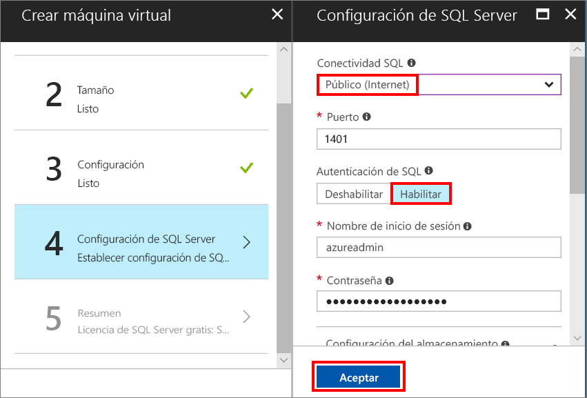
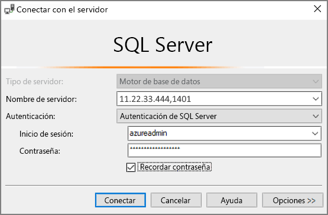

# Inicio rápido: Creación de una máquina virtual Windows de SQL Server 2017 en Azure Portal

> [!div class="op_single_selector"]
> * [Windows](quickstart-sql-vm-create-portal.md)
> * [Linux](../../linux/sql/provision-sql-server-linux-virtual-machine.md)

Esta guía de inicio rápido le ayuda a crear una máquina virtual de SQL Server en Azure Portal.

> [!TIP]
> Esta guía de inicio rápido describe una manera de aprovisionar y conectarse a una máquina virtual de SQL rápidamente. Para más información sobre otras opciones de aprovisionamiento de máquinas virtuales de SQL, consulte la [guía de aprovisionamiento de máquinas virtuales Windows de SQL Server en Azure Portal](virtual-machines-windows-portal-sql-server-provision.md).

> [!TIP]
> Si tiene alguna pregunta sobre las máquinas virtuales de SQL Server, consulte las [Preguntas más frecuentes](virtual-machines-windows-sql-server-iaas-faq.md).

##  Obtener una suscripción de Azure

Si no tiene una suscripción a Azure, cree una [cuenta gratuita](https://azure.microsoft.com/free/?WT.mc_id=A261C142F) antes de empezar.

##  Seleccionar una imagen de máquina virtual de SQL Server

1. Inicie sesión en [Azure Portal](https://portal.azure.com) con su cuenta.

1. En Azure Portal, haga clic en **Crear un recurso**. 

1. En el campo de búsqueda, escriba **SQL Server 2017 Developer on Windows Server 2016** y presione ENTRAR.

1. Seleccione la imagen de **Free SQL Server License: SQL Server 2017 Developer en Windows Server 2016**.

   

   > [!TIP]
   > La edición Developer se usa en este tutorial porque es una edición completa de SQL Server que es gratuita para desarrollo y pruebas. Solo paga por el costo de ejecutar la máquina virtual. Para conocer al detalle las consideraciones sobre precios, consulte la [guía de precios para máquinas virtuales de Azure de SQL Server](virtual-machines-windows-sql-server-pricing-guidance.md).

1. Haga clic en **Create**(Crear).

##  Proporcionar los detalles básicos

En la ventana **Datos básicos**, especifique la siguiente información:

1. En el campo **Nombre**, escriba un nombre único para la máquina virtual. 

1. En el campo **Nombre de usuario**, escriba un nombre para la cuenta de administrador local en la máquina virtual.

1. Proporcione una contraseña segura en **Contraseña**.

1. Escriba un nuevo nombre para el **grupo de recursos**. Este grupo ayuda a administrar todos los recursos asociados con la máquina virtual.

1. Compruebe el resto de valores de configuración predeterminados y haga clic en **Aceptar** para continuar.

   

## Elección del tamaño de la máquina virtual

1. En el paso **Tamaño**, elija un tamaño de máquina virtual en la ventana **Elegir un tamaño**.

   Para esta guía de inicio rápido, seleccione **D2S_V3**. El portal muestra el costo mensual estimado de la máquina por el uso continuo (sin incluir los costos de licencia de SQL Server). Tenga en cuenta que la edición Developer no agrega ningún costo adicional a la licencia de SQL Server. Para obtener información de precios más específica, consulte la [página de precios](https://azure.microsoft.com/pricing/details/virtual-machines/windows/).

   > [!TIP]
   > El tamaño de máquina **D2S_V3** ahorra dinero durante las pruebas. Para cargas de trabajo de producción, consulte las recomendaciones de tamaño de máquina y configuración en [Procedimientos recomendados de SQL Server en Azure Virtual Machines](virtual-machines-windows-sql-performance.md).

1. Haga clic en **Seleccionar** para continuar.

## Configuración de características opcionales

1. En la ventana **Configuración**, seleccione el puerto **RDP (3389)** en la lista **Select public inbound ports** (Seleccionar puertos de entrada públicos) si quiere iniciar una sesión de Escritorio remoto en la máquina virtual.

   

   > [!NOTE]
   > Puede seleccionar el puerto **MS SQL (1433)** para acceder a SQL Server de forma remota. Sin embargo, esto no es necesario porque el paso **Configuración de SQL Server** también proporciona esta opción. Si selecciona el puerto 1433 en este paso, se abrirá independientemente de las selecciones realizadas en el paso **Configuración de SQL Server**.

1. Haga clic en **Aceptar** para guardar los cambios y continuar.

## Configuración de SQL Server

En la ventana **Configuración de SQL Server**, configure las siguientes opciones.

1. En la lista desplegable **Conectividad SQL**, seleccione **Publica (Internet)**. Esta opción permite conexiones de SQL Server través de Internet.

1. Cambie el valor de **Puerto** a **1401** para evitar el uso de un nombre de puerto conocido por todos en el escenario público.

1. En **Autenticación de SQL**, haga clic en **Habilitar**. El inicio de sesión de SQL se establece en el mismo nombre de usuario y contraseña que ha configurado para la máquina virtual.

1. Cambie cualquier otro valor de configuración, si es necesario, y haga clic en **Aceptar** para completar la configuración de la máquina virtual de SQL Server.

   

## Creación de la máquina virtual de SQL Server

En la ventana **Resumen**, revise el resumen y haga clic en **Comprar** para crear la instancia de SQL Server, el grupo de recursos y los recursos especificados para esta máquina virtual.

Puede supervisar la implementación desde Azure Portal. En el botón **Notificaciones** de la parte superior de la pantalla, se muestra el estado básico de la implementación.

> [!TIP]
> La implementación de una máquina virtual Windows de SQL Server puede llevar varios minutos.

## Conexión con SQL Server

1. En el portal, busque la **dirección IP pública** de la máquina virtual en la sección **Información general** de las propiedades de la máquina virtual.

1. En un equipo conectado a Internet diferente, abra SQL Server Management Studio (SSMS).

   > [!TIP]
   > Si no tiene SQL Server Management Studio, puede descargarla [aquí](https://docs.microsoft.com/sql/ssms/download-sql-server-management-studio-ssms).

1. En el cuadro de diálogo **Conectar al servidor** o **Conectarse al motor de base de datos**, edite el valor de **Nombre del servidor**. Escriba la dirección IP pública de la máquina virtual. A continuación, agregue una coma y el puerto personalizado **1401**, que se especificó cuando configuró la nueva máquina virtual. Por ejemplo, `11.22.33.444,1401`.

1. En el cuadro **Autenticación**, seleccione **Autenticación de SQL Server**.

1. En el cuadro **Inicio de sesión** , escriba un nombre de inicio de sesión de SQL válido.

1. En el cuadro **Contraseña** , escriba la contraseña de inicio de sesión.

1. Haga clic en **Conectar**.

    

##  Iniciar sesión en la máquina virtual de forma remota

Use los pasos siguientes para conectarse a la máquina virtual de SQL Server con Escritorio remoto:

[!INCLUDE [Connect to SQL Server VM with remote desktop](../../../../includes/virtual-machines-sql-server-remote-desktop-connect.md)]

Después de conectarse a la máquina virtual de SQL Server, puede iniciar SQL Server Management Studio y conectarse con la autenticación de Windows mediante sus credenciales de administrador local. Si ha habilitado la autenticación de SQL Server, también puede conectarse con la autenticación de SQL mediante el inicio de sesión de SQL y la contraseña configurada durante el aprovisionamiento.

El acceso a la máquina le permite cambiar directamente la máquina y la configuración de SQL Server según sus necesidades. Por ejemplo, podría configurar el firewall o cambiar la configuración de SQL Server.

## Limpieza de recursos

Si no necesita que la máquina virtual de SQL se ejecute continuamente, puede detenerla cuando no esté en uso y así evitar cargos innecesarios. También puede eliminar de forma definitiva todos los recursos asociados con la máquina virtual mediante la eliminación de su grupo de recursos asociado en el portal. Como esta acción también elimina la máquina virtual definitivamente, use este comando con cuidado. Para más información, consulte [Administración de recursos de Azure en el portal](../../../azure-resource-manager/resource-group-portal.md).

## Pasos siguientes

En esta guía de inicio rápido, ha creado una máquina virtual de SQL Server 2017 en Azure Portal. Para aprender más sobre la migración de los datos a la nueva instancia de SQL Server, consulte el artículo siguiente.

> [!div class="nextstepaction"]
> [Migración de una base de datos a una máquina virtual SQL](virtual-machines-windows-migrate-sql.md)
