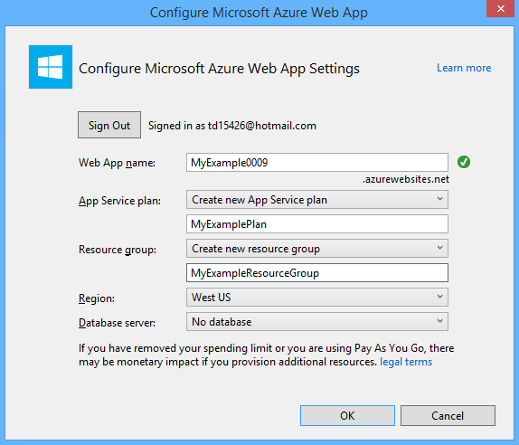
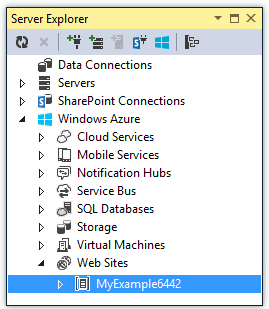
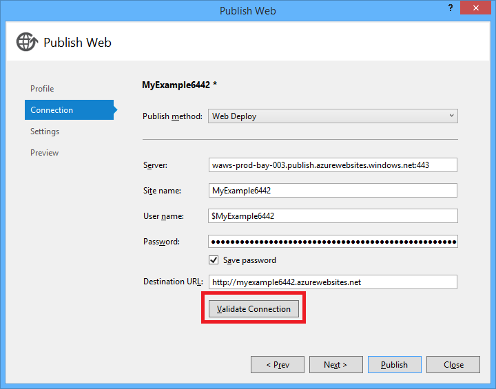
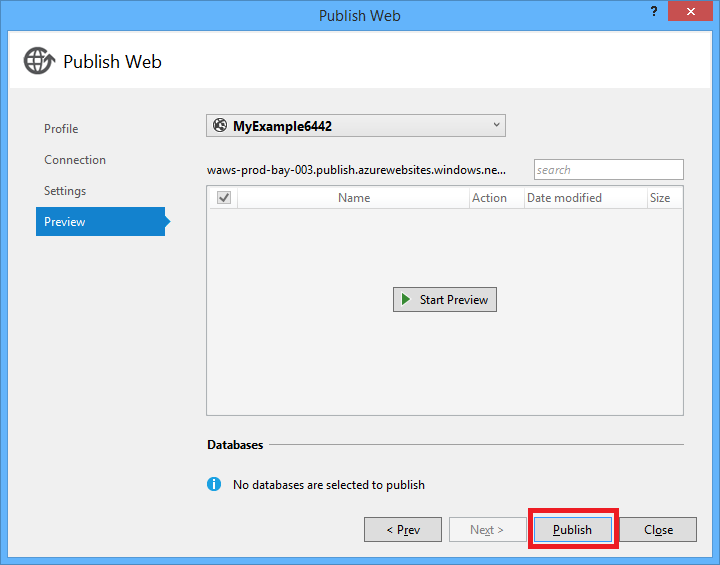
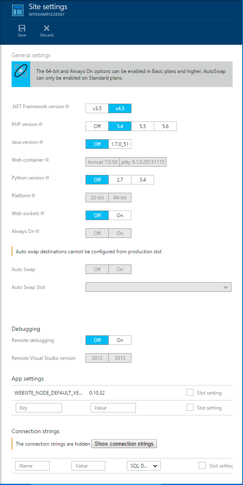

<properties 
	pageTitle="Creación de una aplicación web ASP.NET en el Servicio de aplicaciones de Azure" 
	description="Este tutorial muestra cómo crear un proyecto web ASP.NET en Visual Studio 2013 e implementarlo en una aplicación web en el Servicio de aplicaciones de Azure. En menos de 15 minutos, tendrá una aplicación en funcionamiento en la nube." 
	services="app-service\web" 
	documentationCenter=".net" 
	authors="tdykstra" 
	manager="wpickett" 
	editor="mollybos"/>

<tags 
	ms.service="app-service-web" 
	ms.workload="web" 
	ms.tgt_pltfrm="na" 
	ms.devlang="dotnet" 
	ms.topic="hero-article" 
	ms.date="03/24/2015" 
	ms.author="tdykstra"/>

# Creación de una aplicación web ASP.NET en el Servicio de aplicaciones de Azure

## Información general

Este tutorial muestra cómo crear una aplicación web ASP.NET e implementarla en [aplicaciones web del Servicio de aplicaciones ](http://go.microsoft.com/fwlink/?LinkId=529714) con Visual Studio 2013 o Visual Studio Express 2013 para Web. En este tutorial se supone que no tiene ninguna experiencia previa con Azure o ASP.NET. Cuando acabe, tendrá una sencilla aplicación web que se ejecutará en la nube.

Aprenderá a realizar los siguientes procedimientos:

* Habilitación de su equipo para desarrollar contenido de Azure mediante la instalación del SDK de Azure.
* Creación de un proyecto web de Visual Studio ASP.NET y su posterior  implementación en un sitio web de Azure.
* Realización de cambios en el proyecto web y reimplementación de la aplicación.
* Uso del [Portal de Azure](http://go.microsoft.com/fwlink/?LinkId=529715) para supervisar y administrar la aplicación web.

Para completar este tutorial, deberá tener una cuenta de Azure:

* Puede [abrir una cuenta de Azure de manera gratuita](/pricing/free-trial/?WT.mc_id=A261C142F): obtiene créditos que puede utilizar para probar los servicios de Azure de pago, e incluso una vez agotados estos, podrá mantener la cuenta y utilizar servicios gratuitos de Azure, como Aplicaciones web del Servicio de aplicaciones.
* Puede [activar las ventajas de suscriptor de MSDN](/pricing/member-offers/msdn-benefits-details/?WT.mc_id=A261C142F): su suscripción a MSDN le proporciona créditos todos los meses que puede utilizar para servicios de Azure de pago.</li>

La siguiente ilustración muestra la aplicación completada:

##Suscribirse a Microsoft Azure \(vídeo\)

En este vídeo, Scott Hanselman presenta lo sencillo que resulta suscribirse para una prueba gratuita de Microsoft Azure. \(Duración: 1:58\)

> [AZURE.VIDEO sign-up-for-microsoft-azure]

[AZURE.INCLUDE [install-sdk-2013-only](../includes/install-sdk-2013-only.md)]

## Creación de una aplicación web ASP.NET

El primer paso es crear un proyecto de aplicación web. Visual Studio creará automáticamente la aplicación web de Azure en la que implementará el proyecto más adelante.

1. Abra Visual Studio 2013 o Visual Studio 2013 Express para Web.

2. En el menú **Archivo**, haga clic en **Nuevo proyecto**.

3. En el cuadro de diálogo **Nuevo proyecto**, haga clic en **C\#** \> **Web** \> **Aplicación Web ASP.NET**. Si lo prefiere, puede elegir **Visual Basic**.

3. Asegúrese de que **.NET Framework 4.5** sea el marco de trabajo de destino seleccionado.

4. Desactive la casilla **Agregar Application Insights al proyecto**.
 
4. Póngale a la aplicación el nombre **MyExample** y haga clic en **Aceptar**.

	

5. En el cuadro de diálogo **Nuevo proyecto de ASP.NET**, seleccione la plantilla **MVC**. Si prefiere trabajar con formularios Web Forms de ASP.NET, seleccione la plantilla **Formularios Web Forms**.

	[MVC y Formularios Web Forms](http://www.asp.net/get-started/websites) son marcos de ASP.NET para el desarrollo de aplicaciones web. Para este tutorial puede elegir cualquiera de ellos, pero si elige Formularios Web Forms, tendrá que editar *Default.aspx* más adelante, cuando en el tutorial se le indique que edite *Index.cshtml*.

7. Haga clic en **Cambiar autenticación**.

	

6. En el cuadro de diálogo **Cambiar autenticación**, haga clic en **Sin autenticación** y, a continuación, en **Aceptar**.

	

	La aplicación de ejemplo que va a crear no permitirá a los usuarios iniciar sesión. La sección [Pasos siguientes](#next-steps) vincula a un tutorial que implementa la autenticación y autorización.

5. En el cuadro de diálogo **Nuevo proyecto de ASP.NET**, no altere la configuración de en **MicrosoftAzure** y, a continuación, haga clic en **Aceptar**.

	

	La configuración predeterminada especifica que Visual Studio creará una aplicación web de Azure para el proyecto web. En la siguiente sección del tutorial, implementará el proyecto web en la aplicación web recién creada.

5. Si aún no ha iniciado sesión en Azure, Visual Studio le pedirá que lo haga. Inicie sesión con el identificador y la contraseña de la cuenta que utiliza para administrar la suscripción de Azure.
	
	Cuando haya iniciado sesión, el cuadro de diálogo **Configuración de aplicación web de Microsoft Azure** le preguntará qué recursos desea crear.

	

3. En el cuadro de diálogo **Configuración de aplicación web de Microsoft Azure**, deje el valor predeterminado.
 
	Si lo prefiere, puede especificar otro **nombre de aplicación web**, pero el nombre debe ser único en el dominio *azurewebsites.net*. El nombre predeterminado que proporciona Visual Studio es único.

	Azure usará este nombre como prefijo de la dirección URL de la aplicación. La dirección URL completa se compondrá de lo que escriba aquí más *. azurewebsites.net* \(como se muestra junto al cuadro de texto **Nombre de aplicación Web**\). Por ejemplo, si el nombre es `MyExample6442`, la dirección URL será `MyExample6442.azurewebsites.net`. La dirección URL debe ser única. Si elige una dirección URL que ya haya usado otro usuario, aparecerá un signo de exclamación rojo a la derecha, en lugar de una marca de verificación verde, y tendrá que especificar otro nombre.

4. En la lista desplegable **Plan del Servicio de aplicaciones**, seleccione **Crear nuevo plan del Servicio de aplicaciones**.

	La sección [Pasos siguientes](#next-steps), que se encuentra al final del tutorial, contiene vínculos a información acerca de los planes del Servicio de aplicaciones.

5. Escriba *MyExamplePlan*, u otro nombre si lo prefiere, como nombre del plan.

6. En la lista desplegable **Grupo de recursos**, seleccione **Crear nuevo grupo de recursos**.

	La sección [Pasos siguientes](#next-steps) contiene vínculos a información acerca de los grupos de recursos.
 
5. Escriba *MyExampleResourceGroup*, u otro nombre si lo prefiere, como nombre del grupo de recursos.

5. En la lista desplegable **Región**, elija la ubicación más cercana.

	Este valor especifica el centro de datos de Azure en el que se ejecutará la aplicación web. Para este tutorial, puede seleccionar cualquier región y no habrá una diferencia notable, pero, para una aplicación web de producción, lo normal es que quiera tener el servidor web lo más cercano posible a los exploradores que accederán al sitio, con el fin de minimizar la [latencia](http://www.bing.com/search?q=web%20latency%20introduction&qs=n&form=QBRE&pq=web%20latency%20introduction&sc=1-24&sp=-1&sk=&cvid=eefff99dfc864d25a75a83740f1e0090).

5. No modifique el campo de la base de datos.

	En este tutorial no se utiliza una base de datos. En la sección [Pasos siguientes](#next-steps) del final del tutorial encontrará un vínculo a un tutorial que muestra cómo utilizar una base de datos.

6. Haga clic en **Aceptar**.

	

	En unos segundos, Visual Studio crea el proyecto web en la carpeta especificada y crea la aplicación web en la región de Azure especificada.

	La ventana del **Explorador de soluciones** ventana muestra los archivos y carpetas del nuevo proyecto.

	

	La ventana **Actividad del Servicio de aplicaciones de Azure** muestra que se ha creado la aplicación web.

	

	Y puede ver la aplicación web en el Explorador de servidores.

	

## Implementación de la aplicación en Azure

7. En la ventana **Actividad del Servicio de aplicaciones de Azure**, haga clic en **Publicar MyExample en esta aplicación web ahora**.

	

	En unos segundos aparecerá el Asistente para **publicación web**.

	La configuración que Visual Studio necesita para implementar el proyecto en Azure se ha guardado en un *perfil de publicación*. El asistente permite revisar y cambiar esta configuración.

8. En la pestaña **Conexión** del Asistente para **publicación web**, haga clic en **Validar conexión** para asegurarse de que Visual Studio pueda conectar con Azure para implementar el proyecto web.

	

	Una vez que se valide la conexión, aparecerá una marca de verificación verde junto al botón **Validar conexión**.

9. Haga clic en **Siguiente**.

	

10. En la pestaña **Configuración**, haga clic en **Siguiente**.

	

	Puede aceptar los valores predeterminados de **Configuración** y **Opciones de publicación de archivos**.

	La lista desplegable **Configuración** permite implementar una compilación de depuración para la depuración remota. La sección [Pasos siguientes](#next-steps) contiene vínculos a un tutorial que muestra cómo ejecutar Visual Studio en modo de depuración de forma remota.

	Si expande **Opciones de publicación de archivos**, varios valores de configuración que permiten controlar escenarios no aplicables a este tutorial:
 
	* Quitar archivos adicionales en destino.
	  
		Deletes any files at the server that aren't in your project. You might need this if you were deploying a project to a web app that you had deployed a different project to earlier.

	* Precompilar durante la publicación. 
	 
		Can reduce first-request warm up times for large applications.

	* Excluir archivos de la carpeta App\_Data. 
	 
		For testing you sometimes have a SQL Server database file in App_Data which you don't want to deploy to production.
	
11. En la pestaña **Vista previa**, haga clic en **Iniciar vista previa**.

	

	La pestaña muestra una lista de los archivos que se copiarán en el servidor. Para publicar la aplicación no es necesario mostrar la vista previa, pero se trata de una función útil que conviene conocer.

12. Haga clic en **Publicar**.

	

	Visual Studio comienza el proceso de copiar los archivos en el servidor de Azure.

	Las ventanas **Salida** y **Actividad de publicación web** muestran qué acciones de implementación se realizaron e informan de la correcta finalización de la implementación.

	

	Tras una implementación correcta, el explorador predeterminado se abre automáticamente en la dirección URL de la aplicación web implementada y la aplicación que creó se ejecuta ahora en la nube. La dirección URL en la barra de direcciones del explorador muestra que la aplicación web se está cargando desde Internet.

	

13. Cierre el explorador.

## Realización de cambios y nueva implementación

En esta sección del tutorial, cambiará el título **h1** de la página principal, ejecutará el proyecto en modo local en su equipo de desarrollo para comprobar el cambio y, a continuación, implementará el cambio en Azure.

2. Abra los archivos *Views/Home/Index.cshtml* o *.vbhtml* en el **Explorador de soluciones**, cambie el título **h1** de "ASP.NET" a "ASP.NET y Azure", y guarde el archivo. 

	

	

1. Presione CTRL + F5 para ver el título actualizado mediante la ejecución de la aplicación web en el equipo local.

	

	La dirección URL `http://localhost` muestra que se está ejecutando en el equipo local. De forma predeterminada se ejecuta en IIS Express, que es una versión ligera de IIS diseñada para el desarrollo de aplicaciones web.

1. Cierre el explorador.

1. En el **Explorador de soluciones**, haga clic con el botón derecho y seleccione **Publicar**.

	

	Aparece la pestaña Vista previa del Asistente para **publicación web**. Si tuviera que cambiar cualquier configuración de publicación podría elegir otra pestaña; sin embargo, ahora todo lo que desea es repetir la implementación con la misma configuración.

2. En el Asistente para **publicación web**, haga clic en **Publicar**.

	

	Visual Studio implementa el proyecto en Azure y abre la aplicación web en el explorador predeterminado.

	

**Sugerencia:** puede habilitar la barra de herramientas **Publicación en Web con un solo clic** para que la implementación sea aún más rápida. Haga clic en **Vista** \> **Barras de herramientas** y, a continuación, seleccione **Publicación en Web con un solo clic**. La barra de herramientas permite seleccionar un perfil, hacer clic en un botón para publicar o hacer clic en un botón para abrir el Asistente para **publicación web**.

## Supervisión y administración de la aplicación web en el Portal de administración

El [Portal de administración de Azure](/services/management-portal/) es una interfaz web que permite administrar y supervisar los servicios de Azure, por ejemplo, la aplicación web que acaba de crear. En esta sección del tutorial se examina una parte de lo que se puede hacer en el portal.
  
1. En el explorador, vaya a [http://portal.azure.com]() e inicie sesión con sus credenciales de Azure.

2. Haga clic en **Examinar \> Aplicaciones Web** y, a continuación, haga clic en el nombre de la aplicación web.

	La hoja **Aplicación web** de la aplicación web muestra información general de las estadísticas de uso y vínculos de las funciones de administración de aplicaciones web que más se usan.
  
	--\>

	Por ahora, la aplicación web no ha tenido mucho tráfico y puede que no se muestre nada en el gráfico. Si explora la aplicación, actualiza la página varias veces y después actualiza la página la página del portal, verá que aparecen algunas estadísticas.

3. Haga clic en **Toda la configuración** para ver más opciones para configurar la aplicación web.

	Verá una lista de los tipos de configuración.
  
	--\>

4. Haga clic en **Configuración de la aplicación** para ver un ejemplo de los tipos de configuración que se pueden establecer en el portal.

	Por ejemplo, puede controlar la versión de .NET que se utiliza para la aplicación web, habilitar características como [WebSockets](/blog/2013/11/14/introduction-to-websockets-on-windows-azure-web-sites/), establecer [valores de cadena de conexión](/blog/2013/07/17/windows-azure-web-sites-how-application-strings-and-connection-strings-work/) y mucho más.

	

Éstas son sólo algunas de las características del Portal de administración. Puede crear nuevas aplicaciones web, eliminar las existentes, detener y reiniciar aplicaciones web, y administrar otros tipos de servicios de Azure, como bases de datos y máquinas virtuales.

>[AZURE.NOTE]Si desea empezar a trabajar con el Servicio de aplicaciones de Azure antes de inscribirse para abrir una cuenta de Azure, vaya a [Prueba del Servicio de aplicaciones](http://go.microsoft.com/fwlink/?LinkId=523751), donde podrá crear inmediatamente una aplicación web de inicio de corta duración en el Servicio de aplicaciones. No se requiere tarjeta de crédito; sin compromisos.

## Pasos siguientes

En este tutorial, ha aprendido a crear una aplicación web sencilla e implementarla en una aplicación web de Azure. Estos son algunos temas y recursos relacionados que le permitirán obtener más información al respecto.

* Otros métodos de implementar un proyecto web

	En este tutorial ha visto el método más rápido para crear una aplicación web sencilla e implementarlo en una aplicación web de Azure. Para obtener información general sobre otras formas de implementación, ya sea con Visual Studio o con [automatización de la implementación](http://www.asp.net/aspnet/overview/developing-apps-with-windows-azure/building-real-world-cloud-apps-with-windows-azure/continuous-integration-and-continuous-delivery) desde un [sistema de control de código fuente](http://www.asp.net/aspnet/overview/developing-apps-with-windows-azure/building-real-world-cloud-apps-with-windows-azure/source-control), consulte [Implementación de una aplicación web de Azure](web-sites-deploy.md).

	Visual Studio también puede generar scripts de Windows PowerShell que permiten automatizar la implementación. Para obtener más información, consulte [Automatizar todo \(creación de aplicaciones en la nube para el mundo real con Azure\)](http://www.asp.net/aspnet/overview/developing-apps-with-windows-azure/building-real-world-cloud-apps-with-windows-azure/automate-everything).

* Administración de aplicaciones web en Visual Studio

	Para obtener información sobre las funciones de administración de aplicaciones web que se pueden usar en el **Explorador de servidores**, consulte [Solución de problemas de aplicaciones web de Azure en Visual Studio](web-sites-dotnet-troubleshoot-visual-studio.md).

* Solución de problemas de aplicaciones web

	Visual Studio proporciona características que facilitan la visualización de los registros de Azure conforme se generan, en tiempo real. La ejecución también se puede realizar en modo de depuración de manera remota en Azure. Para obtener más información, consulte [Solución de problemas de aplicaciones web de Azure en Visual Studio](web-sites-dotnet-troubleshoot-visual-studio.md).

* Incorporación de funcionalidad de base de datos y autorización

	Para ver un tutorial que muestra cómo acceder a una base de datos y restringir algunas funciones de aplicación a los usuarios autorizados, consulte [Implementación de una aplicación ASP.NET MVC segura con suscripción, OAuth y Base de datos SQL en una aplicación web de Azure](/develop/net/tutorials/web-site-with-sql-database/).

* Incorporación de un nombre de dominio personalizado y SSL

	Para obtener información acerca de cómo utilizar SSL y su propio dominio \(por ejemplo, www.contoso.com, en lugar de contoso.azurewebsites.net\), consulte los siguientes recursos:

	* [Configuración de un nombre de dominio personalizado para un sitio web de Azure](web-sites-custom-domain-name.md). 
	* [Habilitación de HTTPS en un sitio web de Azure](web-sites-configure-ssl-certificate.md)

* Cómo evitar el tiempo de espera de reactivación después de tiempos de espera de inactividad

	De forma predeterminada, las aplicaciones web se descargan si han estado inactivas durante algún tiempo. La primera solicitud después de este tiempo de inactividad tiene que esperar a que la aplicación web se cargue de nuevo. Para evitar el tiempo de espera, puede habilitar la característica AlwaysOn. Para obtener más información, consulte las opciones de configuración de [Configuración de aplicaciones web](web-sites-configure.md).

* Cómo agregar características en tiempo real \(por ejemplo, chat\)

	Si la aplicación web va a incluir características en tiempo real \(como un servicio de chat, un juego, un tablero de cotizaciones, etc.\), se puede optimizar el rendimiento usando [ASP.NET SignalR](http://www.asp.net/signalr) con el método de transporte [WebSockets](/blog/2013/11/14/introduction-to-websockets-on-windows-azure-web-sites/). Para obtener más información, consulte [Uso de SignalR con aplicaciones web de Azure](http://www.asp.net/signalr/overview/signalr-20/getting-started-with-signalr-20/using-signalr-with-windows-azure-web-sites).

* Selección entre Servicio de aplicaciones, Servicios en la nube y Máquinas virtuales de Azure para aplicaciones web

	En Azure puede ejecutar aplicaciones web en Aplicaciones web del Servicio de aplicaciones, como se muestra en este tutorial, o bien en Servicios en la nube o en Máquinas virtuales. Para obtener más información, consulte [Modelos de ejecución de Azure](/develop/net/fundamentals/compute/) y [Aplicaciones web de Azure, Servicios en la nube y Máquinas virtuales: ¿cuándo se usa cada opción?](/manage/services/web-sites/choose-web-app-service/).

* [Cómo elegir o crear un plan del Servicio de aplicaciones](azure-web-sites-web-hosting-plans-in-depth-overview.md)

* [Cómo elegir o crear un grupo de recursos](azure-preview-portal-using-resource-groups.md)

	  

## ¿Qué ha cambiado?
* Para obtener una guía del cambio de Sitios web a Servicio de aplicaciones, consulte: [Servicio de aplicaciones de Azure y su impacto en los servicios de Azure existentes](http://go.microsoft.com/fwlink/?LinkId=529714)
* Para obtener una guía del cambio del portal anterior al nuevo, consulte: [Referencia para navegar en el portal de vista previa](http://go.microsoft.com/fwlink/?LinkId=529715)

<!--HONumber=52-->
