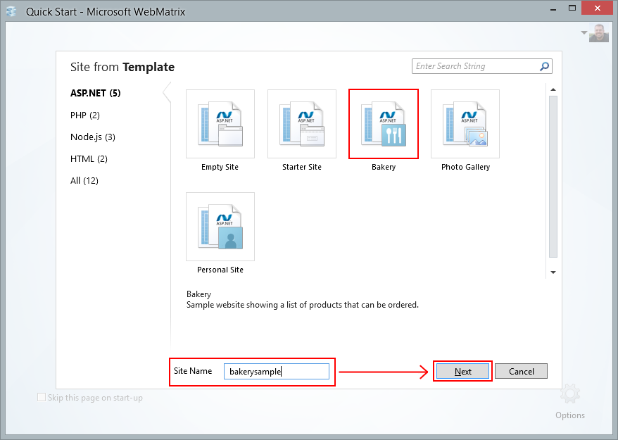
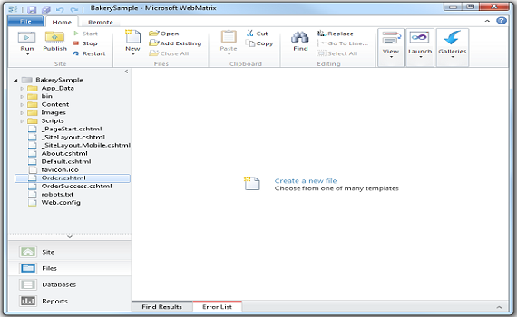
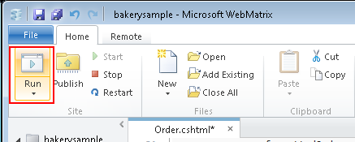
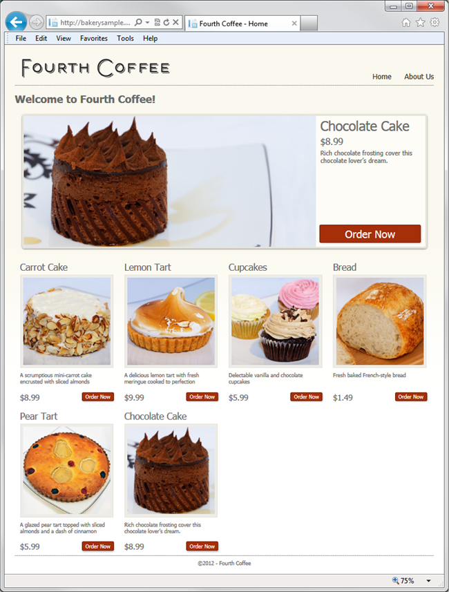
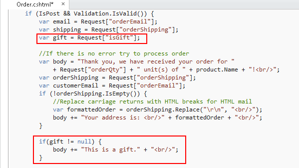
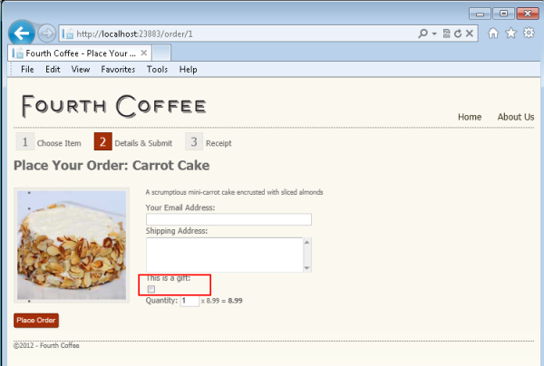

<properties linkid="develop-dotnet-website-with-webmatrix" urlDisplayName="Website with WebMatrix" pageTitle=".NET web site with WebMatrix - Azure tutorials" metaKeywords="WebMatrix Azure, WebMatrix Azure, Azure web site WebMatrix, Azure website WebMatrix, Web Matrix Azure, WebMatrix Azure" description="Learn how to develop and deploy an Azure web site with WebMatrix." metaCanonical="" services="web-sites" documentationCenter=".NET" title="Develop and deploy a web site with Microsoft WebMatrix" authors="" solutions="" manager="" editor="" />

Desarrollo e implementación de un sitio web con Microsoft WebMatrix
===================================================================

En esta guía se describe cómo usar Microsoft WebMatrix para crear e implementar un sitio web en Azure. Utilizará una aplicación de muestra de una plantilla del sitio de WebMatrix.

Aprenderá a:

-   Iniciar sesión en Azure desde WebMatrix
-   Crear un sitio mediante una plantilla integrada con WebMatrix
-   Implementar el sitio web personalizado directamente desde WebMatrix hasta Azure.

[WACOM.INCLUDE [create-account-and-websites-note](../includes/create-account-and-websites-note.md)]

Inicio de sesión en Azure
-------------------------

1.  Inicie WebMatrix.
2.  Si esta es la primera vez que utiliza WebMatrix 3, se le solicitará que inicie sesión en Azure. De lo contrario, puede hacer clic en el botón **Sign In** y seleccionar **Add Account**. Seleccione **Sign in** con su cuenta Microsoft.

    

3.  Si se registró para obtener una cuenta de Azure, puede iniciar sesión con su cuenta de Microsoft:

    

Creación de un sitio con una plantilla integrada para Azure
-----------------------------------------------------------

1.  En la pantalla de inicio, haga clic en el botón **New** y seleccione **Template Gallery** para crear un sitio nuevo a partir de la Galería de plantillas:

    

2.  La Galería de plantillas mostrará una lista de plantillas disponibles que se pueden ejecutar de manera local o en Azure. Seleccione **Bakery** en la lista de plantillas, escriba **bakerysample** para **Site Name** y haga clic en **Next**.

    

3.  Si inició sesión en Azure, ahora tiene la opción de crear un sitio web de Azure para su sitio local. Elija un nombre único y seleccione el centro de datos donde desea crear su sitio:

    

    Después de que WebMatrix finaliza la creación del sitio web, se muestra el IDE de WebMatrix:

    

Prueba del sitio web
--------------------

El ejemplo de la panadería incluye un formulario de pedido simulado que envía un mensaje de correo electrónico con el elemento pedido a una cuenta de Windows Live Hotmail que se proporciona.

1.  En el panel de navegación izquierdo de WebMatrix, expanda la carpeta **bakerysample**.

    

2.  Abra la página *Order.cshtml* haciendo doble clic en el nombre del archivo.

    

3.  Busque el comentario que dice //Configuración SMTP para Hotmail.

    

4.  Cambie los valores de las siguientes líneas para que coincidan con los de su proveedor de correo electrónico:

         WebMail.SmtpServer = "smtp.live.com";
         WebMail.SmtpPort  = 25;
         WebMail.EnableSsl = true; 

         //Escriba sus credenciales de Nombre de usuario/Contraseña de Hotmail y una dirección "De" para el correo electrónico
         WebMail.UserName = "";
         WebMail.Password = "";
         WebMail.From = "";

    Cambie el valor de WebMail.SmtpServer por el nombre del servidor de correo que usa generalmente para enviar correo electrónico. Posteriormente, rellene los valores de nombre de usuario y contraseña. Establezca la propiedad De en su dirección de correo electrónico.

5.  En la cinta de WebMatrix, haga clic en **Run** para probar el sitio.

    

6.  Haga clic en **Order Now** en uno de los productos y envíese un pedido.

7.  Compruebe su correo electrónico y asegúrese de que recibió la confirmación del pedido. Si tiene dificultades para enviar correo electrónico, consulte la sección de [problemas con el envío de correo electrónico](http://go.microsoft.com/fwlink/?LinkId=253001#email) (en inglés) en la Guía de solución de problemas de las páginas web de ASP.NET (Razor).

Implementación del sitio web personalizado de WebMatrix a Azure
---------------------------------------------------------------

1.  En WebMatrix, haga clic en **Publish** desde la cinta **Home** para ver el cuadro de diálogo **Publish Preview** del sitio web.

    

2.  Haga clic para activar la casilla junto a bakery.sdf y, a continuación, haga clic en **Continue**. Cuando se completa la publicación, la dirección URL del sitio web actualizado en Azure se muestra en la parte inferior del IDE de WebMatrix.

    

3.  Haga clic en el vínculo para abrir el sitio web en su explorador:

    

    La dirección URL del sitio web también se puede encontrar en el portal de Azure al hacer clic en **Sitios web** para mostrar todos los sitios web de su suscripción. La dirección URL de cada sitio web se muestra en la columna URL en la página de sitios web.

Modificación del sitio web y nueva publicación en el sitio web de Azure
-----------------------------------------------------------------------

Puede usar WebMatrix para modificar el sitio y volver a publicarlo en su sitio web de Azure. En el siguiente procedimiento agregará una casilla para indicar que el pedido es un regalo.

1.  Abra la página *Order.cshtml*.

2.  Localice la definición de la forma de clase de "envío". Inserte el siguiente código justo después del bloque &lt;li\>.

         <li class="gift">
             

                 <label for="isGift">This is a gift</label>           
                 
@Html.CheckBox("isGift")

             

         </li>

    

3.  Localice la línea "var shipping = Request["orderShipping"];" en el archivo e inserte la siguiente línea de código inmediatamente después.

         var gift = Request["isGift"];

4.  Justo después del bloque de código que valida que la dirección de envío no está vacía en el siguiente fragmento de código.

         if(gift != null) {
             body += "This is a gift." + " ";
         }

    Su archivo *order.cshtml* debe parecerse a la siguiente imagen.

    

5.  Guarde el archivo y ejecute el sitio de manera local y envíese un pedido de prueba. Asegúrese de probar la casilla nueva.

    

6.  Vuelva a publicar el sitio haciendo clic en **Publish** en la cinta **Home**.

7.  En el cuadro de diálogo **Publish Preview**, asegúrese de que ambos Order.cshtml estén marcados y haga clic para continuar.

8.  Haga clic en el vínculo para abrir el sitio web en su explorador y pruebe la actualización en su sitio web de Azure.

Pasos siguientes
================

Ha aprendido a crear e implementar un sitio web de WebMatrix en Azure. Para obtener más información sobre WebMatrix, consulte estos recursos:

-   [WebMatrix for Azure](http://go.microsoft.com/fwlink/?LinkID=253622&clcid=0x409)

-   [Sitio web de WebMatrix (en inglés)](http://www.microsoft.com/click/services/Redirect2.ashx?CR_CC=200106398)

