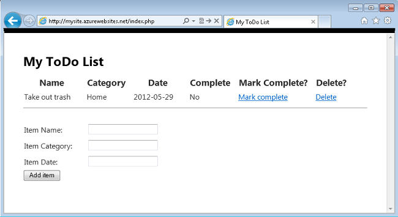
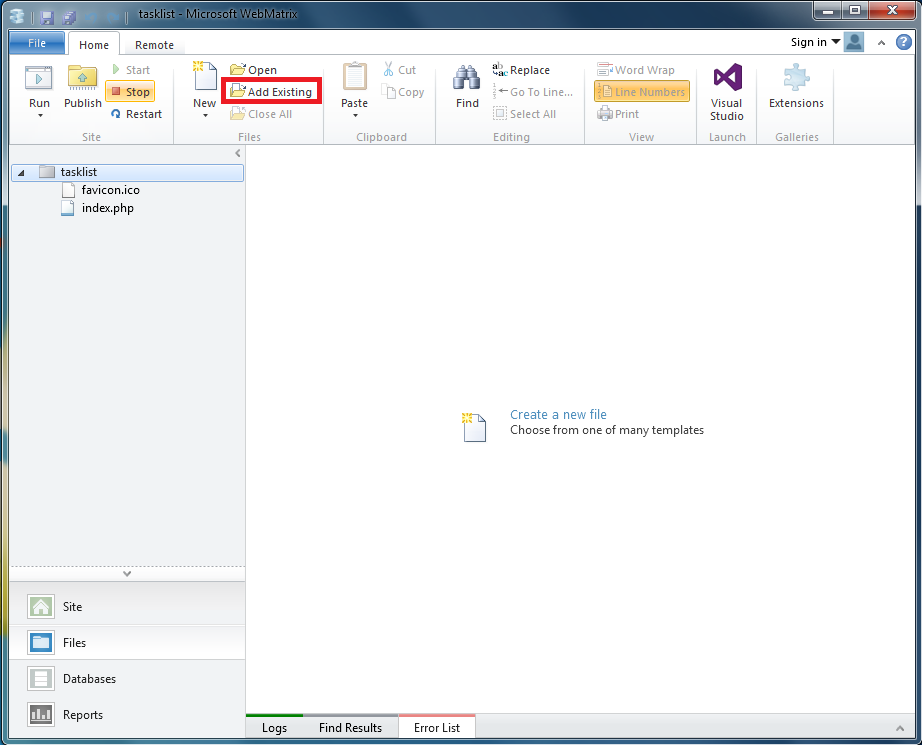
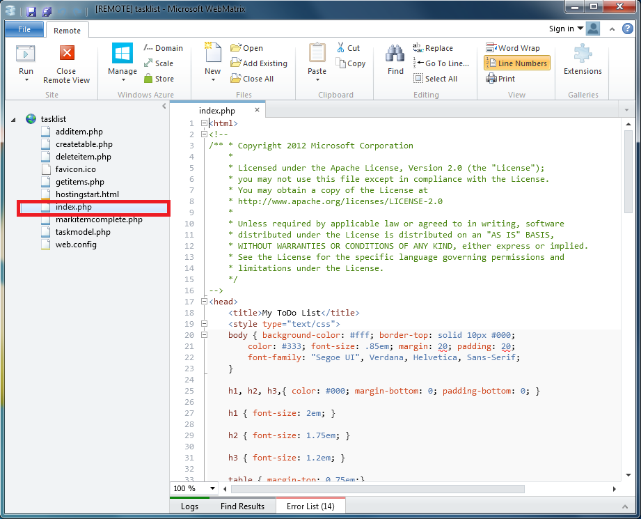

<properties linkid="develop-php-website-with-sql-database-and-webmatrix" urlDisplayName="Web w/ SQL + WebMatrix" pageTitle="PHP web site with SQL Database and WebMatrix - Azure" metaKeywords="" description="A tutorial that demonstrates how to use the free WebMatrix IDE to create and deploy a PHP web site that stores data in SQL Database." metaCanonical="" services="" documentationCenter="" title="Create and Deploy a PHP Web Site and SQL Database using WebMatrix" authors="" solutions="" manager="" editor="mollybos" />

Creación e implementación de un sitio web PHP y una base de datos SQL con WebMatrix
===================================================================================

Este tutorial le muestra cómo usar WebMatrix para desarrollar e implementar una aplicación PHP que usa una base de datos SQL de Azure en un sitio web de Azure. WebMatrix es una herramienta gratuita de desarrollo web de Microsoft que incluye todo lo que necesita para el desarrollo del sitio web. WebMatrix es compatible con PHP e incluye intelliSense para el desarrollo de PHP.

En este tutorial se presupone que ha instalado [SQL Server Express](http://www.microsoft.com/en-us/download/details.aspx?id=29062) en el equipo, por lo que puede realizar una prueba local de la aplicación. Sin embargo, puede completar el tutorial sin tener SQL Server Express instalado. En ese caso, puede implementar la aplicación directamente en Sitios web Azure.

Una vez completada esta guía, tendrá un sitio web PHP-Base de datos SQL que se ejecutará en Azure.

Aprenderá a:

-   Crear un sitio web de Azure y una base de datos SQL a través del Portal de administración. Dado que PHP está habilitado en Sitios web Azure de forma predeterminada, no existen requisitos especiales para ejecutar el código PHP.
-   Desarrollar una aplicación PHP con WebMatrix.
-   Publicar y volver a publicar la aplicación en Azure con WebMatrix.

Mediante este tutorial, se compilará una aplicación web Tasklist sencilla en PHP que se hospedará en un sitio web de Azure. A continuación se muestra una captura de pantalla de la aplicación en ejecución:

[WACOM.INCLUDE [create-account-and-websites-note](../includes/create-account-and-websites-note.md)]

Requisitos previos
------------------

1.  [Descargue](http://go.microsoft.com/fwlink/?LinkId=252504) los archivos de la aplicación Tasklist. La aplicación Tasklist es una aplicación PHP simple que le permite agregar, marcar como completo y eliminar los elementos de una lista de tareas. Los elementos de la lista de tareas se almacenan en una base de datos SQL (SQL Server Express para pruebas locales). La aplicación consta de estos archivos:

-   **index.php**: Muestra las tareas y proporciona un formulario para agregar un elemento a la lista.
-   **additem.php**: Agrega un elemento a la lista.
-   **getitems.php**: Obtiene todos los elementos de la base de datos.
-   **markitemcomplete.php**: Cambia el estado de un elemento a completo.
-   **deleteitem.php**: Elimina un elemento.
-   **taskmodel.php**: Contiene funciones que agregan, obtienen, actualizan y eliminan elementos de la base de datos.
-   **createtable.php**: Crea la tabla Base de datos SQL para la aplicación. Se llamará a este archivo solo una vez.

1.  Cree una base de datos SQL Server denominada `tasklist`. Puede realizar este procedimiento desde el símbolo del sistema `sqlcmd` con estos comandos:

         >sqlcmd -S <server name>\sqlexpress -U <user name> -P <password>
         1> create database tasklist
         2> GO

    Este paso solo es necesario si desea realizar una prueba local de la aplicación.

Creación de un sitio web y una base de datos SQL
------------------------------------------------

1.  Inicie sesión en el [Portal de administración](https://manage.windowsazure.com).
2.  Haga clic en el icono **+ New**, situado en la parte inferior izquierda del portal.

    

3.  Haga clic en **WEB SITE** y, a continuación, en **CUSTOM CREATE**.

    

    Especifique un valor para **URL**, seleccione **Create a New SQL Database** en la lista desplegable **DATABASE** y seleccione el centro de datos del sitio web en la lista desplegable **REGIÓN**. Haga clic en la flecha que aparece en la parte inferior del cuadro de diálogo.

    

4.  Especifique un valor para **NAME** en la base de datos y seleccione **NEW SQL Database server**. Especifique un nombre de inicio de sesión y una contraseña (y confírmela). Seleccione la región en la que se creará el nuevo servidor de Base de datos SQL.

    

    Una vez creado el sitio web, se mostrará el texto **Creating Web Site "[NOMBRESITIO]" succeeded**. A continuación, obtendrá información de conexión de la base de datos.

5.  Haga clic en **LINKED RESOURCES** y, a continuación, en el nombre de la base de datos.

    

6.  Haga clic en **View connection strings**.

    

En la sección **PHP** del cuadro de diálogo que aparece, anote los valores de `UID`, `PWD`, `Database` y `$serverName`. Usará esa información más adelante.

Instalar WebMatrix
------------------

Puede instalar WebMatrix desde el [Portal de administración](https://manage.windowsazure.com).

1.  Una vez que haya iniciado sesión, diríjase a la página de inicio rápido del sitio web y haga clic en el icono de WebMatrix en la parte inferior de la página:

    

    Siga las indicaciones para instalar WebMatrix.

2.  Una vez que se haya instalado WebMatrix, intentará abrir su sitio como proyecto de WebMatrix. Puede seleccionar editar el sitio activo directamente o descargar una copia local. Para este tutorial, seleccione la opción de edición de una copia local.

3.  Cuando se le solicite descargar el sitio, seleccione **Yes, install from the Template Gallery**.

    

4.  En las plantillas disponibles, seleccione **PHP**.

    

5.  Seleccione la plantilla **Empty Site**. Proporcione un nombre para el sitio y haga clic en **NEXT**.

    

El sitio se abrirá en WebMatrix con algunos archivos predeterminados.

Desarrollo de la aplicación
---------------------------

En los siguientes pasos desarrollará la aplicación Tasklist mediante la adición de archivos que descargó anteriormente y la realización de algunas modificaciones. Sin embargo, puede agregar sus propios archivos existentes o crear archivos nuevos.

1.  Con el sitio abierto en WebMatrix, agregue los archivos de la aplicación haciendo clic en **Add Existing**:

    

    En el cuadro de diálogo que aparece, diríjase a los archivos que descargó antes, selecciónelos y haga clic en Open. Cuando se le solicite, elija reemplazar el archivo `index.php`.

2.  A continuación, debe agregar la información de conexión de la base de datos SQL Server local al archivo `taskmodel.php`. Abra el archivo `taskmodel.php` haciendo doble clic en él y actualice la información de conexión de la base de datos en la función `connect`. (**Nota**: diríjase a [Publicación de la aplicación](#Publish) si no desea probar localmente su aplicación y desea publicar directamente en Sitios web Azure.

         // Información de conexión de BD
         $host = "host local\sqlexpress";
         $user = "nombre de usuario";
         $pwd = "contraseña";
         $db = "tasklist";

    Guarde el archivo `taskmodel.php`.

3.  Para que la aplicación se ejecute, tiene que crearse la tabla `items`. Haga clic con el botón secundario en el archivo `createtable.php` y seleccione **Launch in browser**. De esta forma, se iniciará `createtable.php` en el explorador y se ejecutará el código que crea la tabla `items` en la base de datos `tasklist`.

    

4.  Ahora puede realizar la prueba de la aplicación localmente. Haga clic con el botón secundario en el archivo `index.php` y seleccione **Launch in browser**. Realice la prueba de la aplicación agregando elementos, marcándolos como completos y eliminándolos.

Publicación de la aplicación
----------------------------

Antes de publicar la aplicación en Sitios web Azure, la información de conexión de la base de datos en `taskmodel.php` tiene que actualizarse con la información de conexión obtenida anteriormente (en la sección [Creación de un sitio web de Azure y una base de datos SQL](#CreateWebsite)).

1.  Abra el archivo `taskmodel.php` haciendo doble clic en él y actualice la información de conexión de la base de datos en la función `connect`.

         // Información de conexión de BD
         $host = "valor de $serverName";
         $user = "valor de UID";
         $pwd = "la contraseña de SQL que generó cuando creó el sitio web";
         $db = "valor de Base de datos";

    Guarde el archivo `taskmodel.php`.

2.  Haga clic en **Publish** en WebMatrix y, a continuación, haga clic en **Continue** en el cuadro de diálogo **Publish Preview**.

    

3.  Diríjase a http://[su nombre de sitio web].azurewebsites.net/createtable.php para crear la tabla `items`.

4.  Finalmente, diríjase a http://[su nombre de sitio web].azurewebsites.net/index.php para iniciar la aplicación.

Modificación y nueva publicación de la aplicación
-------------------------------------------------

Puede modificar fácilmente la aplicación si edita la copia local del sitio descargado anteriormente y vuelve a publicarla, o puede realizar la edición directamente en el modo Remote. En este caso, realizará un cambio simple en el título del archivo `index.php` y lo guardará directamente en el sitio activo.

1.  Haga clic en la pestaña Remote del sitio en WebMatrix y seleccione **Open Remote View**. Se abrirá directamente el sitio remoto para la edición. 

2.  Abra el archivo `index.php` haciendo doble clic en él. 

3.  Cambie **My ToDo List** por **My Task List** en las etiquetas **title** y **h1**, y guarde el archivo.

4.  Cuando el proceso de guardado haya finalizado, haga clic en el botón Run para ver los cambios en el sitio activo. 

Pasos siguientes
----------------

Ha aprendido a crear e implementar un sitio web de WebMatrix en Azure. Para obtener más información sobre WebMatrix, consulte estos recursos:

-   [WebMatrix for Azure](http://go.microsoft.com/fwlink/?LinkID=253622&clcid=0x409)

-   [Sitio web de WebMatrix (en inglés)](http://www.microsoft.com/click/services/Redirect2.ashx?CR_CC=200106398)

