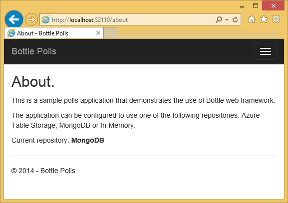
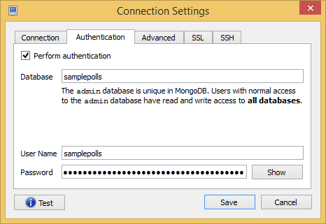

<properties 
	pageTitle="Bottle y MongoDB en Azure con Python Tools 2.1 para Visual Studio" 
	description="Aprenda a usar las herramientas de Python para Visual Studio para crear una aplicación de Bottle que almacene datos en una instancia de base de datos MongoDB y puedan implementarse en un sitio web." 
	services="web-sites" 
	documentationCenter="python" 
	authors="huguesv" 
	manager="wpickett" 
	editor=""/>

<tags 
	ms.service="web-sites" 
	ms.workload="web" 
	ms.tgt_pltfrm="na" 
	ms.devlang="python" 
	ms.topic="article" 
	ms.date="10/10/2014" 
	ms.author="huvalo"/>

# Bottle y MongoDB en Azure con Python Tools 2.1 para Visual Studio

En este tutorial, crearemos una aplicación de sondeos sencilla con la utilización de una de las plantillas de ejemplo de PTVS. Este tutorial también se encuentra disponible en [vídeo](https://www.youtube.com/watch?v=8hQMyf8p_Jo).

La aplicación de sondeos define una abstracción para su repositorio, por lo que puede alternar fácilmente entre los diferentes tipos de repositorios (en memoria, almacenamiento de tablas de Azure y MongoDB).

Facilitaremos información acerca del uso de uno de los servicios de MongoDB hospedados en Azure, la configuración de la aplicación para utilizar MongoDB y la publicación de la aplicación en un sitio web de Azure.

Consulte el [Centro para desarrolladores de Python][] para tener acceso a más artículos que tratan sobre el desarrollo de Sitios web de Azure con PTVS mediante la utilización de marcos web Bottle, Flask y Django, con MongoDB, Almacenamiento de tablas de Azure y los servicios de Base de datos MySQL y SQL.  Si bien estos artículos se centran en Sitios web de Azure, los pasos son similares a los que se aplican para desarrollar [Servicios en la nube de Azure][].

+ [Requisitos previos](#prerequisites)
+ [Creación del proyecto](#create-the-project)
+ [Creación de una base de datos MongoDB](#create-a-mongodb-database)
+ [Configuración del proyecto](#configure-the-project)
+ [Exploración de la base de datos MongoDB](#explore-the-mongodb-database)
+ [Publicación en un sitio web de Azure](#publish-to-an-azure-website)
+ [Configuración del sitio web de Azure](#configure-the-azure-website)
+ [Pasos siguientes](#next-steps)

##Requisitos previos

 - Visual Studio 2012 o 2013
 - [Python Tools 2.1 para Visual Studio (en inglés)][]
 - [Python Tools 2.1 para archivos VSIX de ejemplo de Visual Studio][]
 - [Herramientas del SDK de Azure para VS 2013][] o [Herramientas del SDK de Azure para VS 2012][]
 - [Python 2.7 de 32 bits][] o [Python 3.4 de 32 bits][]
 - [RoboMongo][] (opcional)

[AZURE.INCLUDE [create-account-and-websites-note](../includes/create-account-and-websites-note.md)]

##Creación del proyecto

En esta sección, vamos a crear un proyecto de Visual Studio con la utilización de una plantilla de ejemplo.  Vamos a crear un entorno virtual e instalar los paquetes necesarios.  A continuación, vamos a ejecutar la aplicación localmente con el repositorio en memoria predeterminado.

1.  En Visual Studio, seleccione **Archivo**, **Nuevo proyecto**. 

1.  Las plantillas de proyecto para archivos VSIX de ejemplo de PTVS se encuentran disponibles en **Python**, **Samples** (Ejemplos).  Seleccione **Polls Bottle Web Project** (Proyecto web de Bottle para sondeos) y haga clic en OK (Aceptar) para crear el proyecto.

  	

1.  Se le pedirá que instale paquetes externos.  Seleccione **Instalar en un entorno virtual**.

  	

1.  Seleccione **Python 2.7** o **Python 3.4** como el intérprete de base.

  	

1.  Presione <kbd>F5</kbd> para confirmar que la aplicación funciona.  De forma predeterminada, la aplicación usa un repositorio en memoria que no requiere ninguna configuración.  Todos los datos se pierden cuando el servidor web se detiene.

1.  Haga clic en **Create Sample Polls** (Crear sondeos de ejemplo) y, a continuación, haga clic en un sondeo y vote.

  	

##Creación de una base de datos MongoDB

Para la base de datos, crearemos una base de datos MongoLab hospedada en Azure.

Como alternativa, puede crear su propia máquina virtual para que se ejecute en Azure y, a continuación, instalar y administrar MongoDB por su cuenta.

Siga estos pasos para crear una prueba gratuita con MongoLab.

1.  Inicie sesión en el [Portal de administración de Azure][].

1.  En la parte inferior del panel de navegación, haga clic en **NEW**.

  	

1.  Haga clic en **STORE** (Almacenar) y, a continuación, en **MongoLab**.

  	

1.  En Nombre, escriba un nombre para utilizarlo para el servicio de base de datos.

1.  Seleccione un grupo de región/afinidad en el que ubicar el servicio de base de datos. Si va a usar la base de datos desde la aplicación de Azure, seleccione la misma región en la que implementará la aplicación.

  	

1.  Haga clic en **PURCHASE** (Adquirir).

##Configuración del proyecto

En esta sección, vamos a configurar nuestra aplicación para usar la base de datos de MongoDB que acabamos de crear.  Observaremos cómo obtener la configuración de la conexión en el portal de Azure.  A continuación, ejecutaremos la aplicación localmente.

1.  En el [Portal de administración de Azure][], haga clic en **COMPLEMENTOS** (Complementos) y, a continuación, haga clic en el servicio de MongoLab que ha creado anteriormente.

1.  Haga clic en **INFORMACIÓN DE CONEXIÓN**.  Puede usar el botón de copiar para colocar el valor de **MONGOLAB\_URI** en el Portapapeles.

  	

1.  En Visual Studio, haga clic con el botón secundario en el Explorador de soluciones y seleccione **Propiedades**.  Haga clic en la pestaña **Depurar**.

  	

1.  Defina los valores de las variables del entorno que necesita la aplicación en **Depurar comando del servidor**, **Entorno**.

        REPOSITORY_NAME=mongodb
        MONGODB_HOST=<value of MONGOLAB_URI>
        MONGODB_DATABASE=<database name>

    De esta forma se definirán las variables del entorno cuando **empiece a depurar**.  Si desea que las variables se definan al **Iniciar sin depurar**, establezca los mismos valores en **Ejecutar comando del servidor**.

    De forma alternativa, puede definir las variables del entorno con el Panel de control de Windows.  Se trata de una opción más conveniente si desea evitar que las credenciales se almacenen en el archivo de proyecto / de código fuente.  Tenga en cuenta que necesitará reiniciar Visual Studio para que los nuevos valores del entorno estén disponibles en la aplicación.

1.  El código que implementa el repositorio de MongoDB se encuentra en **models/mongodb.py**.

1.  Ejecute la aplicación con <kbd>F5</kbd>.  Los sondeos creados con **Create Sample Polls** y los datos enviados al votar se serializarán en MongoDB.

1.  Vaya a la página **Acerca de** para verificar que la aplicación usa el repositorio de **MongoDB**.

  	

##Exploración de la base de datos MongoDB

Puede usar una aplicación como [RoboMongo][] para consultar una base de datos MongoDB y realizar modificaciones en ella.  En esta sección, vamos a utilizar RoboMongo para ver el contenido de la base de datos de la aplicación de sondeos.

1.  Cree una conexión nueva.  Necesitará el valor de **MONGOLAB\_URI** que hemos recuperado en la sección anterior.

    Observe el formato del URI: `mongodb://<name>:<password>@<address>:<port>/<name>`

    El nombre coincide con el nombre indicado al crear el servicio con Azure.  Se usa para el nombre de la base de datos y para el nombre de usuario.

1.  En la página de conexión, defina el valor **Nombre** con el nombre que desee para la conexión.  Especifique también los campos **Dirección** y **Puerto** con los valores *address* y *port* de **MONGOLAB\_URI**.

  	

1.  En la página de autenticación, especifique los valores **Base de datos** y **Nombre de usuario** con los valores *name* de **MONGOLAB\_URI**.  Defina también el campo **Contraseña** con el valor *password* de **MONGOLAB\_URI**.

  	

1.  Guarde la base de datos y conéctese a ella.  Ahora puede consultar la colección de sondeos.

  	

##Publicación en un sitio web de Azure

PTVS ofrece una forma fácil de implementar la aplicación web en un sitio web de Azure.

1.  En el **Explorador de soluciones**, haga clic con el botón secundario en el nodo del proyecto y seleccione **Publicar**.

  	

1.  Haga clic en **Sitios web Microsoft Azure**.

1.  Haga clic en **Nuevo** para crear un sitio nuevo.

1.  Seleccione un **Nombre de sitio** y una **Región** y haga clic en **Crear**.

  	

1.  Acepte todos los valores predeterminados y haga clic en **Publicar**.

1.  El explorador web se abrirá automáticamente en el sitio web publicado.  Si navega hasta la página Acerca de, observará que usa el repositorio **En memoria**, y no el repositorio de **MongoDB**.

    Esto se debe a que las variables del entorno no están definidas en el sitio web de Azure, por lo que usa los valores predeterminados especificados en **settings.py**.

##Configuración del sitio web de Azure

En esta sección, vamos a configurar las variables del entorno para el sitio.

1.  En el [Portal de administración de Azure][], haga clic en el sitio creado en la sección anterior.

1.  En el menú superior, haga clic en **CONFIGURAR**.

  	

1.  Desplácese hacia abajo hasta la sección **configuración de la aplicación** y defina los valores para **REPOSITORY\_NAME**, **MONGODB\_HOST** y **MONGODB\_DATABASE**, según se ha descrito en la sección anterior.

  	

1.  En el menú inferior, haga clic en **GUARDAR** y en **REINICIAR** y, por último, en **EXAMINAR**.

  	

1.  La aplicación ahora debe funcionar según lo previsto, con la utilización del repositorio de **MongoDB**.

    ¡Enhorabuena!

  	

##Pasos siguientes

Siga estos vínculos para obtener más información sobre las herramientas de Python para Visual Studio, Bottle y MongoDB.

- [Documentación sobre Python Tools para Visual Studio][]
  - [Proyectos web][]
  - [Proyectos de servicio en la nube][]
  - [Depuración remota en Microsoft Azure][]
- [Documentación de Bottle][]
- [MongoDB][]
- [Documentación de PyMongo][]
- [PyMongo][]

<!--Link references-->
[Centro para desarrolladores de Python]: /es-es/develop/python/
[Servicios en la nube de Azure]: ../cloud-services-python-ptvs/

<!--External Link references-->
[Portal de administración de Azure]: https://manage.windowsazure.com
[RoboMongo]: http://robomongo.org/
[Python Tools 2.1 para Visual Studio (en inglés)]: http://go.microsoft.com/fwlink/?LinkId=517189
[Python Tools 2.1 para archivos VSIX de ejemplo de Visual Studio]: http://go.microsoft.com/fwlink/?LinkId=517189
[Herramientas del SDK de Azure para VS 2013]: http://go.microsoft.com/fwlink/?LinkId=323510
[Herramientas del SDK de Azure para VS 2012]: http://go.microsoft.com/fwlink/?LinkId=323511
[Python 2.7 de 32 bits]: http://go.microsoft.com/fwlink/?LinkId=517190 
[Python 3.4 de 32 bits]: http://go.microsoft.com/fwlink/?LinkId=517191
[Documentación sobre Python Tools para Visual Studio]: http://pytools.codeplex.com/documentation
[Documentación de Bottle]: http://bottlepy.org/docs/dev/index.html
[MongoDB]: http://www.mongodb.org/
[Documentación de PyMongo]: http://api.mongodb.org/python/current/
[PyMongo]: https://github.com/mongodb/mongo-python-driver
[Depuración remota en Microsoft Azure]: http://pytools.codeplex.com/wikipage?title=Features%20Azure%20Remote%20Debugging
[Proyectos web]: http://pytools.codeplex.com/wikipage?title=Features%20Web%20Project
[Proyectos de servicio en la nube]: http://pytools.codeplex.com/wikipage?title=Features%20Cloud%20Project

<!--HONumber=42-->
