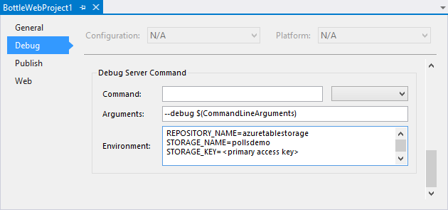
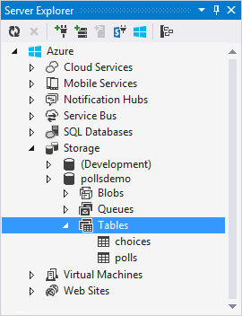

<properties linkid="web-sites-python-ptvs-bottle-table-storage" title="Bottle and Azure Table Storage on Azure with Python Tools 2.1 for Visual Studio" pageTitle="Bottle y Almacenamiento de tablas de Azure en Azure con Python Tools 2.1 para Visual Studio" description="Obtenga información acerca de cómo usar las herramientas de Python para Visual Studio a fin de crear una aplicación Bottle que almacene datos en Almacenamiento de tablas de Azure y que pueda implementarse en un sitio web." metaKeywords="" services="web-sites" solutions="" documentationCenter="Python" authors="huvalo" videoId="" scriptId="" manager="wpickett" editor="" />

<tags ms.service="web-sites" ms.workload="web" ms.tgt_pltfrm="na" ms.devlang="python" ms.topic="article" ms.date="10/10/2014" ms.author="huvalo" />

# Bottle y Almacenamiento de tablas de Azure en Azure con Python Tools 2.1 para Visual Studio 

En este tutorial, crearemos una aplicación de sondeos sencilla con la utilización de una de las plantillas de ejemplo de PTVS. Este tutorial también se encuentra disponible como [vídeo](https://www.youtube.com/watch?v=GJXDGaEPy94).

La aplicación de sondeos define una abstracción para su repositorio, por lo que puede alternar fácilmente entre los diferentes tipos de repositorios (en memoria, almacenamiento de tablas de Azure y MongoDB).

Facilitaremos información acerca de cómo crear una cuetna de almacenamiento de Azure, cómo configurar la aplicación para usar el Almacenamiento de tablas de Azure y cómo publicar la aplicación en un sitio web de Azure.

Consulte el [Centro para desarrolladores de Python][] para tener acceso a más artículos que tratan sobre el desarrollo de Sitios web de Azure con PTVS mediante la utilización de marcos web Bottle, Flask y Django, con MongoDB, Almacenamiento de tablas de Azure y los servicios de Base de datos MySQL y SQL.  Si bien estos artículos se centran en Sitios web de Azure, los pasos son similares a los que se aplican para desarrollar [Servicios en la nube de Azure][].

+ [Requisitos previos](#prerequisites)
+ [Creación del proyecto](#create-the-project)
+ [Creación de una cuenta de almacenamiento de Azure](#create-an-azure-storage-account)
+ [Configuración del proyecto](#configure-the-project)
+ [Exploración del Almacenamiento de tablas de Azure](#explore-the-azure-table-storage)
+ [Publicación en un sitio web de Azure](#publish-to-an-azure-website)
+ [Configuración del sitio web de Azure](#configure-the-azure-website)
+ [Pasos siguientes](#next-steps)

##Requisitos previos

 - Visual Studio 2012 o 2013
 - [Python Tools 2.1 para Visual Studio][]
 - [Python Tools 2.1 para archivos VSIX de ejemplo de Visual Studio][]
 - [Herramientas del SDK de Azure para VS 2013 ][] o [Herramientas del SDK de Azure para VS 2012][]
 - [Python 2.7 de 32 bits][] o [Python 3.4 de 32 bits][]

[WACOM.INCLUDE [create-account-and-websites-note](../includes/create-account-and-websites-note.md)]

##Creación del proyecto

En esta sección, vamos a crear un proyecto de Visual Studio con la utilización de una plantilla de ejemplo.  Vamos a crear un entorno virtual e instalar los paquetes necesarios.  A continuación, vamos a ejecutar la aplicación localmente con el repositorio en memoria predeterminado.

1.  En Visual Studio, seleccione **Archivo**, **Nuevo proyecto**.

1.  Las plantillas de proyecto para archivos VSIX de ejemplo de PTVS se encuentran disponibles en **Python**, **Samples** (Ejemplos).  Seleccione **Polls Bottle Web Project** (Proyecto web de Bottle para sondeos) y haga clic en OK (Aceptar) para crear el proyecto.

  	

1.  Se le pedirá que instale paquetes externos.  Seleccione **Instalar en un entorno virtual**.

  	

1.  Seleccione **Python 2.7** o **Python 3.4** como el intérprete de base.

  	

1.  Presione <kbd>F5</kbd> para confirmar que la aplicación funciona.  De forma predeterminada, la aplicación usa un repositorio en memoria que no requiere ninguna configuración.  Todos los datos se pierden cuando el servidor web se detiene.

1.  Haga clic en **Create Sample Polls** (Crear sondeos de ejemplo) y, a continuación, haga clic en un sondeo y vote.

  	

##Creación de una cuenta de almacenamiento de Azure

Necesita una cuenta de almacenamiento de Azure para usar operaciones de almacenamiento. Siga estos pasos para crear una cuenta de almacenamiento.

1.  Inicie sesión en el [Portal de administración de Azure][].

1.  En la parte inferior del panel de navegación, haga clic en **NEW** (Nuevo).

  	

1.  Haga clic en **SERVICIOS DE DATOS**, en **ALMACENAMIENTO** y, a continuación, en **CREACIÓN RÁPIDA**.

  	

1.  En URL, escriba el nombre de subdominio que vaya usar en el URI para la cuenta de almacenamiento.  Esta entrada puede contener de 3 a 24 letras minúsculas y números. Este valor se convierte en el nombre del host dentro del URI que se ha usado para direccionar los recursos Blob, Cola o Tabla de la suscripción.

1.  Seleccione un grupo de región/afinidad en el que ubicar el almacenamiento. Si va a usar el almacenamiento desde la aplicación de Azure, seleccione la misma región en la que implementará la aplicación.

1.  También puede habilitar la replicación geográfica.  Con la replicación geográfica, Almacenamiento de Azure ahora conserva los datos de manera duradera en dos ubicaciones. En ambas ubicaciones, Almacenamiento de Azure mantiene constantemente varias réplicas en buen estado de los datos.

1.  Haga clic en **CREAR CUENTA DE ALMACENAMIENTO**.

##Configuración del proyecto

En esta sección, vamos a configurar nuestra aplicación para usar la cuenta de almacenamiento que acabamos de crear.  Observaremos cómo obtener la configuración de la conexión en el portal de Azure.  A continuación, ejecutaremos la aplicación localmente.

1.  En el [Portal de administración de Azure][], haga clic en la cuenta de almacenamiento que hemos creado en la sección anterior.

1.  Haga clic en **ADMINISTRAR CLAVES DE ACCESO**.

  	

1.  En Visual Studio, haga clic con el botón secundario en el Explorador de soluciones y seleccione **Propiedades**.  Haga clic en la pestaña **Depurar**.

  	

1.  Defina los valores de las variables del entorno que necesita la aplicación en **Depurar comando del servidor**, **Entorno**.

        REPOSITORY_NAME=azuretablestorage
        STORAGE_NAME=<storage account name>
        STORAGE_KEY=<primary access key>

    De esta forma se definirán las variables del entorno cuando **empiece a depurar**.  Si desea que las variables se definan al **Iniciar sin depurar**, establezca los mismos valores en **Ejecutar comando del servidor**.

    De forma alternativa, puede definir las variables del entorno con el Panel de control de Windows.  Se trata de una opción más conveniente si desea evitar que las credenciales se almacenen en el archivo de proyecto / de código fuente.  Tenga en cuenta que necesitará reiniciar Visual Studio para que los nuevos valores del entorno estén disponibles en la aplicación.

1.  El código que implementa el repositorio de Almacenamiento de tablas de Azure se encuentra en **models/azuretablestorage.py**.  Consulte la [documentación] para obtener más información sobre cómo usar el servicio Tabla en Python.

1.  Presione <kbd>F5</kbd> para ejecutar la aplicación.  Los sondeos creados con **Create Sample Polls** (Crear sondeos de ejemplo) y los datos enviados al votar se serializarán en el Almacenamiento de tablas de Azure.

1.  Vaya a la página **Acerca de** para verificar que la aplicación usa el repositorio de **Almacenamiento de tablas de Azure**.

  	

##Exploración del Almacenamiento de tablas de Azure

Es fácil ver y editar tablas de almacenamiento con el Explorador de servidores en Visual Studio.  En esta sección, vamos a utilizar el Explorador de servidores para ver el contenido de las tablas de la aplicación de sondeos.

> [WACOM.NOTE] Para esto es necesario que las Herramientas de Microsoft Azure estén instaladas, que se encuentran disponibles como parte del [SDK de Azure para .NET][].

1.  Abra el **Explorador de servidores**.  Expanda **Azure**, **Almacenamiento**, la cuenta de almacenamiento y, a continuación, **Tablas**.

  	

1.  Haga doble clic en la tabla **sondeos** u **opciones** para ver el contenido de la tabla en una ventana de documento, así como las entidades agregar/quitar/editar.

  	

##Publicación en un sitio web de Azure

PTVS ofrece una forma fácil de implementar la aplicación web en un sitio web de Azure.

1.  En el **Explorador de soluciones**, haga clic con el botón secundario en el nodo del proyecto y seleccione **Publicar**.

  	

1.  Haga clic en **Sitios web Microsoft Azure**.

1.  Haga clic en **Nuevo** para crear un sitio nuevo.

1.  Seleccione un **Nombre de sitio** y una **Región** y haga clic en **Crear**.

  	

1.  Acepte todos los valores predeterminados y haga clic en **Publicar**.

1.  El explorador web se abrirá automáticamente en el sitio web publicado.  Si navega hasta la página Acerca de, observará que usa el repositorio **En memoria**, y no el repositorio de **Almacenamiento de tablas de Azure**.

    Esto se debe a que las variables del entorno no están definidas en el sitio web de Azure, por lo que usa los valores predeterminados especificados en **settings.py**.

##Configuración del sitio web de Azure

En esta sección, vamos a configurar las variables del entorno para el sitio.

1.  En el [Portal de administración de Azure][], haga clic en el sitio creado en la sección anterior.

1.  En el menú superior, haga clic en **CONFIGURAR**.

  	

1.  Desplácese hacia abajo hasta la sección **configuración de la aplicación** y defina los valores para **REPOSITORY\_NAME**, **STORAGE\_NAME** y **STORAGE\_NAME**, según se ha descrito en la sección anterior.

  	

1. En el menú inferior, haga clic en **GUARDAR** y en **REINICIAR** y, por último, en **EXAMINAR**.

  	

1.  La aplicación ahora debe funcionar según lo previsto, con la utilización del repositorio de **Almacenamiento de tablas de Azure**.

    ¡Enhorabuena!

  	

##Pasos siguientes

Siga estos vínculos para obtener más información sobre las herramientas de Python para Visual Studio, Bottle y Almacenamiento de tablas de Azure.

- [Documentación sobre Python Tools para Visual Studio][]
  - [Proyectos web][]
  - [Proyectos de servicio en la nube][]
  - [Depuración remota en Microsoft Azure][]
- [Documentación sobre Bottle][]
- [Almacenamiento de Azure][]
- [SDK de Azure para Python][]
- [Uso del servicio de almacenamiento de tablas desde Python][]

<!--Link references-->
[Centro para desarrolladores de Python]: /en-us/develop/python/
[Servicios en la nube de Azure]: ../cloud-services-python-ptvs/
[Documentación]: ../storage-python-how-to-use-table-storage/
[Uso del servicio de almacenamiento de tablas desde Python]: ../storage-python-how-to-use-table-storage/

<!--External Link references-->
[Portal de administración de Azure]: https://manage.windowsazure.com
[SDK de Azure para .NET]: http://azure.microsoft.com/en-us/downloads/
[Python Tools 2.1 para Visual Studio]: http://go.microsoft.com/fwlink/?LinkId=517189
[Python Tools 2.1 para archivos VSIX de ejemplo de Visual Studio]: http://go.microsoft.com/fwlink/?LinkId=517189
[Herramientas del SDK de Azure para VS 2013]: http://go.microsoft.com/fwlink/?LinkId=323510
[Herramientas del SDK de Azure para VS 2012]: http://go.microsoft.com/fwlink/?LinkId=323511
[Python 2.7 (32 bits)]: http://go.microsoft.com/fwlink/?LinkId=517190 
[Python 3.4 (32 bits)]: http://go.microsoft.com/fwlink/?LinkId=517191
[Documentación sobre Python Tools para Visual Studio]: http://pytools.codeplex.com/documentation
[Documentación sobre Bottle]: http://bottlepy.org/docs/dev/index.html
[Depuración remota en Microsoft Azure]: http://pytools.codeplex.com/wikipage?title=Features%20Azure%20Remote%20Debugging
[Proyectos web]: http://pytools.codeplex.com/wikipage?title=Features%20Web%20Project
[Proyectos de servicio en la nube]: http://pytools.codeplex.com/wikipage?title=Features%20Cloud%20Project
[Almacenamiento de Azure]: http://azure.microsoft.com/en-us/documentation/services/storage/
[SDK de Azure para Python]: https://github.com/Azure/azure-sdk-for-python

<!--HONumber=35.1-->
