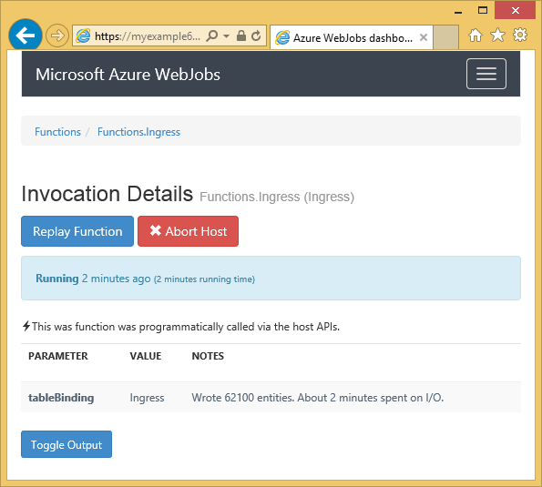

<properties 
	pageTitle="Cómo usar el almacenamiento de tablas de Azure con el SDK de WebJobs" 
	description="Obtenga información sobre cómo usar el almacenamiento de tablas de Azure con el SDK de WebJobs. Cree tablas, agregue entidades a las tablas y lea tablas existentes." 
	services="app-service\web, storage" 
	documentationCenter=".net" 
	authors="tdykstra" 
	manager="wpickett" 
	editor="jimbe"/>

<tags 
	ms.service="app-service-web" 
	ms.workload="web" 
	ms.tgt_pltfrm="na" 
	ms.devlang="dotnet" 
	ms.topic="article" 
	ms.date="04/03/2015" 
	ms.author="tdykstra"/>

# Cómo usar el almacenamiento de tablas de Azure con el SDK de WebJobs

## Información general

Esta guía proporciona ejemplos de código C# que muestran cómo leer y escribir tablas de almacenamiento de Azure mediante el [SDK de WebJobs](websites-dotnet-webjobs-sdk.md) versión 1.x.

En la guía se supone que sabe [cómo crear un proyecto de trabajos web en Visual Studio con cadenas de conexión que señalan a su cuenta de almacenamiento](websites-dotnet-webjobs-sdk-get-started.md).
		
Algunos de los fragmentos de código muestran el atributo `Table` usado en funciones que [se llaman manualmente](websites-dotnet-webjobs-sdk-storage-queues-how-to.md#manual), es decir, sin usar ninguno de los atributos de desencadenador. 

##  Cómo agregar entidades a una tabla

Para agregar entidades a una tabla, use el atributo `Table` con un parámetro `ICollector<T>` o `IAsyncCollector<T>` donde `T` especifica el esquema de las entidades que desea agregar. El atributo constructor toma un parámetro de cadena que especifica el nombre de la tabla. 

Se agrega el siguiente código de ejemplo `Person` entidades a una tabla llamada *Ingress*.

		[NoAutomaticTrigger]
		public static void IngressDemo(
		    [Table("Ingress")] ICollector<Person> tableBinding)
		{
		    for (int i = 0; i < 100000; i++)
		    {
		        tableBinding.Add(
		            new Person() { 
		                PartitionKey = "Test", 
		                RowKey = i.ToString(), 
		                Name = "Name" }
		            );
		    }
		}

Normalmente, el tipo que usa con `ICollector` deriva de `TableEntity` o implementa `ITableEntity`, pero no es necesario que lo haga. Cualquiera de las siguientes clases `Person` funciona con el código que aparece en el método `Ingress` anterior.

		public class Person : TableEntity
		{
		    public string Name { get; set; }
		}

		public class Person
		{
		    public string PartitionKey { get; set; }
		    public string RowKey { get; set; }
		    public string Name { get; set; }
		}

Si desea trabajar directamente con la API de almacenamiento de Azure, puede agregar un parámetro `CloudStorageAccount` a la firma del método.

##  Supervisión en tiempo real

Dado que las funciones de entrada de datos a menudo procesan grandes volúmenes de datos, el panel del SDK de WebJobs proporciona datos de supervisión en tiempo real. La sección **Registro de invocación** indica si la función sigue en ejecución.

La página **Detalles de invocación** informa el progreso de la función (la cantidad de entidades escritas) mientras se ejecuta y ofrece la oportunidad de anularla. 

Cuando finaliza la función, la página **Detalles de invocación** informa la cantidad de filas escritas.

##  Cómo leer varias entidades desde una tabla

Para leer una tabla, use el atributo `Table` con un parámetro `IQueryable<T>` donde el tipo `T` derives from `TableEntity` o implementa `ITableEntity`.

El ejemplo de código siguiente lee y registra todas las filas de la tabla `Ingress`:
 
		public static void ReadTable(
		    [Table("Ingress")] IQueryable<Person> tableBinding,
		    TextWriter logger)
		{
		    var query = from p in tableBinding select p;
		    foreach (Person person in query)
		    {
		        logger.WriteLine("PK:{0}, RK:{1}, Name:{2}", 
		            person.PartitionKey, person.RowKey, person.Name);
		    }
		}

###  Cómo leer una entidad única de una tabla

Existe un constructor de atributo `Table` con dos parámetros adicionales que le permiten especificar la clave de partición y la clave de fila cuando desea enlazar a una entidad de tabla única.

El siguiente ejemplo e código lee una fila de una tabla de una entidad `Person` según los valores de clave de partición y clave de fila recibidos en un mensaje en cola:  

		public static void ReadTableEntity(
		    [QueueTrigger("inputqueue")] Person personInQueue,
		    [Table("persontable","{PartitionKey}", "{RowKey}")] Person personInTable,
		    TextWriter logger)
		{
		    if (personInTable == null)
		    {
		        logger.WriteLine("Person not found: PK:{0}, RK:{1}",
		                personInQueue.PartitionKey, personInQueue.RowKey);
		    }
		    else
		    {
		        logger.WriteLine("Person found: PK:{0}, RK:{1}, Name:{2}",
		                personInTable.PartitionKey, personInTable.RowKey, personInTable.Name);
		    }
		}

La clase `Person` de este ejemplo no debe implementar `ITableEntity`.

##  Cómo usar la API de almacenamiento .NET directamente para trabajar con una tabla

También puede usar el atributo `Table` con un objeto `CloudTable` para obtener más flexibilidad en el trabajo con una tabla.

El siguiente ejemplo de código usa un objeto `CloudTable` para agregar una entidad única a la tabla *Ingress*. 
 
		public static void UseStorageAPI(
		    [Table("Ingress")] CloudTable tableBinding,
		    TextWriter logger)
		{
		    var person = new Person()
		        {
		            PartitionKey = "Test",
		            RowKey = "100",
		            Name = "Name"
		        };
		    TableOperation insertOperation = TableOperation.Insert(person);
		    tableBinding.Execute(insertOperation);
		}

Para obtener más información acerca de cómo usar el objeto `CloudTable`, consulte [Uso del almacenamiento de tablas de .NET](storage-dotnet-how-to-use-tables.md). 

## Temas relacionados tratados en el artículo de procedimientos de las colas

Para obtener información sobre cómo controlar el procesamiento de tablas desencadenado por un mensaje de cola o para ver los escenarios de SDK de WebJobs no específicos para el procesamiento de tablas, consulte [Cómo usar el almacenamiento de colas con el SDK de WebJobs](websites-dotnet-webjobs-sdk-storage-queues-how-to.md). 

Entre los temas tratados en este artículo se incluyen los siguientes:

* Funciones asincrónicas
* Varias instancias
* Apagado correcto
* Utilizar atributos del SDK de WebJobs en el cuerpo de una función
* Establecer las cadenas de conexión del SDK en el código.
* Establecer valores para los parámetros del constructor del SDK de WebJobs en el código
* Desencadenar una función manualmente
* Escribir registros

##  Pasos siguientes

En esta guía se han proporcionado ejemplos de código que muestran cómo controlar los escenarios comunes para trabajar con tablas de Azure. Para obtener más información acerca de cómo usar el SDK de WebJobs y WebJobs de Azure, consulte [Recursos de WebJobs de Azure recomendados](http://go.microsoft.com/fwlink/?linkid=390226).

<!--HONumber=52-->