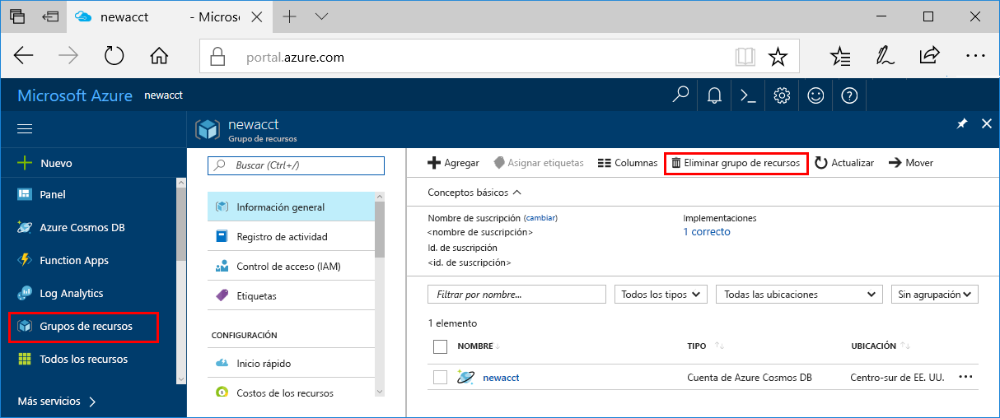

>[!IMPORTANT]
>Los recursos que creó pueden usarse como requisitos previos para otros tutoriales y artículos de procedimientos de Azure Machine Learning. 

Si no va a usar lo que ha creado aquí, elimine los recursos que acaba de crear en esta guía de inicio rápido para no incurrir en gastos.

1. En Azure Portal, seleccione **Grupos de recursos** a la izquierda del todo.  
 
   

1. En la lista, seleccione el grupo de recursos que creó.

1. Seleccione **Eliminar grupo de recursos**.

1. Escriba el nombre del grupo de recursos y, a continuación, seleccione **Eliminar**.

   Si recibe el error "Can not delete resource before nested resources are deleted" (No se puede eliminar el recurso hasta que se eliminen los recursos anidados), debe eliminar primero todos los recursos anidados. Para más información, [consulte esta sección de solución de problemas](../articles/machine-learning/desktop-workbench/known-issues-and-troubleshooting-guide.md#cant-delete-experimentation-account). 