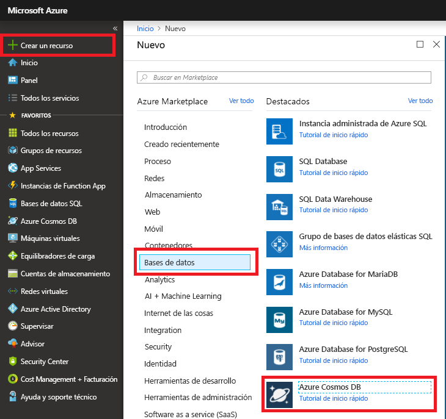

1. En una nueva ventana, inicie sesión en [Azure Portal](https://portal.azure.com/).
2. En el panel de la izquierda, haga clic en **Nuevo**, luego en **Bases de datos** y, después, en **la base de datos de Azure Cosmos**.
   
   

3. En la hoja **Nueva cuenta**, especifique la configuración que quiera para la cuenta de Azure Cosmos DB. 

    Con Azure Cosmos DB, puede elegir uno de cuatro modelos de programación: Gremlin (grafo), MongoDB, SQL (DocumentDB) y Table (clave-valor), cada uno de los cuales requiere actualmente una cuenta independiente.
       
    En este artículo de guía de inicio rápido programaremos con la API Graph, así que elija **Gremlin (graph)** al rellenar el formulario. Si tiene datos de documentos de una aplicación de catálogo, datos de clave/valor (tabla) o datos migrados desde una aplicación de MongoDB, debe tener en cuenta que la base de datos de Azure Cosmos puede proporcionar una plataforma de servicio de base de datos distribuida globalmente y de alta disponibilidad para todas las aplicaciones críticas.

    Rellene los campos en la hoja **Nueva cuenta** usando la información de la captura de pantalla siguiente como guía (sus valores pueden ser diferentes de los de la captura).
 
    

    Configuración|Valor sugerido|Descripción
    ---|---|---
    ID|*Valor único*|Un nombre único que identifica esta cuenta de Azure Cosmos DB. Como *documents.azure.com* se anexará al identificador que proporcione para crear el URI, debe usar un identificador único pero reconocible. El identificador tiene que contener solo letras minúsculas, números y el carácter guion (-), y tiene que tener una extensión de entre 3 y 50 caracteres.
    API|Gremlin (graph)|Más adelante en este artículo programaremos con la [API Graph](../articles/cosmos-db/graph-introduction.md).|
    La suscripción|*Su suscripción*|Suscripción de Azure que quiere usar para esta cuenta de Azure Cosmos DB. 
    Grupo de recursos|*Mismo valor que el identificador*|Nombre del nuevo grupo de recursos para la cuenta. Para simplificar, puede usar el mismo nombre del identificador. 
    Ubicación|*Región más cercana a los usuarios*|Ubicación geográfica en la que se va a hospedar la cuenta de Azure Cosmos DB. Elija la ubicación más cercana a los usuarios para proporcionarles el acceso más rápido a los datos.

4. Haga clic en **Crear** para crear la cuenta.
5. En la barra de herramientas superior, haga clic en el icono **Notificaciones** para supervisar el proceso de implementación.

    

6.  Cuando la ventana Notificaciones indique que la implementación se realizó correctamente, ciérrela y abra la nueva cuenta del icono **Todos los recursos** en el Panel. 

    