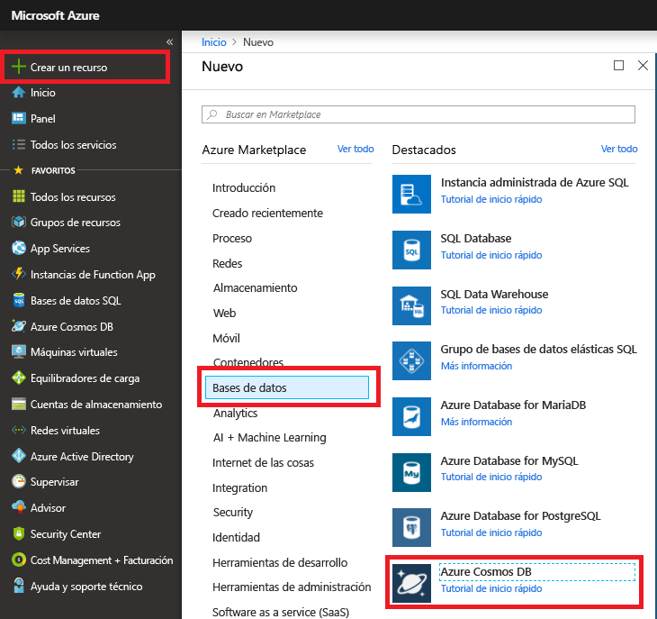
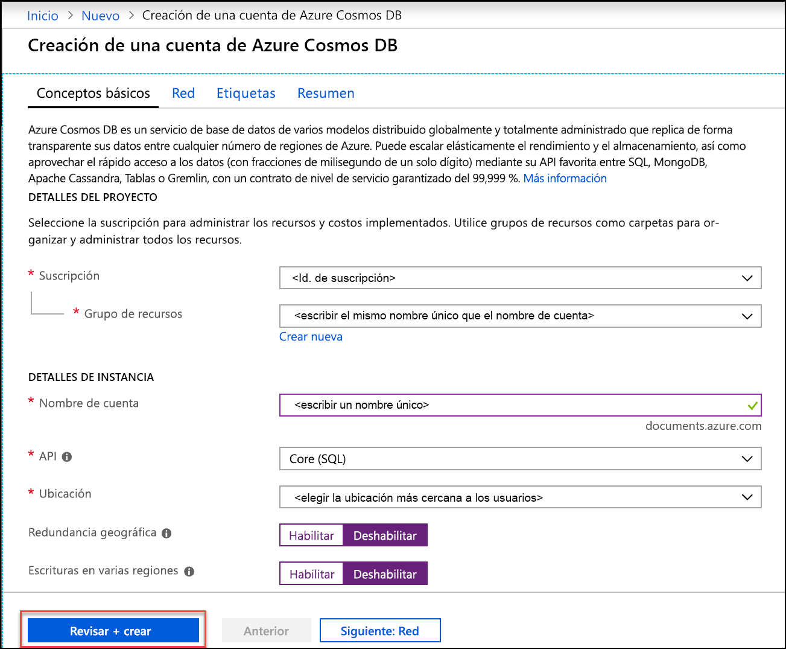
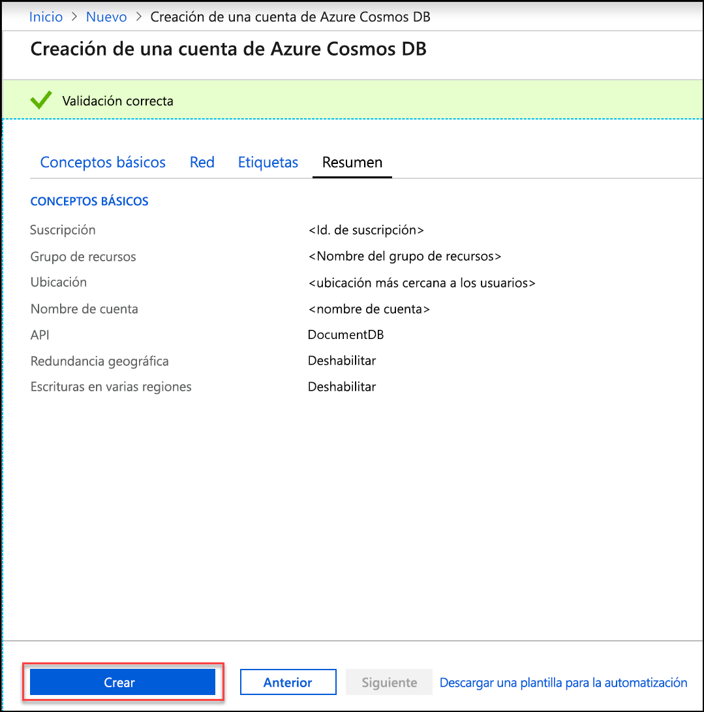
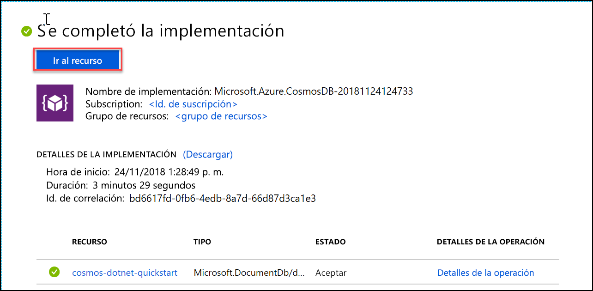

1. En una nueva ventana del explorador, inicie sesión en [Azure Portal](https://portal.azure.com/).
2. Haga clic en **Crear un recurso** > **Bases de datos** > **Azure Cosmos DB**.
   
   

3. En la página **Crear una cuenta de Azure Cosmos DB**, especifique la configuración de la nueva cuenta de Azure Cosmos DB. 
 
    Configuración|Valor|DESCRIPCIÓN
    ---|---|---
    Subscription|*Su suscripción*|Seleccione la suscripción de Azure que quiere usar para esta cuenta de Azure Cosmos DB. 
    Grupo de recursos|Crear nuevo  *Escriba un nombre único*|Seleccione **Crear nuevo** y, después, escriba un nombre nuevo de grupo de recursos para la cuenta. Para simplificar, puede usar el mismo nombre que el de la cuenta. 
    Nombre de cuenta|*Escriba un nombre único*|Escriba un nombre único para identificar la cuenta de Azure Cosmos DB. Dado que *documents.azure.com* se anexa al identificador que se proporciona para crear el identificador URI, debe usar un identificador único.  El identificador solo puede contener letras minúsculas, números y el carácter de guión (-) y debe tener una longitud de entre 3 y 31 caracteres.
    API|Core (SQL)|La API determina el tipo de cuenta que se va a crear. Azure Cosmos DB proporciona cinco API: SQL (base de datos de documentos), Gremlin (base de datos de grafos), MongoDB (base de datos de documentos), Table API y Cassandra API. Cada API requiere la creación de una cuenta independiente.   Seleccione **Core (SQL)** porque en este artículo creará una base de datos de documentos y la consultará mediante la sintaxis SQL.   [Más información acerca de SQL API](../articles/cosmos-db/documentdb-introduction.md)|
    Ubicación|*Seleccione la región más cercana a los usuarios*|Seleccione una ubicación geográfica para hospedar la cuenta de Azure Cosmos DB. Use la ubicación más cercana a los usuarios para proporcionarles el acceso más rápido a los datos.
    Habilitar redundancia geográfica| Déjelo en blanco | Esto crea una versión replicada de la base de datos en una segunda región (emparejada). Déjelo en blanco.  
    Escrituras de varias regiones| Déjelo en blanco | Esto permite que cada una de las regiones de la base de datos sea una región tanto de lectura como de escritura. Déjelo en blanco.  

    Después, haga clic en **Revisar + crear**. Puede omitir las secciones **Red** y **Etiquetas**. 

    

    Revise la información de resumen y haga clic en **Crear**. 

    

4. La cuenta tarda unos minutos en crearse. Espere a que el portal muestre el mensaje **Se completó la implementación** y haga clic en **Ir al recurso**.     

    

5. El portal mostrará ahora **Felicidades. Se ha creado su cuenta de Azure Cosmos DB**.

    

