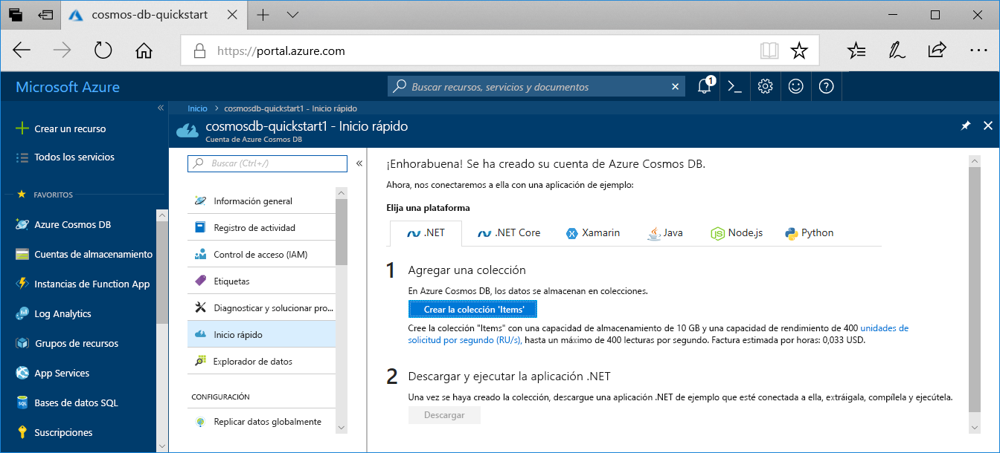

1. En una nueva ventana del explorador, inicie sesión en [Azure Portal](https://portal.azure.com/).
2. Seleccione **Crear un recurso** > **Bases de datos** > **Azure Cosmos DB**.
   
   

3. En la página **Nueva cuenta**, especifique la configuración de la nueva cuenta de Azure Cosmos DB. 
 
    Configuración|Valor|DESCRIPCIÓN
    ---|---|---
    ID|Escriba un nombre único.|Escriba un nombre único para identificar la cuenta de Azure Cosmos DB. Dado que *documents.azure.com* se anexa al identificador que se proporciona para crear el identificador URI, debe usar un identificador único.  El identificador solo debe contener letras minúsculas, números y el carácter de guion (-). Debe tener una longitud de entre 3 y 50 caracteres.
    API|SQL|La API determina el tipo de cuenta que se va a crear. Azure Cosmos DB proporciona cinco API: SQL para bases de datos de documentos, Gremlin para bases de datos de grafos, MongoDB para bases de datos de documentos, Table API y Cassandra API. Actualmente, debe crear una cuenta independiente para cada API.   Seleccione **SQL**, ya que en este artículo creará una base de datos de documentos y la consultará mediante la sintaxis SQL.   [Más información acerca de SQL API](../articles/cosmos-db/documentdb-introduction.md).|
    Subscription|Su suscripción|Seleccione la suscripción de Azure que quiere usar para esta cuenta de Azure Cosmos DB. 
    Grupo de recursos|Crear nuevo  A continuación, escriba el mismo nombre único que se proporcionó en el identificador|Seleccione **Crear nuevo**. A continuación, escriba un nombre nuevo de grupo de recursos para la cuenta. Para simplificar, utilice el mismo nombre del identificador. 
    Ubicación|Seleccionar la región más cercana a los usuarios|Seleccione una ubicación geográfica para hospedar la cuenta de Azure Cosmos DB. Use la ubicación más cercana a los usuarios para proporcionarles el acceso más rápido a los datos.
    Habilitar redundancia geográfica| Déjelo en blanco | Esta opción crea una versión replicada de la base de datos en una segunda región (emparejada). Deje en blanco esta casilla de verificación. 

    Seleccione **Crear**.

    

4. La cuenta tarda unos minutos en crearse. Espere a que el portal muestre la página **¡Enhorabuena! Se ha creado su cuenta de Azure Cosmos DB**.

    

